```mermaid
graph LR
	%% 定义样式：区分Pass名称/参数/作用
	classDef passStyle fill:#f0f8ff,stroke:#4169e1,stroke-width:2px,font-size:12px
	classDef paramStyle font-size:10px,color:#666
	classDef descStyle font-size:9px,color:#888
	
	%% 核心Pass（名称+核心作用+参数）
	VBufferRT["**VBufferRT**<br/><span class='descStyle'>生成几何缓冲</span><br/><span class='paramStyle'>samplePattern=Stratified<br/>sampleCount=16</span>"]
	MinimalPathTracer["**MinimalPathTracer**<br/><span class='descStyle'>核心路径追踪</span><br/><span class='paramStyle'>maxBounces=3</span>"]
	AccumulatePass["**AccumulatePass**<br/><span class='descStyle'>多帧结果累积</span><br/><span class='paramStyle'>enabled=True<br/>precisionMode=Single</span>"]
	ToneMapper["**ToneMapper**<br/><span class='descStyle'>色调映射/色彩校正</span><br/><span class='paramStyle'>autoExposure=False<br/>exposureCompensation=0.0</span>"]
	Output["**最终输出（显示画面）**"]
	
	%% 数据流向（标注数据类型）
	VBufferRT -- vbuffer + viewW --> MinimalPathTracer
	MinimalPathTracer -- 原始追踪颜色 --> AccumulatePass
	AccumulatePass -- 累积后颜色 --> ToneMapper
	ToneMapper -- 伽马校正后颜色 --> Output
    
    class VBufferRT,MinimalPathTracer,AccumulatePass,ToneMapper,Output passStyle
```

# MinimalPathTracer

## 概述

MinimalPathTracer是一个极简的暴力路径追踪器实现。它**不使用任何重要性采样或其他方差减少技术**，其目的是为其他渲染器提供无偏/一致的地面真值验证。

**特点：**
- 纯蒙特卡洛积分实现
- 无偏性和一致性保证
- 用于验证更复杂渲染器的正确性
- 支持多种几何体类型（三角网格、曲线、置换网格、SDF网格）
- 支持解析光源、发光几何体和环境图

**限制：**
- 不支持透射和嵌套介质
- 无NEE（下一代事件估计）
- 无MIS（多重重要性采样）
- 无俄罗斯轮盘
- 不使用重要性采样（可选）

## 输入输出参数表

| 参数名 | 类型 | 方向 | 描述 | 是否必需 |
|--------|------|------|------|----------|
| `vbuffer` | Texture2D\<PackedHitInfo\> | 输入 | 包含主要击中信息的可见性缓冲区 | 是 |
| `viewW` | Texture2D\<float4\> | 输入 | 世界空间视图方向（可选） | 否 |
| `color` | Texture2D\<float4\> | 输出 | 最终渲染颜色（辐射度） | 是 |

## 属性表

| 属性名 | 类型 | 默认值 | 描述 |
|--------|------|--------|------|
| `maxBounces` | uint | 3 | 最大间接反弹次数（0=无间接） |
| `computeDirect` | bool | true | 计算直接光照（否则仅间接） |
| `useImportanceSampling` | bool | true | 对材质使用重要性采样 |

### 编译时定义（静态配置）

| 定义名 | 类型 | 默认值 | 描述 |
|--------|------|--------|------|
| `MAX_BOUNCES` | uint | 3 | 最大间接反弹次数 |
| `COMPUTE_DIRECT` | bool | true | 是否计算直接光照 |
| `USE_IMPORTANCE_SAMPLING` | bool | true | 是否使用重要性采样 |
| `USE_ANALYTIC_LIGHTS` | bool | true | 是否使用解析光源 |
| `USE_EMISSIVE_LIGHTS` | bool | true | 是否使用发光几何体作为光源 |
| `USE_ENV_LIGHT` | bool | true | 是否使用环境图作为光源 |
| `USE_ENV_BACKGROUND` | bool | true | 是否使用环境图作为背景 |
| `kDefaultBackgroundColor` | float3 | (0,0,0) | 默认背景颜色 |
| `kRayTMax` | float | FLT_MAX | 光线最大距离 |

## Shader详细注解

### MinimalPathTracer.rt.slang

这是MinimalPathTracer的完整光线追踪着色器实现。

#### 主要数据结构

**ShadowRayData**
```cpp
struct ShadowRayData
{
    bool visible;  // 如果光线可见则设为true
};
```
阴影光线负载，用于测试光源的可见性。

**ScatterRayData**
```cpp
struct ScatterRayData
{
    float3 radiance;    // 从路径累积的出射辐射度
    bool terminated;    // 路径终止时设为true
    float3 thp;        // 当前路径通过率（每顶点更新）
    uint pathLength;     // 路径段数（0=起点，1=第一次次级击中等）
    float3 origin;       // 下一段路径的原点
    float3 direction;    // 下一段路径的方向
    SampleGenerator sg;   // 每光线样本生成器状态
};
```
散射光线负载，包含完整路径状态，最多约72字节。

#### 核心函数

**1. loadShadingData()**
```cpp
ShadingData loadShadingData(const HitInfo hit, 
                        const float3 rayOrigin, 
                        const float3 rayDir)
```
根据击中点加载的顶点/材质属性设置着色数据。

支持的几何体类型：
- TriangleMesh（三角网格）
- DisplacedTriangleMesh（置换三角网格）
- Curve（曲线）
- SDFGrid（SDF网格）

**2. getPrimaryRayDir()**
```cpp
float3 getPrimaryRayDir(uint2 launchIndex, 
                     uint2 launchDim, 
                     const Camera camera)
```
返回主光线的方向。

如果`gViewW`缓冲区可用，直接从缓冲区获取视图方向。
否则，使用针孔相机模型计算（与G-buffer匹配）。

**3. traceShadowRay()**
```cpp
bool traceShadowRay(float3 origin, 
                  float3 dir, 
                  float distance)
```
追踪阴影光线以测试光源可见性。

**光线参数：**
- `RAY_FLAG_ACCEPT_FIRST_HIT_AND_END_SEARCH` - 接受第一次击中并停止搜索
- `instanceInclusionMask = 0xff` - 包含所有实例

**返回值：** `true`表示光源可见，`false`表示被遮挡。

**4. traceScatterRay()**
```cpp
void traceScatterRay(inout ScatterRayData rayData)
```
追踪散射光线到场景中。

从`rayData`读取光线参数并修改结果。

**5. evalDirectAnalytic()**
```cpp
float3 evalDirectAnalytic(const ShadingData sd, 
                        const IMaterialInstance mi, 
                        inout SampleGenerator sg)
```
评估解析光源的直接光照贡献。

**算法流程：**
```
1. 随机选择一个解析光源（均匀概率）
2. 采样该光源
3. 拒绝不在BSDF半球内的样本
4. 计算偏移原点以避免自相交
5. 追踪阴影光线
6. 评估贡献：mi.eval(sd, ls.dir, sg) * ls.Li * invPdf
```

**注意：** 不使用MIS（多重重要性采样）。

**6. generateScatterRay()**
```cpp
bool generateScatterRay(const ShadingData sd, 
                      const IMaterialInstance mi, 
                      bool isCurveHit, 
                      float3 rayOrigin, 
                      inout ScatterRayData rayData)
```
生成新的散射光线或终止路径。

**算法流程：**
```
1. 采样材质BSDF（可能使用重要性采样）
2. 如果有效：
   a. 设置光线原点
   b. 对于曲线透射，计算偏移原点
   c. 设置光线方向
   d. 更新路径通过率：thp *= weight
   e. 返回true（如果通过率>0）
3. 否则返回false
```

**7. handleHit()**
```cpp
void handleHit(const HitInfo hit, 
             inout ScatterRayData rayData)
```
处理光线击中场景的情况。

**处理流程：**
```
1. 加载着色数据
2. 创建材质实例
3. 添加发光光源贡献
4. 检查是否达到最大深度
5. 计算新光线的原点
6. 添加解析光源的直接光照
7. 生成新的散射光线
8. 增加路径长度
```

**8. tracePath()**
```cpp
float3 tracePath(const uint2 pixel, 
               const uint2 frameDim)
```
主要入口点，为每个像素追踪一条路径。

**算法流程：**
```
1. 计算主光线原点和方向
2. 从V-buffer加载击中信息
3. 如果击中有效：
   a. 加载着色数据
   b. 创建材质实例
   c. 创建样本生成器
   d. 前进样本生成器到可用维度
   e. 如果computeDirect=true：
      - 添加自发光贡献
      - 添加解析光源贡献
   f. 生成散射光线
   g. 循环追踪路径（最多maxBounces次）：
      - 追踪散射光线
   h. 添加散射光线贡献
4. 否则（背景像素）：
   - 返回环境图或默认背景颜色
```

**输出：** 估计的颜色（辐射度）。

#### 着色器入口点

**Miss着色器**

**scatterMiss()**
```cpp
[shader("miss")]
void scatterMiss(inout ScatterRayData rayData)
```
处理散射光线遗失情况。
- 标记光线为终止
- 添加环境图辐射度贡献

**shadowMiss()**
```cpp
[shader("miss")]
void shadowMiss(inout ShadowRayData rayData)
```
处理阴影光线遗失情况。
- 标记光源为可见

**TriangleMesh Hit Group**

**scatterTriangleMeshAnyHit()**
```cpp
[shader("anyhit")]
void scatterTriangleMeshAnyHit(inout ScatterRayData rayData, 
                           BuiltInTriangleIntersectionAttributes attribs)
```
三角网格的any-hit着色器。
- 执行alpha测试
- 如果测试通过则忽略击中

**scatterTriangleMeshClosestHit()**
```cpp
[shader("closesthit")]
void scatterTriangleMeshClosestHit(inout ScatterRayData rayData, 
                               BuiltInTriangleIntersectionAttributes attribs)
```
三角网格的closest-hit着色器。
- 构建TriangleHit结构
- 调用handleHit()

**shadowTriangleMeshAnyHit()**
```cpp
[shader("anyhit")]
void shadowTriangleMeshAnyHit(inout ShadowRayData rayData, 
                          BuiltInTriangleIntersectionAttributes attribs)
```
阴影光线的any-hit着色器。
- 执行alpha测试

**DisplacedTriangleMesh Hit Group**

**displacedTriangleMeshIntersection()**
```cpp
[shader("intersection")]
void displacedTriangleMeshIntersection()
```
置换三角网格的相交测试着色器。
- 使用DisplacedTriangleMeshIntersector测试相交
- 如果相交则报告击中

**scatterDisplacedTriangleMeshClosestHit()**
```cpp
[shader("closesthit")]
void scatterDisplacedTriangleMeshClosestHit(inout ScatterRayData rayData, 
                                        DisplacedTriangleMeshIntersector::Attribs attribs)
```
置换三角网格的closest-hit着色器。
- 构建DisplacedTriangleHit结构
- 调用handleHit()

**Curve Hit Group**

**curveIntersection()**
```cpp
[shader("intersection")]
void curveIntersection()
```
曲线的相交测试着色器。
- 使用CurveIntersector测试相交
- 如果相交则报告击中

**scatterCurveClosestHit()**
```cpp
[shader("closesthit")]
void scatterCurveClosestHit(inout ScatterRayData rayData, 
                          CurveIntersector::Attribs attribs)
```
曲线的closest-hit着色器。
- 构建CurveHit结构
- 调用handleHit()

**SDFGrid Hit Group**

**sdfGridIntersection()**
```cpp
[shader("intersection")]
void sdfGridIntersection()
```
SDF网格的相交测试着色器。
- 使用SDFGridIntersector测试相交
- 如果相交则报告击中

**scatterSdfGridClosestHit()**
```cpp
[shader("closesthit")]
void scatterSdfGridClosestHit(inout ScatterRayData rayData, 
                              SDFGridHitData sdfGridHitData)
```
SDF网格的closest-hit着色器。
- 构建SDFGridHit结构
- 调用handleHit()

**Ray Generation着色器**

**rayGen()**
```cpp
[shader("raygeneration")]
void rayGen()
```
主光线生成着色器。
```
1. 获取像素索引和帧尺寸
2. 调用tracePath()追踪路径
3. 将结果写入输出颜色缓冲区
```

## 算法流程图

```
MinimalPathTracer执行流程：

开始
  │
  ├─ 光线生成
  │   ├─ 计算主光线方向
  │   ├─ 创建样本生成器
  │   └─ 加载V-buffer击中信息
  │
  ├─ 主击中处理（如果击中有效）
  │   │
  │   ├─ 如果computeDirect=true：
  │   │   ├─ 添加自发光贡献
  │   │   └─ 添加解析光源直接光照
  │   │       └─ 随机选择光源 → 采样 → 阴影光线
  │   │
  │   ├─ 生成散射光线
  │   │   └─ 采样BSDF → 更新通过率 → 准备下一段光线
  │   │
  │   └─ 路径追踪循环（最多maxBounces次）
  │       │
  │       ├─ 追踪散射光线
  │       │   ├─ 如果击中：
  │       │   │   ├─ 添加自发光
  │       │   │   ├─ 添加解析光源直接光照
  │       │   │   ├─ 检查深度限制
  │       │   │   └─ 生成新的散射光线
  │       │   └─ 如果遗失：
  │       │       └─ 添加环境图贡献
  │       │
  │       └─ 检查终止条件
  │           ├─ 达到最大反弹
  │           ├─ 零通过率
  │           └─ 无效采样
  │
  ├─ 背景处理（如果击中无效）
  │   └─ 返回环境图或默认背景
  │
  └─ 写入输出缓冲区
      └─ gOutputColor[pixel] = float4(color, 1.f)
```

## 光照模型

### 解析光源采样
- **选择策略：** 均匀随机选择
- **选择概率：** 1/lightCount
- **阴影光线：** 每个击中点一条
- **无MIS：** 不使用多重重要性采样

### 环境图
- **散射遗失时：** 在散射光线遗失时评估环境图
- **背景：** 作为主光线遗失时的背景
- **采样：** 不显式采样（仅在遗失时评估）

### 发光几何体
- **击中时：** 在每次击中时添加自发光贡献
- **采样：** 不显式采样（通过击中自然包含）

## 与其他路径追踪器的区别

| 特性 | MinimalPathTracer | PathTracer |
|------|------------------|------------|
| 重要性采样 | 可选 | 是 |
| NEE（下一代事件估计） | ❌ | ✅ |
| MIS（多重重要性采样） | ❌ | ✅ |
| 俄罗斯轮盘 | ❌ | 可选 |
| RTXDI集成 | ❌ | ✅ |
| NRD降噪支持 | ❌ | ✅ |
| SER支持 | ❌ | ✅ |
| 嵌套介质 | ❌ | ✅ |
| 透射支持 | ❌ | ✅ |
| 光线追踪调度 | 基本调度 | 基本和SER调度 |
| 用途 | 验证基准 | 生产渲染 |

## 使用示例

```python
# 创建MinimalPathTracer
minimal_pt = MinimalPathTracer.create(device, props)

# 配置
props = Properties()
props['maxBounces'] = 3
props['computeDirect'] = True
props['useImportanceSampling'] = True
minimal_pt.setProperties(props)

# 设置场景
minimal_pt.setScene(renderContext, scene)

# 执行渲染
minimal_pt.execute(renderContext, renderData)
```

## 性能特点

**优点：**
- 代码简单易懂
- 无偏性和一致性保证
- 适合作为验证基准

**缺点：**
- 收敛速度慢（无方差减少）
- 需要大量样本以获得低噪声图像
- 无高级优化技术

**性能调优：**
1. 降低`maxBounces`以减少光线数量
2. 启用`useImportanceSampling`以降低方差
3. 使用`TemporalAccumulatePass`累积多帧样本

## 验证用途

MinimalPathTracer主要用于：

1. **算法验证**
   - 验证更复杂路径追踪器的正确性
   - 检测偏差

2. **性能基准**
   - 测试方差减少技术的效果
   - 比较不同实现

3. **回归测试**
   - 检测渲染器更改的影响
   - 确保一致性

4. **教学用途**
   - 展示基本路径追踪原理
   - 理解蒙特卡洛积分

## 参考文档

- [MinimalPathTracer.h](../Source/RenderPasses/MinimalPathTracer/MinimalPathTracer.h) - C++实现
- [MinimalPathTracer.rt.slang](../Source/RenderPasses/MinimalPathTracer/MinimalPathTracer.rt.slang) - 光线追踪着色器
