```mermaid
graph LR
	%% 样式定义：区分Pass名称、参数、数据流向
	classDef passStyle fill:#f0f8ff,stroke:#4169e1,stroke-width:2px,font-size:12px;
	classDef paramStyle font-size:10px,color:#666;
	classDef edgeStyle color:#2c3e50,font-size:9px;
	
	%% 渲染Pass（名称 + 核心参数）
	PathTracer["**PathTracer**<br/><span class='paramStyle'>samplesPerPixel=1</span>"]
	VBufferRT["**VBufferRT**<br/><span class='paramStyle'>samplePattern=Stratified<br/>sampleCount=16<br/>useAlphaTest=True</span>"]
	AccumulatePass["**AccumulatePass**<br/><span class='paramStyle'>enabled=True<br/>precisionMode=Single</span>"]
	ToneMapper["**ToneMapper**<br/><span class='paramStyle'>autoExposure=False<br/>exposureCompensation=0.0</span>"]
	FinalOutput["**最终输出**<br/><span class='paramStyle'>ToneMapper.dst</span>"]
	
	%% 数据流向（严格匹配代码中的addEdge）
	VBufferRT -- <span class='edgeStyle'>vbuffer</span> --> PathTracer
	VBufferRT -- <span class='edgeStyle'>viewW</span> --> PathTracer
	VBufferRT -- <span class='edgeStyle'>mvec</span> --> PathTracer
	PathTracer -- <span class='edgeStyle'>color</span> --> AccumulatePass
	AccumulatePass -- <span class='edgeStyle'>output</span> --> ToneMapper
	ToneMapper -- <span class='edgeStyle'>dst</span> --> FinalOutput
    
    %% 应用样式
    class PathTracer,VBufferRT,AccumulatePass,ToneMapper,FinalOutput passStyle;
```

# PathTracer

## 概述

PathTracer是Falcor的高级蒙特卡洛路径追踪器，具有以下特性：
- 完整的光线追踪支持（包括三角网格、曲线、置换网格、SDF网格）
- 支持材质嵌套（用于体积渲染）
- 下一代事件估计（NEE）
- 多重重要性采样（MIS）
- RTXDI集成用于直接光照
- NVIDIA实时降噪（NRD）集成
- 着色器执行重排序（SER）支持

## 输入输出参数表

| 参数名 | 类型 | 方向 | 描述 | 是否必需 |
|--------|------|------|------|----------|
| `vbuffer` | Texture2D\<PackedHitInfo\> | 输入 | 包含主要击中信息的可见性缓冲区 | 是 |
| `mvec` | Texture2D\<float2\> | 输入 | 用于时间效果的运动向量 | 否 |
| `viewW` | Texture2D\<float3\> | 输入 | 世界空间视图方向 | 否 |
| `sampleCount` | Texture2D\<uint\> | 输入 | 每像素样本数量 | 否 |
| `color` | Texture2D\<RGBA32Float\> | 输出 | 最终渲染颜色 | 是 |
| `albedo` | Texture2D\<RGBA8Unorm\> | 输出 | 漫反射反照率 | 否 |
| `specularAlbedo` | Texture2D\<RGBA8Unorm\> | 输出 | 镜面反照率 | 否 |
| `guideNormal` | Texture2D\<RGBA16Float\> | 输出 | 用于降噪的引导法线 | 否 |
| `nrdDiffuseRadianceHitDist` | Texture2D\<RGBA16Float\> | 输出 | NRD漫反射辐射度和击中距离 | 否 |
| `nrdSpecularRadianceHitDist` | Texture2D\<RGBA16Float\> | 输出 | NRD镜面辐射度和击中距离 | 否 |
| `nrdDeltaReflection` | Texture2D\<RGBA16Float\> | 输出 | NRD delta反射 | 否 |
| `nrdDeltaTransmission` | Texture2D\<RGBA16Float\> | 输出 | NRD delta透射 | 否 |
| `nrdDeltaSecondary` | Texture2D\<RGBA16Float\> | 输出 | NRD delta次要反射 | 否 |

## 属性表

### 静态属性（需要着色器重新编译）

| 属性名 | 类型 | 默认值 | 描述 |
|--------|------|--------|------|
| `samplesPerPixel` | uint32 | 1 | 每像素样本数（除非使用样本密度图） |
| `maxSurfaceBounces` | uint32 | 0 | 最大表面反弹次数 |
| `maxDiffuseBounces` | uint32 | 3 | 最大漫反射反弹次数（0=仅直接光照） |
| `maxSpecularBounces` | uint32 | 3 | 最大镜面反弹次数（0=仅直接光照） |
| `maxTransmissionBounces` | uint32 | 10 | 最大透射反弹次数（0=无透射） |
| `sampleGenerator` | uint32 | TINY_UNIFORM | 伪随机样本生成器类型 |
| `useBSDFSampling` | bool | true | 使用BRDF重要性采样，否则使用余弦加权半球采样 |
| `useRussianRoulette` | bool | false | 使用俄罗斯轮盘终止低通过率路径 |
| `useNEE` | bool | true | 使用下一代事件估计（NEE） |
| `useMIS` | bool | true | 在启用NEE时使用多重重要性采样 |
| `misHeuristic` | enum | Balance | MIS启发式算法（Balance/PowerTwo/PowerExp） |
| `misPowerExponent` | float | 2.0 | 幂启发式的MIS指数 |
| `emissiveSampler` | enum | LightBVH | 发光光源采样器类型 |
| `useRTXDI` | bool | false | 使用RTXDI进行直接光照 |
| `useAlphaTest` | bool | true | 在非透明三角形上使用alpha测试 |
| `adjustShadingNormals` | bool | false | 调整次级击中的着色法线 |
| `maxNestedMaterials` | uint32 | 2 | 支持的最大嵌套材质数量 |
| `useLightsInDielectricVolumes` | bool | false | 在体积内部使用光源 |
| `disableCaustics` | bool | false | 禁用焦散采样 |
| `primaryLodMode` | enum | Mip0 | 主要击中的纹理LOD模式 |
| `useSER` | bool | true | 启用着色器执行重排序（SER） |
| `colorFormat` | enum | LogLuvHDR | 内部每样本颜色和降噪缓冲区的颜色格式 |
| `useNRDDemodulation` | bool | true | NRD解调的全局开关 |

### 运行时属性

| 属性名 | 类型 | 默认值 | 描述 |
|--------|------|--------|------|
| `seed` | uint32 | 0 | 随机数生成器种子 |
| `lodBias` | float | 0.0 | 纹理LOD偏移 |
| `specularRoughnessThreshold` | float | 0.3 | 将镜面事件分类为漫反射的粗糙度阈值 |

## Shader详细注解

### PathTracer.slang

这是路径追踪器的核心逻辑文件，实现了高级的路径追踪算法。

#### 主要结构体

**PathTracer**
```cpp
struct PathTracer
{
    PathTracerParams params;
    EnvMapSampler envMapSampler;
    EmissiveLightSampler emissiveSampler;
    
    Texture2D<PackedHitInfo> vbuffer;
    Texture2D<float3> viewDir;
    Texture2D<uint> sampleCount;
    Texture2D<uint> sampleOffset;
    
    RWStructuredBuffer<ColorType> sampleColor;
    RWStructuredBuffer<GuideData> sampleGuideData;
    NRDBuffers outputNRD;
    RWTexture2D<float4> outputColor;
}
```

**PathState**
- 存储每个路径的状态信息
- 包含：路径ID、位置、方向、通过率、辐射度、PDF、反弹计数器等
- 使用打包格式优化内存使用

**PathVertex**
- 描述路径顶点
- 包含：顶点索引、位置、面法线、朝向标志
- 提供方法来计算偏移的光线原点以避免自相交

#### 核心算法

**1. 路径生成 (generatePath)**
- 为主要击中创建屏幕空间路径状态
- 从相机生成主光线
- 加载可见性缓冲区中的主要击中信息
- 创建样本生成器

**2. 击中处理 (handleHit)**
这是路径追踪的核心逻辑，处理以下步骤：

```
handleHit流程：
├─ 加载着色数据
├─ 考虑体积吸收
├─ 处理嵌套介质
├─ 创建纹理采样器
├─ 创建BSDF实例并查询属性
├─ 添加自发光辐射度（带MIS权重）
├─ 如果路径未结束：
│   ├─ 应用下一代事件估计（NEE）或RTXDI
│   ├─ 生成散射光线或终止路径
│   └─ 输出引导数据和NRD数据
└─ 否则终止路径
```

**3. 遗失处理 (handleMiss)**
- 处理光线未击中场景的情况
- 计算环境图辐射度（带MIS权重）
- 写入引导数据
- 终止路径

**4. 光线采样**
- `generateEnvMapSample()` - 在环境图上采样光源
- `generateEmissiveSample()` - 在发光几何体上采样光源
- `generateAnalyticLightSample()` - 采样解析光源
- `selectLightType()` - 随机选择光源类型
- `generateLightSample()` - 统一的光源采样接口

**5. 散射光线生成 (generateScatterRay)**
- 使用BSDF重要性采样生成新的散射光线
- 处理反射、透射和delta事件
- 更新路径的反弹计数器
- 考虑曲线和特殊几何体的处理

**6. MIS评估 (evalMIS)**
- 实现三种MIS启发式算法：
  - Balance启发式
  - Power Two启发式
  - Power Exp启发式

**7. 俄罗斯轮盘 (terminatePathByRussianRoulette)**
- 基于路径通过率随机终止路径
- 补偿未终止路径的权重

**8. 纹理采样器创建 (createTextureSampler)**
- 根据配置选择纹理LOD方法
- 支持Ray Differentials和Explicit LOD

**9. 引导数据设置**
- `setPrimarySurfaceGuideData()` - 设置主要表面引导数据
- `setIndirectSurfaceGuideData()` - 设置间接表面引导数据
- `setBackgroundGuideData()` - 设置背景引导数据
- 这些数据用于降噪器的引导

### TracePass.rt.slang

这是路径追踪器的着色器入口点文件，管理光线追踪调度。

#### 主要组件

**1. PathPayload**
- 打包路径状态以在着色器之间传递
- 包含：打包的位置、方向、法线、通过率、辐射度、PDF
- 还包含：HitInfo、GuideData、InteriorList、SampleGenerator

**2. ReorderingScheduler (使用SER)**
- 使用HitObject API实现高级调度
- 支持重排序以提高线程一致性
- 方法：
  - `handleMiss()` - 处理遗失
  - `handleHit()` - 处理击中
  - `tracePath()` - 追踪完整路径
  - `run()` - 为单个像素运行路径追踪器

**3. Scheduler (基本调度器)**
- 使用全屏光线追踪调度
- 方法：
  - `handleMiss()` - 处理遗失
  - `handleHit()` - 处理击中
  - `nextHit()` - 追踪到下一个击中
  - `tracePath()` - 追踪完整路径
  - `run()` - 为单个像素运行路径追踪器

#### 着色器入口点

**1. Miss着色器**
```cpp
[shader("miss")]
void scatterMiss(inout PathPayload payload)
```

**2. TriangleMesh Hit Group**
- AnyHit着色器：处理alpha测试
- ClosestHit着色器：处理三角网格击中

**3. DisplacedTriangleMesh Hit Group**
- Intersection着色器：相交测试
- ClosestHit着色器：处理置换三角网格击中

**4. Curve Hit Group**
- Intersection着色器：曲线相交测试
- ClosestHit着色器：处理曲线击中

**5. SDFGrid Hit Group**
- Intersection着色器：SDF网格相交测试
- ClosestHit着色器：处理SDF网格击中

**6. Ray Generation着色器**
```cpp
[shader("raygeneration")]
void rayGen()
```

#### 调度流程

**ReorderingScheduler流程：**
```
1. 生成路径状态
2. 处理主要击中/遗失
3. 追踪路径：
   ├─ 前进到下一个路径顶点
   ├─ 追踪光线
   ├─ 添加路径一致性提示
   ├─ 重排序并调用最近击中/遗失着色器
   └─ 重复直到路径结束
4. 写入输出
```

**Scheduler流程：**
```
1. 生成路径状态
2. 处理主要击中/遗失
3. 追踪路径：
   ├─ 前进到下一个路径顶点
   ├─ 追踪光线（使用TraceRay）
   └─ 重复直到路径结束
4. 写入输出
```

### GeneratePaths.cs.slang

路径生成计算着色器，为主要击中生成初始路径状态。

**主要功能：**
- 从相机生成光线
- 加载可见性缓冲区信息
- 创建样本生成器
- 初始化路径状态

### ResolvePass.cs.slang

样本解析计算着色器，将每样本数据合并到最终输出。

**主要功能：**
- 累积每样本颜色
- 计算最终平均值
- 应用降噪器输出（如果可用）

### NRDHelpers.slang

NRD（NVIDIA实时降噪）集成辅助函数。

**主要功能：**
- 解调/重调制辐射度
- 设置NRD引导数据
- 准备NRD缓冲区
- 处理delta反射/透射的NRD数据

## 算法流程图

```
PathTracer执行流程：

开始
  │
  ├─ 设置阶段
  │   ├─ 初始化场景和材质
  │   ├─ 准备光源采样器
  │   ├─ 准备RTXDI（如果启用）
  │   └─ 准备NRD（如果启用）
  │
  ├─ 帧循环
  │   │
  │   ├─ 路径生成阶段
  │   │   └─ 为每个像素生成初始路径
  │   │
  │   ├─ 光线追踪阶段
  │   │   │
  │   │   ├─ 对于每个路径顶点：
  │   │   │   │
  │   │   │   ├─ 加载着色数据
  │   │   │   │
  │   │   │   ├─ 处理击中：
  │   │   │   │   ├─ 添加自发光（带MIS）
  │   │   │   │   ├─ 采样光源（NEE/RTXDI）
  │   │   │   │   ├─ 生成散射光线
  │   │   │   │   └─ 输出引导/NRD数据
  │   │   │   │
  │   │   │   └─ 处理遗失：
  │   │   │       ├─ 评估环境图（带MIS）
  │   │   │       └─ 输出引导数据
  │   │   │
  │   │   └─ 终止条件检查
  │   │       ├─ 最大反弹次数
  │   │       ├─ 俄罗斯轮盘
  │   │       └─ 零通过率
  │   │
  │   └─ 解析阶段
  │       ├─ 合并每样本数据
  │       ├─ 应用NRD输出
  │       └─ 写入最终缓冲区
  │
  └─ 结束
```

## 高级特性

### 1. 嵌套介质处理
- 支持体积内部的材质嵌套
- 使用InteriorList跟踪介质栈
- 正确处理虚假相交
- 考虑体积吸收

### 2. RTXDI集成
- 使用RTXDI进行高质量直接光照采样
- 支持多种光源类型
- 与NEE兼容
- 专门的光照击中处理

### 3. NRD降噪支持
- 输出漫反射和镜面NRD数据
- 支持解调/重调制
- 输出引导数据（法线、反照率、反射位置）
- 特殊处理delta反射/透射

### 4. 着色器执行重排序（SER）
- 使用一致性提示提高线程利用率
- 基于材质属性和路径状态预测代码路径
- 自动重排序以提高缓存命中率

### 5. 多种几何体支持
- TriangleMesh（三角网格）
- DisplacedTriangleMesh（置换三角网格）
- Curve（曲线）
- SDFGrid（SDF网格）
- Custom（自定义，目前不支持）

## 使用示例

```python
# 创建PathTracer
path_tracer = PathTracer.create(device, props)

# 配置路径追踪器
props = Properties()
props['samplesPerPixel'] = 4
props['maxDiffuseBounces'] = 3
props['useNEE'] = True
props['useMIS'] = True
path_tracer.setProperties(props)

# 设置场景
path_tracer.setScene(renderContext, scene)

# 执行渲染
path_tracer.execute(renderContext, renderData)
```

## 性能优化建议

1. **调整样本数**：降低samplesPerPixel以提高性能，配合Temporal Accumulation
2. **限制反弹**：根据场景需要调整maxDiffuseBounces和maxSpecularBounces
3. **启用NEE和MIS**：显著降低噪声
4. **使用NRD降噪**：大幅减少所需样本数
5. **启用SER**：在支持SER的GPU上提高性能
6. **调整俄罗斯轮盘**：启用以减少低贡献路径的计算
7. **使用RTXDI**：对于复杂光源场景提高直接光照质量

## 已知限制

1. Custom几何体类型目前不支持
2. 分析光源不支持基于贡献的采样
3. Alpha测试几何体处理可能需要额外调整
4. 某些材质组合可能需要更高的maxNestedMaterials

## 参考文档

- [PathTracer.h](../Source/RenderPasses/PathTracer/PathTracer.h) - C++实现
- [PathTracer.slang](../Source/RenderPasses/PathTracer/PathTracer.slang) - 核心路径追踪逻辑
- [TracePass.rt.slang](../Source/RenderPasses/PathTracer/TracePass.rt.slang) - 光线追踪着色器
- [Params.slang](../Source/RenderPasses/PathTracer/Params.slang) - 参数定义
