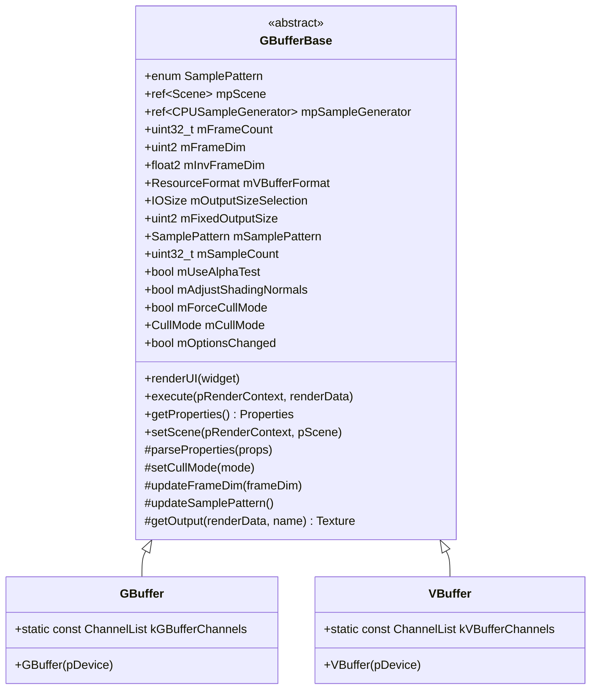
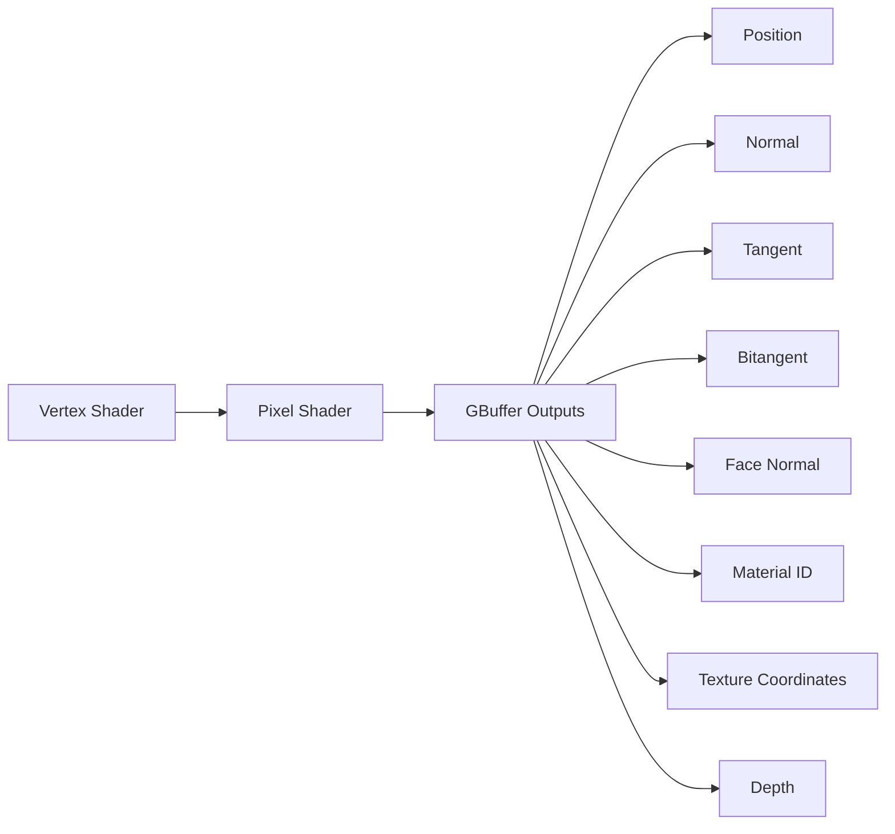
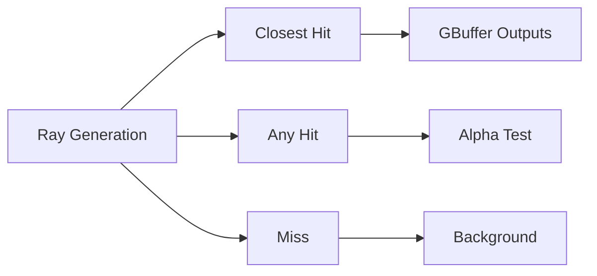

# GBuffer - Geometry Buffer Generation

## Module State Machine

**Status**: Complete

## Dependency Graph

### Sub-modules (Complete)

- [x] **GBuffer** - Main G-buffer implementation
  - [x] **GBuffer.cpp** - G-buffer implementation
  - [x] **GBuffer.h** - G-buffer header
  - [x] **DepthPass.3d.slang** - Depth pass shader
  - [x] **GBufferHelpers.slang** - G-buffer helper functions
  - [x] **GBufferRaster.3d.slang** - Rasterization shader
  - [x] **GBufferRaster.cpp** - Rasterization implementation
  - [x] **GBufferRaster.h** - Rasterization header
  - [x] **GBufferRT.cpp** - Ray tracing implementation
  - [x] **GBufferRT.h** - Ray tracing header
  - [x] **GBufferRT.cs.slang** - Ray tracing compute shader
  - [x] **GBufferRT.rt.slang** - Ray tracing shader
  - [x] **GBufferRT.slang** - Ray tracing shader definitions
- [x] **VBuffer** - Visibility buffer implementation
  - [x] **VBufferRaster.3d.slang** - V-buffer rasterization shader
  - [x] **VBufferRaster.cpp** - V-buffer rasterization implementation
  - [x] **VBufferRaster.h** - V-buffer rasterization header
  - [x] **VBufferRT.cpp** - V-buffer ray tracing implementation
  - [x] **VBufferRT.h** - V-buffer ray tracing header
  - [x] **VBufferRT.cs.slang** - V-buffer ray tracing compute shader
  - [x] **VBufferRT.rt.slang** - V-buffer ray tracing shader
  - [x] **VBufferRT.slang** - V-buffer ray tracing shader definitions
- [x] **GBufferBase** - Base class for G-buffer passes
  - [x] **GBufferBase.cpp** - Base class implementation
  - [x] **GBufferBase.h** - Base class header

### External Dependencies

- **Core/API** - Graphics API (Device, RenderContext, Buffer, Texture, Formats)
- **Core/Object** - Base object class
- **Core/Program** - Shader program management
- **RenderGraph** - Render graph system (RenderPass, RenderPassReflection)
- **Scene** - Scene system (Scene, Camera, Materials)
- **Utils/Math** - Mathematical utilities (Vector, Matrix)
- **Utils/Sampling** - Sampling utilities (SampleGenerator)
- **Utils/UI** - UI utilities (Gui)

## Module Overview

The GBuffer module provides geometry buffer (G-buffer) and visibility buffer (V-buffer) generation for deferred rendering pipelines. It supports both rasterization and ray tracing implementations, with options for camera jitter, sample patterns, alpha testing, and shading normal adjustment. The module is designed to be flexible and efficient, supporting various rendering techniques including path tracing, deferred shading, and ray tracing.

## Component Specifications

### GBufferBase Class

**Files**:
- [`GBufferBase.h`](Source/RenderPasses/GBuffer/GBufferBase.h:1) - GBufferBase class header (112 lines)
- [`GBufferBase.cpp`](Source/RenderPasses/GBuffer/GBufferBase.cpp:1) - GBufferBase implementation

**Purpose**: Base class for G-buffer and V-buffer passes, providing common functionality.

**Key Features**:
- Sample pattern selection (Center, DirectX, Halton, Stratified)
- Camera jitter support
- Alpha testing
- Shading normal adjustment
- Cull mode configuration
- Output size selection (Default, Fixed)
- Frame counting for random seeds

**Architecture**:

### SamplePattern Enum

**Purpose**: Defines camera jitter sample patterns for anti-aliasing.

**Values**:
- `Center` - No jitter, sample at pixel center
- `DirectX` - DirectX sample pattern (standard MSAA pattern)
- `Halton` - Halton sequence (low-discrepancy sequence)
- `Stratified` - Stratified sampling (jittered grid)

### GBuffer Class

**Files**:
- [`GBuffer.h`](Source/RenderPasses/GBuffer/GBuffer/GBuffer.h:1) - GBuffer class header (44 lines)
- [`GBuffer.cpp`](Source/RenderPasses/GBuffer/GBuffer/GBuffer.cpp:1) - GBuffer implementation

**Purpose**: Geometry buffer generation pass for storing per-pixel geometry information.

**Key Features**:
- Position storage (world space)
- Normal storage (world space)
- Tangent storage
- Bitangent storage
- Face normal storage
- Material ID storage
- Texture coordinates storage
- Depth storage

**G-Buffer Channels**:
- Position (float3)
- Normal (float3)
- Tangent (float3)
- Bitangent (float3)
- Face normal (float3)
- Material ID (uint32)
- Texture coordinates (float2)
- Depth (float)

### GBufferRaster Class

**Files**:
- [`GBufferRaster.h`](Source/RenderPasses/GBuffer/GBuffer/GBufferRaster.h:1) - GBufferRaster header
- [`GBufferRaster.cpp`](Source/RenderPasses/GBuffer/GBufferRaster.cpp:1) - GBufferRaster implementation
- [`GBufferRaster.3d.slang`](Source/RenderPasses/GBuffer/GBuffer/GBufferRaster.3d.slang:1) - Rasterization shader

**Purpose**: Rasterization-based G-buffer generation.

**Key Features**:
- Vertex shader for geometry transformation
- Pixel shader for per-pixel data output
- Alpha testing
- Shading normal adjustment
- Cull mode support
- Camera jitter

**Shader Pipeline**:

### GBufferRT Class

**Files**:
- [`GBufferRT.h`](Source/RenderPasses/GBuffer/GBuffer/GBufferRT.h:1) - GBufferRT header
- [`GBufferRT.cpp`](Source/RenderPasses/GBuffer/GBuffer/GBufferRT.cpp:1) - GBufferRT implementation
- [`GBufferRT.cs.slang`](Source/RenderPasses/GBuffer/GBuffer/GBufferRT.cs.slang:1) - Ray tracing compute shader
- [`GBufferRT.rt.slang`](Source/RenderPasses/GBuffer/GBuffer/GBufferRT.rt.slang:1) - Ray tracing shader
- [`GBufferRT.slang`](Source/RenderPasses/GBuffer/GBuffer/GBufferRT.slang:1) - Ray tracing shader definitions

**Purpose**: Ray tracing-based G-buffer generation.

**Key Features**:
- Ray generation shader
- Closest hit shader
- Any hit shader
- Miss shader
- Alpha testing
- Shading normal adjustment
- Camera jitter

**Ray Tracing Pipeline**:

### VBuffer Class

**Purpose**: Visibility buffer generation for storing per-pixel visibility information.

**Key Features**:
- Hit information storage (instance ID, primitive ID, barycentric coordinates)
- Material ID storage
- Compact storage format
- Efficient for deferred shading

**V-Buffer Channels**:
- Hit information (packed)
- Material ID (uint32)

### VBufferRaster Class

**Files**:
- [`VBufferRaster.h`](Source/RenderPasses/GBuffer/VBuffer/VBufferRaster.h:1) - VBufferRaster header
- [`VBufferRaster.cpp`](Source/RenderPasses/GBuffer/VBuffer/VBufferRaster.cpp:1) - VBufferRaster implementation
- [`VBufferRaster.3d.slang`](Source/RenderPasses/GBuffer/VBuffer/VBufferRaster.3d.slang:1) - Rasterization shader

**Purpose**: Rasterization-based V-buffer generation.

**Key Features**:
- Vertex shader for geometry transformation
- Pixel shader for per-pixel hit information
- Alpha testing
- Cull mode support
- Camera jitter

### VBufferRT Class

**Files**:
- [`VBufferRT.h`](Source/RenderPasses/GBuffer/VBuffer/VBufferRT.h:1) - VBufferRT header
- [`VBufferRT.cpp`](Source/RenderPasses/GBuffer/VBuffer/VBufferRT.cpp:1) - VBufferRT implementation
- [`VBufferRT.cs.slang`](Source/RenderPasses/GBuffer/VBuffer/VBufferRT.cs.slang:1) - Ray tracing compute shader
- [`VBufferRT.rt.slang`](Source/RenderPasses/GBuffer/VBuffer/VBufferRT.rt.slang:1) - Ray tracing shader
- [`VBufferRT.slang`](Source/RenderPasses/GBuffer/VBuffer/VBufferRT.slang:1) - Ray tracing shader definitions

**Purpose**: Ray tracing-based V-buffer generation.

**Key Features**:
- Ray generation shader
- Closest hit shader
- Any hit shader
- Miss shader
- Alpha testing
- Camera jitter

### DepthPass Shader

**File**: [`DepthPass.3d.slang`](Source/RenderPasses/GBuffer/GBuffer/DepthPass.3d.slang:1)

**Purpose**: Depth-only pass for depth buffer generation.

**Key Features**:
- Depth output
- Alpha testing
- Early-Z optimization

### GBufferHelpers Shader

**File**: [`GBufferHelpers.slang`](Source/RenderPasses/GBuffer/GBuffer/GBufferHelpers.slang:1)

**Purpose**: Helper functions for G-buffer generation.

**Key Features**:
- Normal packing/unpacking
- Tangent space computation
- Shading normal adjustment
- Material ID encoding/decoding

## Architecture Patterns

### G-Buffer vs V-Buffer

**G-Buffer (Geometry Buffer)**:
- Stores full geometry information per pixel
- Position, normal, tangent, bitangent, face normal
- Material ID, texture coordinates
- Depth
- Larger memory footprint
- Direct access to geometry data

**V-Buffer (Visibility Buffer)**:
- Stores minimal visibility information per pixel
- Hit information (instance ID, primitive ID, barycentric coordinates)
- Material ID
- Compact storage format
- Smaller memory footprint
- Requires geometry data lookup

### Rasterization vs Ray Tracing

**Rasterization**:
- Traditional rasterization pipeline
- Vertex shader → Pixel shader
- Fast for opaque geometry
- Limited to primary visibility
- No ray tracing hardware required

**Ray Tracing**:
- Ray tracing pipeline
- Ray generation → Closest hit/Any hit/Miss
- Supports secondary visibility
- More accurate for complex geometry
- Requires ray tracing hardware

### Sample Patterns

**Center**:
- No jitter
- Sample at pixel center
- No anti-aliasing
- Fastest

**DirectX**:
- DirectX sample pattern
- Standard MSAA pattern
- Good anti-aliasing
- Balanced performance

**Halton**:
- Halton sequence
- Low-discrepancy sequence
- Good coverage
- Better anti-aliasing

**Stratified**:
- Stratified sampling
- Jittered grid
- Good coverage
- Good anti-aliasing

## Technical Details

### Memory Layout

**G-Buffer Format**:
- Position: float3 (12 bytes)
- Normal: float3 (12 bytes)
- Tangent: float3 (12 bytes)
- Bitangent: float3 (12 bytes)
- Face normal: float3 (12 bytes)
- Material ID: uint32 (4 bytes)
- Texture coordinates: float2 (8 bytes)
- Depth: float (4 bytes)
- Total: 76 bytes per pixel

**V-Buffer Format**:
- Hit information: uint32 (4 bytes) - packed instance ID, primitive ID, barycentric coordinates
- Material ID: uint32 (4 bytes)
- Total: 8 bytes per pixel

### Shading Normal Adjustment

**Purpose**: Improve shading quality by adjusting shading normals on secondary hits.

**Algorithm**:
1. Compute geometric normal from triangle vertices
2. Compute shading normal from vertex normals
3. Adjust shading normal based on geometric normal
4. Ensure shading normal points towards camera

### Alpha Testing

**Purpose**: Handle transparent geometry without full transparency.

**Algorithm**:
1. Sample alpha from material
2. Compare alpha to threshold
3. Discard fragment if alpha < threshold
4. Early-Z optimization

### Camera Jitter

**Purpose**: Improve anti-aliasing by jittering camera rays.

**Algorithm**:
1. Generate jitter offset using sample pattern
2. Apply jitter to camera rays
3. Accumulate samples over multiple frames
4. Resolve to final image

### Cull Mode

**Options**:
- `None` - No culling
- `Back` - Back face culling (default)
- `Front` - Front face culling

**Force Cull Mode**:
- Override scene cull mode
- Useful for debugging
- Can improve performance

## Progress Log

- **2026-01-07T19:25:10Z**: GBuffer module analysis completed. Analyzed GBufferBase class, GBuffer class, GBufferRaster class, GBufferRT class, VBuffer class, VBufferRaster class, VBufferRT class, and all shader files. Created comprehensive technical specification covering G-buffer and V-buffer generation, rasterization vs ray tracing, sample patterns, shading normal adjustment, alpha testing, camera jitter, and cull mode. All sub-modules marked as Complete.

## Next Steps

Proceed to analyze other key render passes (TAA, SVGFPass, DLSSPass).
