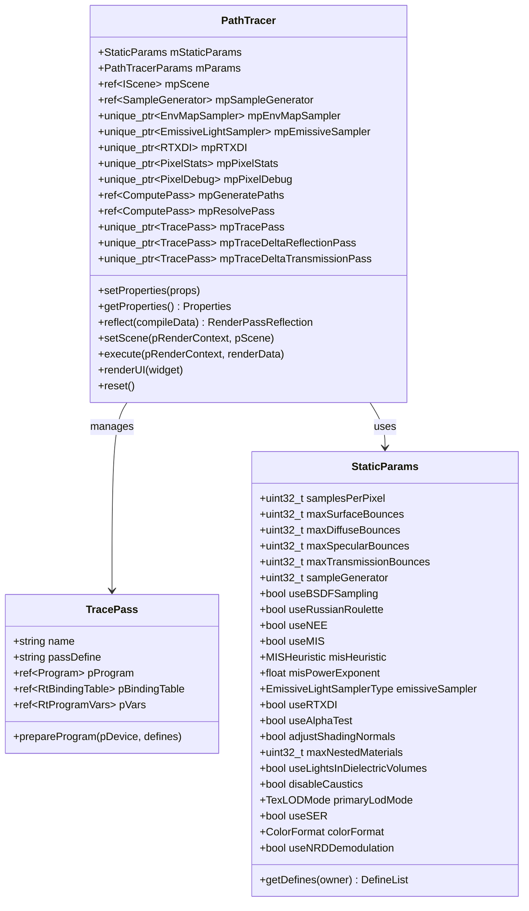
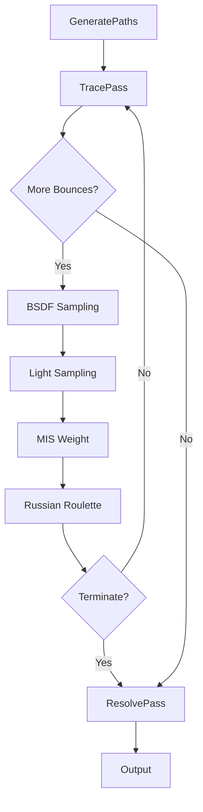

# PathTracer - Path Tracing Render Pass

## Module State Machine

**Status**: Complete

## Dependency Graph

### Sub-modules (Complete)

- [x] **PathTracer** - Main path tracer implementation
  - [x] **PathTracer.slang** - Path tracer shader
  - [x] **PathTracerNRD.slang** - Path tracer with NRD denoising
  - [x] **TracePass.rt.slang** - Ray tracing pass
  - [x] **GeneratePaths.cs.slang** - Path generation compute pass
  - [x] **LoadShadingData.slang** - Shading data loading
  - [x] **ResolvePass.cs.slang** - Sample resolve pass
  - [x] **ColorType.slang** - Color type definitions
  - [x] **GuideData.slang** - Guide data structures
  - [x] **NRDHelpers.slang** - NRD denoising helpers
  - [x] **Params.slang** - Path tracer parameters
  - [x] **PathState.slang** - Path state structures
  - [x] **ReflectTypes.cs.slang** - Type reflection helpers
  - [x] **StaticParams.slang** - Static parameter definitions

### External Dependencies

- **Core/API** - Graphics API (Device, RenderContext, Buffer, Texture)
- **Core/Object** - Base object class
- **Core/Program** - Shader program management
- **RenderGraph** - Render graph system (RenderPass, RenderPassReflection)
- **Scene** - Scene system (Scene, Camera, Lights, Materials)
- **Utils/Math** - Mathematical utilities (Vector, Matrix, Ray)
- **Utils/Sampling** - Sampling utilities (SampleGenerator)
- **Utils/Debug** - Debug utilities (PixelDebug)
- **Rendering/Lights** - Light management (LightBVHSampler, EmissiveLightSampler, EnvMapSampler)
- **Rendering/Materials** - Material system (TexLODTypes)
- **Rendering/RTXDI** - RTXDI integration
- **Rendering/Utils** - Rendering utilities (PixelStats)

## Module Overview

The PathTracer module implements a comprehensive Monte Carlo path tracer for physically-based rendering. It supports multiple importance sampling (MIS), next-event estimation (NEE), Russian roulette termination, various light sampling strategies, and integration with NVIDIA Real-time Denoisers (NRD) and RTX Direct Illumination (RTXDI). The path tracer is designed for high-quality offline rendering and can also be used for real-time applications with denoising.

## Component Specifications

### PathTracer Class

**Files**:
- [`PathTracer.h`](Source/RenderPasses/PathTracer/PathTracer.h:1) - PathTracer class header (207 lines)
- [`PathTracer.cpp`](Source/RenderPasses/PathTracer/PathTracer.cpp:1) - PathTracer implementation

**Purpose**: Main path tracer render pass implementing Monte Carlo path tracing with advanced features.

**Key Features**:
- Multiple importance sampling (MIS)
- Next-event estimation (NEE)
- Russian roulette termination
- Multiple bounce types (diffuse, specular, transmission)
- Light sampling strategies (LightBVH, EmissivePower, Uniform, EnvMap)
- RTXDI integration for direct illumination
- NRD denoising integration
- Shader Execution Reordering (SER)
- PyTorch integration for differentiable rendering
- Pixel debugging support
- Pixel statistics collection

**Architecture**:

### StaticParams Structure

**Purpose**: Compile-time configuration parameters that require shader recompilation when changed.

**Key Parameters**:

**Rendering Parameters**:
- `samplesPerPixel` - Number of samples (paths) per pixel
- `maxSurfaceBounces` - Max number of surface bounces (diffuse + specular + transmission)
- `maxDiffuseBounces` - Max number of diffuse bounces (0 = direct only)
- `maxSpecularBounces` - Max number of specular bounces (0 = direct only)
- `maxTransmissionBounces` - Max number of transmission bounces (0 = none)

**Sampling Parameters**:
- `sampleGenerator` - Pseudorandom sample generator type (TinyUniform, Uniform, Halton, Stratified)
- `useBSDFSampling` - Use BRDF importance sampling, otherwise cosine-weighted hemisphere sampling
- `useRussianRoulette` - Use Russian roulette to terminate low throughput paths
- `useNEE` - Use next-event estimation (NEE) with shadow rays from each path vertex
- `useMIS` - Use multiple importance sampling (MIS) when NEE is enabled
- `misHeuristic` - MIS heuristic (Balance, Power, Maximum)
- `misPowerExponent` - MIS exponent for power heuristic
- `emissiveSampler` - Emissive light sampler type (LightBVH, EmissivePower, EmissiveUniform, EnvMap)
- `useRTXDI` - Use RTXDI for direct illumination

**Material Parameters**:
- `useAlphaTest` - Use alpha testing on non-opaque triangles
- `adjustShadingNormals` - Adjust shading normals on secondary hits
- `maxNestedMaterials` - Maximum supported number of nested materials
- `useLightsInDielectricVolumes` - Use lights inside of volumes (transmissive materials)
- `disableCaustics` - Disable sampling of caustics
- `primaryLodMode` - Texture LOD mode for primary hit (Mip0, RayCones, RayDiffs)

**Scheduling Parameters**:
- `useSER` - Enable Shader Execution Reordering

**Output Parameters**:
- `colorFormat` - Color format for internal per-sample color and denoiser buffers (LogLuvHDR, RGB32Float)

**Denoising Parameters**:
- `useNRDDemodulation` - Global switch for NRD demodulation

### TracePass Structure

**Purpose**: Manages ray tracing shader programs and binding tables for different trace passes.

**Components**:
- `name` - Pass name for identification
- `passDefine` - Shader define for pass specialization
- `pProgram` - Compiled ray tracing program
- `pBindingTable` - Ray tracing binding table
- `pVars` - Ray tracing program variables

**Trace Pass Types**:
1. **Main Trace Pass** - Primary path tracing with full bounce support
2. **Delta Reflection Pass** - Delta reflection for NRD denoising
3. **Delta Transmission Pass** - Delta transmission for NRD denoising

### PathTracer Shader

**File**: [`PathTracer.slang`](Source/RenderPasses/PathTracer/PathTracer.slang:1)

**Purpose**: Main path tracing shader implementing Monte Carlo integration.

**Key Components**:

**Path State**:
- Path vertex information (position, normal, material)
- Path throughput
- Path depth
- Path termination flags

**Sampling**:
- BSDF sampling
- Light sampling
- MIS weight computation
- Russian roulette termination

**Integration**:
- Direct illumination (NEE)
- Indirect illumination
- Emissive materials
- Environment map

**Material Evaluation**:
- Material system integration
- Nested material support
- Alpha testing
- Shading normal adjustment

### PathTracerNRD Shader

**File**: [`PathTracerNRD.slang`](Source/RenderPasses/PathTracer/PathTracerNRD.slang:1)

**Purpose**: Path tracer with NRD (NVIDIA Real-time Denoisers) integration.

**Key Features**:
- NRD guide data generation
- NRD radiance data generation
- NRD hit distance data generation
- NRD demodulation
- Delta path handling

### TracePass Shader

**File**: [`TracePass.rt.slang`](Source/RenderPasses/PathTracer/TracePass.rt.slang:1)

**Purpose**: Ray tracing shader for path tracing.

**Key Components**:

**Ray Generation**:
- Primary ray generation
- Secondary ray generation
- Shadow ray generation

**Closest Hit**:
- Material evaluation
- BSDF sampling
- Light sampling
- Path continuation

**Any Hit**:
- Alpha testing
- Shadow ray handling

**Miss**:
- Environment map sampling
- Background color

### GeneratePaths Shader

**File**: [`GeneratePaths.cs.slang`](Source/RenderPasses/PathTracer/GeneratePaths.cs.slang:1)

**Purpose**: Compute shader for generating paths starting at primary hits.

**Key Features**:
- Primary ray generation
- Camera jitter application
- Sample pattern generation
- Path initialization

### LoadShadingData Shader

**File**: [`LoadShadingData.slang`](Source/RenderPasses/PathTracer/LoadShadingData.slang:1)

**Purpose**: Shader for loading shading data from scene resources.

**Key Features**:
- Material data loading
- Texture sampling
- Normal mapping
- Tangent space computation

### ResolvePass Shader

**File**: [`ResolvePass.cs.slang`](Source/RenderPasses/PathTracer/ResolvePass.cs.slang:1)

**Purpose**: Compute shader for resolving accumulated samples.

**Key Features**:
- Sample accumulation
- Temporal accumulation
- Variance estimation
- Final color output

### ColorType Shader

**File**: [`ColorType.slang`](Source/RenderPasses/PathTracer/ColorType.slang:1)

**Purpose**: Color type definitions for path tracer.

**Key Types**:
- LogLuvHDR color format
- RGB32Float color format
- Color conversion functions

### GuideData Shader

**File**: [`GuideData.slang`](Source/RenderPasses/PathTracer/GuideData.slang:1)

**Purpose**: Guide data structures for NRD denoising.

**Key Structures**:
- Normal data
- Roughness data
- Material ID data
- View direction data

### NRDHelpers Shader

**File**: [`NRDHelpers.slang`](Source/RenderPasses/PathTracer/NRDHelpers.slang:1)

**Purpose**: Helper functions for NRD integration.

**Key Features**:
- NRD data packing
- NRD data unpacking
- NRD demodulation
- NRD validation

### Params Shader

**File**: [`Params.slang`](Source/RenderPasses/PathTracer/Params.slang:1)

**Purpose**: Path tracer parameter definitions.

**Key Structures**:
- Runtime parameters
- Static parameters
- Configuration flags

### PathState Shader

**File**: [`PathState.slang`](Source/RenderPasses/PathTracer/PathState.slang:1)

**Purpose**: Path state structures for path tracing.

**Key Structures**:
- Path vertex
- Path state
- Path termination flags

### ReflectTypes Shader

**File**: [`ReflectTypes.cs.slang`](Source/RenderPasses/PathTracer/ReflectTypes.cs.slang:1)

**Purpose**: Helper shader for reflecting structured buffer types.

**Key Features**:
- Type reflection
- Buffer layout validation
- Type compatibility checking

### StaticParams Shader

**File**: [`StaticParams.slang`](Source/RenderPasses/PathTracer/StaticParams.slang:1)

**Purpose**: Static parameter definitions for shader compilation.

**Key Features**:
- Compile-time constants
- Shader defines
- Configuration validation

## Architecture Patterns

### Path Tracing Pipeline

### Multiple Importance Sampling

- **BSDF Sampling**: Sample outgoing direction based on BSDF
- **Light Sampling**: Sample light sources directly
- **MIS Weight**: Combine samples using balance/power/maximum heuristic
- **Power Heuristic**: `(p1^β) / (p1^β + p2^β)` where β is power exponent

### Next-Event Estimation

- **Shadow Rays**: Cast shadow rays to light sources at each path vertex
- **Light Sampling**: Sample light sources for direct illumination
- **Visibility Testing**: Test visibility between path vertex and light
- **MIS Integration**: Combine BSDF and light sampling with MIS

### Russian Roulette

- **Termination Probability**: Based on path throughput
- **Survival Compensation**: Scale surviving paths by 1/p
- **Minimum Bounces**: Ensure minimum number of bounces before termination
- **Throughput Threshold**: Terminate paths with low throughput

### Light Sampling Strategies

**LightBVH**:
- Build BVH over emissive triangles
- Traverse BVH for efficient light sampling
- Support for large numbers of emissive triangles

**EmissivePower**:
- Sample based on emissive power
- Power-proportional importance sampling
- Good for scenes with varying emissive power

**EmissiveUniform**:
- Uniform sampling of emissive triangles
- Simple but less efficient
- Good for debugging

**EnvMap**:
- Environment map sampling
- Importance sampling based on luminance
- Support for HDR environment maps

### NRD Integration

**Guide Data**:
- Normals (world space)
- Roughness
- Material ID
- View direction

**NRD Data**:
- Diffuse radiance
- Specular radiance
- Hit distances
- Emission
- Reflectance

**Demodulation**:
- Remove BRDF modulation from specular radiance
- Preserve energy conservation
- Improve denoising quality

### RTXDI Integration

**Direct Illumination**:
- RTXDI light sampling
- Efficient direct illumination
- Support for many light sources

**Temporal Accumulation**:
- RTXDI temporal reuse
- Reduced noise
- Improved performance

## Technical Details

### Path Tracing Algorithm

1. **Primary Ray Generation**:
   - Generate primary rays from camera
   - Apply camera jitter for anti-aliasing
   - Initialize path state

2. **Path Tracing Loop**:
   - Trace ray through scene
   - Evaluate material at hit point
   - Sample BSDF for outgoing direction
   - Sample light sources (NEE)
   - Compute MIS weight
   - Apply Russian roulette
   - Continue or terminate path

3. **Sample Accumulation**:
   - Accumulate samples per pixel
   - Apply temporal accumulation
   - Compute variance
   - Output final color

### Memory Layout

**Per-Sample Buffers**:
- `mpSampleColor` - Compact per-sample color buffer
- `mpSampleGuideData` - Compact per-sample denoiser guide data
- `mpSampleNRDRadiance` - Compact per-sample NRD radiance data
- `mpSampleNRDHitDist` - Compact per-sample NRD hit distance data
- `mpSampleNRDPrimaryHitNeeOnDelta` - Compact per-sample NEE on delta primary vertices data
- `mpSampleNRDEmission` - Compact per-sample NRD emission data
- `mpSampleNRDReflectance` - Compact per-sample NRD reflectance data

**Sample Offset**:
- `mpSampleOffset` - Output offset into per-sample buffers

### Shader Compilation

**Defines**:
- `SAMPLES_PER_PIXEL` - Number of samples per pixel
- `MAX_BOUNCES` - Maximum number of bounces
- `USE_NEE` - Enable next-event estimation
- `USE_MIS` - Enable multiple importance sampling
- `USE_RUSSIAN_ROULETTE` - Enable Russian roulette
- `USE_BSDF_SAMPLING` - Enable BSDF sampling
- `USE_RTXDI` - Enable RTXDI
- `USE_SER` - Enable shader execution reordering
- `COLOR_FORMAT` - Color format (LogLuvHDR or RGB32Float)

### Performance Optimizations

**Shader Execution Reordering (SER)**:
- Reorder threads based on ray hit distance
- Improve divergence handling
- Reduce warp execution time

**Ray Tracing Optimizations**:
- Ray flags for optimized traversal
- Hit group specialization
- Instance masking
- Any-hit optimization

**Memory Optimizations**:
- Compact buffer layouts
- Texture compression
- Shared memory usage

## Progress Log

- **2026-01-07T19:24:30Z**: PathTracer module analysis completed. Analyzed PathTracer class, StaticParams structure, TracePass structure, and all shader files. Created comprehensive technical specification covering path tracing algorithm, multiple importance sampling, next-event estimation, Russian roulette, light sampling strategies, NRD integration, and RTXDI integration. All sub-modules marked as Complete.

## Next Steps

Proceed to analyze GBuffer module to understand geometry buffer generation.
