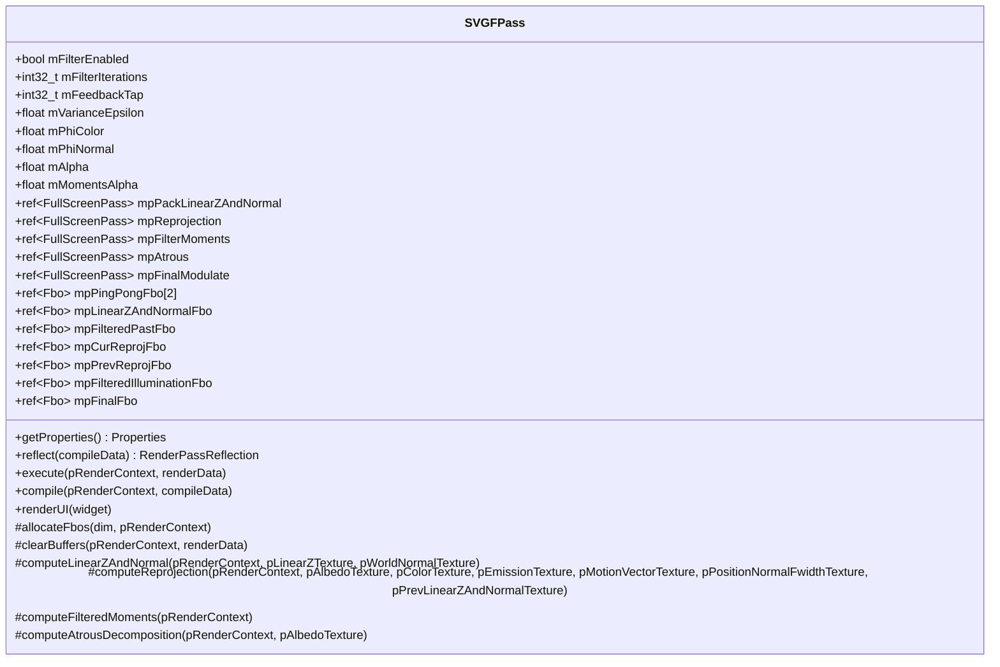
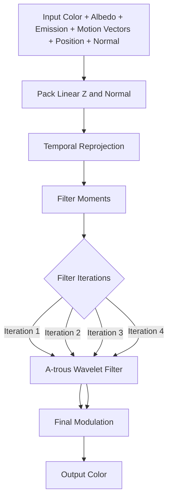

# SVGFPass - Spatiotemporal Variance-Guided Filtering

## Module State Machine

**Status**: Complete

## Dependency Graph

### Sub-modules (Complete)

- [x] **SVGFPass** - SVGF denoising pass
  - [x] **SVGFPass.cpp** - SVGF implementation
  - [x] **SVGFPass.h** - SVGF header
  - [x] **SVGFAtrous.ps.slang** - A-trous wavelet filter shader
  - [x] **SVGFCommon.slang** - SVGF common utilities
  - [x] **SVGFFilterMoments.ps.slang** - Moment filtering shader
  - [x] **SVGFFinalModulate.ps.slang** - Final modulation shader
  - [x] **SVGFPackLinearZAndNormal.ps.slang** - Linear Z and normal packing shader
  - [x] **SVGFReproject.ps.slang** - Temporal reprojection shader

### External Dependencies

- **Core/API** - Graphics API (Device, RenderContext, Texture, Fbo)
- **Core/Object** - Base object class
- **Core/Program** - Shader program management
- **Core/Pass** - Full-screen pass base class
- **RenderGraph** - Render graph system (RenderPass, RenderPassReflection)
- **Utils/Math** - Mathematical utilities (Vector, Matrix)
- **Utils/UI** - UI utilities (Gui)

## Module Overview

The SVGFPass module implements Spatiotemporal Variance-Guided Filtering (SVGF), a state-of-the-art denoising technique for Monte Carlo rendering. SVGF combines temporal accumulation, spatial filtering, and variance estimation to reduce noise while preserving edges and details. The implementation includes configurable parameters for filter iterations, feedback taps, and various phi values for controlling filter strength.

## Component Specifications

### SVGFPass Class

**Files**:
- [`SVGFPass.h`](Source/RenderPasses/SVGFPass/SVGFPass.h:1) - SVGFPass class header (94 lines)
- [`SVGFPass.cpp`](Source/RenderPasses/SVGFPass/SVGFPass.cpp:1) - SVGF implementation
- [`SVGFAtrous.ps.slang`](Source/RenderPasses/SVGFPass/SVGFAtrous.ps.slang:1) - A-trous wavelet filter shader
- [`SVGFCommon.slang`](Source/RenderPasses/SVGFPass/SVGFCommon.slang:1) - SVGF common utilities
- [`SVGFFilterMoments.ps.slang`](Source/RenderPasses/SVGFPass/SVGFFilterMoments.ps.slang:1) - Moment filtering shader
- [`SVGFFinalModulate.ps.slang`](Source/RenderPasses/SVGFPass/SVGFFinalModulate.ps.slang:1) - Final modulation shader
- [`SVGFPackLinearZAndNormal.ps.slang`](Source/RenderPasses/SVGFPass/SVGFPackLinearZAndNormal.ps.slang:1) - Linear Z and normal packing shader
- [`SVGFReproject.ps.slang`](Source/RenderPasses/SVGFPass/SVGFReproject.ps.slang:1) - Temporal reprojection shader

**Purpose**: Spatiotemporal Variance-Guided Filtering for denoising Monte Carlo rendering.

**Key Features**:
- Temporal accumulation with motion vectors
- A-trous wavelet decomposition for spatial filtering
- Variance estimation for adaptive filtering
- Edge-aware filtering using normals and depth
- Configurable filter iterations
- Feedback tap support
- Multiple phi values for different features

**Architecture**:



### SVGF Parameters

**Purpose**: Runtime configuration parameters for SVGF denoising.

**Parameters**:

**mFilterEnabled** (bool, default: true):
- Enable or disable SVGF filtering
- When disabled, passes through input without filtering
- Useful for comparing filtered vs unfiltered results

**mFilterIterations** (int32_t, default: 4):
- Number of A-trous wavelet filter iterations
- More iterations = stronger filtering, more blur
- Fewer iterations = weaker filtering, less blur
- Typical range: 2-6

**mFeedbackTap** (int32_t, default: 1):
- Feedback tap for A-trous filter
- Controls which level of the wavelet decomposition to use for feedback
- Higher values = coarser feedback
- Typical range: 0-3

**mVarianceEpsilon** (float, default: 1e-4f):
- Epsilon value for variance computation
- Prevents division by zero
- Small value to ensure numerical stability

**mPhiColor** (float, default: 10.0f):
- Phi value for color-based filtering
- Controls color similarity threshold
- Higher values = less color-sensitive filtering
- Lower values = more color-sensitive filtering
- Typical range: 5.0-20.0

**mPhiNormal** (float, default: 128.0f):
- Phi value for normal-based filtering
- Controls normal similarity threshold
- Higher values = less normal-sensitive filtering
- Lower values = more normal-sensitive filtering
- Typical range: 64.0-256.0

**mAlpha** (float, default: 0.05f):
- Alpha value for temporal accumulation
- Controls how much of previous frame is blended with current frame
- Lower values = more temporal stability, more ghosting
- Higher values = less ghosting, less temporal stability
- Typical range: 0.02-0.1

**mMomentsAlpha** (float, default: 0.2f):
- Alpha value for moment filtering
- Controls temporal accumulation of moments
- Lower values = more stable moments
- Higher values = more responsive moments
- Typical range: 0.1-0.3

### SVGF Pipeline



### PackLinearZAndNormal Shader

**File**: [`SVGFPackLinearZAndNormal.ps.slang`](Source/RenderPasses/SVGFPass/SVGFPackLinearZAndNormal.ps.slang:1)

**Purpose**: Pack linear depth and world normal into a single texture.

**Key Features**:
- Convert non-linear depth to linear depth
- Pack world normal into RGB channels
- Output combined texture for reprojection

**Algorithm**:
1. Sample depth buffer
2. Convert to linear depth: `d = 1.0 / (z * zFar + zNear)`
3. Sample world normal
4. Pack normal into RGB: `rgb = normal * 0.5 + 0.5`
5. Output packed texture

### SVGFReproject Shader

**File**: [`SVGFReproject.ps.slang`](Source/RenderPasses/SVGFPass/SVGFReproject.ps.slang:1)

**Purpose**: Temporal reprojection of previous frame data.

**Key Features**:
- Reproject previous frame color using motion vectors
- Reproject previous frame moments
- Handle disocclusions
- Compute variance
- Temporal accumulation

**Algorithm**:

1. **Reprojection**:
   - Sample motion vector at current pixel
   - Reproject current pixel to previous frame location
   - Sample previous frame color and moments at reprojected location

2. **Disocclusion Handling**:
   - Compare current and reprojected depth
   - Compare current and reprojected normals
   - Detect disocclusions
   - Reset temporal history for disoccluded pixels

3. **Temporal Accumulation**:
   - Blend current frame color with reprojected previous frame color
   - Use alpha blending factor
   - Accumulate moments: `moment = lerp(currentMoment, prevMoment, momentsAlpha)`

4. **Variance Computation**:
   - Compute variance from moments
   - Variance = `moment2 - moment^2`
   - Add epsilon for numerical stability

**Pseudo-code**:

```slang
// Sample inputs
float3 currentColor = tex2D(color, uv);
float2 motion = tex2D(motionVectors, uv);
float3 currentNormal = tex2D(normals, uv);
float currentDepth = tex2D(depth, uv);

// Reproject
float2 prevUV = uv - motion;
float3 prevColor = tex2D(prevColor, prevUV);
float2 prevMoments = tex2D(prevMoments, prevUV);
float prevDepth = tex2D(prevDepth, prevUV);
float3 prevNormal = tex2D(prevNormals, prevUV);

// Disocclusion detection
bool disoccluded = abs(currentDepth - prevDepth) > depthThreshold ||
                  dot(currentNormal, prevNormal) < normalThreshold;

// Temporal accumulation
float3 accumulatedColor;
if (disoccluded) {
    accumulatedColor = currentColor;
} else {
    accumulatedColor = lerp(currentColor, prevColor, alpha);
}

// Moment accumulation
float currentMoment = luminance(accumulatedColor);
float prevMoment = prevMoments.x;
float accumulatedMoment = lerp(currentMoment, prevMoment, momentsAlpha);

float currentMoment2 = currentMoment * currentMoment;
float prevMoment2 = prevMoments.y;
float accumulatedMoment2 = lerp(currentMoment2, prevMoment2, momentsAlpha);

// Variance
float variance = accumulatedMoment2 - accumulatedMoment * accumulatedMoment + epsilon;

return float4(accumulatedColor, variance);
```

### SVGFFilterMoments Shader

**File**: [`SVGFFilterMoments.ps.slang`](Source/RenderPasses/SVGFPass/SVGFFilterMoments.ps.slang:1)

**Purpose**: Filter moments using spatial filtering.

**Key Features**:
- Spatial filtering of moments
- Edge-aware filtering using normals and depth
- Variance-guided filtering
- Adaptive filter kernel

**Algorithm**:

1. **Neighborhood Sampling**:
   - Sample neighborhood pixels
   - Sample normals and depth
   - Compute weights based on similarity

2. **Weight Computation**:
   - Color weight: `w_color = exp(-deltaColor^2 / phiColor)`
   - Normal weight: `w_normal = exp(-deltaNormal^2 / phiNormal)`
   - Depth weight: `w_depth = exp(-deltaDepth^2 / phiDepth)`
   - Combined weight: `w = w_color * w_normal * w_depth`

3. **Moment Filtering**:
   - Weighted average of moments
   - Normalize by sum of weights
   - Output filtered moments

### SVGFAtrous Shader

**File**: [`SVGFAtrous.ps.slang`](Source/RenderPasses/SVGFPass/SVGFAtrous.ps.slang:1)

**Purpose**: A-trous wavelet decomposition for spatial filtering.

**Key Features**:
- A-trous wavelet transform
- Multi-scale filtering
- Edge preservation
- Iterative refinement

**Algorithm**:

1. **A-trous Wavelet Transform**:
   - Sample pixels at different scales
   - Scale 0: current pixel
   - Scale 1: 1-pixel offset
   - Scale 2: 2-pixel offset
   - Scale 3: 4-pixel offset

2. **Weight Computation**:
   - Compute weights based on color, normal, and depth similarity
   - Use phiColor and phiNormal parameters
   - Edge-aware weighting

3. **Filtering**:
   - Weighted average of samples at different scales
   - Preserve edges
   - Reduce noise

4. **Iteration**:
   - Apply filter multiple times
   - Each iteration refines the result
   - Use feedback from previous iteration

**Pseudo-code**:

```slang
float3 filteredColor = 0;
float totalWeight = 0;

// A-trous samples
for (int i = 0; i < numSamples; i++) {
    float2 offset = getAtrousOffset(i, iteration);
    float2 sampleUV = uv + offset * invDim;

    float3 sampleColor = tex2D(color, sampleUV);
    float3 sampleNormal = tex2D(normals, sampleUV);
    float sampleDepth = tex2D(depth, sampleUV);

    // Weight computation
    float3 centerColor = tex2D(color, uv);
    float3 centerNormal = tex2D(normals, uv);
    float centerDepth = tex2D(depth, uv);

    float wColor = exp(-length(sampleColor - centerColor)^2 / phiColor);
    float wNormal = exp(-length(sampleNormal - centerNormal)^2 / phiNormal);
    float wDepth = exp(-abs(sampleDepth - centerDepth) / phiDepth);

    float weight = wColor * wNormal * wDepth;

    filteredColor += sampleColor * weight;
    totalWeight += weight;
}

filteredColor /= totalWeight;

return filteredColor;
```

### SVGFFinalModulate Shader

**File**: [`SVGFFinalModulate.ps.slang`](Source/RenderPasses/SVGFPass/SVGFFinalModulate.ps.slang:1)

**Purpose**: Final modulation to apply filtered illumination to albedo.

**Key Features**:
- Modulate filtered illumination with albedo
- Apply emission
- Final color output

**Algorithm**:

1. **Sample Inputs**:
   - Sample filtered illumination
   - Sample albedo
   - Sample emission

2. **Modulation**:
   - Multiply illumination by albedo
   - Add emission
   - Output final color

**Pseudo-code**:

```slang
float3 illumination = tex2D(filteredIllumination, uv).rgb;
float3 albedo = tex2D(albedo, uv).rgb;
float3 emission = tex2D(emission, uv).rgb;

float3 finalColor = illumination * albedo + emission;

return float4(finalColor, 1.0);
```

### SVGFCommon Shader

**File**: [`SVGFCommon.slang`](Source/RenderPasses/SVGFPass/SVGFCommon.slang:1)

**Purpose**: Common utilities and helper functions for SVGF.

**Key Features**:
- Common data structures
- Helper functions
- Shared constants

## Architecture Patterns

### Temporal Accumulation

- Motion vector-based reprojection
- Disocclusion detection
- Alpha blending for temporal stability
- Moment accumulation for variance estimation

### Spatial Filtering

- A-trous wavelet decomposition
- Multi-scale filtering
- Edge-aware weighting
- Iterative refinement

### Variance-Guided Filtering

- Variance estimation from moments
- Adaptive filter strength based on variance
- Higher variance = stronger filtering
- Lower variance = weaker filtering

### Edge-Aware Filtering

- Normal-based weighting
- Depth-based weighting
- Color-based weighting
- Combined weight for edge preservation

## Technical Details

### Memory Layout

**Inputs**:
- Color (Texture2D)
- Albedo (Texture2D)
- Emission (Texture2D)
- Motion vectors (Texture2D)
- Position (Texture2D)
- Normal (Texture2D)
- Depth (Texture2D)

**Outputs**:
- Filtered color (Texture2D)

**Intermediate**:
- Linear Z and normal (Texture2D)
- Reprojected frame (Texture2D)
- Filtered moments (Texture2D)
- Ping-pong buffers (Texture2D[2])

### Performance Considerations

**Memory Bandwidth**:
- Multiple texture reads per pixel
- Neighborhood sampling for filtering
- Multiple filter iterations
- High memory bandwidth requirements

**Optimizations**:
- Use shared memory for neighborhood sampling
- Minimize texture fetches
- Use compute shaders for better performance
- Early-out for static pixels

### Quality Considerations

**Ghosting**:
- Caused by disocclusions or incorrect motion vectors
- Reduced by disocclusion detection
- Reduced by lower alpha values

**Blur**:
- Caused by strong filtering
- Reduced by fewer filter iterations
- Reduced by higher phi values

**Noise**:
- Caused by insufficient filtering
- Reduced by more filter iterations
- Reduced by lower phi values

**Edge Preservation**:
- Improved by normal-based weighting
- Improved by depth-based weighting
- Improved by lower phiNormal values

### Integration Points

**Render Graph Integration**:
- Requires motion vectors from previous frame
- Requires depth buffer for disocclusion detection
- Requires normals for edge-aware filtering
- Requires albedo for final modulation
- Requires emission for final modulation
- Can be placed after path tracing or other noisy renderers

## Progress Log

- **2026-01-07T19:27:30Z**: SVGFPass module analysis completed. Analyzed SVGFPass class, SVGF parameters, and all shader files. Created comprehensive technical specification covering temporal accumulation, spatial filtering, variance-guided filtering, edge-aware filtering, A-trous wavelet decomposition, and integration points. All sub-modules marked as Complete.

## Next Steps

Proceed to analyze other key render passes (DLSSPass, AccumulatePass, BlitPass).
