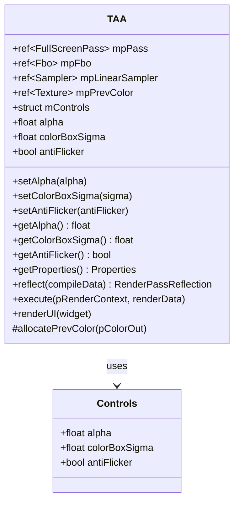
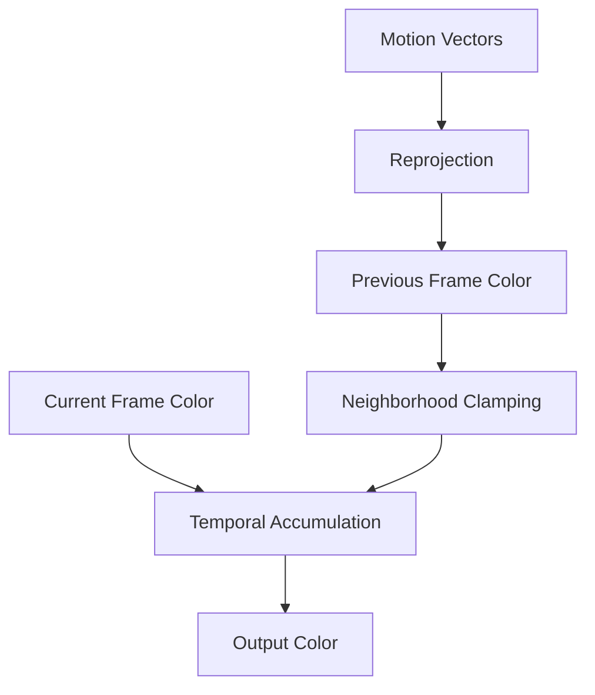

# TAA - Temporal Anti-Aliasing

## Module State Machine

**Status**: Complete

## Dependency Graph

### Sub-modules (Complete)

- [x] **TAA** - Temporal anti-aliasing pass
  - [x] **TAA.cpp** - TAA implementation
  - [x] **TAA.h** - TAA header
  - [x] **TAA.ps.slang** - TAA pixel shader

### External Dependencies

- **Core/API** - Graphics API (Device, RenderContext, Texture, Sampler)
- **Core/Object** - Base object class
- **Core/Program** - Shader program management
- **Core/Pass** - Full-screen pass base class
- **RenderGraph** - Render graph system (RenderPass, RenderPassReflection)
- **Utils/UI** - UI utilities (Gui)

## Module Overview

The TAA module implements temporal anti-aliasing (TAA) for reducing temporal aliasing artifacts in real-time rendering. TAA works by accumulating samples across multiple frames using motion vectors to reproject previous frame samples. The implementation includes configurable blending factor, color box filtering, and anti-flicker options.

## Component Specifications

### TAA Class

**Files**:
- [`TAA.h`](Source/RenderPasses/TAA/TAA.h:1) - TAA class header (74 lines)
- [`TAA.cpp`](Source/RenderPasses/TAA/TAA.cpp:1) - TAA implementation
- [`TAA.ps.slang`](Source/RenderPasses/TAA/TAA.ps.slang:1) - TAA pixel shader

**Purpose**: Temporal anti-aliasing pass for reducing temporal aliasing.

**Key Features**:
- Temporal accumulation across frames
- Motion vector-based reprojection
- Configurable blending factor (alpha)
- Color box filtering
- Anti-flicker option
- History clamping
- Neighborhood clamping

**Architecture**:



### Controls Structure

**Purpose**: Runtime configuration parameters for TAA.

**Parameters**:

**alpha** (float, default: 0.1):
- Blending factor for temporal accumulation
- Controls how much of the previous frame is blended with the current frame
- Lower values = more temporal stability, more ghosting
- Higher values = less ghosting, less temporal stability
- Typical range: 0.05 - 0.2

**colorBoxSigma** (float, default: 1.0):
- Sigma value for color box filtering
- Controls the neighborhood size for color clamping
- Higher values = larger neighborhood, more ghosting reduction
- Lower values = smaller neighborhood, less ghosting reduction
- Typical range: 0.5 - 2.0

**antiFlicker** (bool, default: true):
- Enable anti-flicker option
- Reduces temporal flickering
- Uses additional filtering to stabilize colors
- May reduce sharpness

### TAA Shader

**File**: [`TAA.ps.slang`](Source/RenderPasses/TAA/TAA.ps.slang:1)

**Purpose**: Pixel shader implementing temporal anti-aliasing.

**Key Components**:

**Inputs**:
- Current frame color
- Previous frame color
- Motion vectors
- Depth buffer

**Algorithm**:

1. **Reprojection**:
   - Sample motion vector at current pixel
   - Reproject current pixel to previous frame location
   - Sample previous frame color at reprojected location

2. **Neighborhood Clamping**:
   - Sample neighborhood of current frame
   - Compute color box (min/max) based on colorBoxSigma
   - Clamp previous frame color to color box
   - Prevents ghosting and temporal instability

3. **Temporal Accumulation**:
   - Blend current frame color with clamped previous frame color
   - Use alpha blending factor
   - Output accumulated color

4. **Anti-Flicker** (optional):
   - Apply additional filtering to reduce flickering
   - Stabilize colors across frames
   - May reduce sharpness

**Pseudo-code**:

```slang
// Sample current frame color
float3 currentColor = tex2D(currentFrame, uv);

// Sample motion vector
float2 motion = tex2D(motionVectors, uv);

// Reproject to previous frame
float2 prevUV = uv - motion;
float3 prevColor = tex2D(prevFrame, prevUV);

// Neighborhood clamping
float3 minColor, maxColor;
computeColorBox(currentFrame, uv, colorBoxSigma, minColor, maxColor);
prevColor = clamp(prevColor, minColor, maxColor);

// Temporal accumulation
float3 result = lerp(currentColor, prevColor, alpha);

// Anti-flicker (optional)
if (antiFlicker) {
    result = applyAntiFlickerFilter(result);
}

return result;
```

## Architecture Patterns

### Temporal Accumulation



### Neighborhood Clamping

**Purpose**: Prevent ghosting and temporal instability by clamping previous frame color to neighborhood of current frame.

**Algorithm**:
1. Sample neighborhood pixels around current pixel
2. Compute min/max color values based on colorBoxSigma
3. Clamp previous frame color to [min, max] range
4. Prevents large color differences between frames

**Color Box Computation**:
- Sample 3x3 or 5x5 neighborhood
- Compute mean and standard deviation
- Set min = mean - sigma * std
- Set max = mean + sigma * std

### Motion Vector Reprojection

**Purpose**: Reproject current pixel to previous frame location using motion vectors.

**Algorithm**:
1. Sample motion vector at current pixel
2. Subtract motion vector from current UV
3. Sample previous frame color at reprojected UV
4. Handle out-of-bounds cases

**Motion Vector Format**:
- Motion vectors stored in screen space
- Units: pixels per frame
- Direction: from previous to current frame

## Technical Details

### Memory Layout

**Inputs**:
- Current frame color (Texture2D)
- Previous frame color (Texture2D)
- Motion vectors (Texture2D)
- Depth buffer (Texture2D)

**Outputs**:
- Accumulated color (Texture2D)

**Internal**:
- Previous frame color (Texture2D) - stored for next frame

### Performance Considerations

**Memory Bandwidth**:
- Read current frame color (1 sample)
- Read previous frame color (1 sample)
- Read motion vectors (1 sample)
- Read depth buffer (1 sample)
- Neighborhood sampling (9-25 samples for clamping)
- Write output color (1 sample)

**Optimizations**:
- Use linear sampler for smooth interpolation
- Minimize texture fetches
- Use shared memory for neighborhood sampling
- Early-out for static pixels

### Quality Considerations

**Ghosting**:
- Caused by disocclusions or incorrect motion vectors
- Reduced by neighborhood clamping
- Reduced by lower alpha values

**Flickering**:
- Caused by temporal instability
- Reduced by anti-flicker option
- Reduced by higher alpha values

**Blur**:
- Caused by temporal accumulation
- Reduced by higher alpha values
- Reduced by smaller colorBoxSigma

### Integration Points

**Render Graph Integration**:
- Requires motion vectors from previous frame
- Requires depth buffer for disocclusion detection
- Outputs accumulated color for next frame
- Can be placed before or after post-processing

**Camera Jitter**:
- Works best with camera jitter
- Requires consistent jitter pattern across frames
- Improves spatial anti-aliasing

## Progress Log

- **2026-01-07T19:27:00Z**: TAA module analysis completed. Analyzed TAA class, Controls structure, and TAA shader. Created comprehensive technical specification covering temporal accumulation, motion vector reprojection, neighborhood clamping, color box filtering, anti-flicker, and integration points. All sub-modules marked as Complete.

## Next Steps

Proceed to analyze other key render passes (SVGFPass, DLSSPass, AccumulatePass).
