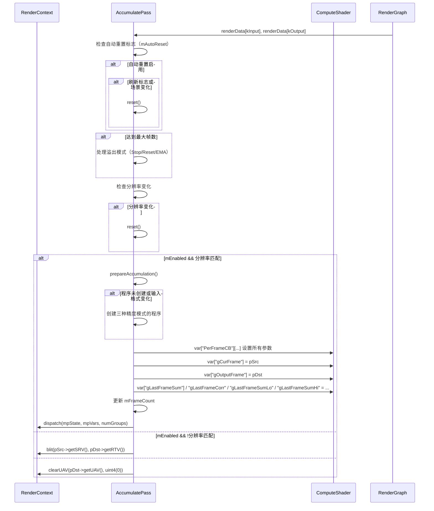

# AccumulatePass RenderPass Shader 绑定分析

## 1. Pass 基本信息

### 描述
AccumulatePass 是一个时间累积 RenderPass，将多帧输入累积到输出纹理中。支持三种累积精度模式：单精度、单精度补偿（Kahan 求和）和双精度。当达到最大帧数时，可以停止累积、重置或切换到指数移动平均（EMA）模式。

### 入口点函数
- **accumulateSingle** - `[numthreads(16, 16, 1)]` Compute Shader：单精度标准求和累积
- **accumulateSingleCompensated** - `[numthreads(16, 16, 1)]` Compute Shader：单精度补偿求和累积（Kahan）
- **accumulateDouble** - `[numthreads(16, 16, 1)]` Compute Shader：双精度标准求和累积

## 2. 资源绑定清单

### 2.1 Constant Buffer 绑定

| C++ 绑定代码 | Shader 声明 | 资源类型 | 绑定方式 | 备注 |
|-------------|-------------|---------|---------|------|
| `var["PerFrameCB"]["gResolution"]` | `uint2 gResolution;` | CBV | 手动 | 帧分辨率（宽高） |
| `var["PerFrameCB"]["gAccumCount"]` | `uint gAccumCount;` | CBV | 手动 | 已累积帧数 |
| `var["PerFrameCB"]["gAccumulate"]` | `bool gAccumulate;` | CBV | 手动 | 是否启用累积 |
| `var["PerFrameCB"]["gMovingAverageMode"]` | `bool gMovingAverageMode;` | CBV | 手动 | 是否使用移动平均模式 |

### 2.2 Shader Resource View (SRV) 绑定

| C++ 绑定代码 | Shader 声明 | 资源类型 | 绑定方式 | 备注 |
|-------------|-------------|---------|---------|------|
| `var["gCurFrame"]` | `Texture2D<InputDataType> gCurFrame;` | SRV | 手动 | 当前帧输入纹理（类型取决于输入格式） |

### 2.3 Unordered Access View (UAV) 绑定

| C++ 绑定代码 | Shader 声明 | 资源类型 | 绑定方式 | 备注 |
|-------------|-------------|---------|---------|------|
| `var["gOutputFrame"]` | `RWTexture2D<float4> gOutputFrame;` | UAV | 手动 | 输出纹理（累积结果） |
| `var["gLastFrameSum"]` (Single/SingleKahan) | `RWTexture2D<float4> gLastFrameSum;` | UAV | 手动 | 上一帧求和（RGBA32Float） |
| `var["gLastFrameCorr"]` (SingleKahan) | `RWTexture2D<float4> gLastFrameCorr;` | UAV | 手动 | 上一帧补偿项（RGBA32Float） |
| `var["gLastFrameSumLo"]` (Double) | `RWTexture2D<uint4> gLastFrameSumLo;` | UAV | 手动 | 上一帧求和低位（RGBA32Uint） |
| `var["gLastFrameSumHi"]` (Double) | `RWTexture2D<uint4> gLastFrameSumHi;` | UAV | 手动 | 上一帧求和高位（RGBA32Uint） |

## 3. Constant Buffer 结构映射

### PerFrameCB 结构

```cpp
// C++ 端：通过 var["PerFrameCB"][key] 逐个设置
// Shader 端定义：
cbuffer PerFrameCB
{
    uint2 gResolution;        // offset: 0, size: 8 bytes
    uint gAccumCount;       // offset: 8, size: 4 bytes
    bool gAccumulate;       // offset: 12, size: 4 bytes (bool 在 HLSL 中为 4 字节)
    bool gMovingAverageMode; // offset: 16, size: 4 bytes
}
// 总大小: 20 bytes（可能填充到 32 字节）
```

### 对齐分析

| 成员 | 偏移 | C++ 类型 | HLSL 类型 | 对齐 |
|------|------|----------|-----------|------|
| gResolution | 0 | uint2 | uint2 | 8 bytes |
| gAccumCount | 8 | uint | uint | 4 bytes |
| gAccumulate | 12 | bool | bool | 4 bytes |
| gMovingAverageMode | 16 | bool | bool | 4 bytes |

## 4. 纹理/缓冲区生命周期

### 4.1 RenderGraph 管理的资源

| 资源 | 用途 | 生命周期 |
|------|------|---------|
| `input` | 输入纹理 | 由 RenderGraph 在 execute() 前提供 |
| `output` | 输出纹理 | 由 RenderGraph 创建（reflect() 时声明） |

### 4.2 Pass 内部管理的资源

| 资源 | 类型 | 创建时机 | 销毁时机 | 说明 |
|------|------|---------|---------|------|
| `mpLastFrameSum` | ref<Texture> | prepareAccumulation() | 随 `AccumulatePass` 析构 | 上一帧求和（Single/SingleKahan 模式） |
| `mpLastFrameCorr` | ref<Texture> | prepareAccumulation() | 随 `AccumulatePass` 析构 | 上一帧补偿项（SingleKahan 模式） |
| `mpLastFrameSumLo` | ref<Texture> | prepareAccumulation() | 随 `AccumulatePass` 析构 | 上一帧求和低位（Double 模式） |
| `mpLastFrameSumHi` | ref<Texture> | prepareAccumulation() | 随 `AccumulatePass` 析构 | 上一帧求和高位（Double 模式） |
| `mpProgram[Precision]` | ref<Program> | accumulate() | 随 `AccumulatePass` 析构 | 三种精度模式的计算程序 |
| `mpVars` | ref<ProgramVars> | accumulate() | 随 `AccumulatePass` 析构 | 程序变量 |
| `mpState` | ref<ComputeState> | 构造函数 | 随 `AccumulatePass` 析构 | 计算状态 |

### 4.3 资源创建逻辑

**prepareAccumulation() 函数**：
```cpp
auto prepareBuffer = [&](ref<Texture>& pBuf, ResourceFormat format, bool bufUsed)
{
    if (!bufUsed)
    {
        pBuf = nullptr;
        return;
    }
    // 创建或调整缓冲区大小
    if (!pBuf || pBuf->getWidth() != width || pBuf->getHeight() != height)
    {
        pBuf = mpDevice->createTexture2D(
            width, height, format, 1, 1, nullptr,
            ResourceBindFlags::ShaderResource | ResourceBindFlags::UnorderedAccess
        );
        reset();
    }
    // 如果累积已重置，清空数据
    if (mFrameCount == 0)
    {
        if (getFormatType(format) == FormatType::Float)
            pRenderContext->clearUAV(pBuf->getUAV().get(), float4(0.f));
        else
            pRenderContext->clearUAV(pBuf->getUAV().get(), uint4(0));
    }
};
```

**缓冲区分配**（根据精度模式）：
- **Single**: `gLastFrameSum` (RGBA32Float)
- **SingleCompensated**: `gLastFrameSum` (RGBA32Float) + `gLastFrameCorr` (RGBA32Float)
- **Double**: `gLastFrameSumLo` (RGBA32Uint) + `gLastFrameSumHi` (RGBA32Uint)

## 5. 执行流程

### 5.1 execute() 函数资源绑定时序



### 5.2 输入格式 Defines

**Shader Defines**：
- `_INPUT_FORMAT_FLOAT` - 浮点输入（默认）
- `_INPUT_FORMAT_UINT` - 无符号整数输入
- `_INPUT_FORMAT_SINT` - 有符号整数输入

**类型映射**：
```cpp
switch (srcType)
{
case FormatType::Uint:
    defines.add("_INPUT_FORMAT", "INPUT_FORMAT_UINT");
    break;
case FormatType::Sint:
    defines.add("_INPUT_FORMAT", "INPUT_FORMAT_SINT");
    break;
default:
    defines.add("_INPUT_FORMAT", "INPUT_FORMAT_FLOAT");
    break;
}
```

### 5.3 绑定频率总结

| 资源类型 | 绑定频率 | 示例 |
|---------|---------|------|
| CBV | 每次 execute | gResolution, gAccumCount, gAccumulate, gMovingAverageMode |
| SRV (gCurFrame) | 每次 execute | 输入纹理 |
| UAV (gOutputFrame) | 每次 execute | 输出纹理 |
| UAV (内部缓冲区) | 每次 execute | gLastFrameSum, gLastFrameCorr, gLastFrameSumLo, gLastFrameSumHi |

## 6. 特殊机制说明

### 6.1 精度模式与 UAV 绑定

三种精度对应不同 UAV 组合：**Single**（gLastFrameSum）、**SingleCompensated**（gLastFrameSum + gLastFrameCorr）、**Double**（gLastFrameSumLo + gLastFrameSumHi）。精度由 Program 选择决定，`prepareAccumulation()` 仅创建当前模式所需缓冲区。

### 6.2 自动重置

**触发条件**：
- 刷新标志（`kRenderPassRefreshFlags`）
- 场景变化（除了相机抖动和历史变化）
- 相机属性变化（除了抖动和历史变化）

**实现**：
```cpp
if (mAutoReset)
{
    auto refreshFlags = dict.getValue(kRenderPassRefreshFlags, ...);
    if (refreshFlags != RenderPassRefreshFlags::None)
        reset();

    if (mpScene)
    {
        auto sceneUpdates = mpScene->getUpdates();
        if ((sceneUpdates & ~IScene::UpdateFlags::CameraPropertiesChanged) != ...)
            reset();

        if (is_set(sceneUpdates, IScene::UpdateFlags::CameraPropertiesChanged))
        {
            auto excluded = Camera::Changes::Jitter | Camera::Changes::History;
            auto cameraChanges = mpScene->getCamera()->getChanges();
            if ((cameraChanges & ~excluded) != Camera::Changes::None)
                reset();
        }
    }
}
```

### 6.3 编译标志

**SingleCompensated 模式**需要精确浮点模式：
```cpp
mpProgram[Precision::SingleCompensated] = Program::createCompute(
    mpDevice,
    kShaderFile,
    "accumulateSingleCompensated",
    defines,
    SlangCompilerFlags::FloatingPointModePrecise | SlangCompilerFlags::TreatWarningsAsErrors
);
```

### 6.4 热重载

```cpp
void AccumulatePass::onHotReload(HotReloadFlags reloaded)
{
    if (is_set(reloaded, HotReloadFlags::Program))
        reset();
}
```

程序热重载时重置累积。
