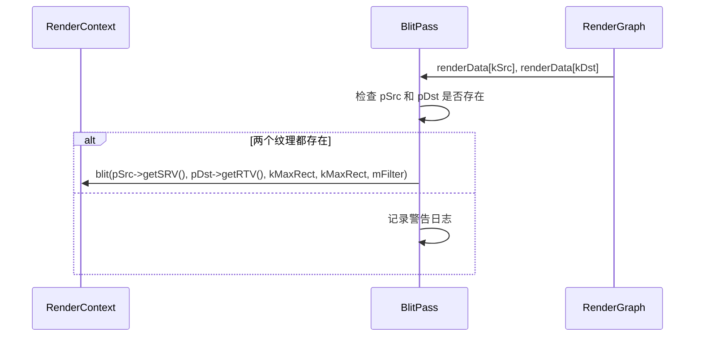

# BlitPass RenderPass Shader 绑定分析

## 1. Pass 基本信息

### 描述
BlitPass 是一个简单的纹理拷贝 RenderPass，将输入纹理拷贝到输出纹理。支持不同的滤波模式（Point/Linear）用于格式转换和缩放操作。此 pass 不使用 shader，而是使用 GPU 内置的 blit 操作。

### 入口点函数
- **无** - 使用 `RenderContext::blit()` 进行直接 GPU 拷贝，不涉及 shader

## 2. 资源绑定清单

### 2.1 资源绑定

| C++ 绑定代码 | 资源类型 | 绑定方式 | 备注 |
|-------------|---------|---------|------|
| `pSrcTex->getSRV()` | SRV | 手动 | 源纹理（输入） |
| `pDstTex->getRTV()` | RTV | 手动 | 目标纹理（输出） |

## 3. Constant Buffer 结构映射

无 Constant Buffer，无 Sampler。此 pass 不使用 shader，通过 `blit(SRV, RTV)` 直接传递资源。

## 4. 纹理/缓冲区生命周期

### 4.1 RenderGraph 管理的资源

| 资源 | 用途 | 生命周期 |
|------|------|---------|
| `src` | 输入源纹理 | 由 RenderGraph 在 execute() 前提供 |
| `dst` | 输出纹理 | 由 RenderGraph 创建（reflect() 时声明） |

### 4.2 Pass 内部管理的资源

无。此 pass 不管理任何内部资源。

## 5. 执行流程

### 5.1 execute() 函数资源绑定时序

### 5.2 执行模式

**Blit 操作**：
- 使用 `RenderContext::blit()` 直接 GPU 拷贝
- 支持整个纹理拷贝（`RenderContext::kMaxRect`）
- 支持格式转换和缩放

**滤波模式**：
- `Point` - 最近邻插值
- `Linear` - 双线性插值（默认）

## 6. 特殊机制说明

### 6.1 格式转换

BlitPass 可以自动转换格式：
- 浮点格式到整数格式
- 不同位深度的格式
- sRGB 到线性（或反向）

### 6.2 缩放

BlitPass 可以自动缩放：
- 如果输入和输出尺寸不同，会自动进行缩放
- 使用选择的滤波模式

### 6.3 无 Shader

此 pass 完全依赖 GPU 的 blit 功能，不编译或执行任何 shader。这使得它非常高效，适用于格式转换和拷贝操作。
