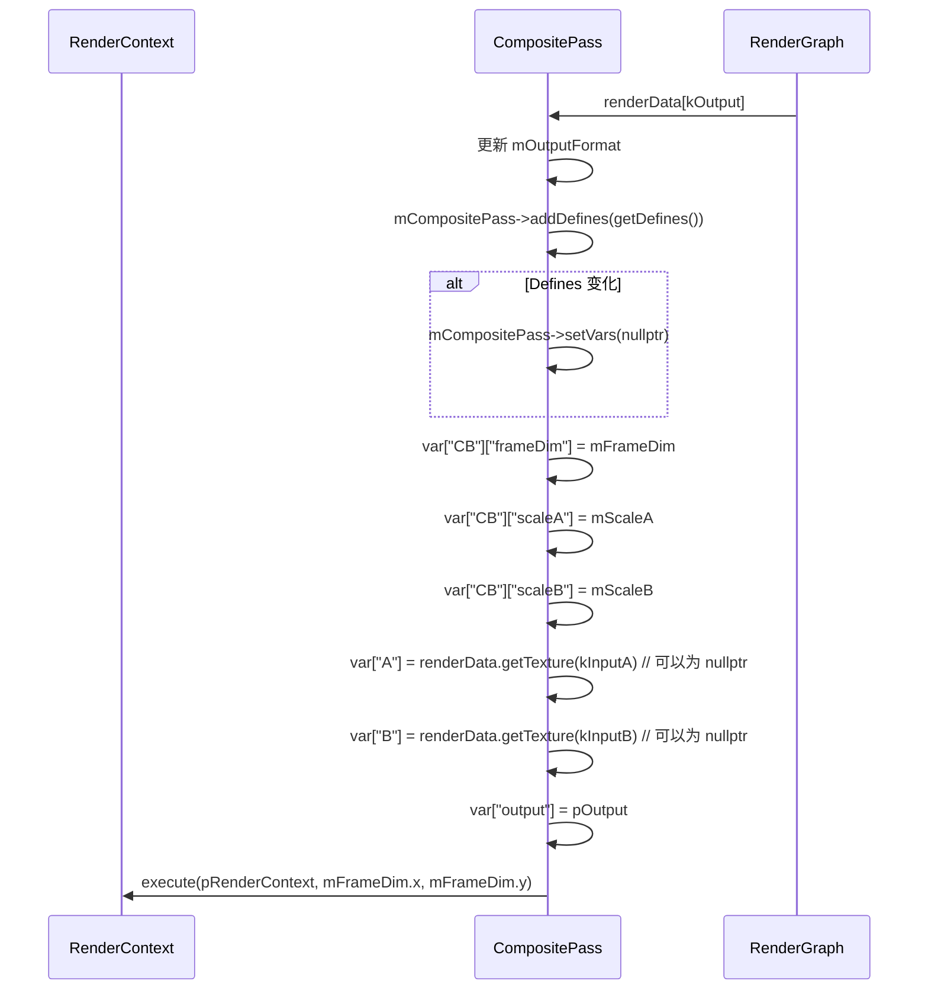

# Composite RenderPass Shader 绑定分析

## 1. Pass 基本信息

### 描述
Composite 是一个简单的合成 RenderPass，将两个缓冲区（输入 A 和 B）按指定模式混合到输出 C。每个输入可以独立缩放。支持混合模式：加法和乘法。如果输出缓冲区是整数格式，浮点值会使用四舍五入到最近偶数转换为整数。

### 入口点函数
- **main** - `[numthreads(16, 16, 1)]` Compute Shader：执行混合操作

## 2. 资源绑定清单

### 2.1 Constant Buffer 绑定

| C++ 绑定代码 | Shader 声明 | 资源类型 | 绑定方式 | 备注 |
|-------------|-------------|---------|---------|------|
| `var["CB"]["frameDim"]` | `uint2 frameDim;` | CBV | 手动 | 帧分辨率（宽高） |
| `var["CB"]["scaleA"]` | `float scaleA;` | CBV | 手动 | 输入 A 的缩放因子 |
| `var["CB"]["scaleB"]` | `float scaleB;` | CBV | 手动 | 输入 B 的缩放因子 |

### 2.2 Shader Resource View (SRV) 绑定

| C++ 绑定代码 | Shader 声明 | 资源类型 | 绑定方式 | 备注 |
|-------------|-------------|---------|---------|------|
| `var["A"]` | `Texture2D<float4> A;` | SRV | 手动 | 输入 A 纹理（可选） |
| `var["B"]` | `Texture2D<float4> B;` | SRV | 手动 | 输入 B 纹理（可选） |

### 2.3 Unordered Access View (UAV) 绑定

| C++ 绑定代码 | Shader 声明 | 资源类型 | 绑定方式 | 备注 |
|-------------|-------------|---------|---------|------|
| `var["output"]` | `RWTexture2D<float4/uint4/int4> output;` | UAV | 手动 | 输出纹理（类型取决于格式） |

## 3. Constant Buffer 结构映射

### CB 结构

```cpp
// C++ 端：通过 var["CB"][key] 逐个设置
// Shader 端定义：
cbuffer CB
{
    uint2 frameDim; // offset: 0, size: 8 bytes
    float scaleA;    // offset: 8, size: 4 bytes
    float scaleB;    // offset: 12, size: 4 bytes
}
// 总大小: 16 bytes（可能填充到 16 字节的倍数）
```

### 对齐分析

| 成员 | 偏移 | C++ 类型 | HLSL 类型 | 对齐 |
|------|------|----------|-----------|------|
| frameDim | 0 | uint2 | uint2 | 8 bytes |
| scaleA | 8 | float | float | 4 bytes |
| scaleB | 12 | float | float | 4 bytes |

## 4. 纹理/缓冲区生命周期

### 4.1 RenderGraph 管理的资源

| 资源 | 用途 | 生命周期 |
|------|------|---------|
| `A` | 输入 A 纹理 | 由 RenderGraph 在 execute() 前提供（可选） |
| `B` | 输入 B 纹理 | 由 RenderGraph 在 execute() 前提供（可选） |
| `out` | 输出纹理 | 由 RenderGraph 创建（reflect() 时声明） |

### 4.2 Pass 内部管理的资源

| 资源 | 类型 | 创建时机 | 销毁时机 | 说明 |
|------|------|---------|---------|------|
| `mCompositePass` | ref<ComputePass> | 构造函数 | 随 `Composite` 析构 | 计算着色器 pass |

## 5. 执行流程

### 5.1 execute() 函数资源绑定时序



### 5.2 Shader Defines 动态生成

**Defines**：`COMPOSITE_MODE`（Add/Multiply）、`OUTPUT_FORMAT`（Float/Uint/Sint）。格式决定 `RWTexture2D<float4|uint4|int4>` 类型。

**getDefines() 函数**：
```cpp
// 混合模式
uint32_t compositeMode = 0;
switch (mMode)
{
case Mode::Add:
    compositeMode = COMPOSITE_MODE_ADD;
    break;
case Mode::Multiply:
    compositeMode = COMPOSITE_MODE_MULTIPLY;
    break;
}

// 输出格式
uint32_t outputFormat = 0;
switch (getFormatType(mOutputFormat))
{
case FormatType::Uint:
    outputFormat = OUTPUT_FORMAT_UINT;
    break;
case FormatType::Sint:
    outputFormat = OUTPUT_FORMAT_SINT;
    break;
default:
    outputFormat = OUTPUT_FORMAT_FLOAT;
    break;
}

DefineList defines;
defines.add("COMPOSITE_MODE", std::to_string(compositeMode));
defines.add("OUTPUT_FORMAT", std::to_string(outputFormat));
```

### 5.3 绑定频率总结

| 资源类型 | 绑定频率 | 示例 |
|---------|---------|------|
| CBV | 每次 execute | frameDim, scaleA, scaleB |
| SRV (A/B) | 每次 execute | 输入 A 和 B 纹理（可选） |
| UAV (output) | 每次 execute | 输出纹理 |

## 6. 特殊机制说明

### 6.1 可选输入与空指针

输入 A 和 B 在 `reflect()` 中标记为 `Optional`。`var["A"]`、`var["B"]` 可绑定 `nullptr`，Shader 中对应采样结果未定义。

```cpp
reflector.addInput(kInputA, "Input A").bindFlags(...).flags(Optional);
var["A"] = renderData.getTexture(kInputA); // Can be nullptr
```
