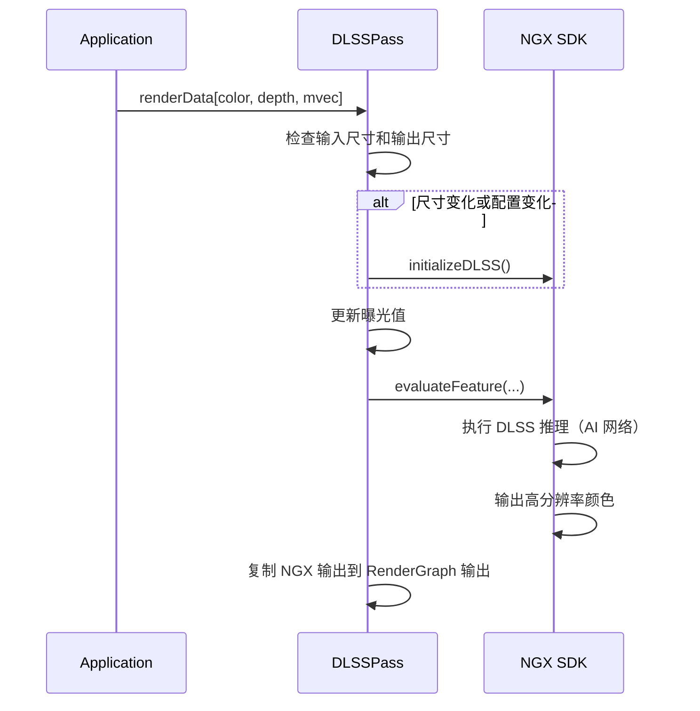

# DLSSPass RenderPass Shader 绑定分析

## 1. Pass 基本信息

### 描述
DLSSPass 是 NVIDIA DLSS (Deep Learning Super Sampling) SDK 的集成 Pass。使用 AI 网络进行超分辨率和抗锯齿，支持 2x、3x、4x 超分辨率。需要深度、运动向量和锐度调节作为输入。

### 主要组件
1. **NGX SDK** - 执行 DLSS 推理
2. **NGXWrapper** - 封装 NGX SDK 调用
3. **曝光控制** - 管理曝光值

### 入口点函数
- **无** - 完全使用 NGX SDK，无自定义 shader

## 2. 资源绑定清单

### 2.1 NGX SDK 输入

| 资源 | 说明 | 必需 |
|------|------|------|
| `gColor` | 低分辨率颜色输入 | 是 |
| `gDepth` | 深度缓冲区 | 是 |
| `gMotionVector` | 屏幕空间运动向量 | 是 |
| `gExposure` | 曝光值（1x1 纹理） | 可选 |

### 2.2 NGX SDK 输出

| 资源 | 说明 | 格式 |
|------|------|------|
| `gOutput` | 高分辨率颜色输出 | RGBA8Unorm 或 RGBA16Float |

### 2.3 资源绑定方式

通过 `NGXWrapper` 封装，直接调用 NGX SDK API。

## 3. Constant Buffer 结构映射

无自定义 CB。NGX SDK 内部管理所有常量数据。

## 4. 纹理/缓冲区生命周期

### 4.1 RenderGraph 管理的资源

**输入**：
- `color` - 低分辨率颜色
- `depth` - 深度缓冲区
- `mvec` - 屏幕空间运动向量

**输出**：
- `color` - 高分辨率颜色（DLSS 超分辨率）

### 4.2 Pass 内部管理的资源

- `mpNGXWrapper` - NGX SDK 封装
- `mpOutput` - 内部输出缓冲区（如果格式/尺寸转换需要）
- `mpExposure` - 曝光纹理（1x1）

## 5. 执行流程

### 5.1 总体流程



### 5.2 DLSS 初始化

**参数**：
```cpp
NVSDK_NGX_Parameter* params = ...;
params->Set(NVSDK_NGX_Parameter_Width, inputSize.x);
params->Set(NVSDK_NGX_Parameter_Height, inputSize.y);
params->Set(NVSDK_NGX_Parameter_OutWidth, dlssOutputSize.x);
params->Set(NVSDK_NGX_Parameter_OutHeight, dlssOutputSize.y);
params->Set(NVSDK_NGX_Parameter_PerfQualityValue, dlssQuality);
```

**调用**：
```cpp
NVSDK_NGX_Result result = NVSDK_NGX_DLSS_Init(params);
```

### 5.3 DLSS 推理

**参数**：
```cpp
NVSDK_NGX_DLSS_Eval_Params evalParams = ...;
evalParams.pInColor = inputColor->getNativeAPIResourceHandle();
evalParams.pInDepth = inputDepth->getNativeAPIResourceHandle();
evalParams.pInMotionVectors = inputMvec->getNativeAPIResourceHandle();
evalParams.pInOutput = dlssOutput->getNativeAPIResourceHandle();
evalParams.pInExposure = exposureTexture->getNativeAPIResourceHandle();
evalParams.jitterOffset = jitterOffset;
```

**调用**：
```cpp
NVSDK_NGX_Result result = NVSDK_NGX_DLSS_EvaluateFeature(&evalParams, featureId);
```

## 6. 特殊机制说明

### 6.1 NGX SDK 资源绑定

DLSS 无 Falcor shader，资源通过 `texture->getNativeAPIResourceHandle()` 传入 NGX。`NGXWrapper` 封装 `NVSDK_NGX_DLSS_EvaluateFeature`。曝光矩阵通过 `mpExposure->setBlob(&exposure, ...)` 传入；输入/输出尺寸由 `mInputSize`、`mDLSSOutputSize` 决定。运动向量必需，屏幕空间格式。
