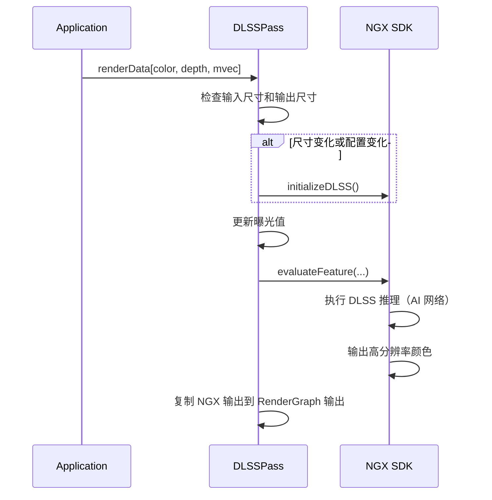

# DLSSPass RenderPass Shader 绑定分析

## 1. Pass 基本信息

### 描述
DLSSPass 是 NVIDIA DLSS (Deep Learning Super Sampling) SDK 的集成 Pass。使用 AI 网络进行超分辨率和抗锯齿，支持 2x、3x、4x 超分辨率。需要深度、运动向量和锐度调节作为输入。

### 主要组件
1. **NGX SDK** - 执行 DLSS 推理
2. **NGXWrapper** - 封装 NGX SDK 调用
3. **曝光控制** - 管理曝光值

### 入口点函数
- **无** - 完全使用 NGX SDK，无自定义 shader

## 2. 资源绑定清单

### 2.1 NGX SDK 输入

| 资源 | 说明 | 必需 |
|------|------|------|
| `gColor` | 低分辨率颜色输入 | 是 |
| `gDepth` | 深度缓冲区 | 是 |
| `gMotionVector` | 屏幕空间运动向量 | 是 |
| `gExposure` | 曝光值（1x1 纹理） | 可选 |

### 2.2 NGX SDK 输出

| 资源 | 说明 | 格式 |
|------|------|------|
| `gOutput` | 高分辨率颜色输出 | RGBA8Unorm 或 RGBA16Float |

### 2.3 资源绑定方式

通过 `NGXWrapper` 封装，直接调用 NGX SDK API。

## 3. Constant Buffer 结构映射

无自定义 CB。NGX SDK 内部管理所有常量数据。

## 4. 纹理/缓冲区生命周期

### 4.1 RenderGraph 管理的资源

**输入**：
- `color` - 低分辨率颜色
- `depth` - 深度缓冲区
- `mvec` - 屏幕空间运动向量

**输出**：
- `color` - 高分辨率颜色（DLSS 超分辨率）

### 4.2 Pass 内部管理的资源

- `mpNGXWrapper` - NGX SDK 封装
- `mpOutput` - 内部输出缓冲区（如果格式/尺寸转换需要）
- `mpExposure` - 曝光纹理（1x1）

## 5. 执行流程

### 5.1 总体流程



### 5.2 DLSS 初始化

**参数**：
```cpp
NVSDK_NGX_Parameter* params = ...;
params->Set(NVSDK_NGX_Parameter_Width, inputSize.x);
params->Set(NVSDK_NGX_Parameter_Height, inputSize.y);
params->Set(NVSDK_NGX_Parameter_OutWidth, dlssOutputSize.x);
params->Set(NVSDK_NGX_Parameter_OutHeight, dlssOutputSize.y);
params->Set(NVSDK_NGX_Parameter_PerfQualityValue, dlssQuality);
```

**调用**：
```cpp
NVSDK_NGX_Result result = NVSDK_NGX_DLSS_Init(params);
```

### 5.3 DLSS 推理

**参数**：
```cpp
NVSDK_NGX_DLSS_Eval_Params evalParams = ...;
evalParams.pInColor = inputColor->getNativeAPIResourceHandle();
evalParams.pInDepth = inputDepth->getNativeAPIResourceHandle();
evalParams.pInMotionVectors = inputMvec->getNativeAPIResourceHandle();
evalParams.pInOutput = dlssOutput->getNativeAPIResourceHandle();
evalParams.pInExposure = exposureTexture->getNativeAPIResourceHandle();
evalParams.jitterOffset = jitterOffset;
```

**调用**：
```cpp
NVSDK_NGX_Result result = NVSDK_NGX_DLSS_EvaluateFeature(&evalParams, featureId);
```

## 6. 特殊机制说明

### 6.1 DLSS 模式

| 模式 | 描述 | 超分辨率倍数 |
|------|------|-------------|
| MaxPerf | 最大性能 | 3x 或 4x |
| Balanced | 平衡 | 2x 或 3x |
| MaxQuality | 最高质量 | 2x |

### 6.2 运动向量缩放

| 缩放 | 说明 |
|------|------|
| Absolute | 运动向量以像素为单位 |
| Relative | 运动向量相对于屏幕宽/高 |

### 6.3 曝光控制

**目的**：
- 防止 DLSS 处理过曝或欠曝图像
- 提高稳定性

**实现**：
```cpp
if (mExposureUpdated)
{
    float4x4 exposure = mpScene->getCamera()->getExposure();
    mpExposure->setBlob(&exposure, 0, sizeof(float4x4));
    mExposureUpdated = false;
}
```

### 6.4 尺寸调整

**输入尺寸**：低分辨率（渲染分辨率）
**DLSS 输出尺寸**：高分辨率（显示分辨率）
**Pass 输出尺寸**：可能等于 DLSS 输出尺寸或需要额外缩放

```cpp
mInputSize = uint2(pColor->getWidth(), pColor->getHeight());
mDLSSOutputSize = ...;  // 根据 DLSS 模式计算
mPassOutputSize = mOutputSizeSelection == IOSize::Default ? mDLSSOutputSize : ...;
```

### 6.5 锐度调节

**用途**：
- 增加锐度以补偿 DLSS 的模糊
- 提高细节保留

**范围**：[0, 1]，默认 0

### 6.6 相机抖动

**目的**：
- 防止由于时域累积导致的模糊
- 提高采样覆盖率

**实现**：
- 相机抖动参数通过 NGX 传递
- DLSS 内部使用抖动信息

### 6.7 NGX SDK 集成

**封装**：
- `NGXWrapper` 类封装所有 NGX SDK 调用
- 处理资源绑定和同步

**资源句柄**：
```cpp
void* nativeHandle = texture->getNativeAPIResourceHandle();
// 传递给 NGX SDK
```

### 6.8 HDR 支持

**选项**：
```cpp
bool mIsHDR = true;  // HDR 模式
```

HDR 模式使用 16-bit 精度输出。

### 6.9 性能考虑

- **超分辨率倍数**：倍数越高，性能提升越大
- **AI 推理**：GPU 密集计算
- **内存带宽**：高分辨率输出需要更多内存

### 6.10 与 NRD 的对比

| 特性 | DLSS | NRD |
|------|------|------|
| 功能 | 超分辨率 | 降噪 |
| 输入 | 颜色、深度、运动向量 | 辐照度、法线、运动向量、深度 |
| 输出 | 高分辨率颜色 | 降噪后的辐照度 |
| 技术 | AI 网络 | 时域累积 + 空间滤波 |
| SDK | NGX | NRD |

### 6.11 设备特性要求

- NVIDIA RTX GPU（Tensor Cores）
- NVIDIA 驱动程序
- NGX SDK

## 7. 注意事项

DLSSPass 完全依赖 NGX SDK，不使用任何自定义 shader。

关键点：
1. **NGX SDK** - 执行所有 DLSS 逻辑
2. **资源绑定** - 通过原生 API 句柄
3. **运动向量** - 必需，使用屏幕空间
4. **曝光控制** - 可选，但推荐
5. **锐度调节** - 可选，提高细节

支持多种 DLSS 模式，可根据性能需求选择。
