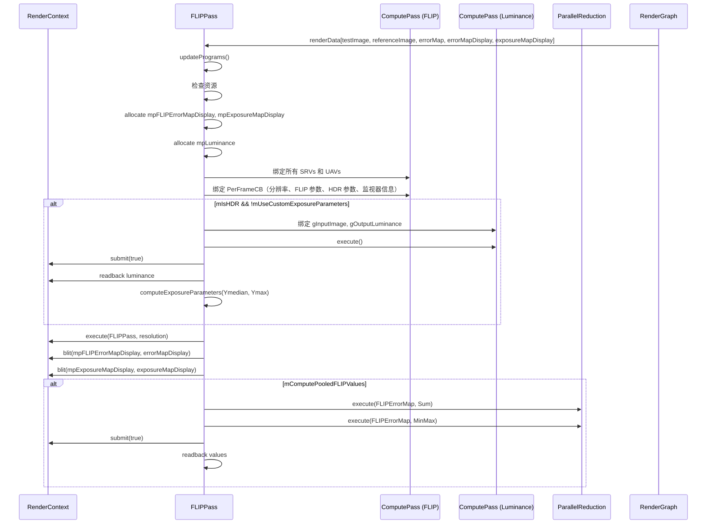

# FLIPPass RenderPass Shader 绑定分析

## 1. Pass 基本信息

### 描述
FLIPPass 是 FLIP（FLIP: A Quality Metric for Real-Time Rendering）误差度量 Pass。计算测试图像和参考图像之间的感知误差，支持 LDR 和 HDR 模式。FLIP 是一种比 PSNR/SSIM 更准确的感知误差度量。

### 主要组件

1. **FLIP Pass** - 计算感知误差（Compute Shader）
2. **ComputeLuminance Pass** - 计算亮度（用于 HDR-FLIP 曝光参数）
3. **ParallelReduction** - 计算平均/最小/最大 FLIP 值

### 入口点函数

**FLIP Pass**：
- **main** - `[numthreads(32, 32, 1)]` Compute Shader：计算 FLIP 误差

**ComputeLuminance Pass**：
- **computeLuminance** - `[numthreads(16, 16, 1)]` Compute Shader：计算亮度

## 2. 资源绑定清单

### 2.1 FLIP Pass 资源绑定

**SRV 输入**：
- `gTestImage` - 测试图像（输入）
- `gReferenceImage` - 参考图像（输入）

**UAV 输出**：
- `gFLIPErrorMap` - FLIP 误差图（高精度，用于计算）
- `gFLIPErrorMapDisplay` - FLIP 误差图（显示用，低精度）
- `gExposureMapDisplay` - HDR-FLIP 曝光图（显示用）

**CBV**：
- `PerFrameCB` - 分辨率、FLIP 参数、HDR 参数、监视器信息等

### 2.2 ComputeLuminance Pass 资源绑定

**SRV 输入**：
- `gInputImage` - 输入图像（参考图像）

**UAV 输出**：
- `gOutputLuminance` - 亮度缓冲区（浮点数组）

**CBV**：
- `PerFrameCB` - 分辨率

### 2.3 ParallelReduction 资源

**SRV 输入**：
- `gFLIPErrorMap` - FLIP 误差图

**输出**（CPU 读取）：
- `mAverageFLIP` - 平均 FLIP 值
- `mMinFLIP` - 最小 FLIP 值
- `mMaxFLIP` - 最大 FLIP 值

## 3. Constant Buffer 结构映射

### FLIP Pass PerFrameCB

```cpp
cbuffer PerFrameCB
{
    uint2 gResolution;      // offset: 0,  size: 8 bytes
    bool gIsHDR;          // offset: 8,  size: 1 byte
    bool gUseMagma;       // offset: 9,  size: 1 byte
    bool gClampInput;      // offset: 10, size: 1 byte
    float gStartExposure;  // offset: 12, size: 4 bytes (填充)
    float gExposureDelta;  // offset: 16, size: 4 bytes
    uint gNumExposures;   // offset: 20, size: 4 bytes
    uint gMonitorWidthPixels; // offset: 24, size: 4 bytes
    float gMonitorWidthMeters; // offset: 28, size: 4 bytes
    float gMonitorDistance;    // offset: 32, size: 4 bytes
}
// 总大小: 36 bytes（可能填充到 40 或 48 字节）
```

### ComputeLuminance Pass PerFrameCB

```cpp
cbuffer PerFrameCB
{
    uint2 gResolution;  // offset: 0, size: 8 bytes
}
// 总大小: 8 bytes（可能填充到 16 字节）
```

## 4. 纹理/缓冲区生命周期

### 4.1 RenderGraph 管理的资源

**输入**：
- `testImage` - 测试图像
- `referenceImage` - 参考图像

**输出**：
- `errorMap` - FLIP 误差图（RGBA32Float，高精度）
- `errorMapDisplay` - FLIP 误差图（RGBA8UnormSrgb，显示用）
- `exposureMapDisplay` - HDR-FLIP 曝光图（RGBA8UnormSrgb，显示用）

### 4.2 Pass 内部管理的资源

| 资源 | 类型 | 创建时机 | 销毁时机 | 说明 |
|------|------|---------|---------|------|
| `mpFLIPErrorMapDisplay` | ref<Texture> | execute()（尺寸变化时） | 随 `FLIPPass` 析构 | 临时显示缓冲区（RGBA32Float） |
| `mpExposureMapDisplay` | ref<Texture> | execute()（尺寸变化时） | 随 `FLIPPass` 析构 | 临时曝光图（RGBA32Float） |
| `mpLuminance` | ref<Buffer> | execute()（首次） | 随 `FLIPPass` 析构 | 亮度缓冲区（浮点数组） |
| `mpFLIPPass` | ref<ComputePass> | 构造函数 | 随 `FLIPPass` 析构 | FLIP Compute Pass |
| `mpComputeLuminancePass` | ref<ComputePass> | 构造函数 | 随 `FLIPPass` 析构 | 亮度 Compute Pass |
| `mpParallelReduction` | unique_ptr<ParallelReduction> | 构造函数 | 随 `FLIPPass` 析构 | 并行缩减辅助类 |

## 5. 执行流程

### 5.1 execute() 函数资源绑定时序



### 5.2 LDR-FLIP 算法流程

**主要步骤**：

1. **准备**：
   - 计算每度像素数（PPD）：`ppd = distance * (pixels / width) * (π / 180)`
   - 计算空间滤波半径（基于 PPD）
   - 准备 CSF 滤波器和特征检测参数

2. **颜色管道**：
   - 读取参考图像和测试图像像素
   - 转换到 YCxCz 色彩空间
   - 使用 CSF 滤波器（对比度敏感函数）进行空间滤波
   - 计算颜色差异：`colorDiff = HyAB(Hunt(Lab_ref), Hunt(Lab_test))`

3. **特征管道**：
   - 计算点梯度（`pointGradient`）
   - 计算边缘梯度（`edgeGradient`）
   - 计算特征差异：`featureDiff = pow(max(pointDiff, edgeDiff) * sqrt(2), qf)`

4. **误差重分布**：
   - 重分布误差：`redistributeErrors(colorDiff, featureDiff)`
   - 使用 Hunt 色差公式和特征差异
   - 应用归一化

### 5.3 HDR-FLIP 算法流程

**主要步骤**：

1. **计算曝光参数**：
   - 计算参考图像的亮度
   - 计算亮度的中位数和最大值
   - 求解二次方程：`a * x^2 + b * x + c = 0`
   - 计算起始曝光和停止曝光

2. **多曝光 LDR-FLIP**：
   - 对每个曝光执行 LDR-FLIP
   - 选择最大 FLIP 值：`hdrflip = max(ldrflip(exposure_i))`
   - 记录曝光图索引

### 5.4 CSF 滤波器（对比度敏感函数）

**用途**：
- 模拟人眼对比度敏感度
- 根据空间频率调整权重

**公式**：
```hlsl
float calculateWeight(float dist2, float4 ab)
{
    float b1Inv = 1.0f / ab.z;
    float b2Inv = 1.0f / ab.w;
    return ab.x * sqrt(M_PI * b1Inv) * exp(b1Inv * dist2) + ab.y * sqrt(M_PI * b2Inv) * exp(b2Inv * dist2);
}
```

- `a1, a2`：A 通道的系数
- `b1, b2`：A 通道的带宽参数

### 5.5 Hunt 色差公式

**用途**：
- 计算 CIELab 空间的感知色差

**公式**：
```hlsl
float HyAB(float3 a, float3 b)
{
    float3 diff = a - b;
    return abs(diff.x) + length(diff.yz);
}
```

- `diff.x`：亮度差异（L）
- `length(diff.yz)`：色度差异（ab）

### 5.6 误差重分布

**公式**：
```hlsl
float redistributeErrors(float colorDifference, float featureDifference)
{
    float error = pow(colorDifference, gqc); // gqc = 0.7

    // 归一化
    float perceptualCutoff = gpc * MaxDistance; // gpc = 0.4

    if (error < perceptualCutoff)
    {
        error *= (gpt / perceptualCutoff); // gpt = 0.95
    }
    else
    {
        error = gpt + ((error - perceptualCutoff) / (MaxDistance - perceptualCutoff)) * (1.0f - gpt);
    }

    error = pow(error, (1.0f - featureDifference)); // gqf = 0.5

    return error;
}
```

### 5.7 曝光参数计算

**算法**：
1. 根据色调映射器系数计算二次方程参数
2. 求解 `x^2` 和 `x` 的根
3. 计算起始曝光：`startExposure = log2(xmax / Ymax)`
4. 计算停止曝光：`stopExposure = log2(xmax / Ymedian)`
5. 计算曝光数量：`numExposures = ceil(stopExposure - startExposure)`

### 5.8 并行缩减

**类型**：
- `Sum`：计算平均 FLIP 值
- `MinMax`：计算最小/最大 FLIP 值

**输出**：
```cpp
mAverageFLIP = FLIPSum.a / (width * height);
mMinFLIP = FLIPMinMax[0].a;
mMaxFLIP = FLIPMinMax[1].a;
```

## 6. 特殊机制说明

### 6.1 色彩空间

**YCxCz**：
```hlsl
float3 linearRGBToYCxCz(float3 c)
{
    float3 YCxCz;
    YCxCz.x = 116.0f * c.y - 16.0f; // Y
    YCxCz.y = c.x / c.z; // Cx
    YCxCz.z = c.x - c.y; // Cz
    return YCxCz;
}
```

### 6.2 Magma 映射

**用途**：
- 将 FLIP 值映射到 Magma 色图
- 用于可视化误差

**实现**：
- 查找表（`MagmaMap[256]`）
- 线性插值

### 6.3 Viridis 映射

**用途**：
- 将曝光图索引映射到 Viridis 色图
- 用于可视化曝光

**实现**：
- 查找表（`ViridisMap[256]`）
- 线性插值

### 6.4 色调映射器（HDR-FLIP）

**类型**：
- `Reinhard`：Reinhard 色调映射
- `ACES`：ACES 色调映射
- `Hable`：Hable 色调映射

**用途**：
- 将 HDR 图像转换为 LDR
- 用于计算 LDR-FLIP

### 6.5 监视器信息

**用途**：
- 计算每度像素数（PPD）
- 用于感知误差计算

**参数**：
- `monitorWidthPixels`：水平分辨率（像素）
- `monitorWidthMeters`：监视器宽度（米）
- `monitorDistance`：到监视器的距离（米）

**自动获取**：
- 使用 `MonitorInfo::getMonitorDescs()` 获取实际监视器信息
- 可在 UI 中启用 `useRealMonitorInfo`

### 6.6 Clamping 输入

**LDR 模式**：
- `clamp(color, 0.0f, 1.0f)`

**HDR 模式**：
- `max(color, 0.0f)`

### 6.7 显示转换

**转换**：
```cpp
// 高精度 → 低精度（显示）
pRenderContext->blit(mpFLIPErrorMapDisplay->getSRV(), pErrorMapDisplayOutput->getRTV());

// 应用 sRGBToLinear 转换以取消 blit 中的线性到 sRGB 转换
gFLIPErrorMapDisplay[pixel] = float4(sRGBToLinear(col), 1.0f);
```

### 6.8 误差值范围

**有效范围**：`[0, 1]`

**无效值处理**：
```hlsl
if (isnan(value) || isinf(value) || value < 0.0f || value > 1.0f)
{
    gFLIPErrorMap[pixel] = float4(1.0f, 0.0f, 0.0f, 1.0f); // 红色
}
```

### 6.9 性能考虑

- **纹理采样**：每像素 2 * (2 * radius + 1)^2 次
- **计算量**：CSF 滤波 + 特征检测 + Hunt 色差 + 误差重分布
- **HDR-FLIP**：额外曝光循环（通常 2-4 次曝光）

### 6.10 参考论文

**FLIP: A Quality Metric for Real-Time Rendering**（Kulczak et al., 2018）
- 提出 FLIP 误差度量
- 包含颜色管道和特征管道

### 6.11 UI 控制项

| 参数 | 类型 | 默认值 | 说明 |
|------|------|---------|------|
| Enabled | bool | true | 是否启用 FLIP 计算 |
| Use Magma | bool | true | 是否使用 Magma 色图 |
| Clamp Input | bool | false | 是否 clamping 输入 |
| Input is HDR | bool | false | 输入是否为 HDR |
| Tone mapper | enum | ACES | HDR-FLIP 色调映射器 |
| Use custom exposure parameters | bool | false | 是否使用自定义曝光参数 |
| Start exposure | float | 0.0 | 起始曝光（log2） |
| Stop exposure | float | 0.0 | 停止曝光（log2） |
| Number of exposures | uint | 2 | 曝光数量 |
| Per-frame metrics | bool | false | 是否计算平均/最小/最大 FLIP |
| Distance to monitor | float | 0.7 | 到监视器距离（米） |
| Monitor width | float | 0.7 | 监视器宽度（米） |
| Monitor resolution | uint | 3840 | 监视器水平分辨率（像素） |

### 6.12 设备特性要求

- Compute Shader 支持
- Texture2D RWTexture2D
- 并行缩减辅助类

### 6.13 输出格式

| 输出 | 格式 | 说明 |
|------|------|------|
| errorMap | RGBA32Float | FLIP 误差图（高精度） |
| errorMapDisplay | RGBA8UnormSrgb | FLIP 误差图（显示用） |
| exposureMapDisplay | RGBA8UnormSrgb | HDR-FLIP 曝光图（显示用） |

## 7. 注意事项

FLIPPass 是一种感知误差度量 Pass，用于比较渲染图像和参考图像。关键点：
1. **LDR vs HDR**：支持两种模式，HDR 模式使用多曝光
2. **CSF 滤波**：模拟人眼对比度敏感度
3. **特征管道**：考虑点梯度和边缘梯度
4. **误差重分布**：根据特征差异调整颜色误差
5. **Magma/Viridis 色图**：可视化误差和曝光
