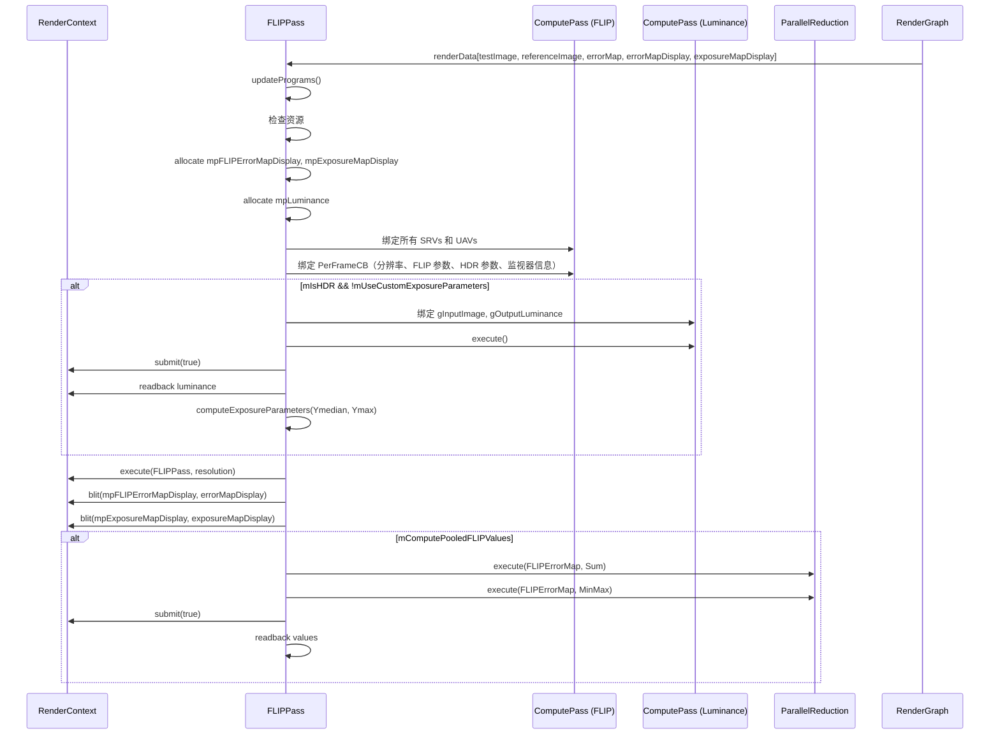

# FLIPPass RenderPass Shader 绑定分析

## 1. Pass 基本信息

### 描述
FLIPPass 是 FLIP（FLIP: A Quality Metric for Real-Time Rendering）误差度量 Pass。计算测试图像和参考图像之间的感知误差，支持 LDR 和 HDR 模式。FLIP 是一种比 PSNR/SSIM 更准确的感知误差度量。

### 主要组件

1. **FLIP Pass** - 计算感知误差（Compute Shader）
2. **ComputeLuminance Pass** - 计算亮度（用于 HDR-FLIP 曝光参数）
3. **ParallelReduction** - 计算平均/最小/最大 FLIP 值

### 入口点函数

**FLIP Pass**：
- **main** - `[numthreads(32, 32, 1)]` Compute Shader：计算 FLIP 误差

**ComputeLuminance Pass**：
- **computeLuminance** - `[numthreads(16, 16, 1)]` Compute Shader：计算亮度

## 2. 资源绑定清单

### 2.1 FLIP Pass 资源绑定

**SRV 输入**：
- `gTestImage` - 测试图像（输入）
- `gReferenceImage` - 参考图像（输入）

**UAV 输出**：
- `gFLIPErrorMap` - FLIP 误差图（高精度，用于计算）
- `gFLIPErrorMapDisplay` - FLIP 误差图（显示用，低精度）
- `gExposureMapDisplay` - HDR-FLIP 曝光图（显示用）

**CBV**：
- `PerFrameCB` - 分辨率、FLIP 参数、HDR 参数、监视器信息等

### 2.2 ComputeLuminance Pass 资源绑定

**SRV 输入**：
- `gInputImage` - 输入图像（参考图像）

**UAV 输出**：
- `gOutputLuminance` - 亮度缓冲区（浮点数组）

**CBV**：
- `PerFrameCB` - 分辨率

### 2.3 ParallelReduction 资源

**SRV 输入**：
- `gFLIPErrorMap` - FLIP 误差图

**输出**（CPU 读取）：
- `mAverageFLIP` - 平均 FLIP 值
- `mMinFLIP` - 最小 FLIP 值
- `mMaxFLIP` - 最大 FLIP 值

## 3. Constant Buffer 结构映射

### FLIP Pass PerFrameCB

```cpp
cbuffer PerFrameCB
{
    uint2 gResolution;      // offset: 0,  size: 8 bytes
    bool gIsHDR;          // offset: 8,  size: 1 byte
    bool gUseMagma;       // offset: 9,  size: 1 byte
    bool gClampInput;      // offset: 10, size: 1 byte
    float gStartExposure;  // offset: 12, size: 4 bytes (填充)
    float gExposureDelta;  // offset: 16, size: 4 bytes
    uint gNumExposures;   // offset: 20, size: 4 bytes
    uint gMonitorWidthPixels; // offset: 24, size: 4 bytes
    float gMonitorWidthMeters; // offset: 28, size: 4 bytes
    float gMonitorDistance;    // offset: 32, size: 4 bytes
}
// 总大小: 36 bytes（可能填充到 40 或 48 字节）
```

### ComputeLuminance Pass PerFrameCB

```cpp
cbuffer PerFrameCB
{
    uint2 gResolution;  // offset: 0, size: 8 bytes
}
// 总大小: 8 bytes（可能填充到 16 字节）
```

## 4. 纹理/缓冲区生命周期

### 4.1 RenderGraph 管理的资源

**输入**：
- `testImage` - 测试图像
- `referenceImage` - 参考图像

**输出**：
- `errorMap` - FLIP 误差图（RGBA32Float，高精度）
- `errorMapDisplay` - FLIP 误差图（RGBA8UnormSrgb，显示用）
- `exposureMapDisplay` - HDR-FLIP 曝光图（RGBA8UnormSrgb，显示用）

### 4.2 Pass 内部管理的资源

| 资源 | 类型 | 创建时机 | 销毁时机 | 说明 |
|------|------|---------|---------|------|
| `mpFLIPErrorMapDisplay` | ref<Texture> | execute()（尺寸变化时） | 随 `FLIPPass` 析构 | 临时显示缓冲区（RGBA32Float） |
| `mpExposureMapDisplay` | ref<Texture> | execute()（尺寸变化时） | 随 `FLIPPass` 析构 | 临时曝光图（RGBA32Float） |
| `mpLuminance` | ref<Buffer> | execute()（首次） | 随 `FLIPPass` 析构 | 亮度缓冲区（浮点数组） |
| `mpFLIPPass` | ref<ComputePass> | 构造函数 | 随 `FLIPPass` 析构 | FLIP Compute Pass |
| `mpComputeLuminancePass` | ref<ComputePass> | 构造函数 | 随 `FLIPPass` 析构 | 亮度 Compute Pass |
| `mpParallelReduction` | unique_ptr<ParallelReduction> | 构造函数 | 随 `FLIPPass` 析构 | 并行缩减辅助类 |

## 5. 执行流程

### 5.1 execute() 函数资源绑定时序



### 5.2 并行缩减与 Readback

ParallelReduction 从 gFLIPErrorMap 读取，输出 mAverageFLIP、mMinFLIP、mMaxFLIP 到 CPU。HDR 模式下 ComputeLuminance 需先 `submit(true)` 并 readback 亮度，再计算曝光参数。

## 6. 特殊机制说明

### 6.1 多 Pass 绑定流程

**FLIP Pass**：绑定 gTestImage、gReferenceImage（SRV），gFLIPErrorMap、gFLIPErrorMapDisplay、gExposureMapDisplay（UAV），PerFrameCB（含 gResolution、gIsHDR、gUseMagma、gClampInput、gStartExposure、gExposureDelta、gNumExposures、监视器参数）。

**ComputeLuminance**（HDR 且非自定义曝光时）：绑定 gInputImage→gOutputLuminance，用于计算曝光参数。需 `submit(true)` 后 readback。

**ParallelReduction**：读取 gFLIPErrorMap，输出平均/最小/最大到 CPU。HDR 模式下 Luminance pass 先执行并 readback，再执行 FLIP pass。显示输出通过 `blit(mpFLIPErrorMapDisplay, errorMapDisplay)` 等传递。
