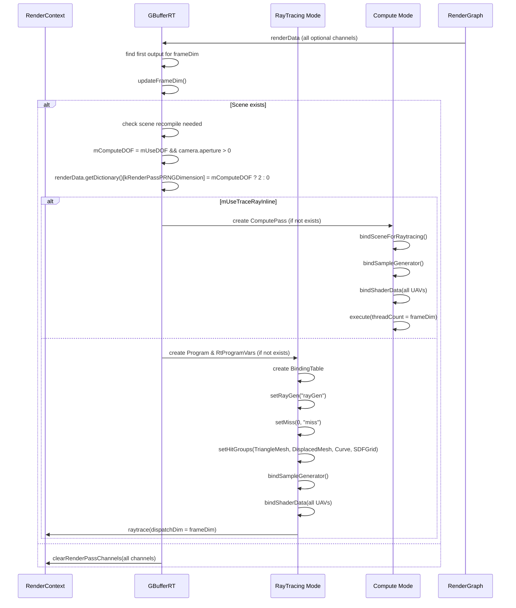

# GBufferRT RenderPass Shader 绑定分析

## 1. Pass 基本信息

### 描述
GBufferRT 是一个光线追踪 G-Buffer 生成 RenderPass，支持两种执行模式：传统光线追踪（DXR）和计算着色器（使用 TraceRayInline）。生成位置、法线、切线、纹理坐标、运动向量、材质数据等多个通道，并支持多种几何体类型（三角形网格、置换网格、曲线、SDF 网格）。支持深度场、纹理 LOD 模式（Mip0/RayCones/RayDiffs）和着色法线调整。

### 入口点函数

**Ray Tracing 模式**：
- **RayGen** - `[raygeneration]` Shader (GBufferRT.rt.slang)：光线生成着色器
- **Miss** - `[miss]` Shader (GBufferRT.rt.slang)：未命中着色器
- **AnyHit** - `[anyhit]` Shader (GBufferRT.rt.slang)：任意命中着色器（alpha test）
- **ClosestHit** - `[closesthit]` Shader (GBufferRT.rt.slang)：最近命中着色器（三角形）
- **DisplacedTriangleMesh ClosestHit** - `[closesthit]` Shader (GBufferRT.rt.slang)：置换网格最近命中
- **DisplacedTriangleMesh Intersection** - `[intersection]` Shader (GBufferRT.rt.slang)：置换网格相交
- **Curve ClosestHit** - `[closesthit]` Shader (GBufferRT.rt.slang)：曲线最近命中
- **Curve Intersection** - `[intersection]` Shader (GBufferRT.rt.slang)：曲线相交
- **SDFGrid ClosestHit** - `[closesthit]` Shader (GBufferRT.rt.slang)：SDF 网格最近命中
- **SDFGrid Intersection** - `[intersection]` Shader (GBufferRT.rt.slang)：SDF 网格相交

**Compute 模式**：
- **Main** - `[main]` Compute Shader (GBufferRT.cs.slang)：[numthreads(16, 16, 1)] 计算着色器，使用 TraceRayInline

## 2. 资源绑定清单

### 2.1 Ray Tracing 模式资源绑定

| C++ 绑定代码 | Shader 声明 | 资源类型 | 绑定方式 | 备注 |
|-------------|-------------|---------|---------|------|
| (Scene auto) | (Scene resources) | CBV/SRV/Accel | 自动 | 场景几何体、材质和加速结构 |
| `var["gGBufferRT"]["frameDim"]` | `uint2 frameDim;` | CBV | 手动 | 帧分辨率（宽高） |
| `var["gGBufferRT"]["invFrameDim"]` | `float2 invFrameDim;` | CBV | 手动 | 分辨率倒数 (1/宽, 1/高) |
| `var["gGBufferRT"]["frameCount"]` | `uint frameCount;` | CBV | 手动 | 帧计数（用于采样） |
| `var["gGBufferRT"]["screenSpacePixelSpreadAngle"]` | `float screenSpacePixelSpreadAngle;` | CBV | 手动 | 屏幕空间像素扩散角度（用于 RayCones LOD） |
| `var["gPosW"]` (UAV) | `RWTexture2D<float4> gPosW;` | UAV | 手动 | 世界空间位置（可选） |
| `var["gNormW"]` (UAV) | `RWTexture2D<float4> gNormW;` | UAV | 手动 | 世界空间着色法线（可选） |
| `var["gTangentW"]` (UAV) | `RWTexture2D<float4> gTangentW;` | UAV | 手动 | 世界空间切线（可选） |
| `var["gFaceNormalW"]` (UAV) | `RWTexture2D<float4> gFaceNormalW;` | UAV | 手动 | 世界空间面法线（可选） |
| `var["gTexC"]` (UAV) | `RWTexture2D<float2> gTexC;` | UAV | 手动 | 纹理坐标（可选） |
| `var["gTexGrads"]` (UAV) | `RWTexture2D<float4> gTexGrads;` | UAV | 手动 | 纹理梯度（可选） |
| `var["gMotionVector"]` (UAV) | `RWTexture2D<float2> gMotionVector;` | UAV | 手动 | 屏幕空间运动向量（可选） |
| `var["gMaterialData"]` (UAV) | `RWTexture2D<uint4> gMaterialData;` | UAV | 手动 | 材质数据（可选） |
| `var["gVBuffer"]` (UAV) | `RWTexture2D<PackedHitInfo> gVBuffer;` | UAV | 手动 | 可见性缓冲区（可选） |
| `var["gDepth"]` (UAV) | `RWTexture2D<float> gDepth;` | UAV | 手动 | 深度缓冲区 NDC（可选） |
| `var["gLinearZ"]` (UAV) | `RWTexture2D<float2> gLinearZ;` | UAV | 手动 | 线性 Z 和斜率（可选） |
| `var["gMotionVectorW"]` (UAV) | `RWTexture2D<float4> gMotionVectorW;` | UAV | 手动 | 世界空间运动向量（可选） |
| `var["gNormalWRoughnessMaterialID"]` (UAV) | `RWTexture2D<float4> gNormalWRoughnessMaterialID;` | UAV | 手动 | 打包的法线+粗糙度+材质 ID（可选） |
| `var["gGuideNormalW"]` (UAV) | `RWTexture2D<float4> gGuideNormalW;` | UAV | 手动 | 引导法线（可选） |
| `var["gDiffOpacity"]` (UAV) | `RWTexture2D<float4> gDiffOpacity;` | UAV | 手动 | 漫反射率和不透明度（可选） |
| `var["gSpecRough"]` (UAV) | `RWTexture2D<float4> gSpecRough;` | UAV | 手动 | 镜面反射率和粗糙度（可选） |
| `var["gEmissive"]` (UAV) | `RWTexture2D<float4> gEmissive;` | UAV | 手动 | 自发光颜色（可选） |
| `var["gViewW"]` (UAV) | `RWTexture2D<float4> gViewW;` | UAV | 手动 | 世界空间视图方向（可选） |
| `var["gTime"]` (UAV) | `RWTexture2D<uint> gTime;` | UAV | 手动 | 每像素执行时间（可选） |
| `var["gDisocclusion"]` (UAV) | `RWTexture2D<float> gDisocclusion;` | UAV | 手动 | 去遮挡掩码（可选） |
| `var["gMask"]` (UAV) | `RWTexture2D<float> gMask;` | UAV | 手动 | 掩码（可选） |

### 2.2 Compute 模式资源绑定

| C++ 绑定代码 | Shader 声明 | 资源类型 | 绑定方式 | 备注 |
|-------------|-------------|---------|---------|------|
| (Scene auto via bindShaderDataForRaytracing) | (Scene resources) | CBV/SRV/Accel | 自动 | 场景几何体、材质和加速结构 |
| (Same as Ray Tracing mode for all GBufferRT CB and UAV bindings) | (Same) | CBV/UAV | 手动 | 与光线追踪模式相同 |

### 2.3 SampleGenerator 资源绑定

| C++ 绑定代码 | Shader 声明 | 资源类型 | 绑定方式 | 备注 |
|-------------|-------------|---------|---------|------|
| `mpSampleGenerator->bindShaderData(var)` | (SampleGenerator resources) | CBV/SRV/UAV | 自动 | 采样生成器（用于深度场和随机采样） |

## 3. Constant Buffer 结构映射

### GBufferRT 结构

```cpp
// C++ 端：通过 var["gGBufferRT"][key] 逐个设置
// Shader 端定义：
struct GBufferRT
{
    uint2 frameDim;                        // offset: 0,  size: 8 bytes
    float2 invFrameDim;                    // offset: 8,  size: 8 bytes
    uint frameCount;                       // offset: 16, size: 4 bytes
    float screenSpacePixelSpreadAngle;       // offset: 20, size: 4 bytes

    // Static constants (not set from C++)
    static const bool kComputeDepthOfField;
    static const bool kUseAlphaTest;
    static const TexLODMode kLODMode;
    static const bool kAdjustShadingNormals;
    static const uint kRayFlags;
    static const float kEnvMapDepth;
}
// 总大小: 24 bytes（可能填充到 32 或 48 字节）
```

### 对齐分析

| 成员 | 偏移 | C++ 类型 | HLSL 类型 | 对齐 |
|------|------|----------|-----------|------|
| frameDim | 0 | uint2 | uint2 | 8 bytes |
| invFrameDim | 8 | float2 | float2 | 8 bytes |
| frameCount | 16 | uint | uint | 4 bytes |
| screenSpacePixelSpreadAngle | 20 | float | float | 4 bytes |

### G-Buffer 通道列表（与 GBufferRaster 共享）

| Channel Name | Shader Variable | 格式 | 可选 | 描述 |
|-------------|-----------------|------|------|------|
| posW | gPosW | RGBA32Float | 是 | 世界空间位置 |
| normW | gNormW | RGBA32Float | 是 | 世界空间着色法线 |
| tangentW | gTangentW | RGBA32Float | 是 | 世界空间切线（含符号） |
| faceNormalW | gFaceNormalW | RGBA32Float | 是 | 世界空间面法线 |
| texC | gTexC | RG32Float | 是 | 纹理坐标 |
| texGrads | gTexGrads | RGBA16Float | 是 | 纹理梯度 |
| mvec | gMotionVector | RG32Float | 是 | 屏幕空间运动向量 |
| mtlData | gMaterialData | RGBA32Uint | 是 | 材质数据 |

### GBufferRT 额外通道

| Channel Name | Shader Variable | 格式 | 可选 | 描述 |
|-------------|-----------------|------|------|------|
| vbuffer | gVBuffer | HitInfo | 是 | 可见性缓冲区 |
| depth | gDepth | R32Float | 是 | 深度缓冲区（NDC） |
| linearZ | gLinearZ | RG32Float | 是 | 线性 Z 和斜率 |
| mvecW | gMotionVectorW | RGBA16Float | 是 | 世界空间运动向量 |
| normWRoughnessMaterialID | gNormalWRoughnessMaterialID | RGB10A2Unorm | 是 | 打包的法线+粗糙度+材质 ID |
| guideNormalW | gGuideNormalW | RGBA32Float | 是 | 引导法线 |
| diffuseOpacity | gDiffOpacity | RGBA32Float | 是 | 漫反射率和不透明度 |
| specRough | gSpecRough | RGBA32Float | 是 | 镜面反射率和粗糙度 |
| emissive | gEmissive | RGBA32Float | 是 | 自发光颜色 |
| viewW | gViewW | RGBA32Float | 是 | 世界空间视图方向 |
| time | gTime | R32Uint | 是 | 每像素执行时间 |
| disocclusion | gDisocclusion | R32Float | 是 | 去遮挡掩码 |
| mask | gMask | R32Float | 是 | 掩码 |

## 4. 纹理/缓冲区生命周期

### 4.1 RenderGraph 管理的资源

所有 G-Buffer 通道（共 22 个）均由 RenderGraph 管理，通过 `reflect()` 函数声明。所有通道均为可选输出（`Optional` 标志）。

### 4.2 Pass 内部管理的资源

| 资源 | 类型 | 创建时机 | 销毁时机 | 说明 |
|------|------|---------|---------|------|
| `mRaytrace.pProgram` | ref<Program> | execute() | 随 `GBufferRT` 析构 | 光线追踪程序 |
| `mRaytrace.pVars` | ref<RtProgramVars> | execute() | 随 `GBufferRT` 析构 | 光线追踪程序变量 |
| `mpComputePass` | ref<ComputePass> | execute() | 随 `GBufferRT` 析构 | 计算着色器 pass |
| `mpSampleGenerator` | ref<SampleGenerator> | 构造函数 | 随 `GBufferRT` 析构 | 采样生成器 |

### 4.3 资源创建逻辑

**Ray Tracing 模式程序创建**：
```cpp
// 条件：场景重新编译、几何变化、SDF 网格配置变化
ProgramDesc desc;
desc.addShaderModules(mpScene->getShaderModules());
desc.addShaderLibrary(kProgramRaytraceFile);
desc.addTypeConformances(mpScene->getTypeConformances());
desc.setMaxPayloadSize(kMaxPayloadSizeBytes);        // 4 bytes
desc.setMaxAttributeSize(mpScene->getRaytracingMaxAttributeSize());
desc.setMaxTraceRecursionDepth(kMaxRecursionDepth);  // 1
```

**Binding Table**：
- 1 个 ray generation shader
- 1 个 miss shader
- 4 个 hit groups：TriangleMesh, DisplacedTriangleMesh, Curve, SDFGrid

**Compute 模式程序创建**：
```cpp
ProgramDesc desc;
desc.addShaderModules(mpScene->getShaderModules());
desc.addShaderLibrary(kProgramComputeFile).csEntry("main");
desc.addTypeConformances(mpScene->getTypeConformances());
```

**Shader Defines**：
```cpp
COMPUTE_DEPTH_OF_FIELD     // 启用深度场
USE_ALPHA_TEST             // 启用 alpha test
LOD_MODE                  // 纹理 LOD 模式 (0=Mip0, 1=RayCones, 2=RayDiffs)
ADJUST_SHADING_NORMALS     // 调整着色法线
RAY_FLAGS                 // 光线剔除标志 (0/CullFront/CullBack)
is_valid_<name>           // 标识可选通道
```

## 5. 执行流程

### 5.1 execute() 函数资源绑定时序



### 5.2 Ray Tracing 执行流程

**RayGen Shader**：
1. 计算光线（pinhole 或 thinlens with DOF）
2. 调用 `TraceRay()` 追踪光线
3. 记录时间（如果启用）
4. 调用 `writeAux()` 写入视图方向

**Hit Groups**：
- **TriangleMesh**: `anyHit` (alpha test) → `closestHit` (写入 hit data)
- **DisplacedTriangleMesh**: `intersection` (相交测试) → `closestHit` (写入 hit data)
- **Curve**: `intersection` (相交测试) → `closestHit` (写入 hit data)
- **SDFGrid**: `intersection` (相交测试) → `closestHit` (写入 hit data)

**Miss Shader**：
1. 计算背景运动向量
2. 清零所有通道
3. 设置默认值（depth=1.0, normalWRoughness 使用 UE4 默认值等）

### 5.3 Compute 执行流程

**Main Shader**（每像素一个线程）：
1. 检查边界：`if (any(pixel >= frameDim)) return`
2. 计算光线（pinhole 或 thinlens with DOF）
3. 使用 `SceneRayQuery.traceRay()` 追踪光线
4. 如果命中：调用 `writeHit()`
5. 如果未命中：调用 `writeMiss()`
6. 调用 `writeAux()` 写入视图方向
7. 记录时间（如果启用）

### 5.4 Shader Defines 动态生成

**getShaderDefines() 函数**：
```cpp
defines.add("COMPUTE_DEPTH_OF_FIELD", mComputeDOF ? "1" : "0");
defines.add("USE_ALPHA_TEST", mUseAlphaTest ? "1" : "0");
defines.add("LOD_MODE", std::to_string((uint32_t)mLODMode));
defines.add("ADJUST_SHADING_NORMALS", mAdjustShadingNormals ? "1" : "0");
defines.add("RAY_FLAGS", std::to_string((uint32_t)rayFlags));
defines.add(getValidResourceDefines(kGBufferChannels, renderData));
defines.add(getValidResourceDefines(kGBufferExtraChannels, renderData));
```

### 5.5 内存屏障/同步点

- **Ray Tracing 模式**：
  - `TraceRay()` 内部隐含同步
  - 每个 pixel 独立执行（无 UAV 写入冲突，因为每像素一个 dispatch）
- **Compute 模式**：
  - Dispatch 后隐含同步
  - 每像素一个线程，无写入冲突

### 5.6 纹理 LOD 模式

**Mip0 (TexLODMode::Mip0)**：
- 使用固定 LOD = 0
- 不计算梯度

**RayCones (TexLODMode::RayCones)**：
- 使用光线锥方法计算各向异性纹理采样
- 需要传递 `screenSpacePixelSpreadAngle`
- 计算 `ddx` 和 `ddy` 并使用 `ExplicitGradientTextureSampler`

**RayDiffs (TexLODMode::RayDiffs)**：
- 使用光线微分方法（来自 Ray Tracing Gems）
- 不适用于翻转手性坐标系的实例变换（TODO）
- 计算 `ddx` 和 `ddy` 并使用 `ExplicitGradientTextureSampler`

### 5.7 绑定频率总结

| 资源类型 | 绑定频率 | 示例 |
|---------|---------|------|
| CBV (gGBufferRT) | 每次 execute | frameDim, invFrameDim, frameCount, screenSpacePixelSpreadAngle |
| UAV (所有通道) | 每次 execute | gPosW, gNormW, gVBuffer, etc. |
| Shader Defines | 程序重建/每帧 | COMPUTE_DEPTH_OF_FIELD, LOD_MODE, is_valid_* |

## 6. 特殊机制说明

### 6.1 双执行模式

**Ray Tracing 模式**：
- 使用完整的 DXR pipeline（rayGen + miss + hit groups）
- 支持 RayPayload 和 RayAttributes
- 适合使用硬件加速的场景

**Compute 模式**：
- 使用 TraceRayInline（计算着色器内联光线追踪）
- 使用 SceneRayQuery 抽象
- 更灵活，但可能性能较低

### 6.2 深度场（Depth-of-Field）

**条件**：
```cpp
mComputeDOF = mUseDOF && mpScene->getCamera()->getApertureRadius() > 0.f;
```

**光线生成**：
```cpp
SampleGenerator sg = SampleGenerator(pixel, frameCount);
return gScene.camera.computeRayThinlens(pixel, frameDim, sampleNext2D(sg));
```

**PRNG 维度**：
- 当启用 DOF 时，使用 2 个 PRNG 维度（透镜采样）
- 传递给后续 passes：`renderData.getDictionary()[kRenderPassPRNGDimension]`

### 6.3 可选通道机制

与 GBufferRaster 相同，但所有通道均为 UAV（无渲染目标）。

### 6.4 几何体类型支持

**TriangleMesh**：
- 标准三角形网格
- Alpha test 在 `anyHit` 中执行

**DisplacedTriangleMesh**：
- 使用自定义相交着色器
- Displacement 信息存储在 hit data 中
- 使用 `DisplacedTriangleMeshIntersector`

**Curve**：
- 使用线性扫描球体表示
- 自定义相交着色器
- 使用 `CurveIntersector`

**SDFGrid**：
- 有向距离场网格
- 自定义相交着色器
- 使用 `SDFGridIntersector`

### 6.5 HitInfo 打包

**TriangleHit**：
- `instanceID`
- `primitiveIndex`
- `barycentrics` (yz)

**DisplacedTriangleHit**：
- 继承 TriangleHit
- `displacement`

**CurveHit**：
- 继承 TriangleHit

**SDFGridHit**：
- `instanceID`
- `hitData` (SDFGridHitData)

### 6.6 运动向量计算

**屏幕空间**：
```cpp
float2 pixelPos = pixel + float2(0.5f, 0.5f);
float4 prevPosH = mul(gScene.camera.data.prevViewProjMatNoJitter, float4(prevPosW, 1.f));
motionVector = calcMotionVector(pixelPos, prevPosH, frameDim) +
               float2(gScene.camera.data.jitterX, -gScene.camera.data.jitterY);
```

**世界空间**：
```cpp
motionVectorW = float4(prevPosW - sd.posW, 0.f);
```

**背景**：
```cpp
float3 worldPos = rayOrigin + normalize(rayDir) * kEnvMapDepth; // 1e8
```

### 6.7 去遮挡掩码

```cpp
float4 curPosH = mul(gScene.camera.data.viewProjMatNoJitter, float4(sd.posW, 1.f));
float4 prevPosH = mul(gScene.camera.data.prevViewProjMatNoJitter, float4(prevPosW, 1.f));
disocclusion = prevPosH.w - curPosH.w;
```

使用线性 Z 空间的差值表示去遮挡。

### 6.8 法线+粗糙度+材质 ID 打包

```cpp
float3 normal = bsdfProperties.guideNormal;
if (sd.mtl.getMaterialType() == MaterialType::Hair)
    normal = sd.frame.T; // 头发使用切线

float2 octNormal = ndir_to_oct_unorm(normal);      // 八进制编码
float roughness = bsdfProperties.roughness;          // [0, 1]
float materialID = 0.f;                            // 当前未使用

gNormalWRoughnessMaterialID[pixel] = float4(octNormal, roughness, materialID);
```

格式：RGB10A2Unorm (10 位 XY 法线，10 位 Z 法线，2 位粗糙度，未使用材质 ID)

### 6.9 线性 Z 和导数

```cpp
float4 curPosH = mul(gScene.camera.data.viewProjMatNoJitter, float4(sd.posW, 1.f));
float curLinearZ = curPosH.w;

// 计算导数
float3 ddxPosW = computeDdxPosW(sd.posW, sd.faceN, invFrameDim);
float3 ddyPosW = computeDdyPosW(sd.posW, sd.faceN, invFrameDim);
float4 curPosH_dx = mul(gScene.camera.data.viewProjMatNoJitter, float4(sd.posW + ddxPosW, 1.f));
float4 curPosH_dy = mul(gScene.camera.data.viewProjMatNoJitter, float4(sd.posW + ddyPosW, 1.f));
float ddxLinearZ = abs(curPosH_dx.w - curLinearZ);
float ddyLinearZ = abs(curPosH_dy.w - curLinearZ);
float dLinearZ = max(ddxLinearZ, ddyLinearZ);

gLinearZ[pixel] = float2(curLinearZ, dLinearZ);
```

### 6.10 Alpha Test

**Ray Tracing 模式（anyHit）**：
```hlsl
if (GBufferRT::kUseAlphaTest)
{
    GeometryInstanceID instanceID = getGeometryInstanceID();
    VertexData v = getVertexData(instanceID, PrimitiveIndex(), attribs);
    const uint materialID = gScene.getMaterialID(instanceID);
    if (gScene.materials.alphaTest(v, materialID, 0.f))
        IgnoreHit();
}
```

**Compute 模式**：
```hlsl
SceneRayQuery<GBufferRT::kUseAlphaTest> sceneRayQuery;
const HitInfo hit = sceneRayQuery.traceRay(ray, hitT, GBufferRT::kRayFlags);
```

### 6.11 着色法线调整

```cpp
bool modifyNormal = evalModifyNormal(hit.getType());
uint hints = !modifyNormal ? (uint)MaterialInstanceHints::DisableNormalMapping : 0;
if (kAdjustShadingNormals && (hit.getType() == HitType::Triangle || hit.getType() == HitType::DisplacedTriangle))
{
    hints |= (uint)MaterialInstanceHints::AdjustShadingNormal;
}

let mi = gScene.materials.getMaterialInstance(sd, lod, hints);
```

### 6.12 设备特性要求

```cpp
if (!mpDevice->isShaderModelSupported(ShaderModel::SM6_5))
    FALCOR_THROW("GBufferRT requires Shader Model 6.5 support.");
if (!mpDevice->isFeatureSupported(Device::SupportedFeatures::RaytracingTier1_1))
    FALCOR_THROW("GBufferRT requires Raytracing Tier 1.1 support.");
```

### 6.13 光线剔除模式

```cpp
RayFlags rayFlags = RayFlags::None;
if (mForceCullMode && mCullMode == RasterizerState::CullMode::Front)
    rayFlags = RayFlags::CullFrontFacingTriangles;
else if (mForceCullMode && mCullMode == RasterizerState::CullMode::Back)
    rayFlags = RayFlags::CullBackFacingTriangles;
defines.add("RAY_FLAGS", std::to_string((uint32_t)rayFlags));
```

### 6.14 GpuTimer

**用途**：测量每个像素的执行时间

**使用**：
```hlsl
GpuTimer timer;
gGBufferRT.beginTime(timer);

// ... 执行光线追踪 ...

gGBufferRT.endTime(pixel, timer);
```

**写入**：
```hlsl
if (is_valid(gTime))
    gTime[pixel] = timer.getElapsed();
```

### 6.15 Ray Tracing 配置

**Payload 大小**：
```cpp
const uint32_t kMaxPayloadSizeBytes = 4;
```

仅包含一个 `int dummy`，因为 GBuffer 数据通过 UAV 写入，不需要 payload。

**递归深度**：
```cpp
const uint32_t kMaxRecursionDepth = 1;
```

仅需主光线追踪，无递归。

### 6.16 Binding Table 配置

```cpp
ref<RtBindingTable> sbt = RtBindingTable::create(1, 1, mpScene->getGeometryCount());
sbt->setRayGen(desc.addRayGen("rayGen"));
sbt->setMiss(0, desc.addMiss("miss"));
sbt->setHitGroup(0, mpScene->getGeometryIDs(Scene::GeometryType::TriangleMesh), desc.addHitGroup("closestHit", "anyHit"));
```

- 1 ray gen
- 1 miss shader (index 0)
- 4 hit groups (all in hit group index 0)

## 7. G-Buffer 数据结构

### 7.1 GBufferData 结构（shader 端）

与 GBufferRaster 相同，使用 `prepareGBufferData()` 辅助函数。

### 7.2 HitInfo 多态

**HitType 枚举**：
- `Triangle` - 标准三角形
- `DisplacedTriangle` - 置换三角形
- `Curve` - 曲线
- `SDFGrid` - SDF 网格

**访问方式**：
```hlsl
if (hit.getType() == HitType::Triangle)
{
    const TriangleHit triangleHit = hit.getTriangleHit();
    // ...
}
else if (hit.getType() == HitType::DisplacedTriangle)
{
    const DisplacedTriangleHit displacedTriangleHit = hit.getDisplacedTriangleHit();
    // ...
}
```

### 7.3 打包的 HitInfo

**TriangleHit**：
```hlsl
triangleHit.instanceID = getGeometryInstanceID();
triangleHit.primitiveIndex = PrimitiveIndex();
triangleHit.barycentrics = attribs.barycentrics;
gVBuffer[ipos] = triangleHit.pack();
```

**DisplacedTriangleHit**：
```hlsl
displacedTriangleHit.instanceID = getGeometryInstanceID();
displacedTriangleHit.primitiveIndex = PrimitiveIndex();
displacedTriangleHit.barycentrics = attribs.barycentrics;
displacedTriangleHit.displacement = attribs.displacement;
gVBuffer[ipos] = displacedTriangleHit.pack();
```

### 7.4 场景更新触发重建

```cpp
if (is_set(mpScene->getUpdates(), IScene::UpdateFlags::RecompileNeeded) ||
    is_set(mpScene->getUpdates(), IScene::UpdateFlags::GeometryChanged) ||
    is_set(mpScene->getUpdates(), IScene::UpdateFlags::SDFGridConfigChanged))
{
    recreatePrograms();
}
```

## 8. 与 GBufferRaster 的对比

| 特性 | GBufferRaster | GBufferRT |
|------|--------------|------------|
| 执行模式 | 光栅化 | 光线追踪 / Compute |
| 输出类型 | 8 RTs + UAVs | 仅 UAVs |
| 必需硬件 | ShaderModel 6.2, Barycentrics, ROV | ShaderModel 6.5, Raytracing Tier 1.1 |
| Pass 数量 | 2 (Depth + GBuffer) | 1 (RayGen / Compute) |
| Alpha Test | 两个 pass | AnyHit / SceneRayQuery |
| 纹理 LOD | 固定 Mip0 | Mip0 / RayCones / RayDiffs |
| DOF | 不支持 | 支持（thinlens） |
| 几何类型 | 仅 TriangleMesh | TriangleMesh / DisplacedMesh / Curve / SDFGrid |
| 运动向量 | 屏幕空间 | 屏幕空间 + 世界空间 |
| 时间测量 | 不支持 | 支持（GpuTimer） |
| 去遮挡 | 不支持 | 支持 |
