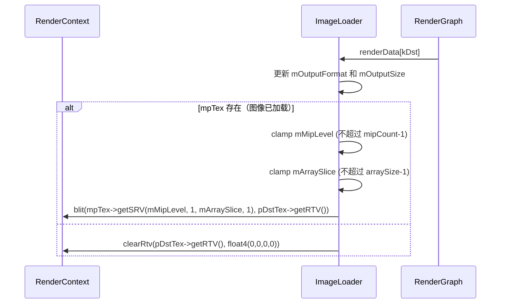

# ImageLoader RenderPass Shader 绑定分析

## 1. Pass 基本信息

### 描述
ImageLoader 是一个图像加载 RenderPass，从文件加载图像并输出到纹理。支持多种输出尺寸选项、Mipmap 生成和 SRGB 加载模式。此 pass 不使用 shader，而是使用 GPU 内置的 blit 操作将加载的图像拷贝到输出。

### 入口点函数
- **无** - 使用 `RenderContext::blit()` 进行直接 GPU 拷贝，不涉及 shader

## 2. 资源绑定清单

### 2.1 资源绑定

| C++ 绑定代码 | 资源类型 | 绑定方式 | 备注 |
|-------------|---------|---------|------|
| `mpTex->getSRV(mMipLevel, 1, mArraySlice, 1)` | SRV | 手动 | 源纹理（从文件加载） |
| `pDstTex->getRTV()` | RTV | 手动 | 目标纹理（输出） |

## 3. Constant Buffer 结构映射

无 Constant Buffer。此 pass 不使用任何 CB。

## 4. 纹理/缓冲区生命周期

### 4.1 RenderGraph 管理的资源

| 资源 | 用途 | 生命周期 |
|------|------|---------|
| `dst` | 输出纹理 | 由 RenderGraph 创建（reflect() 时声明） |

### 4.2 Pass 内部管理的资源

| 资源 | 类型 | 创建时机 | 销毁时机 | 说明 |
|------|------|---------|---------|------|
| `mpTex` | ref<Texture> | 构造函数 / loadImage() | 随 `ImageLoader` 析构 | 从文件加载的图像纹理 |

## 5. 执行流程

### 5.1 execute() 函数资源绑定时序



### 5.2 图像加载流程

**构造函数**：
```cpp
if (!mImagePath.empty())
{
    if (!loadImage(mImagePath))
        FALCOR_THROW("ImageLoader: Failed to load image from '{}'", mImagePath);
}
```

**loadImage() 函数**：
```cpp
std::filesystem::path resolvedPath = AssetResolver::getDefaultResolver().resolvePath(path);
if (std::filesystem::exists(resolvedPath))
{
    mImagePath = path;
    mpTex = Texture::createFromFile(mpDevice, resolvedPath, mGenerateMips, mLoadSRGB);
    return mpTex != nullptr;
}
```

### 5.3 Mipmap 和 Array Slice 选择

**Mipmap Level**：
- `mMipLevel` 在 UI 中选择
- 限制范围：`[0, mpTex->getMipCount() - 1]`

**Array Slice**：
- `mArraySlice` 在 UI 中选择
- 限制范围：`[0, mpTex->getArraySize() - 1]`

### 5.4 输出尺寸选项

通过 `RenderPassHelpers::IOSize` 控制：
- `Default` - 使用默认尺寸（基于连接的 pass）
- `Fixed` - 使用图像的原始尺寸
- `Full` / `Half` / `Quarter` / `Double` - 窗口尺寸的倍数

## 6. 特殊机制说明

### 6.1 图像格式支持

支持的图像格式：
- PNG
- JPEG
- HDR (OpenEXR)
- TGA
- BMP
- DDS

### 6.2 Mipmap 生成

**选项**：`mGenerateMips`

**实现**：
```cpp
mpTex = Texture::createFromFile(mpDevice, resolvedPath, mGenerateMips, mLoadSRGB);
```

### 6.3 SRGB 加载

**选项**：`mLoadSRGB`（默认 true）

**作用**：
- 加载图像时将其视为 sRGB 空间
- 自动进行 gamma 校正转换为线性空间

### 6.4 尺寸不匹配处理

如果输出尺寸与图像原始尺寸不同：
- 使用双线性插值自动缩放
- 适用于调整图像以适应目标分辨率

### 6.5 重新加载流程

UI 中的重新加载流程：
```cpp
if (reloadImage && !mImagePath.empty())
{
    uint2 prevSize = {mpTex->getWidth(), mpTex->getHeight()};

    if (!loadImage(mImagePath))
        msgBox("Error", fmt::format("Failed to load image from '{}'", mImagePath), ...);

    // 如果输出设置为原始尺寸且图像尺寸改变
    if (mOutputSizeSelection == RenderPassHelpers::IOSize::Fixed && ... &&
        (mpTex->getWidth() != prevSize.x || mpTex->getHeight() != prevSize.y))
    {
        requestRecompile(); // 触发图重新编译
    }
}
```

### 6.6 UI 显示

在 UI 中显示：
- 图像预览（320x320）
- 图像格式
- 图像尺寸
- 输出格式
- 输出尺寸

### 6.7 无 Shader

此 pass 完全依赖 GPU 的 blit 功能和 `Texture::createFromFile()`，不编译或执行任何 shader。
