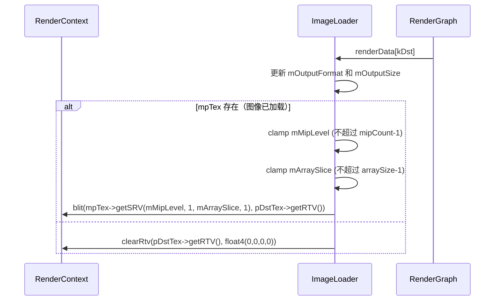

# ImageLoader RenderPass Shader 绑定分析

## 1. Pass 基本信息

### 描述
ImageLoader 是一个图像加载 RenderPass，从文件加载图像并输出到纹理。支持多种输出尺寸选项、Mipmap 生成和 SRGB 加载模式。此 pass 不使用 shader，而是使用 GPU 内置的 blit 操作将加载的图像拷贝到输出。

### 入口点函数
- **无** - 使用 `RenderContext::blit()` 进行直接 GPU 拷贝，不涉及 shader

## 2. 资源绑定清单

### 2.1 资源绑定

| C++ 绑定代码 | 资源类型 | 绑定方式 | 备注 |
|-------------|---------|---------|------|
| `mpTex->getSRV(mMipLevel, 1, mArraySlice, 1)` | SRV | 手动 | 源纹理（从文件加载） |
| `pDstTex->getRTV()` | RTV | 手动 | 目标纹理（输出） |

## 3. Constant Buffer 结构映射

无 Constant Buffer。此 pass 不使用任何 CB。

## 4. 纹理/缓冲区生命周期

### 4.1 RenderGraph 管理的资源

| 资源 | 用途 | 生命周期 |
|------|------|---------|
| `dst` | 输出纹理 | 由 RenderGraph 创建（reflect() 时声明） |

### 4.2 Pass 内部管理的资源

| 资源 | 类型 | 创建时机 | 销毁时机 | 说明 |
|------|------|---------|---------|------|
| `mpTex` | ref<Texture> | 构造函数 / loadImage() | 随 `ImageLoader` 析构 | 从文件加载的图像纹理 |

## 5. 执行流程

### 5.1 execute() 函数资源绑定时序

## 6. 特殊机制说明

### 6.1 无 Shader 与 SRV 子资源

此 pass 不使用 shader，通过 `blit(mpTex->getSRV(mMipLevel, 1, mArraySlice, 1), pDst->getRTV())` 传递资源。`mMipLevel` 和 `mArraySlice` 决定 SRV 子资源选择。
