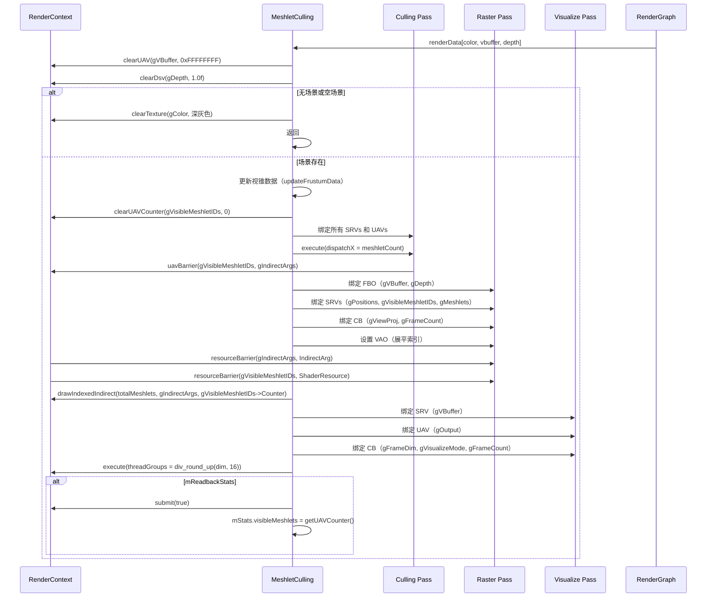

# MeshletCulling RenderPass Shader 绑定分析

## 1. Pass 基本信息

### 描述
MeshletCulling 是一个 GPU Meshlet 剔除和渲染 Pass。使用 meshoptimizer 库在 CPU 上构建 meshlets，然后在 GPU 上进行视锥剔除和间接绘制。支持三种可视化模式：MeshletID、TriangleID 和 Combined。输出可见性缓冲区、颜色和深度。

### 入口点函数

**Culling Pass**：
- **main** - `[numthreads(64, 1, 1)]` Compute Shader：视锥剔除，生成可见 meshlet ID 列表和间接参数

**Raster Pass**：
- **vsMain** - Vertex Shader：顶点着色器
- **psMain** - Pixel Shader：像素着色器（输出 VBuffer）

**Visualize Pass**：
- **main** - `[numthreads(16, 16, 1)]` Compute Shader：将 VBuffer 可视化为颜色

## 2. 资源绑定清单

### 2.1 Culling Pass 资源绑定

**Constant Buffer**：
| C++ 绑定代码 | Shader 声明 | 资源类型 | 绑定方式 | 备注 |
|-------------|-------------|---------|---------|------|
| `vars["gFrustum"]` | `FrustumData gFrustum;` | CBV | 手动 | 视锥剔除数据（6个平面 + 相机位置） |

**Shader Resource View**：
| C++ 绑定代码 | Shader 声明 | 资源类型 | 绑定方式 | 备注 |
|-------------|-------------|---------|---------|------|
| `vars["gMeshlets"]` | `StructuredBuffer<GpuMeshlet> gMeshlets;` | SRV | 手动 | Meshlet 数据（每个 meshlet 的元数据） |
| `vars["gSceneData"]` | `StructuredBuffer<MeshletSceneData> gSceneData;` | SRV | 手动 | 场景数据（meshlet 数量、三角形数量等） |

**Unordered Access View**：
| C++ 绑定代码 | Shader 声明 | 资源类型 | 绑定方式 | 备注 |
|-------------|-------------|---------|---------|------|
| `vars["gVisibleMeshletIDs"]` | `AppendStructuredBuffer<uint> gVisibleMeshletIDs;` | UAV | 手动 | 可见 meshlet ID 列表（Append Buffer） |
| `vars["gIndirectArgs"]` | `RWStructuredBuffer<DrawIndexedIndirectArgs> gIndirectArgs;` | UAV | 手动 | 间接绘制参数 |

### 2.2 Raster Pass 资源绑定

**Constant Buffer**：
| C++ 绑定代码 | Shader 声明 | 资源类型 | 绑定方式 | 备注 |
|-------------|-------------|---------|---------|------|
| `var["PerFrameCB"]["gViewProj"]` | `float4x4 gViewProj;` | CBV | 手动 | 视图投影矩阵 |
| `var["PerFrameCB"]["gFrameCount"]` | `uint gFrameCount;` | CBV | 手动 | 帧计数 |

**Shader Resource View**：
| C++ 绑定代码 | Shader 声明 | 资源类型 | 绑定方式 | 备注 |
|-------------|-------------|---------|---------|------|
| `var["gPositions"]` | `StructuredBuffer<float3> gPositions;` | SRV | 手动 | 顶点位置（优化后） |
| `var["gVisibleMeshletIDs"]` | `StructuredBuffer<uint> gVisibleMeshletIDs;` | SRV | 手动 | 可见 meshlet ID 列表（从 Culling Pass 输出） |
| `var["gMeshlets"]` | `StructuredBuffer<GpuMeshlet> gMeshlets;` | SRV | 手动 | Meshlet 数据 |

**Render Target**：
| C++ 绑定代码 | Shader 声明 | 资源类型 | 绑定方式 | 备注 |
|-------------|-------------|---------|---------|------|
| `mpFbo->attachColorTarget(pVBuffer, 0)` | `SV_TARGET0` | RTV | 手动 | VBuffer 输出（R32Uint，存储 MeshletID + PrimitiveID） |

**Depth Stencil**：
| C++ 绑定代码 | Shader 声明 | 资源类型 | 绑定方式 | 备注 |
|-------------|-------------|---------|---------|------|
| `mpFbo->attachDepthStencilTarget(pDepth)` | `SV_Depth` | DSV | 手动 | 深度缓冲区（D32Float） |

**Index Buffer**：
| C++ 绑定代码 | Shader 声明 | 资源类型 | 绑定方式 | 备注 |
|-------------|-------------|---------|---------|------|
| `mpGraphicsState->setVao(pVao)` | `IB` | SRV | 手动 | 展平的索引缓冲区（R32Uint） |

### 2.3 Visualize Pass 资源绑定

**Constant Buffer**：
| C++ 绑定代码 | Shader 声明 | 资源类型 | 绑定方式 | 备注 |
|-------------|-------------|---------|---------|------|
| `var["VisualizeCB"]["gFrameDim"]` | `uint2 gFrameDim;` | CBV | 手动 | 帧分辨率 |
| `var["VisualizeCB"]["gVisualizeMode"]` | `uint gVisualizeMode;` | CBV | 手动 | 可视化模式（0=MeshletID, 1=TriangleID, 2=Combined） |
| `var["VisualizeCB"]["gFrameCount"]` | `uint gFrameCount;` | CBV | 手动 | 帧计数 |

**Shader Resource View**：
| C++ 绑定代码 | Shader 声明 | 资源类型 | 绑定方式 | 备注 |
|-------------|-------------|---------|---------|------|
| `var["gVBuffer"]` | `Texture2D<uint> gVBuffer;` | SRV | 手动 | VBuffer 输入（从 Raster Pass 输出） |

**Unordered Access View**：
| C++ 绑定代码 | Shader 声明 | 资源类型 | 绑定方式 | 备注 |
|-------------|-------------|---------|---------|------|
| `var["gOutput"]` | `RWTexture2D<float4> gOutput;` | UAV | 手动 | 颜色输出（RGBA8UnormSrgb） |

## 3. Constant Buffer 结构映射

### FrustumData 结构（Culling Pass）

```cpp
// CPU 端计算，通过 mpFrustumBuffer->setBlob() 上传
struct FrustumData
{
    float4 planes[6];      // offset: 0,  size: 96 bytes (6个视锥平面)
    float3 cameraPos;      // offset: 96, size: 12 bytes
}
// 总大小: 108 bytes（可能填充到 112 字节）
```

### PerFrameCB 结构（Raster Pass）

```cpp
// C++ 端：通过 var["PerFrameCB"][key] 逐个设置
// Shader 端定义：
cbuffer PerFrameCB
{
    float4x4 gViewProj;  // offset: 0, size: 64 bytes
    uint gFrameCount;      // offset: 64, size: 4 bytes
}
// 总大小: 68 bytes（可能填充到 80 字节）
```

### VisualizeCB 结构（Visualize Pass）

```cpp
cbuffer VisualizeCB
{
    uint2 gFrameDim;       // offset: 0, size: 8 bytes
    uint gVisualizeMode;   // offset: 8, size: 4 bytes
    uint gFrameCount;      // offset: 12, size: 4 bytes
}
// 总大小: 16 bytes
```

### GpuMeshlet 结构

```cpp
struct GpuMeshlet
{
    uint32_t vertexOffset;      // offset: 0,  size: 4 bytes
    uint32_t triangleOffset;    // offset: 4,  size: 4 bytes
    uint32_t vertexCount;       // offset: 8,  size: 4 bytes
    uint32_t triangleCount;     // offset: 12, size: 4 bytes
    float3   boundCenter;       // offset: 16, size: 12 bytes
    float    boundRadius;       // offset: 28, size: 4 bytes
    uint32_t indexStart;       // offset: 32, size: 4 bytes
    uint32_t indexCount;       // offset: 36, size: 4 bytes
    uint32_t meshID;          // offset: 40, size: 4 bytes
    uint32_t _pad0;          // offset: 44, size: 4 bytes
}
// 总大小: 48 bytes
```

### MeshletSceneData 结构

```cpp
struct MeshletSceneData
{
    uint32_t meshletCount;     // offset: 0, size: 4 bytes
    uint32_t totalTriangles;   // offset: 4, size: 4 bytes
    uint32_t totalVertices;   // offset: 8, size: 4 bytes
    uint32_t totalIndices;    // offset: 12, size: 4 bytes
}
// 总大小: 16 bytes
```

## 4. 纹理/缓冲区生命周期

### 4.1 RenderGraph 管理的资源

| 资源 | 用途 | 生命周期 |
|------|------|---------|
| `color` | 可视化颜色输出 | 由 RenderGraph 创建 |
| `vbuffer` | 可见性缓冲区输出（MeshletID + PrimitiveID） | 由 RenderGraph 创建 |
| `depth` | 深度缓冲区输出 | 由 RenderGraph 创建 |

### 4.2 Pass 内部管理的资源

| 资源 | 类型 | 创建时机 | 销毁时机 | 说明 |
|------|------|---------|---------|------|
| `mpMeshletBuffer` | ref<Buffer> | setScene() | 随 `MeshletCulling` 析构 | Meshlet 数据（GpuMeshlet 数组） |
| `mpMeshletVertices` | ref<Buffer> | setScene() | 随 `MeshletCulling` 析构 | Meshlet 顶点索引（局部索引） |
| `mpMeshletTriangles` | ref<Buffer> | setScene() | 随 `MeshletCulling` 析构 | Meshlet 三角形索引（打包） |
| `mpMeshletPositions` | ref<Buffer> | setScene() | 随 `MeshletCulling` 析构 | 优化后的顶点位置 |
| `mpFlattenedIndexBuffer` | ref<Buffer> | setScene() | 随 `MeshletCulling` 析构 | 展平的全局索引 |
| `mpSceneDataBuffer` | ref<Buffer> | setScene() | 随 `MeshletCulling` 析构 | 场景数据 |
| `mpVisibleMeshletIDs` | ref<Buffer> | setScene() | 随 `MeshletCulling` 析构 | 可见 meshlet ID 列表（Append Buffer） |
| `mpIndirectArgsBuffer` | ref<Buffer> | setScene() | 随 `MeshletCulling` 析构 | 间接绘制参数 |
| `mpFrustumBuffer` | ref<Buffer> | setScene() | 随 `MeshletCulling` 析构 | 视锥剔除数据 |
| `mpCullingPass` | ref<ComputePass> | 构造函数 | 随 `MeshletCulling` 析构 | Culling Pass |
| `mpGraphicsState` | ref<GraphicsState> | initRasterPass() | 随 `MeshletCulling` 析构 | Graphics Pass 状态 |
| `mpGraphicsVars` | ref<ProgramVars> | initRasterPass() | 随 `MeshletCulling` 析构 | Graphics Pass 变量 |
| `mpVisualizePass` | ref<ComputePass> | initVisualizePass() | 随 `MeshletCulling` 析构 | Visualize Pass |

## 5. 执行流程

### 5.1 execute() 函数资源绑定时序



### 5.2 间接绘制与资源屏障

Culling Pass 写入 `gVisibleMeshletIDs`（AppendStructuredBuffer）和 `gIndirectArgs`。Raster Pass 前需 `resourceBarrier(gIndirectArgs, IndirectArg)`、`resourceBarrier(gVisibleMeshletIDs, ShaderResource)`。`drawIndexedIndirect()` 使用 `mpVisibleMeshletIDs->getUAVCounter()` 作为绘制调用数量。VBuffer 格式：高 16 位 MeshletID，低 16 位 PrimitiveID。

## 6. 特殊机制说明

### 6.1 间接绘制与 Append Buffer

**DrawIndexedIndirectArgs 结构**：
```cpp
struct DrawIndexedIndirectArgs
{
    uint indexCountPerInstance;
    uint instanceCount;
    uint startIndexLocation;
    int baseVertexLocation;
    uint startInstanceLocation;
}
```

**使用 Append Buffer 的 Counter**：
```cpp
pContext->drawIndexedIndirect(
    ...,
    mpVisibleMeshletIDs->getUAVCounter().get(),  // counter 作为绘制调用数量
    0
);
```

### 6.2 资源屏障

**Culling Pass 后**：
```cpp
pRenderContext->uavBarrier(mpVisibleMeshletIDs.get());
pRenderContext->uavBarrier(mpIndirectArgsBuffer.get());
```

**Raster Pass 前**：
```cpp
pContext->resourceBarrier(mpIndirectArgsBuffer.get(), Resource::State::IndirectArg);
pContext->resourceBarrier(mpVisibleMeshletIDs.get(), Resource::State::ShaderResource);
```

转换状态以供 Raster Pass 使用。

### 6.3 VBuffer 格式

**R32Uint**：
- 高 16 位：MeshletID
- 低 16 位：PrimitiveID

用于后续 pass 重建 meshlet 信息。
