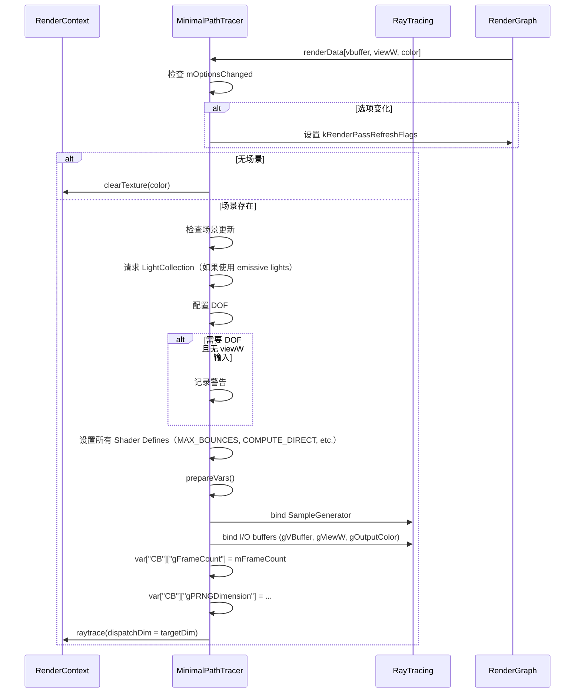

# MinimalPathTracer RenderPass Shader 绑定分析

## 1. Pass 基本信息

### 描述
MinimalPathTracer 是一个最小化的暴力路径追踪器实现，用于验证更复杂渲染器的正确性。不使用任何重要性采样或其他方差缩减技术，输出是无偏/一致的真值图像。支持直接和间接光照，支持多种几何体类型（三角形网格、置换网格、曲线、SDF 网格）。

### 入口点函数

**Ray Tracing Shaders**：
- **rayGen** - `[raygeneration]` Shader：光线生成着色器
- **scatterMiss** - `[miss]` Shader：散射光线未命中着色器（处理环境光照）
- **shadowMiss** - `[miss]` Shader：阴影光线未命中着色器（标记为可见）

**TriangleMesh Hit Groups**：
- **scatterTriangleMeshAnyHit** - `[anyhit]` Shader：散射光线任意命中（alpha test）
- **scatterTriangleMeshClosestHit** - `[closesthit]` Shader：散射光线最近命中
- **shadowTriangleMeshAnyHit** - `[anyhit]` Shader：阴影光线任意命中（alpha test）

**DisplacedTriangleMesh Hit Groups**：
- **displacedTriangleMeshIntersection** - `[intersection]` Shader：置换网格相交着色器
- **scatterDisplacedTriangleMeshClosestHit** - `[closesthit]` Shader：散射光线最近命中

**Curve Hit Groups**：
- **curveIntersection** - `[intersection]` Shader：曲线相交着色器
- **scatterCurveClosestHit** - `[closesthit]` Shader：散射光线最近命中

**SDFGrid Hit Groups**：
- **sdfGridIntersection** - `[intersection]` Shader：SDF 网格相交着色器
- **scatterSdfGridClosestHit** - `[closesthit]` Shader：散射光线最近命中

## 2. 资源绑定清单

### 2.1 Constant Buffer 绑定

| C++ 绑定代码 | Shader 声明 | 资源类型 | 绑定方式 | 备注 |
|-------------|-------------|---------|---------|------|
| `var["CB"]["gFrameCount"]` | `uint gFrameCount;` | CBV | 手动 | 帧计数（用于样本生成） |
| `var["CB"]["gPRNGDimension"]` | `uint gPRNGDimension;` | CBV | 手动 | PRNG 起始维度 |

### 2.2 Shader Resource View (SRV) 绑定

| C++ 绑定代码 | Shader 声明 | 资源类型 | 绑定方式 | 备注 |
|-------------|-------------|---------|---------|------|
| (Scene auto) | (Scene resources) | CBV/SRV/Accel | 自动 | 场景几何体、材质、纹理和加速结构 |
| `var["gVBuffer"]` | `Texture2D<PackedHitInfo> gVBuffer;` | SRV | 手动 | 可见性缓冲区（输入） |
| `var["gViewW"]` (可选) | `Texture2D<float4> gViewW;` | SRV | 手动 | 世界空间视图方向（可选，用于 DOF） |

### 2.3 Unordered Access View (UAV) 绑定

| C++ 绑定代码 | Shader 声明 | 资源类型 | 绑定方式 | 备注 |
|-------------|-------------|---------|---------|------|
| `var["gOutputColor"]` | `RWTexture2D<float4> gOutputColor;` | UAV | 手动 | 输出颜色（RGBA32Float） |

## 3. Constant Buffer 结构映射

### CB 结构

```cpp
// C++ 端：通过 var["CB"][key] 逐个设置
// Shader 端定义：
cbuffer CB
{
    uint gFrameCount;      // offset: 0, size: 4 bytes
    uint gPRNGDimension;  // offset: 4, size: 4 bytes
}
// 总大小: 8 bytes（可能填充到 16 字节）
```

### 对齐分析

| 成员 | 偏移 | C++ 类型 | HLSL 类型 | 对齐 |
|------|------|----------|-----------|------|
| gFrameCount | 0 | uint | uint | 4 bytes |
| gPRNGDimension | 4 | uint | uint | 4 bytes |

## 4. 纹理/缓冲区生命周期

### 4.1 RenderGraph 管理的资源

| 资源 | 用途 | 生命周期 |
|------|------|---------|
| `vbuffer` | 可见性缓冲区（输入） | 由 RenderGraph 在 execute() 前提供 |
| `viewW` | 视图方向（输入，可选） | 由 RenderGraph 在 execute() 前提供 |
| `color` | 输出颜色 | 由 RenderGraph 创建（reflect() 时声明） |

### 4.2 Pass 内部管理的资源

| 资源 | 类型 | 创建时机 | 销毁时机 | 说明 |
|------|------|---------|---------|------|
| `mpSampleGenerator` | ref<SampleGenerator> | 构造函数 | 随 `MinimalPathTracer` 析构 | 样本生成器（均匀分布） |
| `mTracer.pProgram` | ref<Program> | setScene() | 随 `MinimalPathTracer` 析构 | 光线追踪程序 |
| `mTracer.pBindingTable` | ref<RtBindingTable> | setScene() | 随 `MinimalPathTracer` 析构 | 绑定表 |
| `mTracer.pVars` | ref<RtProgramVars> | prepareVars() | 随 `MinimalPathTracer` 析构 | 程序变量 |

## 5. 执行流程

### 5.1 execute() 函数资源绑定时序



### 5.2 路径追踪流程（tracePath 函数）

**主要步骤**：
1. 获取主光线方向（从 gViewW 或相机计算）
2. 从 VBuffer 获取 primary hit
3. 如果命中有效：
   - 加载 shading data 和 material
   - 计算直接光照（如果启用）
   - 生成散射光线
   - 追踪路径（最多 MAX_BOUNCES 次弹射）
4. 如果未命中：
   - 返回环境背景色（如果启用）或默认黑色

**散射光线循环**：
```hlsl
for (uint depth = 0; depth <= kMaxBounces && !rayData.terminated; depth++)
{
    traceScatterRay(rayData);
}
```

每次迭代：
- 追踪散射光线
- 如果命中：调用 `handleHit()` 加载材质、采样光源、生成下一条光线
- 如果未命中：调用 `scatterMiss()` 添加环境光照、标记终止

### 5.3 直接光照计算（evalDirectAnalytic）

**算法**：
1. 均匀选择一个 analytic light
2. 采样光源
3. 检查 BSDF lobe 方向是否兼容（NdotL 检查）
4. 追踪阴影光线
5. 如果可见：计算贡献

```hlsl
const uint lightIndex = min(uint(sampleNext1D(sg) * lightCount), lightCount - 1);
float invPdf = lightCount;

AnalyticLightSample ls;
if (!sampleLight(sd.posW, gScene.getLight(lightIndex), sg, ls))
    return float3(0.f);

bool V = traceShadowRay(origin, ls.dir, ls.distance);
if (!V)
    return float3(0.f);

return mi.eval(sd, ls.dir, sg) * ls.Li * invPdf;
```

### 5.4 散射光线生成（generateScatterRay）

**算法**：
1. 使用重要性采样（或均匀采样）采样 BSDF
2. 计算 ray origin（使用偏移避免自相交）
3. 更新 throughput
4. 检查是否继续路径

```hlsl
BSDFSample bsdfSample;
if (mi.sample(sd, rayData.sg, bsdfSample, kUseImportanceSampling))
{
    rayData.origin = rayOrigin;
    if (!isCurveHit && bsdfSample.isLobe(LobeType::Transmission))
    {
        rayData.origin = sd.computeRayOrigin(false);
    }
    rayData.direction = bsdfSample.wo;
    rayData.thp *= bsdfSample.weight;
    return any(rayData.thp > 0.f);
}
```

### 5.5 光线类型

**散射光线**：
- Payload 大小：72 bytes
- 包含：radiance, throughput, pathLength, origin, direction, terminated, sample generator state

**阴影光线**：
- Payload 大小：4 bytes（bool）
- 简单的可见性测试

## 6. 特殊机制说明

### 6.1 Shader Defines

**光线追踪配置**：
- `MAX_BOUNCES` - 最大间接弹射次数（0 = 仅直接光照）
- `COMPUTE_DIRECT` - 是否计算直接光照
- `USE_IMPORTANCE_SAMPLING` - 是否使用重要性采样
- `USE_ANALYTIC_LIGHTS` - 是否使用 analytic lights（点光源、方向光等）
- `USE_EMISSIVE_LIGHTS` - 是否使用 emissive geometry 作为光源
- `USE_ENV_LIGHT` - 是否使用环境图作为光源
- `USE_ENV_BACKGROUND` - 是否使用环境图作为背景

**可选资源**：
- `is_valid_gVBuffer`
- `is_valid_gViewW`
- `is_valid_gOutputColor`

### 6.2 光线追踪配置

**参数**：
```cpp
const uint32_t kMaxPayloadSizeBytes = 72u;  // 散射光线 payload
const uint32_t kMaxRecursionDepth = 2u;     // rayGen -> scatter -> shadow
```

**递归说明**：
- rayGen: 深度 0
- scatter ray: 深度 1
- shadow ray: 深度 2（从 scatter hit 或 rayGen 调用）

### 6.3 几何体类型支持

| 几何体类型 | Hit Groups | 说明 |
|-----------|------------|------|
| TriangleMesh | scatter + shadow | 标准三角形，支持 alpha test |
| DisplacedTriangleMesh | scatter | 置换网格，自定义相交着色器 |
| Curve | scatter | 曲线（线性扫描球体），自定义相交着色器 |
| SDFGrid | scatter | SDF 网格，自定义相交着色器 |

### 6.4 Alpha Test

**Scatter AnyHit**：
```hlsl
GeometryInstanceID instanceID = getGeometryInstanceID();
VertexData v = getVertexData(instanceID, PrimitiveIndex(), attribs);
const uint materialID = gScene.getMaterialID(instanceID);
if (gScene.materials.alphaTest(v, materialID, 0.f))
    IgnoreHit();
```

**Shadow AnyHit**：
```hlsl
if (gScene.materials.alphaTest(v, materialID, 0.f))
    IgnoreHit();
```

两个 pass 都执行 alpha test 以确保阴影正确。

### 6.5 深度场支持

**警告**：
```cpp
const bool useDOF = mpScene->getCamera()->getApertureRadius() > 0.f;
if (useDOF && renderData[kInputViewDir] == nullptr)
{
    logWarning("Depth-of-field requires '{}' input. Expect incorrect shading.", kInputViewDir);
}
```

**实现**：
如果 `gViewW` 可用，直接从中读取主光线方向，避免相机计算和样本生成器不匹配。

### 6.6 路径终止条件

**最大深度**：
```hlsl
if (rayData.pathLength >= kMaxBounces)
{
    rayData.terminated = true;
    return;
}
```

**Throughput 阈值**：
```hlsl
if (mi.sample(sd, rayData.sg, bsdfSample, kUseImportanceSampling))
{
    rayData.thp *= bsdfSample.weight;
    return any(rayData.thp > 0.f);
}
return false;  // 终止
```

### 6.7 光源处理

**Analytic Lights**：
- 在 `handleHit()` 中采样
- 每个顶点 1 个 shadow ray
- 均匀光源选择

**Emissive Lights**：
- 在 `handleHit()` 中添加
- 只在直接光照或间接弹射时添加

**Environment Lights**：
- 在 `scatterMiss()` 中添加
- 只在直接光照或间接弹射时添加

**Background**：
- 在 `tracePath()` 的背景分支中
- 使用环境图或默认黑色

### 6.8 样本生成器

**配置**：
```cpp
mpSampleGenerator = SampleGenerator::create(mpDevice, SAMPLE_GENERATOR_UNIFORM);
```

**绑定**：
```cpp
mpSampleGenerator->bindShaderData(var);
```

**PRNG Dimension**：
- 从 C++ 传递（`gPRNGDimension`）
- 在 shader 中跳过前 `gPRNGDimension` 个维度

```hlsl
SampleGenerator sg = SampleGenerator(pixel, gFrameCount);
for (uint i = 0; i < gPRNGDimension; i++)
    sampleNext1D(sg);
```

### 6.9 VBuffer 输入

**用途**：
- 避免重新计算 primary hit
- 提高效率（假设 GBuffer pass 已经计算过）

**加载**：
```hlsl
const HitInfo hit = HitInfo(gVBuffer[pixel]);
if (hit.isValid())
{
    // 命中几何体
    ShadingData sd = loadShadingData(hit, primaryRayOrigin, primaryRayDir);
    // ...
}
else
{
    // 背景
    outColor = kUseEnvBackground ? gScene.envMap.eval(primaryRayDir) : kDefaultBackgroundColor;
}
```

### 6.10 设备特性要求

**必需特性**：
- Raytracing Tier 1.1（隐含，使用标准 DXR API）
- 不支持自定义几何体（Custom Primitives）

### 6.11 Binding Table 配置

```cpp
mTracer.pBindingTable = RtBindingTable::create(2, 2, mpScene->getGeometryCount());

// Ray Generation
sbt->setRayGen(desc.addRayGen("rayGen"));

// Miss Shaders（2个）
sbt->setMiss(0, desc.addMiss("scatterMiss"));
sbt->setMiss(1, desc.addMiss("shadowMiss"));

// Hit Groups（每种几何体类型 2 个：scatter + shadow）
```

- 1 ray gen
- 2 miss shaders（scatter index 0, shadow index 1）
- 4 geometry types × 2 hit groups = 8 hit groups

### 6.12 帧计数

**更新**：
```cpp
mpScene->raytrace(pRenderContext, mTracer.pProgram.get(), mTracer.pVars, uint3(targetDim, 1));
mFrameCount++;
```

**用途**：
- 样本生成器种子
- PRNG 状态初始化

### 6.13 与 PathTracer 的对比

| 特性 | MinimalPathTracer | PathTracer |
|------|------------------|-------------|
| 重要性采样 | 可选 | 强制 |
| NEE | 均匀 1 光 | 可能多个样本 |
| 重置策略 | 无 | 多种 |
| 累积 | 无 | 支持 |
| 体积散射 | 不支持 | 支持 |
| NRD 集成 | 不支持 | 支持 |
| 目的 | 验证/基准 | 生产渲染 |

### 6.14 性能考虑

- **VBuffer 输入**：避免重复计算 primary hit
- **均匀光源选择**：简单但低效（不使用 CDF）
- **单 Shadow Ray**：每个顶点仅 1 个 shadow ray
- **无时域累积**：需要外部 pass 进行累积
- **简单材质采样**：可选重要性采样

### 6.15 输出格式

- **颜色**：`RGBA32Float`
  - RGB: 辐照度（radiance）
  - A: 1.0（固定）

### 6.16 不支持的功能

- 传输和嵌套电介质（文档中说明）
- 自定义几何体
- 体积散射
- 时域累积
- NRD 降噪集成
