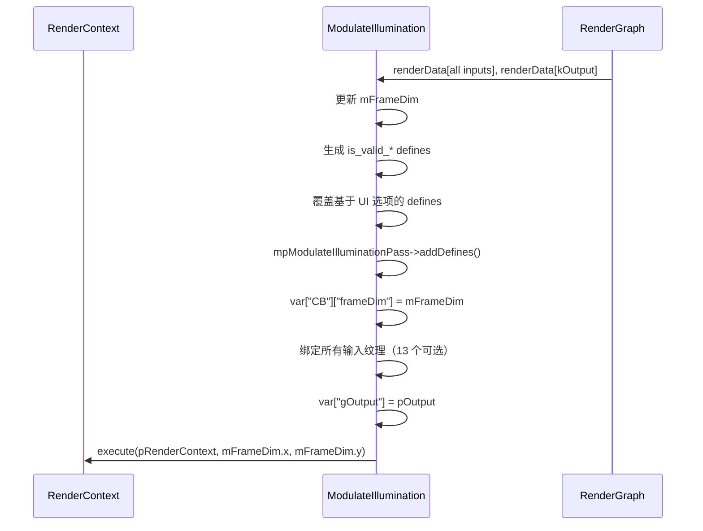

# ModulateIllumination RenderPass Shader 绑定分析

## 1. Pass 基本信息

### 描述
ModulateIllumination 是一个光照调制 RenderPass，将多个光照通道（自发光、漫反射辐照度/反射率、镜面辐照度/反射率、Delta 反射/透射、残差辐照度）调制并求和到最终输出。每个通道都是可选的，允许灵活的光照管道配置。

### 入口点函数
- **main** - `[numthreads(16, 16, 1)]` Compute Shader：执行光照调制和求和

## 2. 资源绑定清单

### 2.1 Constant Buffer 绑定

| C++ 绑定代码 | Shader 声明 | 资源类型 | 绑定方式 | 备注 |
|-------------|-------------|---------|---------|------|
| `var["CB"]["frameDim"]` | `uint2 frameDim;` | CBV | 手动 | 帧分辨率（宽高） |

### 2.2 Shader Resource View (SRV) 绑定

| C++ 绑定代码 | Shader 声明 | 资源类型 | 绑定方式 | 备注 |
|-------------|-------------|---------|---------|------|
| `var["gEmission"]` | `Texture2D gEmission;` | SRV | 手动 | 自发光（可选） |
| `var["gDiffuseReflectance"]` | `Texture2D gDiffuseReflectance;` | SRV | 手动 | 漫反射反射率（可选） |
| `var["gDiffuseRadiance"]` | `Texture2D gDiffuseRadiance;` | SRV | 手动 | 漫反射辐照度（可选） |
| `var["gSpecularReflectance"]` | `Texture2D gSpecularReflectance;` | SRV | 手动 | 镜面反射反射率（可选） |
| `var["gSpecularRadiance"]` | `Texture2D gSpecularRadiance;` | SRV | 手动 | 镜面反射辐照度（可选） |
| `var["gDeltaReflectionEmission"]` | `Texture2D gDeltaReflectionEmission;` | SRV | 手动 | Delta 反射自发光（可选） |
| `var["gDeltaReflectionReflectance"]` | `Texture2D gDeltaReflectionReflectance;` | SRV | 手动 | Delta 反射反射率（可选） |
| `var["gDeltaReflectionRadiance"]` | `Texture2D gDeltaReflectionRadiance;` | SRV | 手动 | Delta 反射辐照度（可选） |
| `var["gDeltaTransmissionEmission"]` | `Texture2D gDeltaTransmissionEmission;` | SRV | 手动 | Delta 透射自发光（可选） |
| `var["gDeltaTransmissionReflectance"]` | `Texture2D gDeltaTransmissionReflectance;` | SRV | 手动 | Delta 透射反射率（可选） |
| `var["gDeltaTransmissionRadiance"]` | `Texture2D gDeltaTransmissionRadiance;` | SRV | 手动 | Delta 透射辐照度（可选） |
| `var["gResidualRadiance"]` | `Texture2D gResidualRadiance;` | SRV | 手动 | 残差辐照度（可选） |

### 2.3 Unordered Access View (UAV) 绑定

| C++ 绑定代码 | Shader 声明 | 资源类型 | 绑定方式 | 备注 |
|-------------|-------------|---------|---------|------|
| `var["gOutput"]` | `RWTexture2D gOutput;` | UAV | 手动 | 输出纹理（RGBA32Float） |

## 3. Constant Buffer 结构映射

### CB 结构

```cpp
cbuffer CB
{
    uint2 frameDim; // offset: 0, size: 8 bytes
}
// 总大小: 8 bytes（可能填充到 16 字节）
```

## 4. 纹理/缓冲区生命周期

### 4.1 RenderGraph 管理的资源

所有 13 个输入通道和 1 个输出通道均由 RenderGraph 管理。

### 4.2 Pass 内部管理的资源

| 资源 | 类型 | 创建时机 | 销毁时机 | 说明 |
|------|------|---------|---------|------|
| `mpModulateIlluminationPass` | ref<ComputePass> | 构造函数 | 随 `ModulateIllumination` 析构 | 计算着色器 pass |

## 5. 执行流程

### 5.1 execute() 函数资源绑定时序



## 6. 特殊机制说明

### 6.1 可选通道与 Defines

所有 13 个输入在 `reflect()` 中标记为 `Optional`。使用 `is_valid_<name>` defines 控制通道可用性；UI 可覆盖：即使纹理已连接，禁用通道时 `defineList["is_valid_gEmission"] = "0"` 等。
