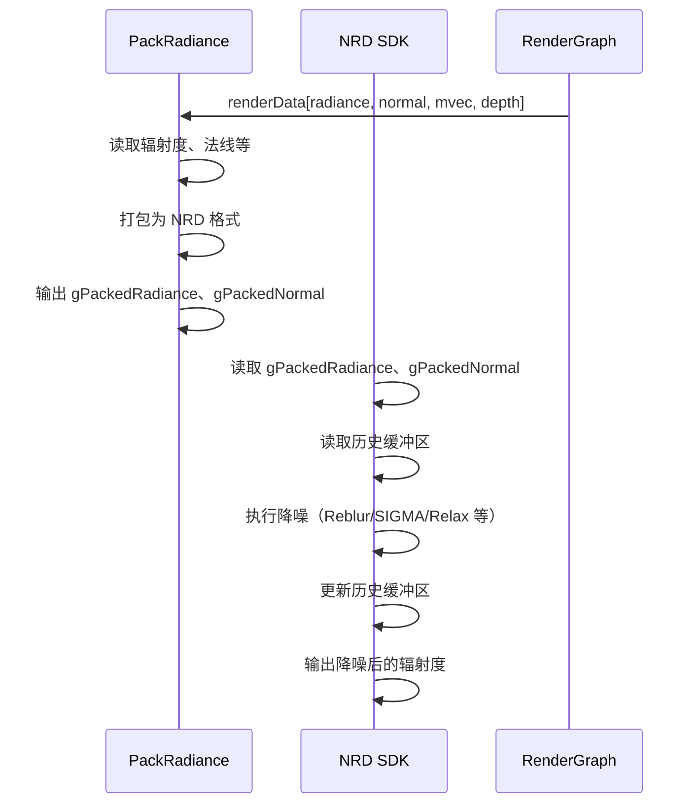

# NRDPass RenderPass Shader 绑定分析

## 1. Pass 基本信息

### 描述
NRDPass 是 NVIDIA Real-time Denoiser (NRD) SDK 的集成 Pass。支持多种降噪模式（Reblur、SIGMA 等），对噪声图像进行实时降噪。需要深度、法线、运动向量等辅助输入。

### 主要组件
1. **NRD SDK** - 执行降噪（Reblur、SIGMA 等）
2. **PackRadiance Pass** - 打包辐照度和法线数据为 NRD 格式
3. **Descriptor Set 和 Root Signature 管理** - D3D12 特有

### 入口点函数

**PackRadiance Pass**：
- **main** - `[numthreads(16, 16, 1)]` Compute Shader：打包辐射度数据

## 2. 资源绑定清单（简化）

### 2.1 PackRadiance 资源绑定

**SRV 输入**：
- `gRadiance` - 输入辐射度（噪声）
- `gNormal` - 法线（世界空间或屏幕空间）
- `gMotionVector` - 运动向量
- `gDepth` - 深度
- `gRoughness` - 粗糙度
- ...

**UAV 输出**：
- `gPackedRadiance` - NRD 格式的辐射度
- `gPackedNormal` - NRD 格式的法线
- `gHitT` - 命中距离（可选）

**CBV**：
- `PerFrameCB` - 帧维度等

### 2.2 NRD SDK 调用

**输入**：
- `gPackedRadiance` - 辐照度
- `gPackedNormal` - 法线
- `gMotionVector` - 运动向量
- `gDepth` - 深度
- 历史缓冲区（用于时域累积）

**输出**：
- `gDenoisedRadiance` - 降噪后的辐射度
- 更新的历史缓冲区

## 3. Constant Buffer 结构映射（简化）

### PackRadiance CB

```cpp
struct PackRadianceCB
{
    uint2 frameDim;
    float maxIntensity;
    // ... 其他参数
}
```

## 4. 纹理/缓冲区生命周期（简化）

### 4.1 RenderGraph 管理的资源

**输入**：
- 辐照度（噪声）
- 法线
- 运动向量
- 深度
- 粗糙度
- 可选：其他辅助数据

**输出**：
- 降噪后的辐照度
- 历史缓冲区（内部管理）

### 4.2 Pass 内部管理的资源

- `mpDenoiser` - NRD SDK Denoiser 实例
- `mpPasses` - NRD Compute Passes（多个）
- `mpPermanentTextures` - 永久纹理（历史缓冲区）
- `mpTransientTextures` - 临时纹理
- Descriptor Sets 和 Root Signatures（D3D12）

## 5. 执行流程（简化）

### 5.1 总体流程



### 5.2 NRD 降噪流程

**时域累积**：
1. 将当前帧与历史帧混合
2. 使用运动向量重投影历史像素
3. 检测不连续性（disocclusion）

**空间滤波**：
1. 在像素周围进行空间滤波
2. 根据法线和深度调整权重
3. 减少噪声

## 6. 特殊机制说明

### 6.1 NRD 降噪模式

| 模式 | 说明 |
|------|------|
| RelaxDiffuseSpecular | RELAX：漫反射 + 镜面反射 |
| RelaxDiffuse | RELAX：仅漫反射 |
| ReblurDiffuseSpecular | Reblur：漫反射 + 镜面反射 |
| SpecularReflectionMv | 镜面反射（运动向量） |
| SpecularDeltaMv | Delta 反射（运动向量） |

### 6.2 NRD SDK 集成

**SDK 调用**：
```cpp
nrd::DispatchDesc dispatchDesc = ...;
mpDenoiser->Update(dispatchDesc, pRenderContext);
mpDenoiser->GetDispatchDesc(pDispatchDesc);
mpDenoiser->Execute(pDispatchDesc, pRenderContext);
```

**配置**：
- `nrd::CommonSettings` - 通用设置
- 特定模式的设置（如 `nrd::RelaxDiffuseSpecularSettings`）

### 6.3 数据打包

**目的**：
将 Falcor 格式转换为 NRD 格式。

**示例**：
```hlsl
// Falcor 格式：float3 normal
// NRD 格式：packed normal (oct16 or oct8)
float2 packedNormal = packNormalOct16(normal);
gPackedNormal[pixel] = packedNormal;
```

### 6.4 历史缓冲区

**用途**：
- 时域累积
- 减少闪烁

**管理**：
- NRD SDK 内部管理
- 在场景变化时重置

### 6.5 不连续检测（Disocclusion）

**算法**：
1. 比较当前帧和历史帧的深度和法线
2. 如果差异超过阈值，标记为 disocclusion
3. 跳过历史贡献，使用当前帧

### 6.6 最大强度裁剪

**用途**：
- 防止高亮溢出
- 提高稳定性

**设置**：
```cpp
float mMaxIntensity = 1000.f;
```

### 6.7 世界空间运动向量

**选项**：
- `mWorldSpaceMotion = true`：世界空间运动向量
- `mWorldSpaceMotion = false`：屏幕空间运动向量

### 6.8 Shader 文件

- `PackRadiance.cs.slang` - 数据打包 pass
- NRD Passes（SDK 内部，不直接暴露）

### 6.9 设备特性要求

- D3D12（使用 D3D12DescriptorSet 和 D3D12RootSignature）
- Compute Shader 支持

### 6.10 性能考虑

- **时域累积**：显著降低噪声，但引入模糊
- **空间滤波**：减少残留噪声，但可能模糊细节
- **历史缓冲区**：需要额外内存

## 7. 注意事项

NRDPass 是 NRD SDK 的完整集成。SDK 的核心逻辑在 DLL 中，不直接暴露在 shader 中。

关键点：
1. **PackRadiance** - 将 Falcor 格式转换为 NRD 格式
2. **NRD SDK** - 执行降噪（时域累积 + 空间滤波）
3. **历史缓冲区** - SDK 内部管理
4. **Descriptor Set 管理** - D3D12 特有

支持多种降噪模式，可根据场景选择。
