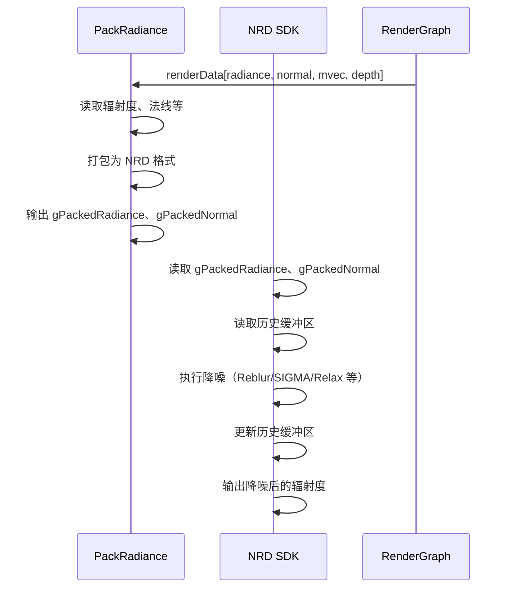

# NRDPass RenderPass Shader 绑定分析

## 1. Pass 基本信息

### 描述
NRDPass 是 NVIDIA Real-time Denoiser (NRD) SDK 的集成 Pass。支持多种降噪模式（Reblur、SIGMA 等），对噪声图像进行实时降噪。需要深度、法线、运动向量等辅助输入。

### 主要组件
1. **NRD SDK** - 执行降噪（Reblur、SIGMA 等）
2. **PackRadiance Pass** - 打包辐照度和法线数据为 NRD 格式
3. **Descriptor Set 和 Root Signature 管理** - D3D12 特有

### 入口点函数

**PackRadiance Pass**：
- **main** - `[numthreads(16, 16, 1)]` Compute Shader：打包辐射度数据

## 2. 资源绑定清单（简化）

### 2.1 PackRadiance 资源绑定

**SRV 输入**：
- `gRadiance` - 输入辐射度（噪声）
- `gNormal` - 法线（世界空间或屏幕空间）
- `gMotionVector` - 运动向量
- `gDepth` - 深度
- `gRoughness` - 粗糙度
- ...

**UAV 输出**：
- `gPackedRadiance` - NRD 格式的辐射度
- `gPackedNormal` - NRD 格式的法线
- `gHitT` - 命中距离（可选）

**CBV**：
- `PerFrameCB` - 帧维度等

### 2.2 NRD SDK 调用

**输入**：
- `gPackedRadiance` - 辐照度
- `gPackedNormal` - 法线
- `gMotionVector` - 运动向量
- `gDepth` - 深度
- 历史缓冲区（用于时域累积）

**输出**：
- `gDenoisedRadiance` - 降噪后的辐射度
- 更新的历史缓冲区

## 3. Constant Buffer 结构映射（简化）

### PackRadiance CB

```cpp
struct PackRadianceCB
{
    uint2 frameDim;
    float maxIntensity;
    // ... 其他参数
}
```

## 4. 纹理/缓冲区生命周期（简化）

### 4.1 RenderGraph 管理的资源

**输入**：
- 辐照度（噪声）
- 法线
- 运动向量
- 深度
- 粗糙度
- 可选：其他辅助数据

**输出**：
- 降噪后的辐照度
- 历史缓冲区（内部管理）

### 4.2 Pass 内部管理的资源

- `mpDenoiser` - NRD SDK Denoiser 实例
- `mpPasses` - NRD Compute Passes（多个）
- `mpPermanentTextures` - 永久纹理（历史缓冲区）
- `mpTransientTextures` - 临时纹理
- Descriptor Sets 和 Root Signatures（D3D12）

## 5. 执行流程（简化）

### 5.1 总体流程



## 6. 特殊机制说明

### 6.1 PackRadiance 与 SDK 绑定

**PackRadiance**（`PackRadiance.cs.slang`）：Falcor 手动绑定 gRadiance、gNormal、gMotionVector、gDepth 等 → gPackedRadiance、gPackedNormal。法线需打包为 oct16/oct8 供 NRD 使用。

**NRD SDK**：资源通过 `nrd::DispatchDesc` 传入，SDK 内部管理 Descriptor Set / Root Signature。历史缓冲区由 SDK 管理，场景变化时重置。
