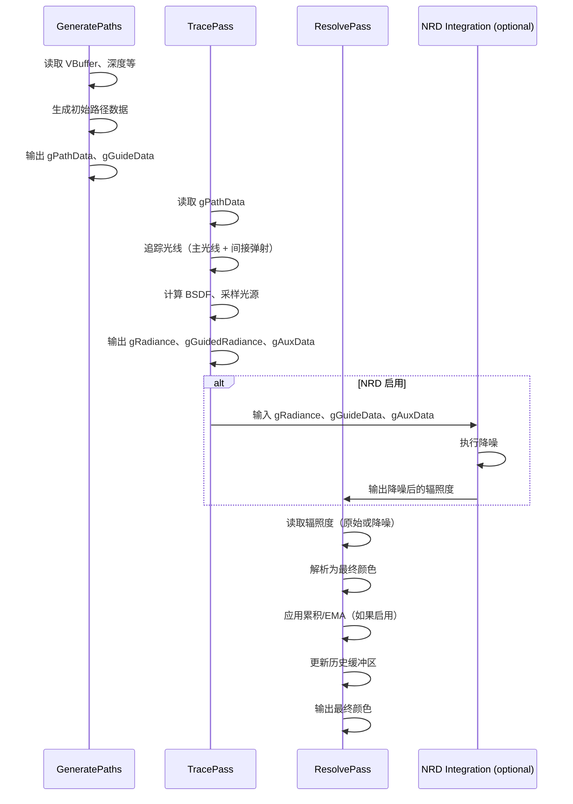

# PathTracer RenderPass Shader 绑定分析

## 1. Pass 基本信息

### 描述
PathTracer 是一个完整的路径追踪实现，支持多种功能：BSDF 采样、NEE（Next Event Estimation）、俄罗斯轮盘、重置策略、体积散射、NRD 降噪集成等。输出多种反射组件（漫反射、镜面反射、Delta 反射/透射、残差辐照度）用于高级渲染管线。

### 主要组件

1. **GeneratePaths** - 生成初始路径数据（位置、方向、材质 ID 等）
2. **TracePass** - 追踪光线并计算 BSDF（Ray Tracing 或 Compute 模式）
3. **ResolvePass** - 将路径数据解析为最终颜色（支持累积和 EMA）
4. **LoadShadingData** - 从 VBuffer 加载材质数据（可选）
5. **NRD Integration** - 与 NRD 降噪器集成（可选）

### 入口点函数

**GeneratePaths**（Compute）：
- **main** - `[numthreads(16, 16, 1)]` Compute Shader：生成路径数据

**TracePass**（Ray Tracing）：
- **rayGen** - `[raygeneration]` Shader：光线生成
- **miss** - `[miss]` Shader：未命中着色器
- **anyHit** - `[anyhit]` Shader：任意命中（alpha test）
- **closestHit** - `[closesthit]` Shader：最近命中

**ResolvePass**（Compute）：
- **main** - `[numthreads(16, 16, 1)]` Compute Shader：解析路径为颜色

## 2. 资源绑定清单（简化）

### 2.1 GeneratePaths 资源绑定

**SRV 输入**：
- `gVBuffer` - 可见性缓冲区（可选）
- `gViewW` - 世界空间视图方向（可选）
- `gMotionVector` - 运动向量（可选，用于 NRD）

**UAV 输出**：
- `gPathData` - 路径数据（位置、方向、材质 ID 等）
- `gGuideData` - 引导数据（法线、粗糙度等，用于 NRD）

**CBV**：
- `PerFrameCB` - 帧维度、帧计数、样本生成器状态等

### 2.2 TracePass 资源绑定

**SRV 输入**：
- `gPathData` - 路径数据（从 GeneratePaths 输入）
- (Scene resources) - 场景几何体、材质、纹理和加速结构

**UAV 输出**：
- `gRadiance` - 辐照度缓冲区（多种反射组件）
- `gGuidedRadiance` - 引导辐照度（用于 NRD）
- `gAuxData` - 辅助数据（用于 NRD）

**CBV**：
- `PerFrameCB` - 路径追踪参数（最大深度、俄罗斯轮盘等）

### 2.3 ResolvePass 资源绑定

**SRV 输入**：
- `gRadiance` - 辐照度缓冲区（从 TracePass 输入）
- `gVBuffer` - 可见性缓冲区（可选）
- (History buffers) - 历史辐照度和引导数据（用于累积）

**UAV 输出**：
- `gOutput` - 最终颜色输出
- (History buffers) - 更新的历史辐照度和引导数据（用于累积）

**CBV**：
- `PerFrameCB` - 解析参数（累积模式、EMA 参数等）

## 3. Constant Buffer 结构映射（简化）

### GeneratePaths CB

```cpp
struct GeneratePathsCB
{
    uint2 frameDim;
    uint frameCount;
    uint prngDimension;
    // ... 其他参数
}
```

### TracePass CB

```cpp
struct TracePassCB
{
    uint2 frameDim;
    uint maxBounces;
    float russianRouletteProb;
    bool useNEE;
    // ... 其他参数
}
```

### ResolvePass CB

```cpp
struct ResolvePassCB
{
    uint2 frameDim;
    uint accumCount;
    bool useAccumulation;
    bool useEMA;
    // ... 其他参数
}
```

## 4. 纹理/缓冲区生命周期（简化）

### 4.1 RenderGraph 管理的资源

所有输入和输出通道均由 RenderGraph 管理，包括：
- 可见性缓冲区、运动向量、视图方向
- 辐照度缓冲区（多种反射组件）
- 历史缓冲区（用于时域累积）
- 最终颜色输出

### 4.2 Pass 内部管理的资源

- 路径数据缓冲区（gPathData）
- 引导数据缓冲区（gGuideData）
- 样本生成器
- Ray Tracing 程序和绑定表
- Compute Pass 程序和变量

## 5. 执行流程（简化）

### 5.1 总体流程



### 5.2 TracePass 路径追踪流程

**For 循环路径追踪**：
1. 生成初始光线（从相机或 VBuffer）
2. 循环直到终止条件：
   - 追踪光线
   - 如果命中：加载材质数据、计算 BSDF、采样 NEE
   - 生成下一条光线
   - 俄罗斯轮盘终止
3. 累积辐照度

### 5.3 NEE（Next Event Estimation）

**采样策略**：
- 使用 PDF 采样光源
- 计算 MIS（Multiple Importance Sampling）权重
- 追踪阴影光线测试可见性

### 5.4 ResolvePass 累积

**标准累积**：
```hlsl
float weight = 1.0f / (gAccumCount + 1.0f);
gAccumulatedRadiance += gRadiance * weight;
```

**EMA（指数移动平均）**：
```hlsl
float alpha = gAlpha;
gAccumulatedRadiance = lerp(gAccumulatedRadiance, gRadiance, alpha);
```

## 6. 特殊机制说明

### 6.1 反射组件

PathTracer 输出多种反射组件的辐照度：

| 组件 | 说明 |
|------|------|
| Emission | 自发光 |
| DiffuseReflectance | 漫反射反射率 |
| DiffuseRadiance | 漫反射辐照度 |
| SpecularReflectance | 镜面反射反射率 |
| SpecularRadiance | 镜面反射辐照度 |
| DeltaReflectionEmission | Delta 反射自发光 |
| DeltaReflectionRadiance | Delta 反射辐照度 |
| DeltaTransmissionEmission | Delta 透射自发光 |
| DeltaTransmissionRadiance | Delta 透射辐照度 |
| ResidualRadiance | 残差辐照度 |

这些组件可由 `ModulateIllumination` Pass 混合。

### 6.2 重置策略

| 策略 | 说明 |
|------|------|
| Never | 从不重置 |
| OnMouseClick | 鼠标点击时重置 |
| OnKeyPress | 按键时重置 |
| OnTriangleChange | 三角形变化时重置 |
| EveryNFrames | 每 N 帧重置 |

### 6.3 体积散射

- 支持 RayMarching 和 DeltaTracking
- 采样参与介质
- 计算体积散射

### 6.4 NRD 集成

**集成点**：
- 使用 `gGuideData` 和 `gAuxData` 降噪
- 支持 Reblur 和 SIGMA 等降噪模式
- 支持历史累积

### 6.5 俄罗斯轮盘

```hlsl
if (pathLength > 1)
{
    if (sampleNext1D(sg) > russianRouletteProb)
        terminate;
    throughput /= russianRouletteProb;
}
```

### 6.6 多重光线生成

**从 VBuffer**：
```hlsl
HitInfo hit = gVBuffer[pixel];
if (hit.isValid())
{
    // 从 VBuffer 加载位置和法线
}
```

**从相机**：
```hlsl
Ray ray = camera.computeRayPinhole(pixel, frameDim);
```

### 6.7 光源类型

支持：
- Analytic Lights（点光源、方向光、聚光灯）
- Emissive Geometry（自发光网格）
- Environment Map（环境光照）

### 6.8 样本生成器

使用 `SampleGenerator` 进行 PRNG 采样，支持：
- 均匀分布
- Sobol 序列
- Halton 序列

### 6.9 历史缓冲区

用于时域累积：
- `gHistoryRadiance` - 历史辐照度
- `gHistoryGuideData` - 历史引导数据

### 6.10 与 MinimalPathTracer 的对比

| 特性 | PathTracer | MinimalPathTracer |
|------|------------|------------------|
| NEE | 支持 | 均匀 1 光 |
| 俄罗斯轮盘 | 支持 | 不支持 |
| 重置策略 | 多种 | 无 |
| 累积 | 支持 | 不支持 |
| 体积散射 | 支持 | 不支持 |
| NRD 集成 | 支持 | 不支持 |
| 反射组件 | 10 种 | 1 种 |

### 6.11 Shader 文件

| 文件 | 说明 |
|------|------|
| `PathTracer.slang` | 主路径追踪逻辑 |
| `TracePass.rt.slang` | 光线追踪 pass |
| `GeneratePaths.cs.slang` | 路径生成 pass |
| `ResolvePass.cs.slang` | 路径解析 pass |
| `LoadShadingData.slang` | 材质数据加载 |
| `PathTracerNRD.slang` | NRD 集成 |
| `Params.slang` | 参数定义 |
| `StaticParams.slang` | 静态参数 |
| `PathState.slang` | 路径状态结构 |
| `ColorType.slang` | 颜色类型定义 |
| `GuideData.slang` | 引导数据结构 |
| `NRDHelpers.slang` | NRD 辅助函数 |

### 6.12 设备特性要求

- Raytracing Tier 1.1（如果使用光线追踪模式）
- Shader Model 6.5 或更高（如果使用 Compute 模式）

### 6.13 性能考虑

- **VBuffer 输入**：避免重复计算 primary hit
- **NRD 降噪**：显著降低噪声，允许更少样本
- **累积**：提高信噪比，但引入模糊
- **EMA**：平衡噪声和细节

## 7. 注意事项

由于 PathTracer 非常复杂（13 个 shader 文件，多种模式），本文档提供了简化的资源绑定和执行流程概述。对于完整的实现细节，建议参考源代码和注释。

关键组件：
1. **GeneratePaths** - 生成初始路径数据
2. **TracePass** - 追踪光线并计算 BSDF
3. **ResolvePass** - 解析路径为最终颜色

输出 10 种反射组件的辐照度，可由后续 pass（如 `ModulateIllumination`）灵活组合。
