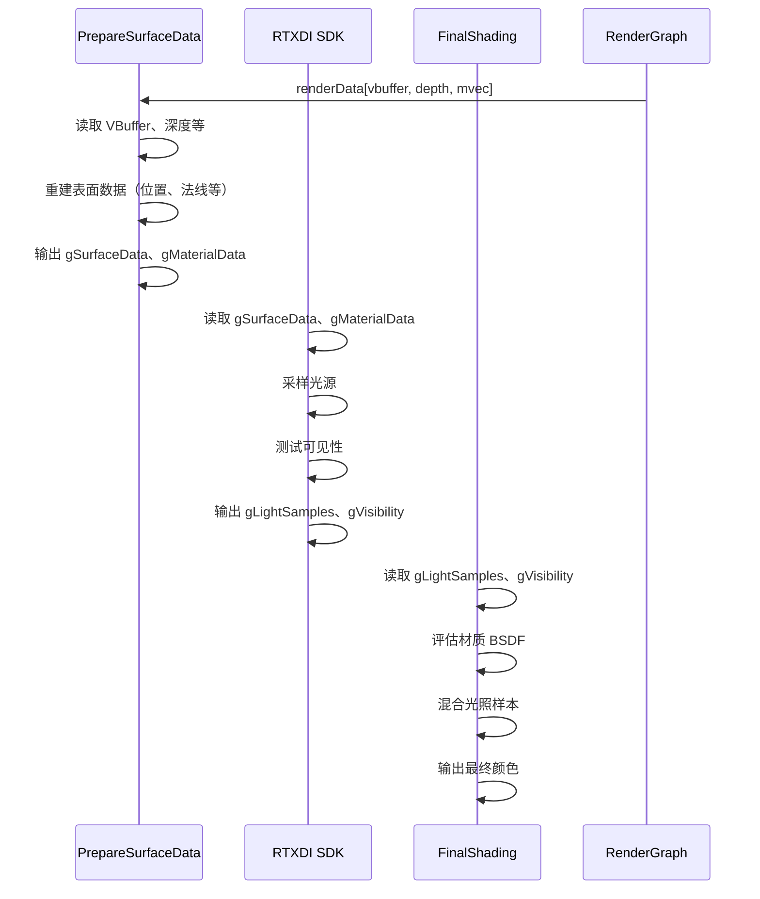

# RTXDIPass RenderPass Shader 绑定分析

## 1. Pass 基本信息

### 描述
RTXDIPass 是 RTXDI（Ray Tracing Dynamic Direct Illumination）SDK 的集成示例 Pass。使用 RTXDI 进行高效的直接光照计算，支持多种光源类型和采样策略。包含两个 Compute Pass：PrepareSurfaceData 和 FinalShading。

### 主要组件
1. **PrepareSurfaceData** - 从 VBuffer 准备表面数据（位置、法线、材质等）
2. **RTXDI SDK** - 执行直接光照计算
3. **FinalShading** - 将 RTXDI 光照样本与材质 BSDF 混合

### 入口点函数

**PrepareSurfaceData Pass**：
- **main** - `[numthreads(16, 16, 1)]` Compute Shader：准备表面数据

**FinalShading Pass**：
- **main** - `[numthreads(16, 16, 1)]` Compute Shader：最终着色

## 2. 资源绑定清单（简化）

### 2.1 PrepareSurfaceData 资源绑定

**SRV 输入**：
- `gVBuffer` - 可见性缓冲区（PackedHitInfo）
- `gDepth` - 深度缓冲区（可选）
- `gMotionVector` - 运动向量（可选）
- (Scene resources) - 场景几何体、材质和纹理

**UAV 输出**：
- `gSurfaceData` - 表面数据（位置、法线、粗糙度等）
- `gMaterialData` - 材质数据（反照率、发射率等）

**CBV**：
- `PerFrameCB` - 帧维度、相机数据等

### 2.2 RTXDI SDK 调用

**输入**：
- 表面数据（从 PrepareSurfaceData 输出）
- 场景光源列表
- 相机数据

**输出**：
- `gLightSamples` - RTXDI 生成的光照样本
- `gVisibility` - 可见性测试结果

### 2.3 FinalShading 资源绑定

**SRV 输入**：
- `gLightSamples` - RTXDI 光照样本
- `gVisibility` - 可见性测试结果
- `gSurfaceData` - 表面数据
- `gMaterialData` - 材质数据
- (Scene resources) - 场景资源

**UAV 输出**：
- `gOutput` - 最终颜色输出

**CBV**：
- `PerFrameCB` - 着色参数

## 3. Constant Buffer 结构映射（简化）

### PrepareSurfaceData CB

```cpp
struct PrepareSurfaceDataCB
{
    uint2 frameDim;
    float4x4 viewMatrix;
    float4x4 projMatrix;
    // ... 其他参数
}
```

### FinalShading CB

```cpp
struct FinalShadingCB
{
    uint2 frameDim;
    float exposure;
    // ... 其他参数
}
```

## 4. 纹理/缓冲区生命周期（简化）

### 4.1 RenderGraph 管理的资源

- 输入：VBuffer、深度、运动向量
- 输出：最终颜色
- RTXDI 中间数据：内部管理

### 4.2 Pass 内部管理的资源

- `mpRTXDI` - RTXDI SDK 实例
- `mpPrepareSurfaceDataPass` - Compute Pass
- `mpFinalShadingPass` - Compute Pass

## 5. 执行流程（简化）

### 5.1 总体流程



### 5.2 RTXDI 光照采样

## 6. 特殊机制说明

### 6.1 Falcor 与 RTXDI SDK 绑定

**PrepareSurfaceData**（`PrepareSurfaceData.cs.slang`）：从 VBuffer 读取几何体，绑定表面数据到 RTXDI 格式。**FinalShading**（`FinalShading.cs.slang`）：绑定 RTXDI 输出与材质数据，应用 BSDF。RTXDI SDK 通过 `mpRTXDI->updateSettings()`, `prepare()`, `dispatch()`, `finalize()` 接收 Falcor 资源，核心逻辑在 SDK 内部。
