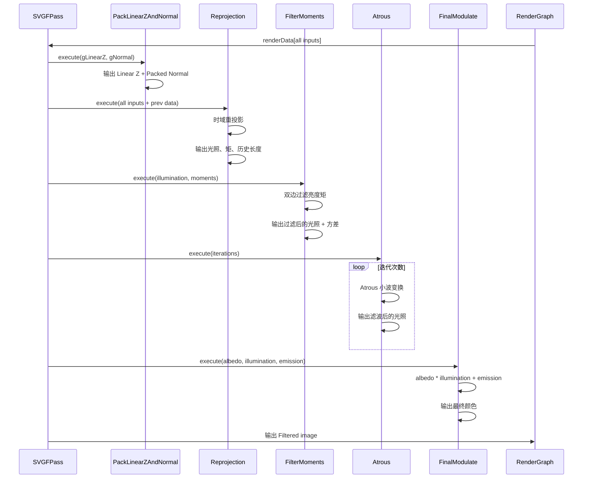

# SVGFPass RenderPass Shader 绑定分析

## 1. Pass 基本信息

### 描述
SVGFPass 是 SVGF（Spatiotemporal Variance-Guided Filtering）降噪 Pass。使用时域累积和空间滤波（Atrous 小波变换）来减少渲染噪声。包含 5 个子 Pass：PackLinearZAndNormal、Reprojection、FilterMoments、Atrous、FinalModulate。

### 主要组件

1. **PackLinearZAndNormal** - 打包线性深度和法线
2. **Reprojection** - 时域重投影
3. **FilterMoments** - 过滤亮度矩
4. **Atrous** - Atrous 小波变换（空间滤波）
5. **FinalModulate** - 最终着色（albedo * filteredIllumination + emission）

### 入口点函数

**所有 Pass 都是 Pixel Shader**：
- **PackLinearZAndNormal.psMain** - 打包深度和法线
- **Reprojection.psMain** - 时域重投影
- **FilterMoments.psMain** - 过滤亮度矩
- **Atrous.psMain** - Atrous 小波变换
- **FinalModulate.psMain** - 最终着色

## 2. 资源绑定清单（简化）

### 2.1 输入（RenderGraph）

| 名称 | 类型 | 说明 |
|------|------|------|
| Albedo | Texture2D | 反照率 |
| Color | Texture2D | 颜色 |
| Emission | Texture2D | 自发光 |
| WorldPosition | Texture2D | 世界空间位置 |
| WorldNormal | Texture2D | 世界空间法线 |
| PositionNormalFwidth | Texture2D | 位置和法线的 fwidth |
| LinearZ | Texture2D | 线性深度 |
| MotionVec | Texture2D | 屏幕空间运动向量 |

### 2.2 内部缓冲区（Pass 内部管理）

| 名称 | 类型 | 格式 | 说明 |
|------|------|------|------|
| Previous Linear Z and Packed Normal | Texture2D | RGBA32Float | 上一帧深度和法线 |
| Previous Filtered Lighting | Texture2D | RGBA32Float | 上一帧过滤后的光照 |
| Previous Moments | Texture2D | RG32Float | 上一帧亮度矩 |

### 2.3 输出（RenderGraph）

| 名称 | 类型 | 格式 | 说明 |
|------|------|------|------|
| Filtered image | Texture2D | RGBA16Float | 降噪后的图像 |

### 2.4 临时 FBO（Pass 内部）

| 名称 | MRT | 格式 | 说明 |
|------|------|------|------|
| mpLinearZAndNormalFbo | 1 | RGBA32Float | 深度和法线 |
| mpCurReprojFbo | 3 | RGBA32Float, RG32Float, R16Float | 光照、矩、历史长度 |
| mpPrevReprojFbo | 3 | RGBA32Float, RG32Float, R16Float | 上一帧光照、矩、历史长度 |
| mpFilteredIlluminationFbo | 1 | RGBA32Float | 过滤后的光照 |
| mpPingPongFbo[2] | 1 | RGBA32Float | Atrous 乒乓缓冲 |
| mpFinalFbo | 1 | RGBA32Float | 最终输出 |

## 3. Constant Buffer 结构映射（简化）

### PerImageCB（所有 Pass 共享）

```cpp
cbuffer PerImageCB
{
    // PackLinearZAndNormal
    Texture2D gLinearZ;
    Texture2D gNormal;

    // Reprojection
    Texture2D gMotion;
    Texture2D gColor;
    Texture2D gEmission;
    Texture2D gAlbedo;
    Texture2D gPositionNormalFwidth;
    Texture2D gPrevIllum;
    Texture2D gPrevMoments;
    Texture2D gLinearZAndNormal;
    Texture2D gPrevLinearZAndNormal;
    Texture2D gPrevHistoryLength;
    float gAlpha;
    float gMomentsAlpha;

    // FilterMoments
    Texture2D gIllumination;
    Texture2D gMoments;
    Texture2D gHistoryLength;
    float gPhiColor;
    float gPhiNormal;

    // Atrous
    int gStepSize;

    // FinalModulate
    // (无需额外参数)
}
```

## 4. 执行流程（简化）

### 4.1 总体流程



### 4.2 PackLinearZAndNormal

**操作**：
1. 读取线性深度和世界空间法线
2. 计算深度导数
3. 打包法线到 RG 通道
4. 输出：Linear Z + Packed Normal (RGBA)

### 4.3 Reprojection

**操作**：
1. 使用运动向量重投影上一帧光照
2. Demodulate：`illumination = color / albedo`
3. 混合历史和当前：`result = lerp(prev, current, alpha)`
4. 计算初始亮度矩
5. 更新历史长度

### 4.4 FilterMoments

**操作**：
1. 读取光照和亮度矩
2. 双边过滤（基于深度和法线）
3. 计算方差：`variance = moment2 - moment1^2`
4. 输出：过滤后的光照 + 方差

### 4.5 Atrous

**操作**：
1. 多次迭代（默认 4 次）
2. 每次迭代：Atrous 小波变换
3. 步长随迭代增加：`stepSize = 1 << i`
4. 双边滤波（基于深度和法线）
5. 可选：反馈到历史帧

### 4.6 FinalModulate

**操作**：
1. Modulate：`result = albedo * filteredIllumination`
2. 添加自发光：`result += emission`
3. 输出最终颜色

## 5. 特殊机制说明

### 5.1 SVGF 参数

| 参数 | 默认值 | 说明 |
|------|---------|------|
| mFilterEnabled | true | 是否启用 SVGF |
| mFilterIterations | 4 | Atrous 迭代次数 |
| mFeedbackTap | 1 | 反馈到历史帧的迭代索引 |
| mVarainceEpsilon | 1e-4 | 方差 epsilon（避免除零） |
| mPhiColor | 10.0 | 颜色双边滤波阈值 |
| mPhiNormal | 128.0 | 法线双边滤波阈值 |
| mAlpha | 0.05 | 时域混合因子 |
| mMomentsAlpha | 0.2 | 矩混合因子 |

### 5.2 双边滤波

**权重计算**：
```hlsl
float weightColor = exp(-dist^2 / (2 * phiColor^2));
float weightNormal = exp(-dist^2 / (2 * phiNormal^2));
float weightZ = exp(-dist^2 / (2 * phiZ^2));
float totalWeight = weightColor * weightNormal * weightZ;
```

### 5.3 Atrous 小波变换

**目的**：
- 多尺度空间滤波
- 保持边缘（通过双边滤波）
- 减少噪声

### 5.4 时域累积

**公式**：
```hlsl
illumination = lerp(prevIllumination, currentIllumination, alpha);
moments = lerp(prevMoments, currentMoments, momentsAlpha);
historyLength = min(prevHistoryLength + 1, maxHistoryLength);
```

### 5.5 亮度矩

**定义**：
- `moment1`：亮度平均值
- `moment2`：亮度平方的平均值
- `variance`：`moment2 - moment1^2`

### 5.6 Ping-Pong 缓冲

**用途**：
- Atrous 小波变换的乒乓缓冲
- 避免读写冲突

### 5.7 历史缓冲区交换

```cpp
std::swap(mpCurReprojFbo, mpPrevReprojFbo);
```

每帧后交换当前和历史缓冲区。

### 5.8 资源清理

**时机**：
- `compile()` 时设置 `mBuffersNeedClear = true`
- `execute()` 首次时清理所有缓冲区

### 5.9 性能考虑

- **多次迭代**：Atrous 迭代次数（默认 4）
- **双边滤波**：每个像素采样邻居
- **时域累积**：读取上一帧数据

### 5.10 参考论文

**Spatiotemporal Variance-Guided Filtering: Real-Time Reconstruction for Path-Traced Global Illumination**（Schied et al., HPG 2017）
- 提出 SVGF 降噪算法
- 使用时域累积和 Atrous 小波变换

## 6. 注意事项

SVGFPass 是一个完整的时域降噪 Pass，包含多个子 Pass。关键点：
1. **时域累积** - 使用历史帧减少噪声
2. **双边滤波** - 基于深度和法线保护边缘
3. **Atrous 小波变换** - 多尺度空间滤波
4. **亮度矩** - 估计方差用于自适应滤波
5. **Ping-Pong 缓冲** - 避免读写冲突
