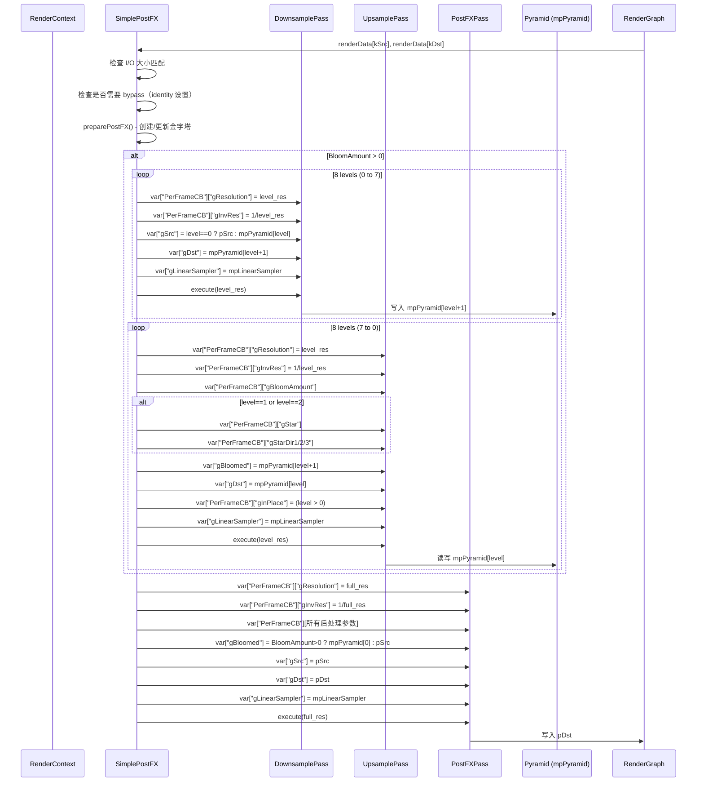

# SimplePostFX RenderPass Shader 绑定分析

## 1. Pass 基本信息

### 描述
SimplePostFX 是一个后处理效果 RenderPass，实现了以下效果：
- 镜头特效：Bloom（泛光）、Star（星芒）、Vignette（暗角）、Chromatic Aberration（色差）、Barrel Distortion（桶形畸变）
- 饱和度调整：针对阴影、中间调和高光分别调整
- 颜色校正：基于 ASC-CDL 的 Offset/Scale/Power（偏移/缩放/幂）
- Wipe（擦拭效果）：用于前后对比

### 入口点函数
- **downsample** - `[numthreads(16, 16, 1)]` Compute Shader：构建图像金字塔的降采样阶段
- **upsample** - `[numthreads(16, 16, 1)]` Compute Shader：图像金字塔的升采样阶段，混合各级泛光
- **runPostFX** - `[numthreads(16, 16, 1)]` Compute Shader：应用后处理效果到最终输出

## 2. 资源绑定清单

### 2.1 Constant Buffer 绑定

| C++ 绑定代码 | Shader 声明 | 资源类型 | 绑定方式 | 备注 |
|-------------|-------------|---------|---------|------|
| `var["PerFrameCB"]["gResolution"] = res` | `uint2 gResolution;` | CBV | 手动 | 纹理分辨率（宽高） |
| `var["PerFrameCB"]["gInvRes"] = invres` | `float2 gInvRes;` | CBV | 手动 | 分辨率倒数 (1/宽, 1/高) |
| `var["PerFrameCB"]["gBloomAmount"]` | `float gBloomAmount;` | CBV | 手动 | 泛光强度 |
| `var["PerFrameCB"]["gVignetteAmount"]` | `float gVignetteAmount;` | CBV | 手动 | 暗角强度 |
| `var["PerFrameCB"]["gChromaticAberrationAmount"]` | `float gChromaticAberrationAmount;` | CBV | 手动 | 色差强度（C++ 端乘以 1/64） |
| `var["PerFrameCB"]["gBarrelDistort"]` | `float2 gBarrelDistort;` | CBV | 手动 | 桶形畸变参数（缩放因子, 畸变强度） |
| `var["PerFrameCB"]["gSaturationCurve"]` | `float3 gSaturationCurve;` | CBV | 手动 | 二次饱和度曲线系数 (A, B, C) |
| `var["PerFrameCB"]["gColorOffset"]` | `float3 gColorOffset;` | CBV | 手动 | 颜色偏移量 |
| `var["PerFrameCB"]["gColorScale"]` | `float3 gColorScale;` | CBV | 手动 | 颜色缩放（曝光） |
| `var["PerFrameCB"]["gColorPower"]` | `float3 gColorPower;` | CBV | 手动 | 颜色幂次（伽马） |
| `var["PerFrameCB"]["gStar"]` | `float gStar;` | CBV | 手动 | 星芒强度（仅 levels 1-2 使用） |
| `var["PerFrameCB"]["gStarDir1/2/3"]` | `float2 gStarDir1/2/3;` | CBV | 手动 | 六角星芒的三个方向向量 |
| `var["PerFrameCB"]["gWipe"]` | `float gWipe;` | CBV | 手动 | 擦拭阈值（C++ 端乘以分辨率宽度） |
| `var["PerFrameCB"]["gInPlace"]` | `bool gInPlace;` | CBV | 手动 | 是否原地更新金字塔（level > 0 时为 true） |

### 2.2 Shader Resource View (SRV) 绑定

| C++ 绑定代码 | Shader 声明 | 资源类型 | 绑定方式 | 备注 |
|-------------|-------------|---------|---------|------|
| `var["gSrc"] = level ? mpPyramid[level] : pSrc` | `Texture2D<float4> gSrc;` | SRV | 手动 | 下采样输入纹理 |
| `var["gSrc"] = pSrc` | `Texture2D<float4> gSrc;` | SRV | 手动 | 上采样输入纹理（金字塔外） |
| `var["gBloomed"] = mpPyramid[level + 1]` | `Texture2D<float4> gBloomed;` | SRV | 手动 | 上采样时读取的上一级泛光结果 |
| `var["gBloomed"] = ... ? mpPyramid[0] : pSrc` | `Texture2D<float4> gBloomed;` | SRV | 手动 | PostFX 输入的泛光纹理 |
| `var["gSrc"] = pSrc` (PostFX) | `Texture2D<float4> gSrc;` | SRV | 手动 | PostFX 原始输入纹理（用于 wipe） |

### 2.3 Unordered Access View (UAV) 绑定

| C++ 绑定代码 | Shader 声明 | 资源类型 | 绑定方式 | 备注 |
|-------------|-------------|---------|---------|------|
| `var["gDst"] = mpPyramid[level + 1]` | `RWTexture2D<float4> gDst;` | UAV | 手动 | 下采样输出金字塔层级 |
| `var["gDst"] = mpPyramid[level]` | `RWTexture2D<float4> gDst;` | UAV | 手动 | 上采样输出金字塔层级 |
| `var["gDst"] = pDst` | `RWTexture2D<float4> gDst;` | UAV | 手动 | PostFX 最终输出纹理 |

### 2.4 Sampler 绑定

| C++ 绑定代码 | Shader 声明 | 资源类型 | 绑定方式 | 备注 |
|-------------|-------------|---------|---------|------|
| `var["gLinearSampler"] = mpLinearSampler` | `SamplerState gLinearSampler;` | Sampler | 手动 | 线性采样器（Filter: Linear-Linear-Point, Border addressing） |

## 3. Constant Buffer 结构映射

### PerFrameCB 结构

```cpp
// C++ 端：通过 var["PerFrameCB"][key] 逐个设置
// Shader 端定义：
cbuffer PerFrameCB
{
    uint2   gResolution;              // offset: 0,  size: 8 bytes
    float2  gInvRes;                  // offset: 8,  size: 8 bytes
    float   gBloomAmount;             // offset: 16, size: 4 bytes
    float   gVignetteAmount;          // offset: 20, size: 4 bytes
    float   gChromaticAberrationAmount; // offset: 24, size: 4 bytes
    float2  gBarrelDistort;           // offset: 28, size: 8 bytes
    float3  gSaturationCurve;         // offset: 36, size: 12 bytes (aligned)
    float3  gColorOffset;             // offset: 48, size: 12 bytes (aligned)
    float3  gColorScale;              // offset: 60, size: 12 bytes (aligned)
    float3  gColorPower;              // offset: 72, size: 12 bytes (aligned)
    float   gStar;                    // offset: 84, size: 4 bytes
    float2  gStarDir1;                // offset: 88, size: 8 bytes
    float2  gStarDir2;                // offset: 96, size: 8 bytes
    float2  gStarDir3;                // offset: 104, size: 8 bytes
    float   gWipe;                    // offset: 112, size: 4 bytes
    bool    gInPlace;                 // offset: 116, size: 4 bytes (padded)
}
// 总大小: 120 bytes（可能填充到 16 的倍数）
```

### 对齐分析

| 成员 | 偏移 | C++ 类型 | HLSL 类型 | 对齐 |
|------|------|----------|-----------|------|
| gResolution | 0 | uint2 | uint2 | 8 bytes (自然对齐) |
| gInvRes | 8 | float2 | float2 | 8 bytes |
| gBloomAmount | 16 | float | float | 4 bytes |
| gVignetteAmount | 20 | float | float | 4 bytes |
| gChromaticAberrationAmount | 24 | float | float | 4 bytes |
| gBarrelDistort | 28 | float2 | float2 | 4字节边界（需要检查） |
| gSaturationCurve | 36 | float3 | float3 | 16字节对齐 |
| gColorOffset | 48 | float3 | float3 | 16字节对齐 |
| gColorScale | 60 | float3 | float3 | 16字节对齐 |
| gColorPower | 72 | float3 | float3 | 16字节对齐 |
| gStar | 84 | float | float | 4字节对齐 |
| gStarDir1 | 88 | float2 | float2 | 8字节对齐 |
| gStarDir2 | 96 | float2 | float2 | 8字节对齐 |
| gStarDir3 | 104 | float2 | float2 | 8字节对齐 |
| gWipe | 112 | float | float | 4字节对齐 |
| gInPlace | 116 | bool | bool | 4字节对齐 |

**潜在对齐陷阱**：
- HLSL 中 `float3` 会被自动对齐到 16 字节边界，导致 `gBarrelDistort` 从偏移 28 开始，这与 `gSaturationCurve` 的 16 字节对齐（偏移 36）之间有 8 字节填充。
- Falcor 的 `ShaderVar` 机制会自动处理这些对齐问题，但如果直接操作 raw buffer 需要注意手动填充。

## 4. 纹理/缓冲区生命周期

### 4.1 RenderGraph 管理的资源

| 资源 | 用途 | 生命周期 |
|------|------|---------|
| `kSrc` ("src") | 输入源纹理 | 由 RenderGraph 在 execute() 前提供 |
| `kDst` ("dst") | 输出纹理 | 由 RenderGraph 创建（reflect() 时声明） |

### 4.2 Pass 内部管理的资源

| 资源 | 类型 | 创建时机 | 销毁时机 | 说明 |
|------|------|---------|---------|------|
| `mpPyramid[0..8]` | ref<Texture> | execute() -> preparePostFX() | 随 `SimplePostFX` 析构 | 9层图像金字塔（全分辨率到 1/256 分辨率） |
| `mpLinearSampler` | ref<Sampler> | 构造函数 | 随 `SimplePostFX` 析构 | 线性采样器，Border addressing |
| `mpDownsamplePass` | ref<ComputePass> | 构造函数 | 随 `SimplePostFX` 析构 | downsample compute pass |
| `mpUpsamplePass` | ref<ComputePass> | 构造函数 | 随 `SimplePostFX` 析构 | upsample compute pass |
| `mpPostFXPass` | ref<ComputePass> | 构造函数 | 随 `SimplePostFX` 析构 | runPostFX compute pass |

### 4.3 资源创建逻辑

```cpp
// preparePostFX() 中：
// - 如果 mBloomAmount <= 0，所有 mpPyramid 设为 nullptr
// - 否则，检查每层分辨率是否变化，变化则重新创建 Texture2D
// - 格式：ResourceFormat::RGBA16Float
// - BindFlags：ShaderResource | UnorderedAccess
```

## 5. 执行流程

### 5.1 execute() 函数资源绑定时序



### 5.2 循环内 vs 一次性绑定

**一次性绑定（per execute call）**：
- `gLinearSampler` - 在每个 pass 首次使用时绑定一次
- `PerFrameCB` 中常量部分：在每次 pass 调用时设置

**循环内变化的绑定**：
- `PerFrameCB["gResolution"]` / `gInvRes` - 每个金字塔层级不同
- `PerFrameCB["gStar"]` / `gStarDir1/2/3` - 仅在特定层级（1-2）设置
- `PerFrameCB["gInPlace"]` - level=0 时为 false，其他为 true
- `gSrc` / `gBloomed` / `gDst` - 每个层级指向不同的金字塔纹理

### 5.3 内存屏障/同步点

- **显式同步点**：每个 `ComputePass::execute()` 调用内部隐含 UAV 屏障
- **金字塔层级间依赖**：
  - 下采样：严格顺序执行（level 0 → 1 → ... → 7）
  - 上采样：严格顺序执行（level 7 → 6 → ... → 0）
- **数据流**：
  ```
  pSrc → mpPyramid[1] → mpPyramid[2] → ... → mpPyramid[8]
       ↓ (upsample with blend)
  mpPyramid[7] → mpPyramid[6] → ... → mpPyramid[0]
                                             ↓
  mpPyramid[0] + pSrc → pDst (PostFX)
  ```

### 5.4 绑定频率总结

| 资源类型 | 绑定频率 | 示例 |
|---------|---------|------|
| Sampler | 每次 pass 执行开始 | `var["gLinearSampler"]` |
| CBV（常量参数） | 每次 pass 执行开始 | `gBloomAmount`, `gVignetteAmount` |
| CBV（循环参数） | 每个迭代 | `gResolution`, `gInvRes`, `gInPlace` |
| SRV/UAV（金字塔） | 每个迭代 | `gSrc`, `gDst`, `gBloomed` |

## 6. 特殊机制说明

### 6.1 金字塔管理策略
- **动态调整**：`preparePostFX()` 根据分辨率和 BloomAmount 动态创建/销毁金字塔
- **内存优化**：BloomAmount <= 0 时所有金字塔纹理设为 nullptr，避免占用内存
- **格式选择**：RGBA16Float。星芒相关 CB（gStar, gStarDir1/2/3）仅在 level 1-2 设置。

### 6.2 参数转换
多个参数在 C++ 到 Shader 传递时有额外转换：
- `gChromaticAberrationAmount`：乘以 `1/64`
- `gSaturationCurve`：从 3 个控制点拟合二次曲线系数 (A, B, C)
- `gBarrelDistort`：从单一畸变强度计算缩放因子和畸变参数
- `gWipe`：C++ 端乘以 `resolution.x` 后传入 CB
