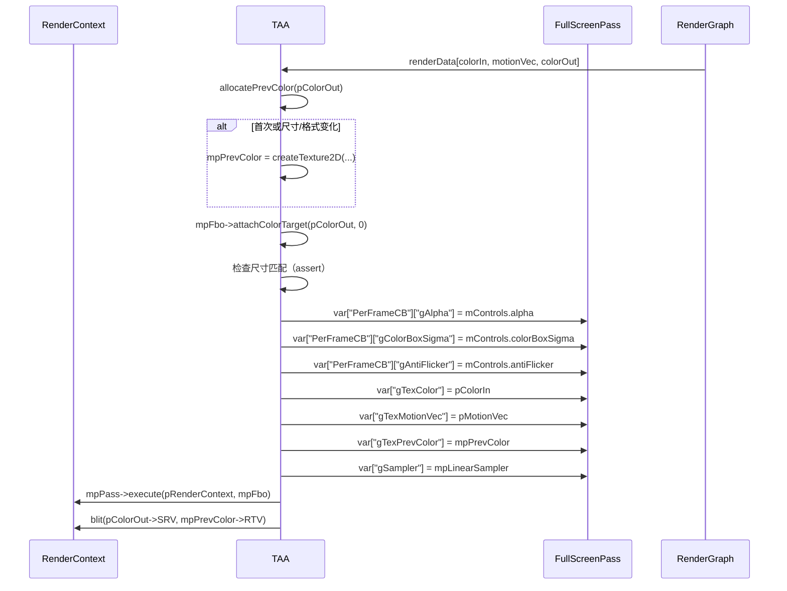

# TAA RenderPass Shader 绑定分析

## 1. Pass 基本信息

### 描述
TAA（Temporal Anti-Aliasing）是一个时域抗锯齿 Pass。使用历史帧信息进行抗锯齿，包含颜色边界盒（Color Box）和抗闪烁（Anti-Flicker）优化。使用运动向量进行重投影，并使用双三次样条（Bicubic Catmull-Rom）进行纹理采样。

### 入口点函数
- **main** - Pixel Shader：全屏像素着色器，执行 TAA

## 2. 资源绑定清单

### 2.1 Constant Buffer 绑定

| C++ 绑定代码 | Shader 声明 | 资源类型 | 绑定方式 | 备注 |
|-------------|-------------|---------|---------|------|
| `var["PerFrameCB"]["gAlpha"]` | `float gAlpha;` | CBV | 手动 | 混合因子（历史帧权重） |
| `var["PerFrameCB"]["gColorBoxSigma"]` | `float gColorBoxSigma;` | CBV | 手动 | 颜色边界盒 sigma（调整 clamping 范围） |
| `var["PerFrameCB"]["gAntiFlicker"]` | `bool gAntiFlicker;` | CBV | 手动 | 是否启用抗闪烁 |

### 2.2 Shader Resource View (SRV) 绑定

| C++ 绑定代码 | Shader 声明 | 资源类型 | 绑定方式 | 备注 |
|-------------|-------------|---------|---------|------|
| `var["gTexColor"]` | `Texture2D gTexColor;` | SRV | 手动 | 当前帧颜色（输入） |
| `var["gTexMotionVec"]` | `Texture2D gTexMotionVec;` | SRV | 手动 | 屏幕空间运动向量（输入） |
| `var["gTexPrevColor"]` | `Texture2D gTexPrevColor;` | SRV | 手动 | 上一帧颜色（内部历史缓冲区） |
| `var["gSampler"]` | `SamplerState gSampler;` | Sampler | 手动 | 线性采样器 |

### 2.3 Render Target (RTV) 绑定

| C++ 绑定代码 | Shader 声明 | 资源类型 | 绑定方式 | 备注 |
|-------------|-------------|---------|---------|------|
| `mpFbo->attachColorTarget(pColorOut, 0)` | `SV_TARGET0` | RTV | 手动 | TAA 输出颜色（同时复制到历史缓冲区） |

## 3. Constant Buffer 结构映射

### PerFrameCB 结构

```cpp
// C++ 端：通过 var["PerFrameCB"][key] 逐个设置
// Shader 端定义：
cbuffer PerFrameCB
{
    float gAlpha;         // offset: 0, size: 4 bytes
    float gColorBoxSigma; // offset: 4, size: 4 bytes
    bool gAntiFlicker;    // offset: 8, size: 1 byte (可能填充到 4)
}
// 总大小: 12 bytes（可能填充到 16 字节）
```

### 对齐分析

| 成员 | 偏移 | C++ 类型 | HLSL 类型 | 对齐 |
|------|------|----------|-----------|------|
| gAlpha | 0 | float | float | 4 bytes |
| gColorBoxSigma | 4 | float | float | 4 bytes |
| gAntiFlicker | 8 | bool | bool | 1 byte（可能填充到 4） |

## 4. 纹理/缓冲区生命周期

### 4.1 RenderGraph 管理的资源

| 资源 | 用途 | 生命周期 |
|------|------|---------|
| `colorIn` | 当前帧颜色（输入） | 由 RenderGraph 提供 |
| `motionVec` | 屏幕空间运动向量（输入） | 由 RenderGraph 提供 |
| `colorOut` | TAA 输出颜色（输出） | 由 RenderGraph 创建 |

### 4.2 Pass 内部管理的资源

| 资源 | 类型 | 创建时机 | 销毁时机 | 说明 |
|------|------|---------|---------|------|
| `mpPrevColor` | ref<Texture> | execute()（首次或尺寸变化时） | 随 `TAA` 析构 | 上一帧颜色（历史缓冲区） |
| `mpPass` | ref<FullScreenPass> | 构造函数 | 随 `TAA` 析构 | 全屏 Pass |
| `mpFbo` | ref<Fbo> | 构造函数 | 随 `TAA` 析构 | 帧缓冲对象 |
| `mpLinearSampler` | ref<Sampler> | 构造函数 | 随 `TAA` 析构 | 线性采样器 |

## 5. 执行流程

### 5.1 execute() 函数资源绑定时序



### 5.2 TAA 算法流程

**主要步骤**：

1. **颜色边界盒计算**：
   - 读取当前像素和 8 个邻居的颜色
   - 转换到 YCgCo 色彩空间
   - 计算平均颜色和方差
   - 计算颜色最小值和最大值（`colorMin = avg - sigma * sqrt(var)`）

2. **运动向量选择**：
   - 读取当前像素和 8 个邻居的运动向量
   - 选择最长的一个（`dot(m, m)` 最大）

3. **历史重投影**：
   - 使用选中的运动向量重投影历史像素
   - 使用双三次样条（Bicubic Catmull-Rom）进行采样

4. **颜色 Clamping**：
   - 将历史颜色 clamping 到颜色边界盒 `[colorMin, colorMax]`

5. **抗闪烁**：
   - 计算历史颜色到 clamping 边界的距离
   - 调整混合因子 `alpha`（接近边界时减小）

6. **混合输出**：
   - `result = lerp(history, current, alpha)`
   - 转换回 RGB 色彩空间

### 5.3 双三次样条采样（Bicubic Catmull-Rom）

**算法**：
```hlsl
float3 bicubicSampleCatmullRom(Texture2D tex, SamplerState samp, float2 samplePos, float2 texDim)
{
    float2 invTextureSize = 1.0 / texDim;
    float2 tc = floor(samplePos - 0.5f) + 0.5f;
    float2 f = samplePos - tc;
    float2 f2 = f * f;
    float2 f3 = f2 * f;

    float2 w0 = f2 - 0.5f * (f3 + f);
    float2 w1 = 1.5f * f3 - 2.5f * f2 + 1.f;
    float2 w3 = 0.5f * (f3 - f2);
    float2 w2 = 1 - w0 - w1 - w3;

    // ... 采样 4x4 位置并加权混合
}
```

采样 4x4 邻居（16 个纹理采样），使用 Catmull-Rom 权重函数。

### 5.4 颜色空间转换

**RGB → YCgCo**：
```hlsl
float3 RGBToYCgCo(float3 c)
{
    float3 YCgCo;
    YCgCo.y = (c.r + c.b) * 0.5f - c.g;
    YCgCo.x = c.g + YCgCo.y * 0.5f;
    YCgCo.z = c.r - c.b;
    return YCgCo;
}
```

**YCgCo → RGB**：
```hlsl
float3 YCgCoToRGB(float3 c)
{
    float3 RGB;
    RGB.g = c.x - c.y * 0.5f;
    RGB.r = c.z + RGB.g;
    RGB.b = RGB.g - c.z;
    return RGB;
}
```

YCgCo 色彩空间更适合颜色边界盒计算（亮度分量独立）。

### 5.5 历史缓冲区更新

**方式**：
```cpp
pRenderContext->blit(pColorOut->getSRV(), mpPrevColor->getRTV());
```

执行后，将当前帧 TAA 输出 blit 到历史缓冲区，供下一帧使用。

## 6. 特殊机制说明

### 6.1 颜色边界盒（Color Box）

**目的**：
- 限制历史颜色范围
- 减少重影（ghosting）

**算法**：
1. 计算当前像素和邻居的颜色平均值和方差
2. 计算标准差 `sigma = sqrt(var - avg^2)`
3. 设置边界 `min = avg - colorBoxSigma * sigma`
4. 设置边界 `max = avg + colorBoxSigma * sigma`

**参数**：
- `colorBoxSigma`：调整边界范围（默认 1.0）
  - 较小值：更紧的 clamping，减少重影但可能闪烁
  - 较大值：更松的 clamping，减少闪烁但可能重影

### 6.2 抗闪烁（Anti-Flicker）

**目的**：
- 减少历史颜色 clamping 时的闪烁
- 基于 Brian Karis 的 Siggraph 2014 演讲

**算法**：
```hlsl
if (gAntiFlicker)
{
    float distToClamp = min(abs(colorMin.x - history.x), abs(colorMax.x - history.x));
    alpha = clamp((gAlpha * distToClamp) / (distToClamp + colorMax.x - colorMin.x), 0.f, 1.f);
}
```

- 计算历史颜色到最近 clamping 边界的距离
- 距离越近，`alpha` 越小（使用更多历史）
- 距离越远，`alpha` 越大（使用更多当前帧）

### 6.3 运动向量选择

**算法**：
```hlsl
float2 motion = gTexMotionVec.Load(int3(ipos, 0)).xy;
[unroll]
for (int a = 0; a < 8; a++)
{
    float2 m = gTexMotionVec.Load(int3(ipos + offset[a], 0)).rg;
    motion = dot(m, m) > dot(motion, motion) ? m : motion;
}
```

选择最长运动向量（邻居中最大），用于处理亚像素运动。

### 6.4 混合因子（Alpha）

**默认值**：0.1

**用途**：
- 控制历史帧和当前帧的混合比例
- `result = lerp(history, current, alpha)`
  - 较小 alpha：更多历史（更平滑但可能有重影）
  - 较大 alpha：更多当前帧（更锐利但可能有噪声）

### 6.5 双三次样条采样

**优点**：
- 更平滑的历史重投影
- 减少锯齿和混叠

**代价**：
- 16 次纹理采样（4x4）

### 6.6 历史缓冲区管理

**分配条件**：
```cpp
bool allocate = mpPrevColor == nullptr;
allocate = allocate || (mpPrevColor->getWidth() != pColorOut->getWidth());
allocate = allocate || (mpPrevColor->getHeight() != pColorOut->getHeight());
allocate = allocate || (mpPrevColor->getFormat() != pColorOut->getFormat());
```

尺寸或格式变化时重新分配。

### 6.7 运动向量要求

**格式**：屏幕空间（像素单位）

**方向**：当前 → 上一帧

**用途**：
- 重投影历史像素
- `prevTexPos = currentTexPos + motionVector`

### 6.8 多重采样抗锯齿（MSAA）

TAA 要求所有输入纹理样本数为 1（`sampleCount == 1`）。

```cpp
FALCOR_ASSERT(pColorIn->getSampleCount() == 1);
```

### 6.9 性能考虑

- **纹理采样**：每像素 9（颜色边界盒） + 9（运动向量） + 16（双三次样条）= 34 次
- **分支**：抗闪烁条件分支（可能影响性能）
- **历史缓冲区**：blit 操作（内存带宽）

### 6.10 参考论文

1. **Temporal Reprojection Anti-Aliasing**（Brian Karis, Siggraph 2014）
   - 颜色边界盒和抗闪烁算法
2. **From the Lab Bench: Real-Time Temporal AA**（McMenemy, 2016）
   - YCgCo 色彩空间用于颜色边界盒

### 6.11 UI 控制项

| 参数 | 范围 | 默认值 | 说明 |
|------|-------|---------|------|
| Alpha | [0, 1] | 0.1 | 混合因子 |
| Color-Box Sigma | [0, 15] | 1.0 | 颜色边界盒 sigma |
| Anti Flicker | bool | true | 是否启用抗闪烁 |

### 6.12 设备特性要求

- Pixel Shader 支持
- Texture2D Load 和 SampleLevel 操作
- 无特殊设备要求

### 6.13 输出格式

跟随 `colorOut` 格式（通常为 `RGBA8UnormSrgb` 或 `RGBA16Float`）。

## 7. 注意事项

TAA 是标准的时域抗锯齿实现，适用于实时渲染。关键点：
1. **历史缓冲区** - Pass 内部管理，自动更新
2. **运动向量** - 必需，屏幕空间格式
3. **颜色边界盒** - 减少重影
4. **抗闪烁** - 减少闪烁
5. **双三次样条** - 更平滑的重投影
