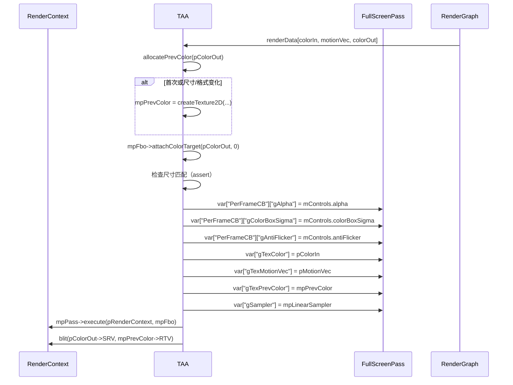

# TAA RenderPass Shader 绑定分析

## 1. Pass 基本信息

### 描述
TAA 是时域抗锯齿 Pass，使用历史帧和运动向量重投影进行抗锯齿。

### 入口点函数
- **main** - Pixel Shader：全屏像素着色器，执行 TAA

## 2. 资源绑定清单

### 2.1 Constant Buffer 绑定

| C++ 绑定代码 | Shader 声明 | 资源类型 | 绑定方式 | 备注 |
|-------------|-------------|---------|---------|------|
| `var["PerFrameCB"]["gAlpha"]` | `float gAlpha;` | CBV | 手动 | 混合因子（历史帧权重） |
| `var["PerFrameCB"]["gColorBoxSigma"]` | `float gColorBoxSigma;` | CBV | 手动 | 颜色边界盒 sigma（调整 clamping 范围） |
| `var["PerFrameCB"]["gAntiFlicker"]` | `bool gAntiFlicker;` | CBV | 手动 | 是否启用抗闪烁 |

### 2.2 Shader Resource View (SRV) 绑定

| C++ 绑定代码 | Shader 声明 | 资源类型 | 绑定方式 | 备注 |
|-------------|-------------|---------|---------|------|
| `var["gTexColor"]` | `Texture2D gTexColor;` | SRV | 手动 | 当前帧颜色（输入） |
| `var["gTexMotionVec"]` | `Texture2D gTexMotionVec;` | SRV | 手动 | 屏幕空间运动向量（输入） |
| `var["gTexPrevColor"]` | `Texture2D gTexPrevColor;` | SRV | 手动 | 上一帧颜色（内部历史缓冲区） |
| `var["gSampler"]` | `SamplerState gSampler;` | Sampler | 手动 | 线性采样器 |

### 2.3 Render Target (RTV) 绑定

| C++ 绑定代码 | Shader 声明 | 资源类型 | 绑定方式 | 备注 |
|-------------|-------------|---------|---------|------|
| `mpFbo->attachColorTarget(pColorOut, 0)` | `SV_TARGET0` | RTV | 手动 | TAA 输出颜色（同时复制到历史缓冲区） |

## 3. Constant Buffer 结构映射

### PerFrameCB 结构

```cpp
// C++ 端：通过 var["PerFrameCB"][key] 逐个设置
// Shader 端定义：
cbuffer PerFrameCB
{
    float gAlpha;         // offset: 0, size: 4 bytes
    float gColorBoxSigma; // offset: 4, size: 4 bytes
    bool gAntiFlicker;    // offset: 8, size: 1 byte (可能填充到 4)
}
// 总大小: 12 bytes（可能填充到 16 字节）
```

### 对齐分析

| 成员 | 偏移 | C++ 类型 | HLSL 类型 | 对齐 |
|------|------|----------|-----------|------|
| gAlpha | 0 | float | float | 4 bytes |
| gColorBoxSigma | 4 | float | float | 4 bytes |
| gAntiFlicker | 8 | bool | bool | 1 byte（可能填充到 4） |

## 4. 纹理/缓冲区生命周期

### 4.1 RenderGraph 管理的资源

| 资源 | 用途 | 生命周期 |
|------|------|---------|
| `colorIn` | 当前帧颜色（输入） | 由 RenderGraph 提供 |
| `motionVec` | 屏幕空间运动向量（输入） | 由 RenderGraph 提供 |
| `colorOut` | TAA 输出颜色（输出） | 由 RenderGraph 创建 |

### 4.2 Pass 内部管理的资源

| 资源 | 类型 | 创建时机 | 销毁时机 | 说明 |
|------|------|---------|---------|------|
| `mpPrevColor` | ref<Texture> | execute()（首次或尺寸变化时） | 随 `TAA` 析构 | 上一帧颜色（历史缓冲区） |
| `mpPass` | ref<FullScreenPass> | 构造函数 | 随 `TAA` 析构 | 全屏 Pass |
| `mpFbo` | ref<Fbo> | 构造函数 | 随 `TAA` 析构 | 帧缓冲对象 |
| `mpLinearSampler` | ref<Sampler> | 构造函数 | 随 `TAA` 析构 | 线性采样器 |

## 5. 执行流程

### 5.1 execute() 函数资源绑定时序



### 5.2 历史缓冲区更新

**方式**：
```cpp
pRenderContext->blit(pColorOut->getSRV(), mpPrevColor->getRTV());
```

执行后，将当前帧 TAA 输出 blit 到历史缓冲区，供下一帧使用。

## 6. 特殊机制说明

### 6.1 历史缓冲区管理

**分配条件**：
```cpp
bool allocate = mpPrevColor == nullptr;
allocate = allocate || (mpPrevColor->getWidth() != pColorOut->getWidth());
allocate = allocate || (mpPrevColor->getHeight() != pColorOut->getHeight());
allocate = allocate || (mpPrevColor->getFormat() != pColorOut->getFormat());
```

尺寸或格式变化时重新分配。执行后通过 `blit(pColorOut->SRV, mpPrevColor->RTV)` 更新历史供下一帧使用。
