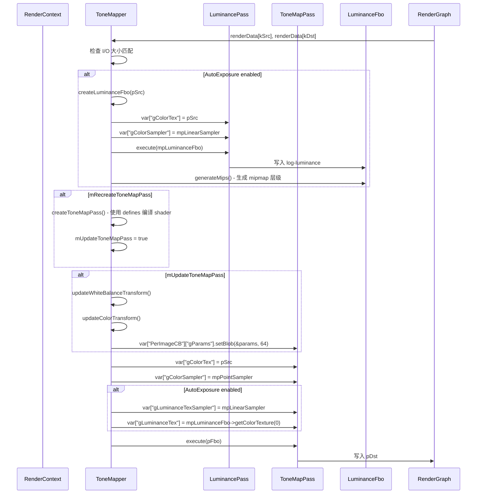

# ToneMapper RenderPass Shader 绑定分析

## 1. Pass 基本信息

### 描述
ToneMapper 是一个色调映射 RenderPass，将 HDR 颜色值映射到 LDR 范围 [0, 1]。支持多种色调映射算子（Linear、Reinhard、ACES 等）和自动曝光功能。同时支持白平衡和颜色校正（基于 ISO、光圈和快门速度）。

### 入口点函数
- **LuminancePass** - `[ps]` Pixel Shader (Luminance.ps.slang)：计算对数亮度并输出到纹理，用于自动曝光
- **ToneMapPass** - `[ps]` Pixel Shader (ToneMapping.ps.slang)：应用颜色变换和色调映射算子

## 2. 资源绑定清单

### 2.1 LuminancePass 资源绑定

| C++ 绑定代码 | Shader 声明 | 资源类型 | 绑定方式 | 备注 |
|-------------|-------------|---------|---------|------|
| `var["gColorTex"] = pSrc` | `Texture2D gColorTex;` | SRV | 手动 | 输入源纹理（HDR 颜色） |
| `var["gColorSampler"] = mpLinearSampler` | `SamplerState gColorSampler;` | Sampler | 手动 | 线性采样器（Filter: Linear-Linear-Point） |

### 2.2 ToneMapPass 资源绑定

| C++ 绑定代码 | Shader 声明 | 资源类型 | 绑定方式 | 备注 |
|-------------|-------------|---------|---------|------|
| `var["gColorTex"] = pSrc` | `Texture2D gColorTex;` | SRV | 手动 | 输入源纹理（HDR 颜色） |
| `var["gColorSampler"] = mpPointSampler` | `SamplerState gColorSampler;` | Sampler | 手动 | 点采样器（Filter: Point-Point-Point） |
| `var["PerImageCB"]["gParams"].setBlob(&params, sizeof(params))` | `ToneMapperParams gParams;` | CBV | 手动（blob） | 色调映射参数结构体 |
| `var["gLuminanceTexSampler"] = mpLinearSampler` | `SamplerState gLuminanceTexSampler;` | Sampler | 手动 | 线性采样器（仅在启用自动曝光时） |
| `var["gLuminanceTex"] = mpLuminanceFbo->getColorTexture(0)` | `Texture2D gLuminanceTex;` | SRV | 手动 | 亮度纹理（仅在启用自动曝光时） |

## 3. Constant Buffer 结构映射

### PerImageCB 结构

```cpp
// C++ 端：通过 var["PerImageCB"]["gParams"].setBlob() 整体设置
// Shader 端定义：
cbuffer PerImageCB
{
    ToneMapperParams gParams;  // offset: 0, size: 64 bytes
}

// ToneMapperParams 结构：
struct ToneMapperParams
{
    float   whiteScale;         // offset: 0,  size: 4 bytes  (HableUc2 算子参数)
    float   whiteMaxLuminance;  // offset: 4,  size: 4 bytes  (ReinhardModified 算子参数)
    float   _pad0;              // offset: 8,  size: 4 bytes  (填充)
    float   _pad1;              // offset: 12, size: 4 bytes  (填充)
    float3x4 colorTransform;    // offset: 16, size: 48 bytes (白平衡 + 曝光变换矩阵)
}
// 总大小: 64 bytes
```

### 对齐分析

| 成员 | 偏移 | C++ 类型 | HLSL 类型 | 对齐 |
|------|------|----------|-----------|------|
| whiteScale | 0 | float | float | 4 bytes |
| whiteMaxLuminance | 4 | float | float | 4 bytes |
| _pad0 | 8 | float | float | 4 bytes |
| _pad1 | 12 | float | float | 4 bytes |
| colorTransform | 16 | float3x4 | float3x4 | 16字节对齐（HLSL 中 float3x4 自动对齐到 16 字节） |

**填充原因**：
- `whiteScale` 和 `whiteMaxLuminance` 各占 4 字节
- `float3x4` 在 HLSL 中需要 16 字节对齐
- 从偏移 8 到 16 需要 8 字节填充，通过 `_pad0` 和 `_pad1` 实现

### colorTransform 计算逻辑

```cpp
// C++ 端计算：
mColorTransform = mWhiteBalanceTransform * exposureScale * manualExposureScale;

// 其中：
// - mWhiteBalanceTransform: 从 whitePoint (K) 计算的白平衡变换矩阵（3x3）
// - exposureScale = pow(2.f, mExposureCompensation)
// - manualExposureScale (非自动曝光时) = (1/100 * mFilmSpeed) / (mShutter * mFNumber * mFNumber)
```

## 4. 纹理/缓冲区生命周期

### 4.1 RenderGraph 管理的资源

| 资源 | 用途 | 生命周期 |
|------|------|---------|
| `kSrc` ("src") | 输入源纹理（HDR） | 由 RenderGraph 在 execute() 前提供 |
| `kDst` ("dst") | 输出纹理（LDR） | 由 RenderGraph 创建（reflect() 时声明） |

### 4.2 Pass 内部管理的资源

| 资源 | 类型 | 创建时机 | 销毁时机 | 说明 |
|------|------|---------|---------|------|
| `mpToneMapPass` | ref<FullScreenPass> | 构造函数或 createToneMapPass() | 随 `ToneMapper` 析构 | 主色调映射 pass |
| `mpLuminancePass` | ref<FullScreenPass> | 构造函数 | 随 `ToneMapper` 析构 | 亮度计算 pass |
| `mpLuminanceFbo` | ref<Fbo> | execute() -> createLuminanceFbo() | 随 `ToneMapper` 析构 | 亮度纹理 FBO（带 mipmap） |
| `mpPointSampler` | ref<Sampler> | 构造函数 | 随 `ToneMapper` 析构 | 点采样器（Point-Point-Point） |
| `mpLinearSampler` | ref<Sampler> | 构造函数 | 随 `ToneMapper` 析构 | 线性采样器（Linear-Linear-Point） |

### 4.3 资源创建逻辑

**Luminance FBO**:
- 格式：根据输入源格式选择（R32Float 或 R16Float）
- 尺寸：输入分辨率的向下 2 的幂次（bit_floor）
- Mipmap：1 级（execute() 后调用 generateMips）

**ToneMapPass**:
- 在以下情况重建：
  - Operator 改变（`mRecreateToneMapPass = true`）
  - AutoExposure 切换（`mRecreateToneMapPass = true`）
  - Clamp 切换（`mRecreateToneMapPass = true`）
- 使用 shader defines 动态编译：
  - `_TONE_MAPPER_OPERATOR`: 0-5（对应 6 种算子）
  - `_TONE_MAPPER_AUTO_EXPOSURE`: 启用自动曝光
  - `_TONE_MAPPER_CLAMP`: 启用输出钳制到 [0,1]

## 5. 执行流程

### 5.1 execute() 函数资源绑定时序



### 5.2 Shader Defines 影响

| Define | 影响 | Shader 代码分支 |
|--------|------|----------------|
| `_TONE_MAPPER_OPERATOR` | 选择色调映射算子 | `switch(kOperator)` |
| `_TONE_MAPPER_AUTO_EXPOSURE` | 启用自动曝光逻辑 | `#ifdef _TONE_MAPPER_AUTO_EXPOSURE` |
| `_TONE_MAPPER_CLAMP` | 输出钳制到 [0,1] | `#ifdef _TONE_MAPPER_CLAMP` |

### 5.3 内存屏障/同步点

- **显式同步点**：
  - `mpLuminancePass->execute()` 完成后调用 `generateMips()`
  - `mpToneMapPass->execute()` 独立于 LuminancePass（除数据依赖）
- **数据流**：
  ```
  pSrc (HDR) → LuminancePass → mpLuminanceFbo (log-luminance + mipmap)
                                     ↓ (sample mip level 16)
  pSrc (HDR) → ToneMapPass → pDst (LDR)
                ↑
        (colorTransform: white balance + exposure)
  ```

### 5.4 自动曝光工作流程

1. **LuminancePass** 输出对数亮度：`log2(max(0.0001, luminance(color)))`
2. **生成 mipmap**：最高层（level 16）代表平均亮度
3. **ToneMapPass** 读取平均亮度：
   ```hlsl
   float avgLuminance = exp2(gLuminanceTex.SampleLevel(gLuminanceTexSampler, texC, kLuminanceLod).r);
   finalColor *= (kExposureKey / avgLuminance);  // kExposureKey = 0.042
   ```

### 5.5 绑定频率总结

| 资源类型 | 绑定频率 | 示例 |
|---------|---------|------|
| Sampler | 每次 execute | `gColorSampler`, `gLuminanceTexSampler` |
| CBV | 参数更新时（mUpdateToneMapPass） | `gParams` (64 bytes blob) |
| SRV (gColorTex) | 每次 execute | 输入源纹理 |
| SRV (gLuminanceTex) | 每次 execute（仅在启用自动曝光时） | 亮度纹理 |

## 6. 特殊机制说明

### 6.1 Shader Recompile 机制

ToneMapPass 在以下情况会触发 shader 重新编译：
- Operator 切换：`_TONE_MAPPER_OPERATOR` define 改变
- AutoExposure 切换：`_TONE_MAPPER_AUTO_EXPOSURE` define 添加/移除
- Clamp 切换：`_TONE_MAPPER_CLAMP` define 添加/移除

**优化**：
- 使用 defines 而非分支，避免在 shader 中运行时判断
- 不频繁改变的操作（Operator、AutoExposure、Clamp）才触发 recompile

### 6.2 动态参数更新

不触发 recompile 的参数（仅更新 CB）：
- `mExposureCompensation`：曝光补偿
- `mFilmSpeed`、`mFNumber`、`mShutter`：手动曝光参数
- `mWhitePoint`：白平衡色温
- `mWhiteScale`、`mWhiteMaxLuminance`：算子特定参数

这些参数改变时，`mUpdateToneMapPass = true`，在 execute() 中更新 `PerImageCB`。

### 6.3 颜色变换矩阵

**ColorTransform 组成**：
```cpp
mColorTransform = mWhiteBalanceTransform * exposureScale * manualExposureScale;
```

**应用顺序**（shader 端）：
```hlsl
finalColor = mul((float3x3)gParams.colorTransform, finalColor);
```

**注意事项**：
- `ToneMapperParams` 中 `colorTransform` 类型为 `float3x4`，但 shader 中转换为 `float3x3` 使用
- 这种转换是合法的，因为只使用前 3 列的 3 个分量

### 6.4 输出格式支持

通过 `reflect()` 函数支持自定义输出格式：
```cpp
if (mOutputFormat != ResourceFormat::Unknown)
    output.format(mOutputFormat);
```

常见格式：
- `ResourceFormat::RGBA16Float`（HDR）
- `ResourceFormat::RGBA8Unorm`（LDR）
- `ResourceFormat::RGBA8UnormSrgb`（sRGB LDR）

### 6.5 对数亮度纹理

**格式选择**：
```cpp
ResourceFormat luminanceFormat = (bytesPerChannel == 4) ?
    ResourceFormat::R32Float : ResourceFormat::R16Float;
```

- 输入为 32-bit float 通道：使用 R32Float
- 输入为 16-bit float 通道：使用 R16Float

**尺寸计算**：
```cpp
uint32_t requiredHeight = fstd::bit_floor(pSrc->getHeight());
uint32_t requiredWidth = fstd::bit_floor(pSrc->getWidth());
```

向下取 2 的幂次，确保能生成足够的 mipmap 层级。

### 6.6 采样器选择

| Pass | 采样器 | Filter | Address | 用途 |
|------|--------|--------|---------|------|
| LuminancePass | mpLinearSampler | Linear-Linear-Point | (默认) | 对源纹理进行亮度采样 |
| ToneMapPass | mpPointSampler | Point-Point-Point | (默认) | 对源纹理进行精确像素采样 |
| ToneMapPass (AutoExposure) | mpLinearSampler | Linear-Linear-Point | (默认) | 对亮度纹理的 mipmap 进行采样 |

**设计原因**：
- 主色调映射使用点采样避免模糊
- 亮度纹理采样使用线性采样，因为读取的是最高层 mipmap（平均亮度）

### 6.7 暴露补偿范围

```cpp
const float kExposureCompensationMin = -12.f;
const float kExposureCompensationMax = 12.f;
```

对应 +/- 12 档曝光（F-stops），覆盖典型摄影需求。

### 6.8 场景元数据支持

加载场景时，如果 `mUseSceneMetadata = true`，会从场景元数据读取：
- Film ISO
- f-Number
- Shutter Speed

这些值用于初始化手动曝光参数。

## 7. 色调映射算子

### 7.1 算子列表

| 算子 | 特点 | 参数 |
|------|------|------|
| Linear | 无色调映射 | 无 |
| Reinhard | 经典 Reinhard | 无 |
| ReinhardModified | Reinhard with white max | `whiteMaxLuminance` |
| HejiHableAlu | Jim Heji's filmic approximation | 无 |
| HableUc2 | Uncharted 2 filmic | `whiteScale` |
| Aces | ACES filmic | 无 |

### 7.2 算子参数

**ReinhardModified**:
- `mWhiteMaxLuminance`: 白色最大亮度（默认 1.0）
- 范围：0.1 ~ FLT_MAX

**HableUc2**:
- `mWhiteScale`: 线性白色缩放（默认 11.2）
- 范围：0.001 ~ 100

其他算子无需额外参数。
