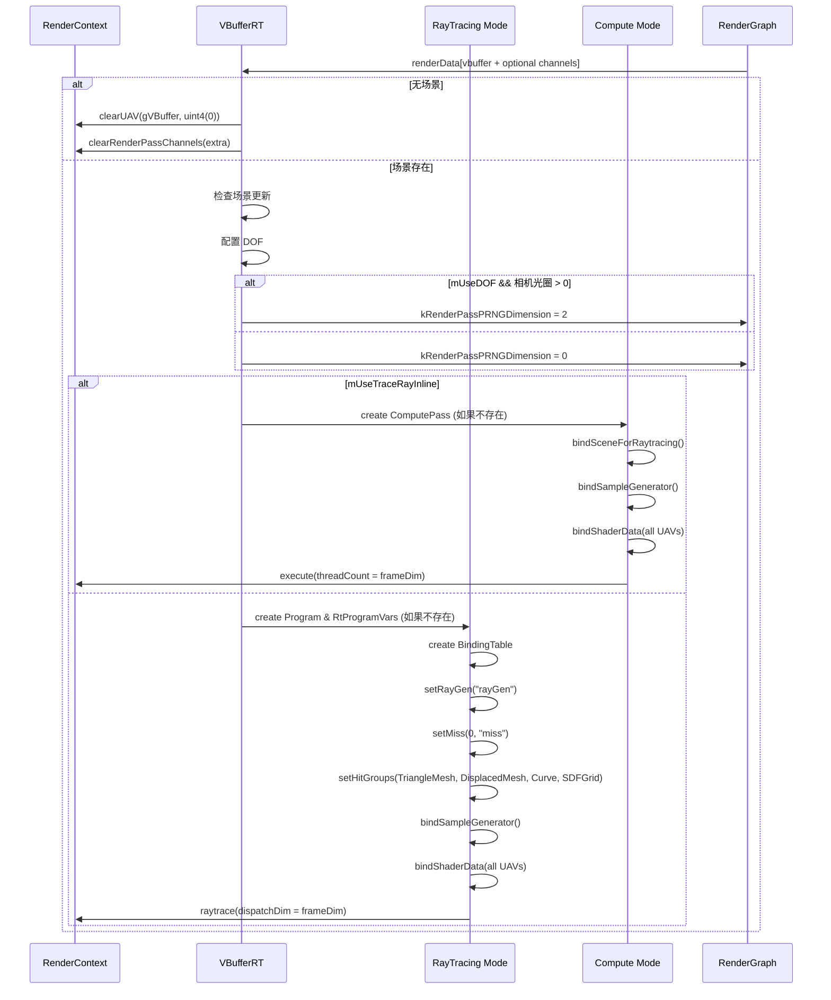

# VBufferRT RenderPass Shader 绑定分析

## 1. Pass 基本信息

### 描述
VBufferRT 是一个光线追踪可见性缓冲区（V-Buffer）生成 Pass。支持两种执行模式：传统光线追踪（DXR）和计算着色器（使用 TraceRayInline）。输出可见性缓冲区和多个可选通道（深度、运动向量、视图方向、时间、掩码）。

### 入口点函数

**Ray Tracing 模式**：
- **rayGen** - `[raygeneration]` Shader：光线生成着色器
- **miss** - `[miss]` Shader：未命中着色器
- **anyHit** - `[anyhit]` Shader：任意命中着色器（alpha test）
- **closestHit** - `[closesthit]` Shader：最近命中着色器（三角形）
- **displacedTriangleMeshClosestHit** - `[closesthit]` Shader：置换网格最近命中
- **displacedTriangleMeshIntersection** - `[intersection]` Shader：置换网格相交
- **curveClosestHit** - `[closesthit]` Shader：曲线最近命中
- **curveIntersection** - `[intersection]` Shader：曲线相交
- **sdfGridClosestHit** - `[closesthit]` Shader：SDF 网格最近命中
- **sdfGridIntersection** - `[intersection]` Shader：SDF 网格相交

**Compute 模式**：
- **main** - `[main]` Compute Shader：[numthreads(16, 16, 1)] 计算着色器，使用 TraceRayInline

## 2. 资源绑定清单

### 2.1 Constant Buffer 绑定

| C++ 绑定代码 | Shader 声明 | 资源类型 | 绑定方式 | 备注 |
|-------------|-------------|---------|---------|------|
| `var["gVBufferRT"]["frameDim"]` | `uint2 frameDim;` | CBV | 手动 | 帧分辨率（宽高） |
| `var["gVBufferRT"]["frameCount"]` | `uint frameCount;` | CBV | 手动 | 帧计数（用于采样） |

### 2.2 Shader Resource View (SRV) 绑定

| C++ 绑定代码 | Shader 声明 | 资源类型 | 绑定方式 | 备注 |
|-------------|-------------|---------|---------|------|
| (Scene auto) | (Scene resources) | CBV/SRV/Accel | 自动 | 场景几何体、材质和加速结构 |

### 2.3 Unordered Access View (UAV) 绑定

| C++ 绑定代码 | Shader 声明 | 资源类型 | 绑定方式 | 备注 |
|-------------|-------------|---------|---------|------|
| `var["gVBuffer"]` | `RWTexture2D<PackedHitInfo> gVBuffer;` | UAV | 手动 | 可见性缓冲区（输出） |
| `var["gDepth"]` (可选) | `RWTexture2D<float> gDepth;` | UAV | 手动 | 深度缓冲区 NDC（可选） |
| `var["gMotionVector"]` (可选) | `RWTexture2D<float2> gMotionVector;` | UAV | 手动 | 屏幕空间运动向量（可选） |
| `var["gViewW"]` (可选) | `RWTexture2D<float4> gViewW;` | UAV | 手动 | 世界空间视图方向（可选） |
| `var["gTime"]` (可选) | `RWTexture2D<uint> gTime;` | UAV | 手动 | 每像素执行时间（可选） |
| `var["gMask"]` (可选) | `RWTexture2D<float> gMask;` | UAV | 手动 | 掩码（可选） |

## 3. Constant Buffer 结构映射

### gVBufferRT 结构

```cpp
// C++ 端：通过 var["gVBufferRT"][key] 逐个设置
// Shader 端定义：
struct VBufferRT
{
    uint2 frameDim;     // offset: 0, size: 8 bytes
    uint frameCount;     // offset: 8, size: 4 bytes
}
// 总大小: 12 bytes（可能填充到 16 字节）
```

### 对齐分析

| 成员         | 偏移  | C++ 类型 | HLSL 类型 | 对齐      |
| ---------- | --- | ------ | ------- | ------- |
| frameDim   | 0   | uint2  | uint2   | 8 bytes |
| frameCount | 8   | uint   | uint    | 4 bytes |

## 4. 纹理/缓冲区生命周期

### 4.1 RenderGraph 管理的资源

所有 6 个输出通道（vbuffer + 5 个可选通道）均由 RenderGraph 管理。

### 4.2 Pass 内部管理的资源

| 资源 | 类型 | 创建时机 | 销毁时机 | 说明 |
|------|------|---------|---------|------|
| `mRaytrace.pProgram` | ref<Program> | executeRaytrace() | 随 `VBufferRT` 析构 | 光线追踪程序 |
| `mRaytrace.pVars` | ref<RtProgramVars> | executeRaytrace() | 随 `VBufferRT` 析构 | 光线追踪程序变量 |
| `mRaytrace.pBindingTable` | ref<RtBindingTable> | executeRaytrace() | 随 `VBufferRT` 析构 | 绑定表 |
| `mpComputePass` | ref<ComputePass> | executeCompute() | 随 `VBufferRT` 析构 | 计算着色器 pass |
| `mpSampleGenerator` | ref<SampleGenerator> | 构造函数 | 随 `VBufferRT` 析构 | 采样生成器 |

## 5. 执行流程

### 5.1 execute() 函数资源绑定时序



### 5.2 Ray Tracing 执行流程

**RayGen Shader**：
1. 生成光线（pinhole 或 thinlens with DOF）
2. 追踪光线
3. 如果命中：写入 hit info
4. 如果未命中：清零所有通道

**Hit Groups**：
- **TriangleMesh**: `anyHit` (alpha test) → `closestHit` (写入 hit data)
- **DisplacedTriangleMesh**: `intersection` (相交测试) → `closestHit` (写入 hit data)
- **Curve**: `intersection` (相交测试) → `closestHit` (写入 hit data)
- **SDFGrid**: `intersection` (相交测试) → `closestHit` (写入 hit data)

**Miss Shader**：
- 清零 VBuffer
- 清零所有可选通道（或设置默认值）

### 5.3 Compute 模式执行流程

**Main Shader**（每像素一个线程）：
1. 检查边界
2. 生成光线（pinhole 或 thinlens with DOF）
3. 使用 `SceneRayQuery.traceRay()` 追踪光线
4. 如果命中：写入 hit info
5. 如果未命中：清零所有通道
6. 写入时间（如果启用）

### 5.4 Shader Defines

```cpp
defines.add("COMPUTE_DEPTH_OF_FIELD", mComputeDOF ? "1" : "0");
defines.add("USE_ALPHA_TEST", mUseAlphaTest ? "1" : "0");
defines.add("RAY_FLAGS", std::to_string((uint32_t)rayFlags));
defines.add(getValidResourceDefines(kVBufferExtraChannels, renderData));
```

### 5.5 绑定频率总结

| 资源类型 | 绑定频率 | 示例 |
|---------|---------|------|
| CBV | 每次 execute | frameDim, frameCount |
| UAV (所有通道) | 每次 execute | gVBuffer, gDepth, gMotionVector, etc. |
| Shader Defines | 程序重建/每帧 | COMPUTE_DEPTH_OF_FIELD, RAY_FLAGS, is_valid_* |

## 6. 特殊机制说明

### 6.1 双执行模式

**Ray Tracing 模式**：
- 使用完整的 DXR pipeline
- 支持多种几何体类型
- 适合硬件加速

**Compute 模式**：
- 使用 TraceRayInline
- 更灵活
- 可能性能较低

### 6.2 深度场（Depth-of-Field）

```cpp
mComputeDOF = mUseDOF && mpScene->getCamera()->getApertureRadius() > 0.f;
```

**光线生成**：
```hlsl
SampleGenerator sg = SampleGenerator(pixel, frameCount);
return gScene.camera.computeRayThinlens(pixel, frameDim, sampleNext2D(sg));
```

**PRNG 维度**：
- 当启用 DOF 时，使用 2 个 PRNG 维度

### 6.3 可选通道机制

所有 5 个额外通道都是可选的，使用 `is_valid_<name>` defines。

### 6.4 可见性缓冲区存储

**TriangleHit**：
```hlsl
TriangleHit triangleHit;
triangleHit.instanceID = getGeometryInstanceID();
triangleHit.primitiveIndex = PrimitiveIndex();
triangleHit.barycentrics = attribs.barycentrics;
gVBuffer[ipos] = triangleHit.pack();
```

### 6.5 Alpha Test

**Ray Tracing 模式（anyHit）**：
```hlsl
GeometryInstanceID instanceID = getGeometryInstanceID();
VertexData v = getVertexData(instanceID, PrimitiveIndex(), attribs);
const uint materialID = gScene.getMaterialID(instanceID);
if (gScene.materials.alphaTest(v, materialID, 0.f))
    IgnoreHit();
```

### 6.6 光线剔除模式

```cpp
RayFlags rayFlags = RayFlags::None;
if (mForceCullMode && mCullMode == RasterizerState::CullMode::Front)
    rayFlags = RayFlags::CullFrontFacingTriangles;
else if (mForceCullMode && mCullMode == RasterizerState::CullMode::Back)
    rayFlags = RayFlags::CullBackFacingTriangles;
```

### 6.7 光线追踪配置

```cpp
const uint32_t kMaxPayloadSizeBytes = 4;  // 4 bytes dummy
const uint32_t kMaxRecursionDepth = 1;    // rayGen -> hit
```

仅需主光线追踪，无递归。

### 6.8 输出通道

| Channel | 格式 | 可选 | 描述 |
|---------|------|------|------|
| vbuffer | HitInfo | 否 | 可见性缓冲区 |
| depth | R32Float | 是 | 深度缓冲区 NDC |
| mvec | RG32Float | 是 | 屏幕空间运动向量 |
| viewW | RGBA32Float | 是 | 世界空间视图方向 |
| time | R32Uint | 是 | 每像素执行时间 |
| mask | R32Float | 是 | 掩码 |

### 6.9 设备特性要求

```cpp
if (!mpDevice->isShaderModelSupported(ShaderModel::SM6_5))
    FALCOR_THROW("VBufferRT requires Shader Model 6.5 support.");
if (!mpDevice->isFeatureSupported(Device::SupportedFeatures::RaytracingTier1_1))
    FALCOR_THROW("VBufferRT requires Raytracing Tier 1.1 support.");
```

### 6.10 与 VBufferRaster 的对比

参见 VBufferRaster.md 的对比表。

### 6.11 与 GBufferRT 的对比

| 特性 | GBufferRT | VBufferRT |
|------|----------|------------|
| 主要输出 | 22 UAVs | 6 UAVs |
| 包含通道 | posW, normW, tangentW, etc. | vbuffer + 5 个可选通道 |
| 纹理 LOD | Mip0/RayCones/RayDiffs | 不支持 |
| 材质数据 | 包含 | 不包含 |
| 用途 | 完整渲染数据 | 几何体可见性 |
