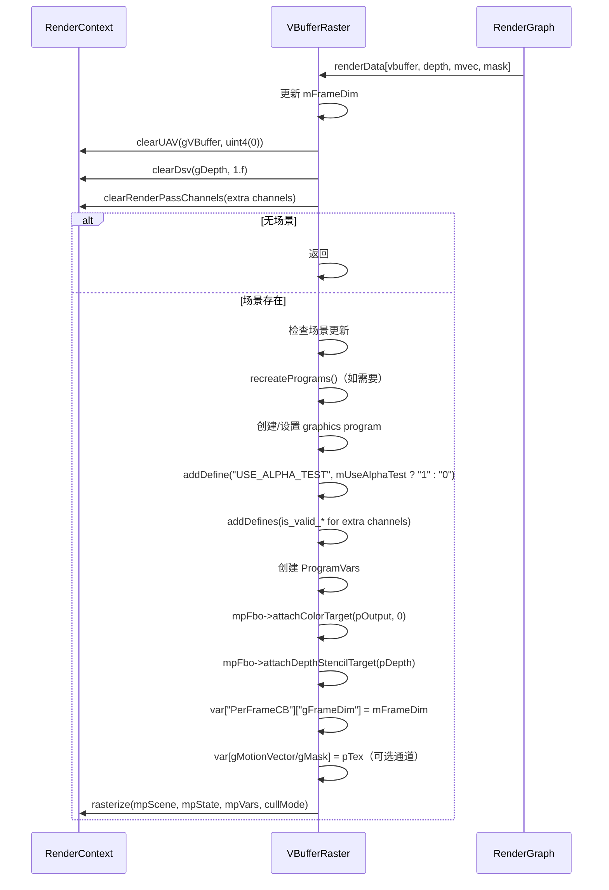

# VBufferRaster RenderPass Shader 绑定分析

## 1. Pass 基本信息

### 描述
VBufferRaster 是一个光栅化可见性缓冲区（V-Buffer）生成 Pass。与 GBufferRaster 类似，但只输出可见性缓冲区（存储几何体信息和重心坐标），不输出完整的 G-Buffer 通道（位置、法线、材质数据等）。

### 入口点函数
- **vsMain** - Vertex Shader：顶点着色器
- **psMain** - Pixel Shader：像素着色器（使用 Pixel Shader Barycentrics）

## 2. 资源绑定清单

### 2.1 Constant Buffer 绑定

| C++ 绑定代码 | Shader 声明 | 资源类型 | 绑定方式 | 备注 |
|-------------|-------------|---------|---------|------|
| `var["PerFrameCB"]["gFrameDim"]` | `uint2 gFrameDim;` | CBV | 手动 | 帧分辨率（宽高） |

### 2.2 Render Target (RTV) 绑定

| C++ 绑定代码 | Shader 声明 | 资源类型 | 绑定方式 | 备注 |
|-------------|-------------|---------|---------|------|
| `mpFbo->attachColorTarget(pOutput, 0)` | `SV_TARGET0` | RTV | 手动 | VBuffer 输出（PackedHitInfo） |

### 2.3 Depth Stencil View (DSV) 绑定

| C++ 绑定代码 | Shader 声明 | 资源类型 | 绑定方式 | 备注 |
|-------------|-------------|---------|---------|------|
| `mpFbo->attachDepthStencilTarget(pDepth)` | `SV_Depth` | DSV | 手动 | 深度缓冲区（D32Float） |

### 2.4 Unordered Access View (UAV) 绑定

| C++ 绑定代码 | Shader 声明 | 资源类型 | 绑定方式 | 备注 |
|-------------|-------------|---------|---------|------|
| `var["gMotionVector"]` (可选) | `RWTexture2D<float2> gMotionVector;` | UAV | 手动 | 屏幕空间运动向量（可选） |
| `var["gMask"]` (可选) | `RWTexture2D<float> gMask;` | UAV | 手动 | 掩码（可选） |

## 3. Constant Buffer 结构映射

### PerFrameCB 结构

```cpp
// C++ 端：通过 var["PerFrameCB"][key] 逐个设置
// Shader 端定义：
cbuffer PerFrameCB
{
    uint2 gFrameDim;  // offset: 0, size: 8 bytes
}
// 总大小: 8 bytes（可能填充到 16 字节）
```

### 对齐分析

| 成员 | 偏移 | C++ 类型 | HLSL 类型 | 对齐 |
|------|------|----------|-----------|------|
| gFrameDim | 0 | uint2 | uint2 | 8 bytes |

## 4. 纹理/缓冲区生命周期

### 4.1 RenderGraph 管理的资源

| 资源 | 用途 | 生命周期 |
|------|------|---------|
| `vbuffer` | 可见性缓冲区（输出） | 由 RenderGraph 创建 |
| `depth` | 深度缓冲区（输出） | 由 RenderGraph 创建 |
| `mvec` | 运动向量（输出，可选） | 由 RenderGraph 创建 |
| `mask` | 掩码（输出，可选） | 由 RenderGraph 创建 |

### 4.2 Pass 内部管理的资源

| 资源 | 类型 | 创建时机 | 销毁时机 | 说明 |
|------|------|---------|---------|------|
| `mRaster.pProgram` | ref<Program> | execute() | 随 `VBufferRaster` 析构 | 图形程序 |
| `mRaster.pVars` | ref<ProgramVars> | execute() | 随 `VBufferRaster` 析构 | 程序变量 |
| `mRaster.pState` | ref<GraphicsState> | 构造函数 | 随 `VBufferRaster` 析构 | 图形状态 |
| `mpFbo` | ref<Fbo> | 构造函数 | 随 `VBufferRaster` 析构 | 帧缓冲对象 |

## 5. 执行流程

### 5.1 execute() 函数资源绑定时序



### 5.2 Pixel Shader Barycentrics

**用途**：
- 获取像素着色器中的三角形重心坐标
- 用于存储在可见性缓冲区中

**Shader 声明**：
```hlsl
[earlydepthstencil]
GBufferPSOut psMain(VSOut vsOut, uint triangleIndex: SV_PrimitiveID, float3 barycentrics: SV_Barycentrics)
```

**存储格式**：
```hlsl
TriangleHit triangleHit;
triangleHit.instanceID = vsOut.instanceID;
triangleHit.primitiveIndex = triangleIndex;
triangleHit.barycentrics = barycentrics.yz;
gVBuffer[ipos] = triangleHit.pack();
```

### 5.3 Alpha Test

```hlsl
#if USE_ALPHA_TEST
    let lod = ImplicitLodTextureSampler();
    if (alphaTest(vsOut, triangleIndex, lod))
        discard;
#endif
```

在像素着色器中执行，丢弃透明像素。

### 5.4 输出通道

**必需通道**：
- `vbuffer`：可见性缓冲区（PackedHitInfo）
- `depth`：深度缓冲区（D32Float）

**可选通道**：
- `mvec`：运动向量（RG32Float）
- `mask`：掩码（R32Float）

### 5.5 内存屏障/同步点

- **FBO 绑定**：隐式同步
- **UAV 写入**：如果使用 ROV（Rasterizer Ordered Views），保证写入顺序

## 6. 特殊机制说明

### 6.1 与 GBufferRaster 的对比

| 特性 | GBufferRaster | VBufferRaster |
|------|--------------|--------------|
| Pass 数量 | 2 (Depth + GBuffer) | 1 |
| 输出 RTs | 8 | 1 (vbuffer) |
| 输出 UAVs | 9 (可选） | 2 (可选） |
| Shader 入口点 | vsMain/psMain (x2) | vsMain/psMain |
| Alpha Test | 两个 pass | 像素着色器 |

### 6.2 设备特性要求

```cpp
if (!mpDevice->isShaderModelSupported(ShaderModel::SM6_2))
    FALCOR_THROW("VBufferRaster requires Shader Model 6.2 support.");
if (!mpDevice->isFeatureSupported(Device::SupportedFeatures::Barycentrics))
    FALCOR_THROW("VBufferRaster requires pixel shader barycentrics support.");
if (!mpDevice->isFeatureSupported(Device::SupportedFeatures::RasterizerOrderedViews))
    FALCOR_THROW("VBufferRaster requires rasterizer ordered views (ROVs) support.");
```

### 6.3 可选通道机制

与 GBufferRaster 相同，使用 `is_valid_<name>` defines。

### 6.4 深度测试

```cpp
DepthStencilState::Desc dsDesc;
dsDesc.setDepthFunc(ComparisonFunc::LessEqual).setDepthWriteMask(true);
mRaster.pState->setDepthStencilState(DepthStencilState::create(dsDesc));
```

### 6.5 剔除模式

```cpp
RasterizerState::CullMode cullMode = mForceCullMode ? mCullMode : kDefaultCullMode;
```

默认：背面剔除（Back）。

### 6.6 可见性缓冲区内容

**PackedHitInfo**：
- `instanceID`：实例 ID
- `primitiveIndex`：图元索引
- `barycentrics`：重心坐标（yz 分量）

用于后续 pass（如 PathTracer）重建几何体信息。

### 6.7 运动向量计算

如果启用 `mvec` 通道：
- 需要计算屏幕空间运动向量
- 需要相机抖动信息

（具体实现参考 GBufferRaster.md）

### 6.8 帧维度更新

每次 execute() 时更新：
```cpp
auto pOutput = renderData.getTexture(kVBufferName);
FALCOR_ASSERT(pOutput);
updateFrameDim(uint2(pOutput->getWidth(), pOutput->getHeight()));
```

## 7. 与 VBufferRT 的对比

| 特性 | VBufferRaster | VBufferRT |
|------|--------------|------------|
| 执行模式 | 光栅化 | 光线追踪 / Compute |
| 设备要求 | SM6.2, Barycentrics, ROV | SM6.5, RT Tier 1.1 |
| Pass 数量 | 1 | 1 (RayGen + Hit Groups) |
| 输出类型 | RT + UAV + DSV | 仅 UAV |
| 几何体类型 | 仅 TriangleMesh | TriangleMesh + Displaced + Curve + SDFGrid |
| DOF | 不支持 | 支持 |
| 运动向量 | 屏幕空间 | 屏幕空间 + 世界空间 |
| 额外通道 | mvec, mask | depth, mvec, viewW, time, mask |
