# Acceleration Structure Management

> **Relevant source files**
> * [src/scenert.cpp](https://github.com/zeux/niagara/blob/6f3fb529/src/scenert.cpp)
> * [src/scenert.h](https://github.com/zeux/niagara/blob/6f3fb529/src/scenert.h)

This document explains the creation, compaction, and management of ray tracing acceleration structures in the Niagara renderer. It covers Bottom-Level Acceleration Structures (BLAS) built from mesh geometry, Top-Level Acceleration Structures (TLAS) built from scene instances, and support for NVIDIA's cluster acceleration structure extension. For information about how these acceleration structures are used during shadow ray tracing, see [Shadow Ray Tracing](/zeux/niagara/9.2-shadow-ray-tracing).

## Overview

The ray tracing system uses a two-level acceleration structure hierarchy as defined by the Vulkan ray tracing extensions:

* **BLAS (Bottom-Level Acceleration Structure)**: Encapsulates the geometry of individual meshes, built once per mesh from vertex and index data
* **TLAS (Top-Level Acceleration Structure)**: Contains instances referencing BLAS objects with transformation matrices, rebuilt or updated per frame

The implementation is located in [src/scenert.cpp](https://github.com/zeux/niagara/blob/6f3fb529/src/scenert.cpp)

 and [src/scenert.h](https://github.com/zeux/niagara/blob/6f3fb529/src/scenert.h)

 with build flags and configuration constants defined at [src/scenert.cpp L11-L13](https://github.com/zeux/niagara/blob/6f3fb529/src/scenert.cpp#L11-L13)

:

```
kBuildBLAS = VK_BUILD_ACCELERATION_STRUCTURE_PREFER_FAST_TRACE_BIT_KHR
kBuildCLAS = VK_BUILD_ACCELERATION_STRUCTURE_PREFER_FAST_TRACE_BIT_KHR  
kBuildTLAS = VK_BUILD_ACCELERATION_STRUCTURE_PREFER_FAST_TRACE_BIT_KHR
```

**Sources:** [src/scenert.cpp L1-L13](https://github.com/zeux/niagara/blob/6f3fb529/src/scenert.cpp#L1-L13)

 [src/scenert.h L1-L19](https://github.com/zeux/niagara/blob/6f3fb529/src/scenert.h#L1-L19)

## BLAS Construction Pipeline

### Standard BLAS Building

The `buildBLAS()` function [src/scenert.cpp L15-L158](https://github.com/zeux/niagara/blob/6f3fb529/src/scenert.cpp#L15-L158)

 constructs bottom-level acceleration structures from mesh geometry. The process operates in several phases:

#### Phase 1: Size Calculation

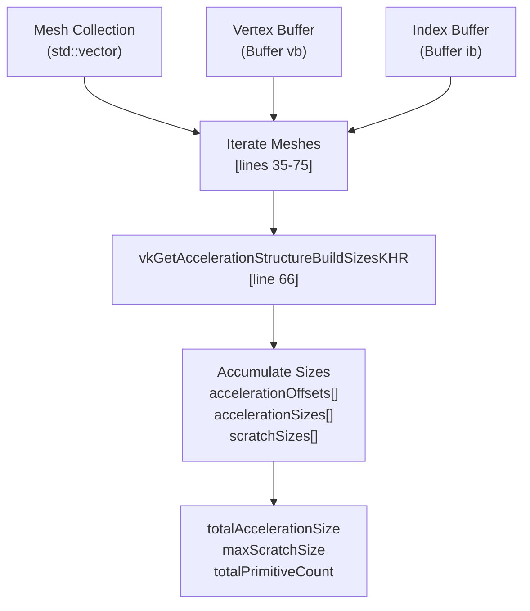

For each mesh, the function queries size requirements using `vkGetAccelerationStructureBuildSizesKHR` [src/scenert.cpp L66](https://github.com/zeux/niagara/blob/6f3fb529/src/scenert.cpp#L66-L66)

 Key data points:

| Attribute | Purpose | Storage |
| --- | --- | --- |
| `accelerationOffsets[i]` | Offset of BLAS `i` within the combined buffer | Aligned to 256 bytes |
| `accelerationSizes[i]` | Size required for BLAS `i` | From size query |
| `scratchSizes[i]` | Scratch memory needed to build BLAS `i` | From size query |

**Sources:** [src/scenert.cpp L15-L75](https://github.com/zeux/niagara/blob/6f3fb529/src/scenert.cpp#L15-L75)

#### Phase 2: Buffer Allocation

After accumulating size requirements, two buffers are allocated [src/scenert.cpp L77-L80](https://github.com/zeux/niagara/blob/6f3fb529/src/scenert.cpp#L77-L80)

:

1. **BLAS Storage Buffer**: Device-local buffer containing all BLAS objects * Size: `totalAccelerationSize` (aligned to 256 bytes) * Usage: `VK_BUFFER_USAGE_ACCELERATION_STRUCTURE_STORAGE_BIT_KHR | VK_BUFFER_USAGE_SHADER_DEVICE_ADDRESS_BIT`
2. **Scratch Buffer**: Temporary build workspace * Size: `max(kDefaultScratch, maxScratchSize)` where `kDefaultScratch = 32 MB` * Usage: `VK_BUFFER_USAGE_STORAGE_BUFFER_BIT | VK_BUFFER_USAGE_SHADER_DEVICE_ADDRESS_BIT`

**Sources:** [src/scenert.cpp L77-L84](https://github.com/zeux/niagara/blob/6f3fb529/src/scenert.cpp#L77-L84)

#### Phase 3: Geometry Description

For each mesh, a `VkAccelerationStructureGeometryKHR` structure is populated [src/scenert.cpp L38-L63](https://github.com/zeux/niagara/blob/6f3fb529/src/scenert.cpp#L38-L63)

:

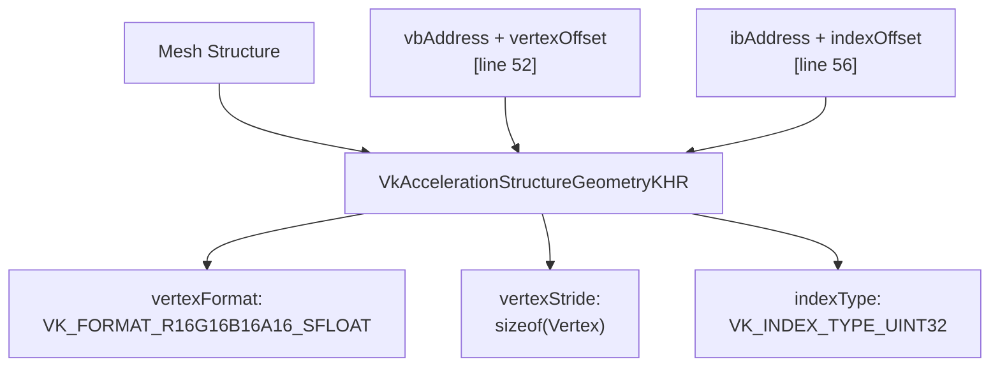

The vertex format expects 16-bit half-precision floats for vertex positions, matching the `Vertex` structure layout where positions are stored as `vx, vy, vz` [src/scenert.cpp L48-L54](https://github.com/zeux/niagara/blob/6f3fb529/src/scenert.cpp#L48-L54)

**Sources:** [src/scenert.cpp L35-L63](https://github.com/zeux/niagara/blob/6f3fb529/src/scenert.cpp#L35-L63)

#### Phase 4: Batched Building

The build process batches acceleration structure builds to fit within the allocated scratch buffer [src/scenert.cpp L116-L138](https://github.com/zeux/niagara/blob/6f3fb529/src/scenert.cpp#L116-L138)

:

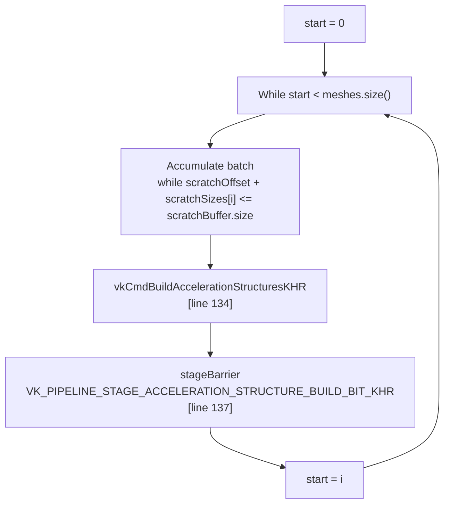

Each batch processes as many BLAS objects as can share the scratch buffer simultaneously. A pipeline barrier ensures proper synchronization between batches.

**Sources:** [src/scenert.cpp L116-L138](https://github.com/zeux/niagara/blob/6f3fb529/src/scenert.cpp#L116-L138)

#### Phase 5: Compaction Query

After building, the function queries compacted sizes using a query pool [src/scenert.cpp L102-L154](https://github.com/zeux/niagara/blob/6f3fb529/src/scenert.cpp#L102-L154)

:

1. Create query pool of type `VK_QUERY_TYPE_ACCELERATION_STRUCTURE_COMPACTED_SIZE_KHR` [src/scenert.cpp L102-L107](https://github.com/zeux/niagara/blob/6f3fb529/src/scenert.cpp#L102-L107)
2. Write acceleration structure properties to query pool [src/scenert.cpp L141](https://github.com/zeux/niagara/blob/6f3fb529/src/scenert.cpp#L141-L141)
3. Read back compacted sizes [src/scenert.cpp L152-L153](https://github.com/zeux/niagara/blob/6f3fb529/src/scenert.cpp#L152-L153)

The compacted sizes are stored in `compactedSizes` vector for use by `compactBLAS()`.

**Sources:** [src/scenert.cpp L102-L158](https://github.com/zeux/niagara/blob/6f3fb529/src/scenert.cpp#L102-L158)

### BLAS Compaction

The `compactBLAS()` function [src/scenert.cpp L160-L227](https://github.com/zeux/niagara/blob/6f3fb529/src/scenert.cpp#L160-L227)

 reduces memory usage by copying acceleration structures to a smaller buffer:

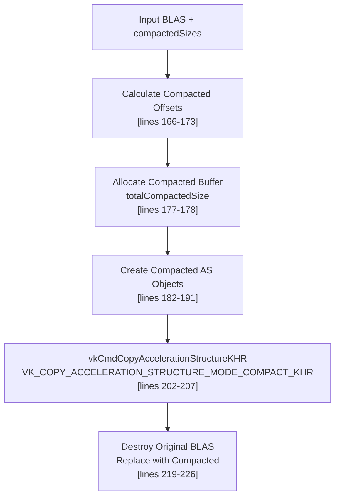

The compaction process typically reduces memory usage significantly. The function prints statistics [src/scenert.cpp L175](https://github.com/zeux/niagara/blob/6f3fb529/src/scenert.cpp#L175-L175)

:

```
"BLAS compacted accelerationStructureSize: %.2f MB"
```

**Sources:** [src/scenert.cpp L160-L227](https://github.com/zeux/niagara/blob/6f3fb529/src/scenert.cpp#L160-L227)

## Cluster BLAS (NVIDIA Extension)

### Overview

The `buildCBLAS()` function [src/scenert.cpp L229-L469](https://github.com/zeux/niagara/blob/6f3fb529/src/scenert.cpp#L229-L469)

 implements support for NVIDIA's `VK_NV_cluster_acceleration_structure` extension, which builds acceleration structures directly from meshlets rather than raw triangles. This is wrapped in a preprocessor conditional [src/scenert.cpp L231-L468](https://github.com/zeux/niagara/blob/6f3fb529/src/scenert.cpp#L231-L468)

:

```python
#ifdef VK_NV_cluster_acceleration_structure
    // Implementation
#else
    VK_CHECK(VK_ERROR_FEATURE_NOT_PRESENT);
#endif
```

**Sources:** [src/scenert.cpp L229-L469](https://github.com/zeux/niagara/blob/6f3fb529/src/scenert.cpp#L229-L469)

### Three-Phase Build Process

Cluster BLAS construction uses a three-phase indirect build process:

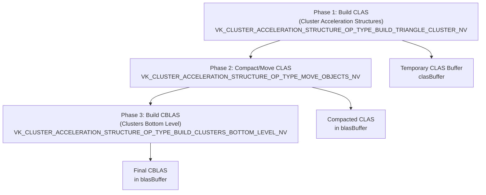

**Sources:** [src/scenert.cpp L231-L444](https://github.com/zeux/niagara/blob/6f3fb529/src/scenert.cpp#L231-L444)

### Phase 1: Cluster Build Configuration

The first phase builds individual cluster acceleration structures from meshlet data [src/scenert.cpp L235-L363](https://github.com/zeux/niagara/blob/6f3fb529/src/scenert.cpp#L235-L363)

:

#### Size Configuration

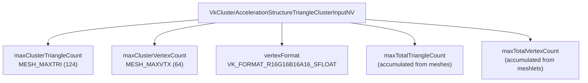

**Sources:** [src/scenert.cpp L235-L263](https://github.com/zeux/niagara/blob/6f3fb529/src/scenert.cpp#L235-L263)

#### Cluster Info Population

For each meshlet, the function fills `VkClusterAccelerationStructureBuildTriangleClusterInfoNV` structures [src/scenert.cpp L312-L335](https://github.com/zeux/niagara/blob/6f3fb529/src/scenert.cpp#L312-L335)

:

| Field | Value | Description |
| --- | --- | --- |
| `clusterID` | `mi` (meshlet index within mesh) | Unique identifier |
| `triangleCount` | `ml.triangleCount` | Number of triangles |
| `vertexCount` | `ml.vertexCount` | Number of vertices |
| `indexType` | `VK_CLUSTER_ACCELERATION_STRUCTURE_INDEX_FORMAT_8BIT_NV` | 8-bit indices |
| `vertexBufferStride` | `sizeof(uint16_t) * 4` | Half-precision float4 |
| `indexBuffer` | Address in meshlet data buffer | Device address |
| `vertexBuffer` | Address in vertex expansion buffer | Device address |

**Sources:** [src/scenert.cpp L312-L335](https://github.com/zeux/niagara/blob/6f3fb529/src/scenert.cpp#L312-L335)

#### Indirect Build Command

The cluster build uses indirect commands via `vkCmdBuildClusterAccelerationStructureIndirectNV` [src/scenert.cpp L363](https://github.com/zeux/niagara/blob/6f3fb529/src/scenert.cpp#L363-L363)

:

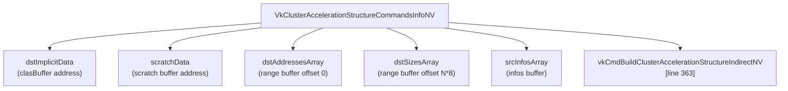

**Sources:** [src/scenert.cpp L342-L372](https://github.com/zeux/niagara/blob/6f3fb529/src/scenert.cpp#L342-L372)

### Phase 2: Compaction

After the initial build, the function compacts cluster acceleration structures [src/scenert.cpp L374-L444](https://github.com/zeux/niagara/blob/6f3fb529/src/scenert.cpp#L374-L444)

:

1. **Read Compacted Sizes**: From `rangeBuffer` written by Phase 1 [src/scenert.cpp L374-L380](https://github.com/zeux/niagara/blob/6f3fb529/src/scenert.cpp#L374-L380)
2. **Calculate Total Compacted Size**: Aligned to 128 bytes per cluster [src/scenert.cpp L379](https://github.com/zeux/niagara/blob/6f3fb529/src/scenert.cpp#L379-L379)
3. **Allocate Final Buffer**: Contains both compacted CLAS and CBLAS [src/scenert.cpp L388](https://github.com/zeux/niagara/blob/6f3fb529/src/scenert.cpp#L388-L388)
4. **Move Operation**: Using `VK_CLUSTER_ACCELERATION_STRUCTURE_OP_TYPE_MOVE_OBJECTS_NV` [src/scenert.cpp L391-L436](https://github.com/zeux/niagara/blob/6f3fb529/src/scenert.cpp#L391-L436)

**Sources:** [src/scenert.cpp L374-L444](https://github.com/zeux/niagara/blob/6f3fb529/src/scenert.cpp#L374-L444)

### Phase 3: Bottom-Level Build

The final phase builds bottom-level acceleration structures from the compacted clusters [src/scenert.cpp L404-L444](https://github.com/zeux/niagara/blob/6f3fb529/src/scenert.cpp#L404-L444)

:

Each mesh's CBLAS references its meshlets via `VkClusterAccelerationStructureBuildClustersBottomLevelInfoNV`:

* `clusterReferencesCount`: Number of meshlets in the mesh
* `clusterReferencesStride`: 8 bytes per reference
* `clusterReferences`: Device address to array of cluster references

The build command places CBLAS objects at offset `compactTotalSize` within `blasBuffer` [src/scenert.cpp L421](https://github.com/zeux/niagara/blob/6f3fb529/src/scenert.cpp#L421-L421)

**Sources:** [src/scenert.cpp L404-L444](https://github.com/zeux/niagara/blob/6f3fb529/src/scenert.cpp#L404-L444)

## Instance Management

### Instance Transformation

The `fillInstanceRT()` function [src/scenert.cpp L471-L485](https://github.com/zeux/niagara/blob/6f3fb529/src/scenert.cpp#L471-L485)

 populates `VkAccelerationStructureInstanceKHR` structures from `MeshDraw` objects:

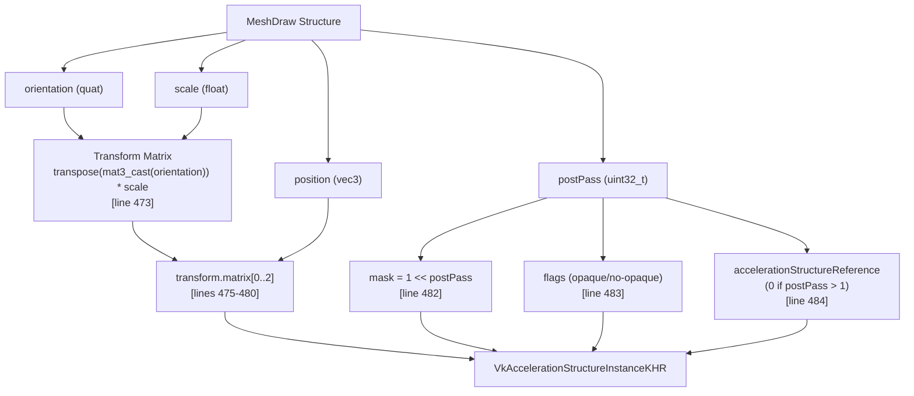

Key transformations:

* **Matrix**: 3x4 row-major matrix created by transposing quaternion-based rotation and scaling [src/scenert.cpp L473-L480](https://github.com/zeux/niagara/blob/6f3fb529/src/scenert.cpp#L473-L480)
* **Mask**: Bit field for ray masking, set to `1 << postPass` [src/scenert.cpp L482](https://github.com/zeux/niagara/blob/6f3fb529/src/scenert.cpp#L482-L482)
* **Flags**: `VK_GEOMETRY_INSTANCE_FORCE_OPAQUE_BIT_KHR` for opaque objects (postPass == 0), `VK_GEOMETRY_INSTANCE_FORCE_NO_OPAQUE_BIT_KHR` for transparent [src/scenert.cpp L483](https://github.com/zeux/niagara/blob/6f3fb529/src/scenert.cpp#L483-L483)
* **Acceleration Structure Reference**: Set to `blas` address for postPass ≤ 1, otherwise 0 [src/scenert.cpp L484](https://github.com/zeux/niagara/blob/6f3fb529/src/scenert.cpp#L484-L484)

**Sources:** [src/scenert.cpp L471-L485](https://github.com/zeux/niagara/blob/6f3fb529/src/scenert.cpp#L471-L485)

## TLAS Construction

### TLAS Creation

The `createTLAS()` function [src/scenert.cpp L487-L519](https://github.com/zeux/niagara/blob/6f3fb529/src/scenert.cpp#L487-L519)

 allocates buffers and creates the TLAS object:

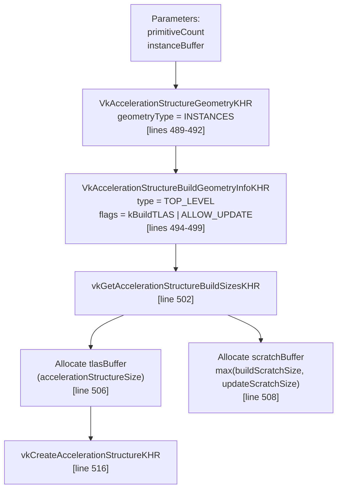

The TLAS is created with `VK_BUILD_ACCELERATION_STRUCTURE_ALLOW_UPDATE_BIT_KHR` [src/scenert.cpp L496](https://github.com/zeux/niagara/blob/6f3fb529/src/scenert.cpp#L496-L496)

 enabling efficient per-frame updates for animated scenes.

**Sources:** [src/scenert.cpp L487-L519](https://github.com/zeux/niagara/blob/6f3fb529/src/scenert.cpp#L487-L519)

### TLAS Building and Updating

The `buildTLAS()` function [src/scenert.cpp L521-L546](https://github.com/zeux/niagara/blob/6f3fb529/src/scenert.cpp#L521-L546)

 builds or updates the TLAS in a command buffer:

#### Build Mode Selection

| Mode | Value | Usage |
| --- | --- | --- |
| `VK_BUILD_ACCELERATION_STRUCTURE_MODE_BUILD_KHR` | Initial build | Used for first-time construction |
| `VK_BUILD_ACCELERATION_STRUCTURE_MODE_UPDATE_KHR` | Incremental update | Used for per-frame updates with changed instances |

The mode is passed as a parameter [src/scenert.cpp L521](https://github.com/zeux/niagara/blob/6f3fb529/src/scenert.cpp#L521-L521)

 and determines whether the operation performs a full rebuild or incremental update.

#### Build Process

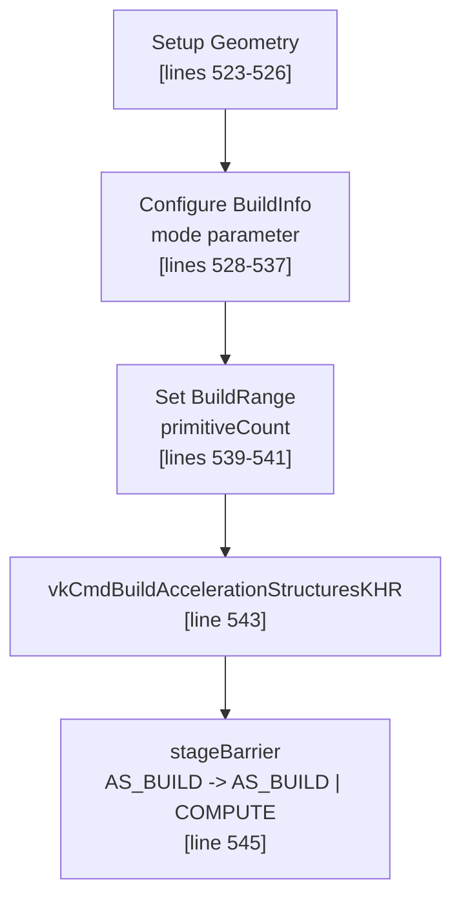

The function sets both `srcAccelerationStructure` and `dstAccelerationStructure` to the same TLAS handle [src/scenert.cpp L535-L536](https://github.com/zeux/niagara/blob/6f3fb529/src/scenert.cpp#L535-L536)

 enabling in-place updates. A pipeline barrier [src/scenert.cpp L545](https://github.com/zeux/niagara/blob/6f3fb529/src/scenert.cpp#L545-L545)

 ensures the TLAS is ready for both subsequent builds and ray tracing operations.

**Sources:** [src/scenert.cpp L521-L546](https://github.com/zeux/niagara/blob/6f3fb529/src/scenert.cpp#L521-L546)

## Memory and Performance Characteristics

### Memory Footprint

The implementation tracks and reports memory usage at various stages:

| Structure Type | Reporting Location | Typical Reduction |
| --- | --- | --- |
| BLAS (uncompacted) | [src/scenert.cpp L82](https://github.com/zeux/niagara/blob/6f3fb529/src/scenert.cpp#L82-L82) | Baseline |
| BLAS (compacted) | [src/scenert.cpp L175](https://github.com/zeux/niagara/blob/6f3fb529/src/scenert.cpp#L175-L175) | ~40-60% of uncompacted |
| CLAS (uncompacted) | [src/scenert.cpp L297](https://github.com/zeux/niagara/blob/6f3fb529/src/scenert.cpp#L297-L297) | N/A |
| CLAS (compacted) | [src/scenert.cpp L385](https://github.com/zeux/niagara/blob/6f3fb529/src/scenert.cpp#L385-L385) | Variable |
| CBLAS | [src/scenert.cpp L298](https://github.com/zeux/niagara/blob/6f3fb529/src/scenert.cpp#L298-L298) | Combined with CLAS |
| TLAS | [src/scenert.cpp L504](https://github.com/zeux/niagara/blob/6f3fb529/src/scenert.cpp#L504-L504) | Depends on instance count |

### Alignment Requirements

All acceleration structure buffers use 256-byte alignment [src/scenert.cpp L21](https://github.com/zeux/niagara/blob/6f3fb529/src/scenert.cpp#L21-L21)

 [src/scenert.cpp L162](https://github.com/zeux/niagara/blob/6f3fb529/src/scenert.cpp#L162-L162)

:

```javascript
const size_t kAlignment = 256;
```

Cluster acceleration structures use 128-byte alignment [src/scenert.cpp L233](https://github.com/zeux/niagara/blob/6f3fb529/src/scenert.cpp#L233-L233)

:

```javascript
const size_t kClusterAlignment = 128;
```

### Scratch Buffer Management

The build process uses a shared scratch buffer strategy:

* **Default allocation**: 32 MB [src/scenert.cpp L22](https://github.com/zeux/niagara/blob/6f3fb529/src/scenert.cpp#L22-L22)
* **Actual allocation**: `max(kDefaultScratch, maxScratchSize)` to ensure sufficient space
* **Batching**: Multiple BLAS builds share scratch buffer when possible [src/scenert.cpp L116-L135](https://github.com/zeux/niagara/blob/6f3fb529/src/scenert.cpp#L116-L135)

**Sources:** [src/scenert.cpp L21-L23](https://github.com/zeux/niagara/blob/6f3fb529/src/scenert.cpp#L21-L23)

 [src/scenert.cpp L116-L135](https://github.com/zeux/niagara/blob/6f3fb529/src/scenert.cpp#L116-L135)

 [src/scenert.cpp L162-L163](https://github.com/zeux/niagara/blob/6f3fb529/src/scenert.cpp#L162-L163)

 [src/scenert.cpp L232-L233](https://github.com/zeux/niagara/blob/6f3fb529/src/scenert.cpp#L232-L233)

## Integration with Scene System

The acceleration structure management integrates with the scene system (see [Scene Loading and Processing](/zeux/niagara/5.1-scene-loading-and-processing)) through several key data structures:

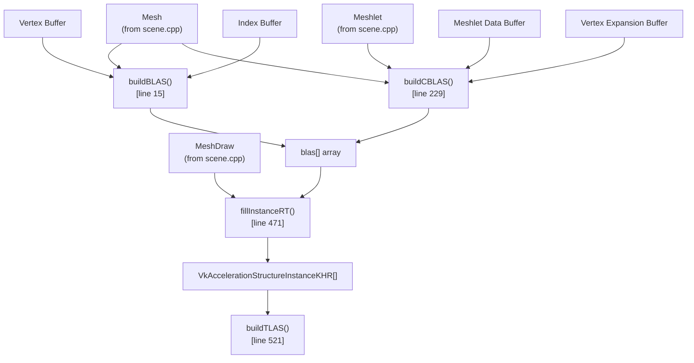

The functions are typically called during scene loading:

1. Geometry buffers are uploaded
2. `buildBLAS()` or `buildCBLAS()` creates acceleration structures for each mesh
3. `compactBLAS()` reduces memory usage (for standard BLAS)
4. `createTLAS()` allocates TLAS resources
5. Per-frame: `fillInstanceRT()` populates instance buffer
6. Per-frame: `buildTLAS()` updates TLAS with new instance data

**Sources:** [src/scenert.cpp L15-L546](https://github.com/zeux/niagara/blob/6f3fb529/src/scenert.cpp#L15-L546)

 [src/scenert.h L9-L18](https://github.com/zeux/niagara/blob/6f3fb529/src/scenert.h#L9-L18)