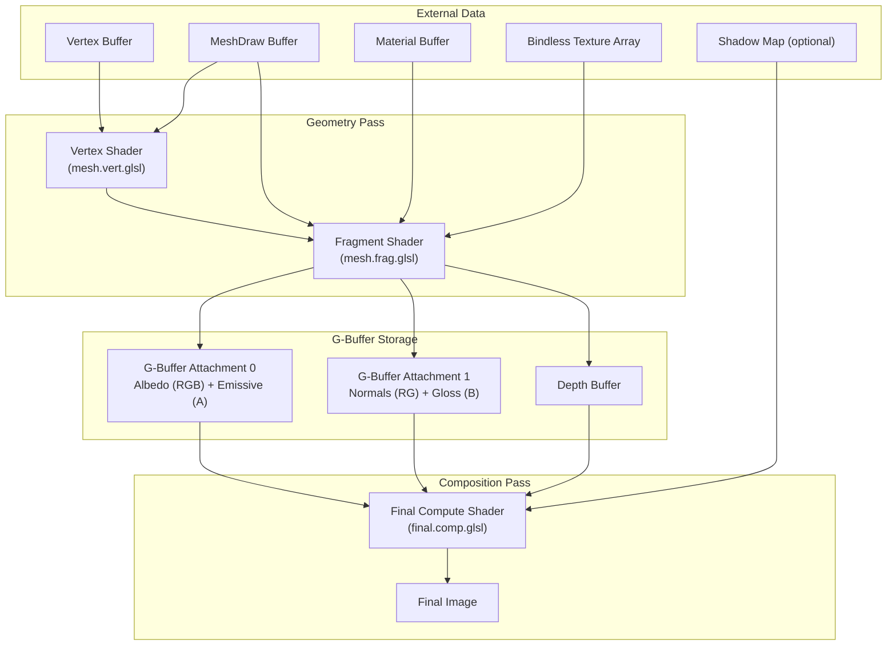
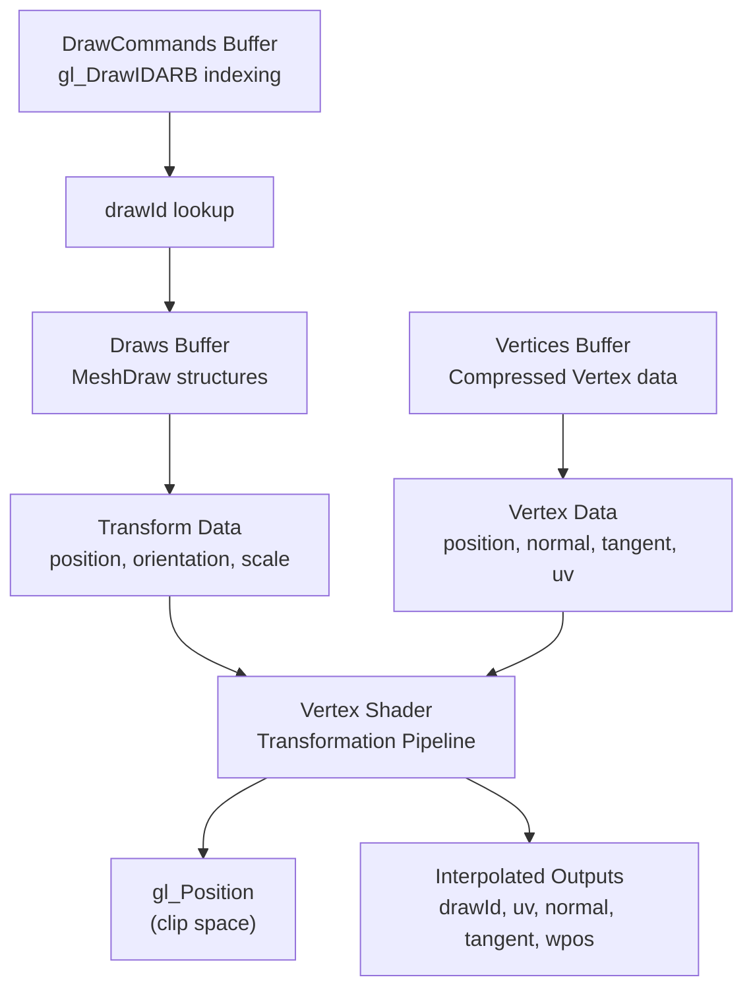
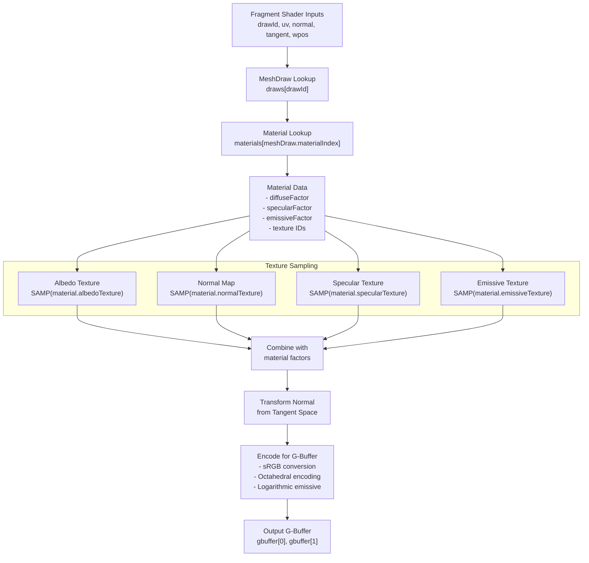
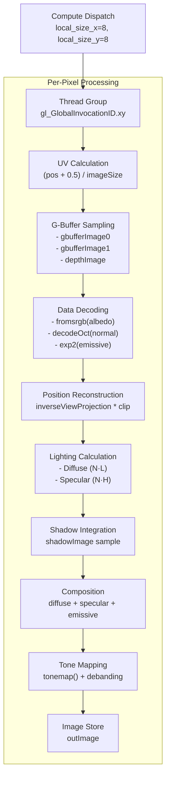

# Deferred Rendering

> **Relevant source files**
> * [src/shaders/final.comp.glsl](https://github.com/zeux/niagara/blob/6f3fb529/src/shaders/final.comp.glsl)
> * [src/shaders/math.h](https://github.com/zeux/niagara/blob/6f3fb529/src/shaders/math.h)
> * [src/shaders/mesh.frag.glsl](https://github.com/zeux/niagara/blob/6f3fb529/src/shaders/mesh.frag.glsl)
> * [src/shaders/mesh.vert.glsl](https://github.com/zeux/niagara/blob/6f3fb529/src/shaders/mesh.vert.glsl)

## Purpose and Scope

The deferred rendering system in Niagara separates geometry processing from lighting computation using a G-Buffer architecture. This document covers the vertex transformation stage, G-Buffer generation, and final composition pass that produces the rendered output.

For information about the GPU-driven culling that precedes geometry rendering, see [GPU-Driven Rendering](/zeux/niagara/7-gpu-driven-rendering). For ray-traced shadow generation that integrates with the lighting pass, see [Ray Tracing System](/zeux/niagara/9-ray-tracing-system).

## Architecture Overview

Niagara's deferred renderer uses a compact two-attachment G-Buffer format. The pipeline consists of three distinct stages:



**Sources:** [src/shaders/mesh.vert.glsl](https://github.com/zeux/niagara/blob/6f3fb529/src/shaders/mesh.vert.glsl)

 [src/shaders/mesh.frag.glsl](https://github.com/zeux/niagara/blob/6f3fb529/src/shaders/mesh.frag.glsl)

 [src/shaders/final.comp.glsl](https://github.com/zeux/niagara/blob/6f3fb529/src/shaders/final.comp.glsl)

## G-Buffer Layout

The G-Buffer uses two `vec4` attachments to store all required geometric and material properties:

| Attachment | Channel | Content | Format | Notes |
| --- | --- | --- | --- | --- |
| **0** | RGB | Albedo | sRGB encoded | Diffuse color in gamma space |
| **0** | A | Emissive Factor | Logarithmic | `log2(1 + emissivef) / 5` |
| **1** | RG | Normal | Octahedral encoding | Compressed to 2 components, range [0,1] |
| **1** | B | Gloss | Linear | Specular glossiness value |
| **1** | A | Reserved | Unused | Currently set to 0.0 |

Additionally, a standard depth buffer stores Z-values for position reconstruction.

### Data Encoding Details

The fragment shader applies several compression techniques to fit all data into the compact G-Buffer:

**Normal Encoding**: Normals are encoded using octahedral projection, which compresses a unit vector from 3 floats to 2 floats without significant quality loss. The encoded values are mapped from `[-1,1]` to `[0,1]` range for storage:

```
encoded_normal = encodeOct(normal) * 0.5 + 0.5
```

**Emissive Encoding**: Emissive intensity is stored logarithmically to support a wide dynamic range while using only 8 bits:

```
emissive_factor = dot(emissive, vec3(0.3, 0.6, 0.1)) / (dot(albedo.rgb, vec3(0.3, 0.6, 0.1)) + 1e-3)
gbuffer[0].a = log2(1 + emissive_factor) / 5
```

**Debanding**: Gradient noise is added to prevent banding artifacts in the quantized G-Buffer values, particularly visible in the normal and emissive channels.

**Sources:** [src/shaders/mesh.frag.glsl L82-L86](https://github.com/zeux/niagara/blob/6f3fb529/src/shaders/mesh.frag.glsl#L82-L86)

 [src/shaders/math.h L35-L50](https://github.com/zeux/niagara/blob/6f3fb529/src/shaders/math.h#L35-L50)

## Vertex Processing

The vertex shader (`mesh.vert.glsl`) transforms geometry from object space to clip space and prepares attributes for interpolation.

### Input Data Sources



**Sources:** [src/shaders/mesh.vert.glsl L18-L31](https://github.com/zeux/niagara/blob/6f3fb529/src/shaders/mesh.vert.glsl#L18-L31)

### Transformation Pipeline

The vertex shader performs the following operations in sequence:

1. **Draw ID Resolution**: Uses `gl_DrawIDARB` to index into the `drawCommands` buffer to retrieve the actual `drawId` [src/shaders/mesh.vert.glsl L41](https://github.com/zeux/niagara/blob/6f3fb529/src/shaders/mesh.vert.glsl#L41-L41)
2. **Vertex Decompression**: Reads compressed vertex data from the vertex buffer: * Position: `vec3(vertices[vi].vx, vertices[vi].vy, vertices[vi].vz)` * UV coordinates: `vec2(vertices[vi].tu, vertices[vi].tv)` * Normal and tangent: Unpacked via `unpackTBN()` from compressed formats
3. **Tangent Space Transformation**: Applies per-draw orientation quaternion to normals and tangents: ``` normal = rotateQuat(normal, meshDraw.orientation) tangent.xyz = rotateQuat(tangent.xyz, meshDraw.orientation) ```
4. **World Space Transformation**: Transforms position to world space: ``` wpos = rotateQuat(position, meshDraw.orientation) * meshDraw.scale + meshDraw.position ```
5. **Clip Space Projection**: Applies view and projection matrices: ``` gl_Position = globals.projection * (globals.cullData.view * vec4(wpos, 1)) ```

### Vertex Attribute Unpacking

The `unpackTBN()` function decompresses normal and tangent vectors from tightly packed integer formats:

* **Normal**: Packed as 3×10-bit values in a single `uint32`, decoded to `[-1,1]` range
* **Tangent**: Octahedral encoded in 2×8-bit values within a `uint32`
* **Tangent Handedness**: Stored as a single bit flag in the normal data

**Sources:** [src/shaders/mesh.vert.glsl L39-L63](https://github.com/zeux/niagara/blob/6f3fb529/src/shaders/mesh.vert.glsl#L39-L63)

 [src/shaders/math.h L87-L92](https://github.com/zeux/niagara/blob/6f3fb529/src/shaders/math.h#L87-L92)

## G-Buffer Generation

The fragment shader (`mesh.frag.glsl`) processes interpolated vertex attributes and material properties to generate the G-Buffer.

### Material System Integration



**Sources:** [src/shaders/mesh.frag.glsl L55-L95](https://github.com/zeux/niagara/blob/6f3fb529/src/shaders/mesh.frag.glsl#L55-L95)

### Material Property Processing

The fragment shader samples textures using bindless texture arrays with non-uniform indexing:

```
#define SAMP(id) sampler2D(textures[nonuniformEXT(id)], textureSampler)
```

For each material property:

1. **Albedo**: Base diffuse color, modulated by texture if present * Factor: `material.diffuseFactor` * Texture: `material.albedoTexture` * Conversion: Applied `fromsrgb()` to texture sample (gamma-to-linear)
2. **Normal Map**: Tangent-space normal perturbation * Factor: `vec3(0, 0, 1)` (default, no perturbation) * Texture: `material.normalTexture` * Range: Mapped from `[0,1]` to `[-1,1]`
3. **Specular/Gloss**: Specular intensity and glossiness * Factor: `material.specularFactor` * Texture: `material.specularTexture` * Conversion: Applied `fromsrgb()` to texture sample
4. **Emissive**: Self-illumination * Factor: `material.emissiveFactor` * Texture: `material.emissiveTexture` * Conversion: Applied `fromsrgb()` to texture sample (RGB only)

**Sources:** [src/shaders/mesh.frag.glsl L56-L76](https://github.com/zeux/niagara/blob/6f3fb529/src/shaders/mesh.frag.glsl#L56-L76)

### Normal Mapping

The fragment shader transforms normal map samples from tangent space to world space:

1. **Bitangent Construction**: Computed from interpolated normal and tangent: ``` bitangent = cross(normal, tangent.xyz) * tangent.w ``` The `tangent.w` component stores the handedness of the tangent frame.
2. **Normal Transformation**: Maps the normal map vector to world space: ``` nrm = normalize(nmap.r * tangent.xyz + nmap.g * bitangent + nmap.b * normal) ```
3. **Encoding**: The world-space normal is encoded using octahedral projection for G-Buffer storage.

**Sources:** [src/shaders/mesh.frag.glsl L78-L80](https://github.com/zeux/niagara/blob/6f3fb529/src/shaders/mesh.frag.glsl#L78-L80)

### Alpha Testing

The fragment shader supports alpha testing for transparent geometry using a specialization constant:

```javascript
layout (constant_id = 2) const int POST = 0;
```

When `POST > 0` (post-pass mode), fragments with `albedo.a < 0.5` are discarded. This allows rendering of alpha-tested geometry in a separate pass after opaque geometry.

**Sources:** [src/shaders/mesh.frag.glsl L11](https://github.com/zeux/niagara/blob/6f3fb529/src/shaders/mesh.frag.glsl#L11-L11)

 [src/shaders/mesh.frag.glsl L88-L89](https://github.com/zeux/niagara/blob/6f3fb529/src/shaders/mesh.frag.glsl#L88-L89)

## Lighting and Final Composition

The final composition stage is implemented as a compute shader (`final.comp.glsl`) with an 8×8 thread group size. It reads the G-Buffer, performs lighting calculations, and outputs the final tonemapped image.

### Shader Invocation



**Sources:** [src/shaders/final.comp.glsl L7](https://github.com/zeux/niagara/blob/6f3fb529/src/shaders/final.comp.glsl#L7-L7)

 [src/shaders/final.comp.glsl L33-L72](https://github.com/zeux/niagara/blob/6f3fb529/src/shaders/final.comp.glsl#L33-L72)

### Lighting Model

The composition shader implements a simple Blinn-Phong lighting model:

**Diffuse Term**:

```
ndotl = max(dot(normal, sunDirection), 0.0)
diffuse = albedo * ndotl * shadow * sunIntensity
```

**Specular Term**:

```
halfv = normalize(view + sunDirection)
ndoth = max(dot(normal, halfv), 0.0)
specular = pow(ndoth, mix(1, 64, gloss)) * gloss * shadow * sunIntensity
```

**Ambient Term**:

```
ambient = albedo * 0.07
shadow_ambient = albedo * shadow * 0.05
```

**Emissive Term**:

```
emissivef = exp2(gbuffer0.a * 5) - 1
emissive = albedo * emissivef
```

The final output combines all terms:

```
output = diffuse + specular + ambient + shadow_ambient + emissive
```

**Sources:** [src/shaders/final.comp.glsl L42-L68](https://github.com/zeux/niagara/blob/6f3fb529/src/shaders/final.comp.glsl#L42-L68)

### Position Reconstruction

World-space position is reconstructed from depth and UV coordinates to avoid storing positions in the G-Buffer:

1. **Clip-space Coordinates**: Constructed from UV and depth: ``` clip.x = uv.x * 2 - 1      // [-1, 1] clip.y = 1 - uv.y * 2      // [-1, 1] (flipped Y) clip.z = depth             // depth buffer value clip.w = 1 ```
2. **Homogeneous Division**: Transforms to world space: ``` wposh = inverseViewProjection * clip wpos = wposh.xyz / wposh.w ```

This allows computing view-dependent effects like specular highlights without storing 3D positions per pixel.

**Sources:** [src/shaders/final.comp.glsl L48-L50](https://github.com/zeux/niagara/blob/6f3fb529/src/shaders/final.comp.glsl#L48-L50)

### Shadow Integration

When shadows are enabled (`shadowsEnabled == 1`), the shader samples from a shadow map generated by the ray tracing system:

```
shadow = texture(shadowImage, uv).r
```

The shadow value is clamped and combined with ambient lighting:

```
lighting = ndotl * min(shadow + shadowAmbient, 1.0) * sunIntensity + ambient
```

This ensures that shadowed areas receive some ambient illumination (`shadowAmbient = 0.05`) in addition to the base ambient term (`ambient = 0.07`).

For details on shadow generation, see [Shadow Ray Tracing](/zeux/niagara/9.2-shadow-ray-tracing).

**Sources:** [src/shaders/final.comp.glsl L60-L62](https://github.com/zeux/niagara/blob/6f3fb529/src/shaders/final.comp.glsl#L60-L62)

### Tone Mapping and Output

The final step applies tone mapping and dithering:

1. **Filmic Tone Mapping**: Uses the Hejl-Burgess-Dawson operator for a filmic look: ``` x = max(vec3(0), color - 0.004) tonemapped = (x * (6.2 * x + .5)) / (x * (6.2 * x + 1.7) + 0.06) ```
2. **Debanding**: Adds gradient noise to prevent banding in the 8-bit output: ``` deband = gradientNoise(vec2(pos)) * 2 - 1 final = tonemapped + deband * (0.5 / 255) ```
3. **Image Store**: Writes directly to the output image (typically the swapchain): ``` imageStore(outImage, ivec2(pos), vec4(final, 1.0)) ```

**Sources:** [src/shaders/final.comp.glsl L70-L71](https://github.com/zeux/niagara/blob/6f3fb529/src/shaders/final.comp.glsl#L70-L71)

 [src/shaders/math.h L72-L78](https://github.com/zeux/niagara/blob/6f3fb529/src/shaders/math.h#L72-L78)

 [src/shaders/math.h L82-L85](https://github.com/zeux/niagara/blob/6f3fb529/src/shaders/math.h#L82-L85)

## Data Flow Summary

The complete deferred rendering pipeline data flow:

| Stage | Input | Output | Key Operations |
| --- | --- | --- | --- |
| **Vertex** | Vertex buffer, MeshDraw | Clip position, interpolated attributes | Transform to world/clip space, quaternion rotation |
| **Fragment** | Interpolated attributes, Materials, Textures | G-Buffer (2 attachments), Depth | Material sampling, normal mapping, data encoding |
| **Composition** | G-Buffer, Depth, Shadow map | Final image | Position reconstruction, lighting, tone mapping |

The G-Buffer format's compact 2-attachment design minimizes memory bandwidth while providing sufficient data for high-quality lighting. The octahedral normal encoding and logarithmic emissive storage demonstrate efficient use of limited precision, while debanding ensures smooth gradients in the final output.

**Sources:** [src/shaders/mesh.vert.glsl](https://github.com/zeux/niagara/blob/6f3fb529/src/shaders/mesh.vert.glsl)

 [src/shaders/mesh.frag.glsl](https://github.com/zeux/niagara/blob/6f3fb529/src/shaders/mesh.frag.glsl)

 [src/shaders/final.comp.glsl](https://github.com/zeux/niagara/blob/6f3fb529/src/shaders/final.comp.glsl)

 [src/shaders/math.h](https://github.com/zeux/niagara/blob/6f3fb529/src/shaders/math.h)