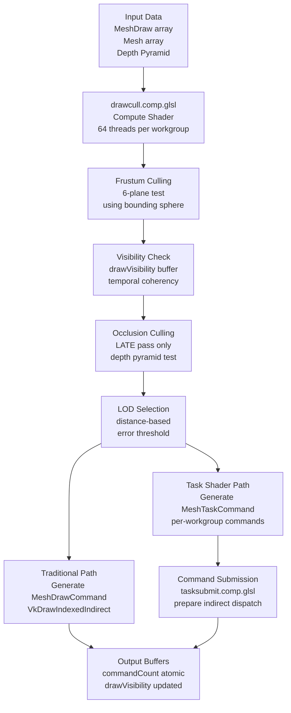
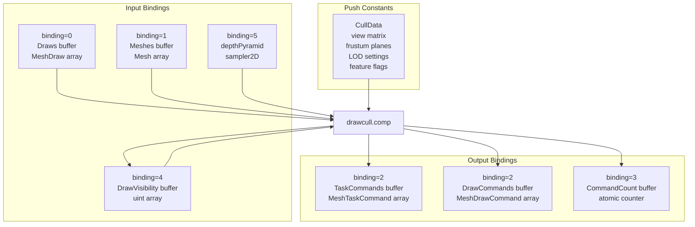
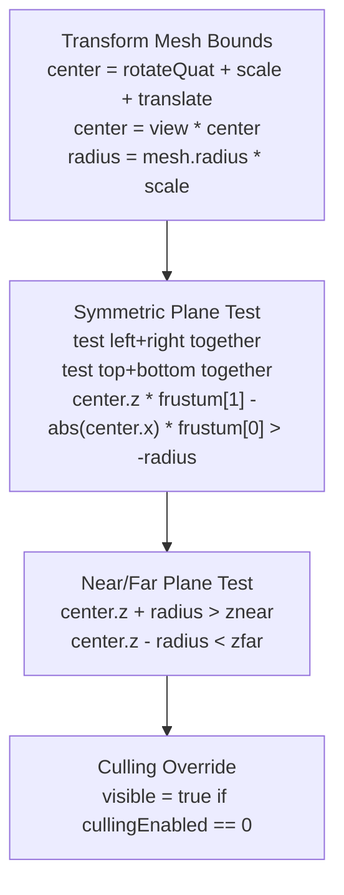
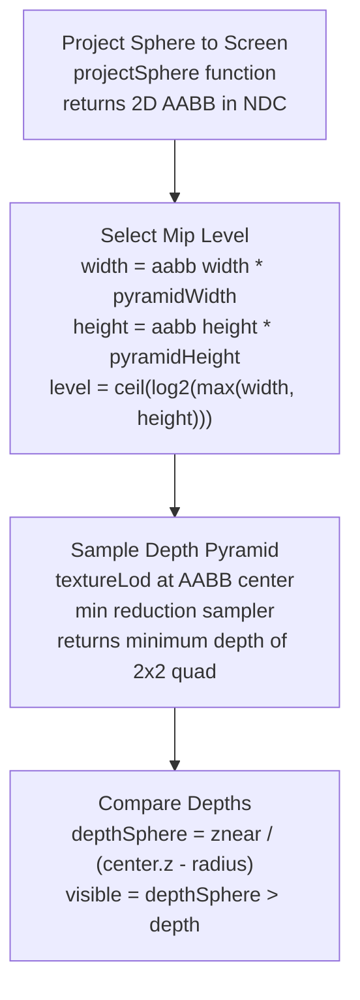
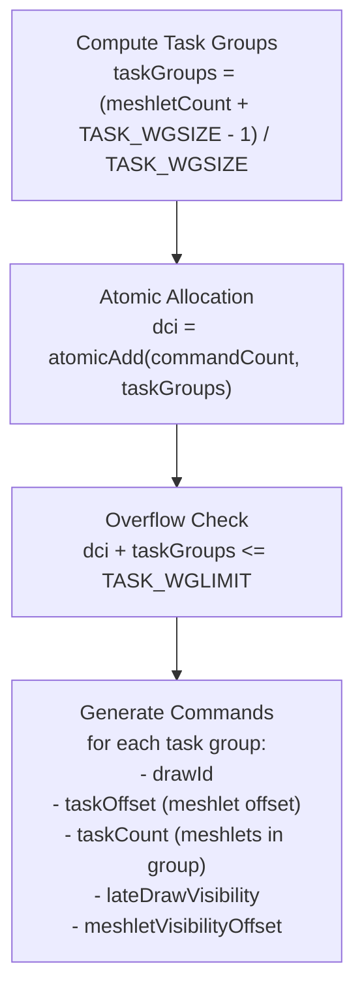
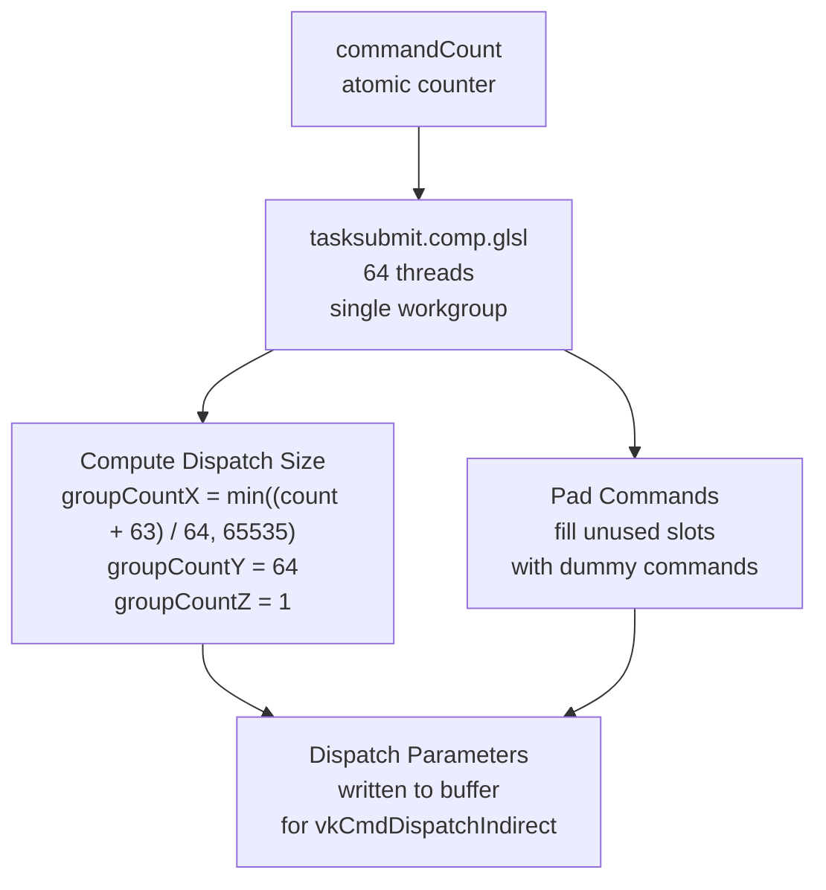

# Draw Culling Pipeline

> **Relevant source files**
> * [src/config.h](https://github.com/zeux/niagara/blob/6f3fb529/src/config.h)
> * [src/shaders/clustersubmit.comp.glsl](https://github.com/zeux/niagara/blob/6f3fb529/src/shaders/clustersubmit.comp.glsl)
> * [src/shaders/drawcull.comp.glsl](https://github.com/zeux/niagara/blob/6f3fb529/src/shaders/drawcull.comp.glsl)
> * [src/shaders/tasksubmit.comp.glsl](https://github.com/zeux/niagara/blob/6f3fb529/src/shaders/tasksubmit.comp.glsl)

## Purpose and Scope

The Draw Culling Pipeline is the first stage of Niagara's GPU-driven rendering system, responsible for performing per-draw frustum culling, occlusion culling, and LOD selection. This compute shader-based system processes all draw calls on the GPU, filtering out non-visible geometry and generating commands for either traditional indexed draws or task/mesh shader execution.

For information about the subsequent stages that process visible meshlets, see [Task Shader Stage](/zeux/niagara/7.2-task-shader-stage) and [Mesh Shader Stage](/zeux/niagara/7.3-mesh-shader-stage). For the overall two-phase rendering strategy that coordinates early and late passes, see [Two-Phase Rendering Strategy](/zeux/niagara/7.4-two-phase-rendering-strategy).

**Sources:** [src/shaders/drawcull.comp.glsl L1-L162](https://github.com/zeux/niagara/blob/6f3fb529/src/shaders/drawcull.comp.glsl#L1-L162)

## Overview

The draw culling pipeline operates as a compute shader that processes the entire scene's draw list in parallel. Each compute thread evaluates one draw call, performing culling tests and conditionally appending commands to output buffers. The system supports two execution modes (early/late pass) and two output modes (traditional indexed draws or task shader commands).



**Diagram: Draw Culling Pipeline Flow**

**Sources:** [src/shaders/drawcull.comp.glsl L53-L161](https://github.com/zeux/niagara/blob/6f3fb529/src/shaders/drawcull.comp.glsl#L53-L161)

## Shader Configuration

The draw culling shader uses specialization constants to enable different execution paths without shader recompilation. This allows the same shader source to be compiled into multiple specialized variants.

### Specialization Constants

| Constant | Type | Purpose |
| --- | --- | --- |
| `LATE` | `bool` | Enables late-pass behavior with occlusion culling |
| `TASK` | `bool` | Switches between task shader and traditional draw output |

**Sources:** [src/shaders/drawcull.comp.glsl L11-L12](https://github.com/zeux/niagara/blob/6f3fb529/src/shaders/drawcull.comp.glsl#L11-L12)

### Workgroup Configuration

The shader is configured with a 1D workgroup layout:

```
layout(local_size_x = 64, local_size_y = 1, local_size_z = 1) in;
```

Each thread processes one draw call, identified by `gl_GlobalInvocationID.x`. The 64-thread workgroup size provides good occupancy on modern GPUs while allowing efficient atomic operations for command generation.

**Sources:** [src/shaders/drawcull.comp.glsl L14](https://github.com/zeux/niagara/blob/6f3fb529/src/shaders/drawcull.comp.glsl#L14-L14)

## Input and Output Bindings



**Diagram: Draw Culling Shader Bindings**

**Sources:** [src/shaders/drawcull.comp.glsl L16-L51](https://github.com/zeux/niagara/blob/6f3fb529/src/shaders/drawcull.comp.glsl#L16-L51)

### Push Constant Structure

The `CullData` structure contains all per-frame culling parameters:

| Field | Description |
| --- | --- |
| `view` | View matrix for transforming mesh bounds to camera space |
| `frustum[4]` | Precomputed frustum plane equations for symmetric culling |
| `znear`, `zfar` | Near and far plane distances |
| `P00`, `P11` | Projection matrix diagonal elements for sphere projection |
| `pyramidWidth`, `pyramidHeight` | Depth pyramid dimensions |
| `drawCount` | Total number of draws to process |
| `lodTarget` | LOD selection threshold multiplier |
| `cullingEnabled`, `occlusionEnabled`, `lodEnabled` | Feature enable flags |
| `clusterOcclusionEnabled` | Enables meshlet-level occlusion culling |
| `postPass` | Filter flag for deferred/forward rendering separation |

**Sources:** [src/shaders/drawcull.comp.glsl L16-L19](https://github.com/zeux/niagara/blob/6f3fb529/src/shaders/drawcull.comp.glsl#L16-L19)

## Culling Operations

### Draw Filtering

The shader first performs basic filtering to skip draws that should not be processed in the current pass:

```
if (di >= cullData.drawCount)
    return;

if (drawData.postPass != cullData.postPass)
    return;

if (!LATE && drawVisibility[di] == 0)
    return;
```

The `postPass` flag allows separation of opaque and transparent geometry or deferred/forward rendering paths. In early pass mode (`!LATE`), only previously-visible draws are processed to leverage temporal coherency.

**Sources:** [src/shaders/drawcull.comp.glsl L55-L67](https://github.com/zeux/niagara/blob/6f3fb529/src/shaders/drawcull.comp.glsl#L55-L67)

### Frustum Culling

Frustum culling tests the mesh's bounding sphere against the view frustum. The implementation transforms the mesh center to camera space and applies a radius-based test:



**Diagram: Frustum Culling Algorithm**

The frustum test uses a symmetric optimization that tests left/right and top/bottom planes together:

```
visible = center.z * frustum[1] - abs(center.x) * frustum[0] > -radius
visible = center.z * frustum[3] - abs(center.y) * frustum[2] > -radius
```

This reduces the number of tests from 6 planes to effectively 4 comparisons, exploiting the symmetry of perspective projection.

**Sources:** [src/shaders/drawcull.comp.glsl L72-L83](https://github.com/zeux/niagara/blob/6f3fb529/src/shaders/drawcull.comp.glsl#L72-L83)

### Occlusion Culling

Occlusion culling is only performed in the late pass (`LATE == true`) when enabled. It uses hierarchical depth buffer testing to determine if a draw's bounding sphere is occluded by previously rendered geometry.



**Diagram: Occlusion Culling Using Depth Pyramid**

The algorithm:

1. Projects the bounding sphere to screen space as a 2D axis-aligned bounding box
2. Computes the appropriate mip level to sample (ensuring AABB maps to ≤1 texel)
3. Samples the depth pyramid at the AABB center using the computed mip level
4. Compares the sphere's front depth against the sampled depth

The sampler is configured with min reduction, so a single sample at the AABB center returns the minimum depth of a 2×2 texel area, providing conservative occlusion testing.

**Sources:** [src/shaders/drawcull.comp.glsl L85-L104](https://github.com/zeux/niagara/blob/6f3fb529/src/shaders/drawcull.comp.glsl#L85-L104)

### Visibility Logic

The visibility decision incorporates multiple factors:

```
if (visible && (!LATE || 
    (cullData.clusterOcclusionEnabled == 1 && TASK_CULL == 1) || 
    drawVisibility[di] == 0 || 
    cullData.postPass != 0))
```

A draw is appended to the command buffer if:

* It passes culling tests (`visible == true`), AND
* In early pass (`!LATE`), OR
* Meshlet occlusion culling is enabled (requiring task shader processing), OR
* The draw was previously invisible (`drawVisibility[di] == 0`), OR
* This is a post-pass (transparent geometry)

This logic ensures:

* Early pass: Only process previously-visible draws
* Late pass: Process newly-visible draws and those requiring meshlet-level culling
* Meshlet culling path: Always generate commands for task shader to perform fine-grained culling

**Sources:** [src/shaders/drawcull.comp.glsl L109](https://github.com/zeux/niagara/blob/6f3fb529/src/shaders/drawcull.comp.glsl#L109-L109)

## LOD Selection

When LOD is enabled (`cullData.lodEnabled == 1`), the shader selects the appropriate level of detail based on the draw's distance from the camera:

```
if (cullData.lodEnabled == 1)
{
    float distance = max(length(center) - radius, 0);
    float threshold = distance * cullData.lodTarget / drawData.scale;
    
    for (uint i = 1; i < mesh.lodCount; ++i)
        if (mesh.lods[i].error < threshold)
            lodIndex = i;
}
```

The LOD selection:

* Computes distance from camera to the surface of the bounding sphere
* Scales the distance by `lodTarget` (screen-space error tolerance) and inverse object scale
* Iterates through available LODs, selecting the lowest-quality LOD whose error metric is still below the threshold

This approach prioritizes lower LODs (higher quality) and only switches to higher LOD indices (lower quality) when the error is acceptable for the viewing distance.

**Sources:** [src/shaders/drawcull.comp.glsl L113-L121](https://github.com/zeux/niagara/blob/6f3fb529/src/shaders/drawcull.comp.glsl#L113-L121)

## Command Generation

Based on the `TASK` specialization constant, the shader generates either task shader commands or traditional indexed draw commands.

### Task Shader Command Path

When `TASK == true`, the shader generates `MeshTaskCommand` entries for task shader execution:



**Diagram: Task Command Generation**

Each `MeshTaskCommand` structure contains:

| Field | Description |
| --- | --- |
| `drawId` | Index into the draws array |
| `taskOffset` | Starting meshlet index within the LOD |
| `taskCount` | Number of meshlets for this task workgroup |
| `lateDrawVisibility` | Previous visibility state for temporal culling |
| `meshletVisibilityOffset` | Offset into meshlet visibility buffer |

The shader generates one command per task shader workgroup, with each workgroup processing up to `TASK_WGSIZE` meshlets (defined as 64 in [config.h L2](https://github.com/zeux/niagara/blob/6f3fb529/config.h#L2-L2)

).

**Sources:** [src/shaders/drawcull.comp.glsl L125-L144](https://github.com/zeux/niagara/blob/6f3fb529/src/shaders/drawcull.comp.glsl#L125-L144)

 [src/config.h L2](https://github.com/zeux/niagara/blob/6f3fb529/src/config.h#L2-L2)

### Traditional Draw Command Path

When `TASK == false`, the shader generates `MeshDrawCommand` entries compatible with `vkCmdDrawIndexedIndirect`:

```
uint dci = atomicAdd(commandCount, 1);

drawCommands[dci].drawId = di;
drawCommands[dci].indexCount = lod.indexCount;
drawCommands[dci].instanceCount = 1;
drawCommands[dci].firstIndex = lod.indexOffset;
drawCommands[dci].vertexOffset = mesh.vertexOffset;
drawCommands[dci].firstInstance = 0;
```

This path generates a single command per visible draw, using the selected LOD's index range.

**Sources:** [src/shaders/drawcull.comp.glsl L147-L156](https://github.com/zeux/niagara/blob/6f3fb529/src/shaders/drawcull.comp.glsl#L147-L156)

### Visibility Buffer Update

At the end of the late pass, the shader updates the visibility buffer to record which draws were visible:

```
if (LATE)
    drawVisibility[di] = visible ? 1 : 0;
```

This enables temporal coherency: the early pass in the next frame will only process draws that were visible in the previous frame's late pass.

**Sources:** [src/shaders/drawcull.comp.glsl L159-L160](https://github.com/zeux/niagara/blob/6f3fb529/src/shaders/drawcull.comp.glsl#L159-L160)

## Dispatch Preparation

After draw culling completes, the generated commands must be prepared for indirect dispatch or draw. Two additional compute shaders handle this preparation.

### Task Submit Shader

The `tasksubmit.comp.glsl` shader prepares the indirect dispatch parameters for task shader execution:



**Diagram: Task Submit Preparation**

The shader computes the dispatch dimensions to represent up to `TASK_WGLIMIT` commands (4M workgroups = ~16B triangles) using a `X×64×1` layout, where X is clamped to 65535 per VK_EXT_mesh_shader limits. Any padding is filled with dummy commands to prevent reading uninitialized memory.

**Sources:** [src/shaders/tasksubmit.comp.glsl L1-L47](https://github.com/zeux/niagara/blob/6f3fb529/src/shaders/tasksubmit.comp.glsl#L1-L47)

### Cluster Submit Shader

The `clustersubmit.comp.glsl` shader performs similar preparation for cluster-based dispatch:

```
groupCountX = CLUSTER_TILE (16)
groupCountY = min((count + 255) / 256, 65535)
groupCountZ = 256 / CLUSTER_TILE (16)
```

This uses a `16×Y×16` 3D tiled layout to maximize locality while balancing performance across different GPU architectures. The unusual layout provides better performance than simple 2D or linear layouts on both discrete and integrated AMD GPUs.

**Sources:** [src/shaders/clustersubmit.comp.glsl L1-L45](https://github.com/zeux/niagara/blob/6f3fb529/src/shaders/clustersubmit.comp.glsl#L1-L45)

 [src/config.h L22](https://github.com/zeux/niagara/blob/6f3fb529/src/config.h#L22-L22)

## Performance Characteristics

### Workgroup Efficiency

| Configuration | Value | Rationale |
| --- | --- | --- |
| Workgroup size | 64 threads | Balances occupancy and atomic contention |
| Task commands per workgroup | Up to 64 | Matches TASK_WGSIZE for aligned access |
| Maximum task workgroups | 4M (2²²) | Supports ~16B triangles at 64 triangles/meshlet |
| Maximum clusters | 16M (2²⁴) | Supports ~64MB cluster index buffer |

**Sources:** [src/config.h L2-L28](https://github.com/zeux/niagara/blob/6f3fb529/src/config.h#L2-L28)

### Culling Order

The culling operations are ordered from cheapest to most expensive:

1. **Draw count bounds check** - Single comparison
2. **Post-pass filtering** - Single comparison
3. **Temporal visibility check** - Single memory read (early pass only)
4. **Frustum culling** - Transform + 4 plane tests
5. **Occlusion culling** - Sphere projection + texture sample + depth comparison (late pass only)
6. **LOD selection** - Distance calculation + loop over LOD levels
7. **Command generation** - Atomic increment + buffer writes

This ordering minimizes wasted work by rejecting draws early before performing expensive operations.

**Sources:** [src/shaders/drawcull.comp.glsl L55-L161](https://github.com/zeux/niagara/blob/6f3fb529/src/shaders/drawcull.comp.glsl#L55-L161)

## Integration with Rendering Pipeline

The draw culling pipeline integrates with other rendering stages as follows:

* **Input:** Scene data uploaded by [Scene System](/zeux/niagara/5-scene-system), depth pyramid generated by depth reduction pass (see [Two-Phase Rendering Strategy](/zeux/niagara/7.4-two-phase-rendering-strategy))
* **Output:** Commands consumed by [Task Shader Stage](/zeux/niagara/7.2-task-shader-stage) or traditional vertex pipeline
* **Synchronization:** Command count buffer synchronized between draw culling and dispatch preparation
* **Temporal coherency:** Visibility buffer carries state from late pass to next frame's early pass

The two-pass strategy (early + late) with draw culling, depth pyramid generation, and subsequent task/mesh shader processing forms the complete GPU-driven rendering pipeline described in [GPU-Driven Rendering](/zeux/niagara/7-gpu-driven-rendering).

**Sources:** [src/shaders/drawcull.comp.glsl L1-L162](https://github.com/zeux/niagara/blob/6f3fb529/src/shaders/drawcull.comp.glsl#L1-L162)