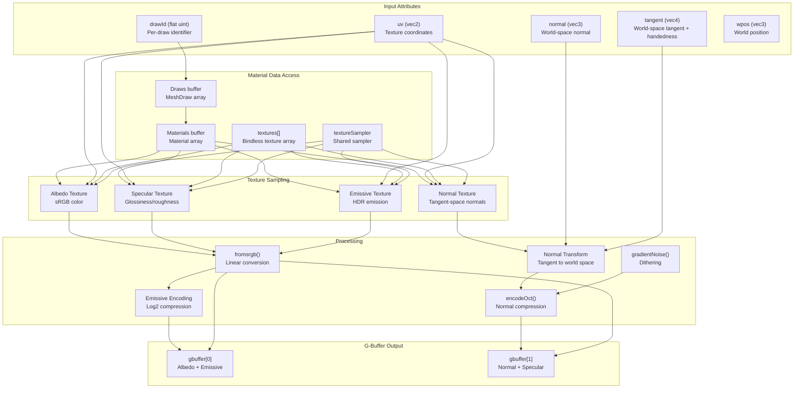
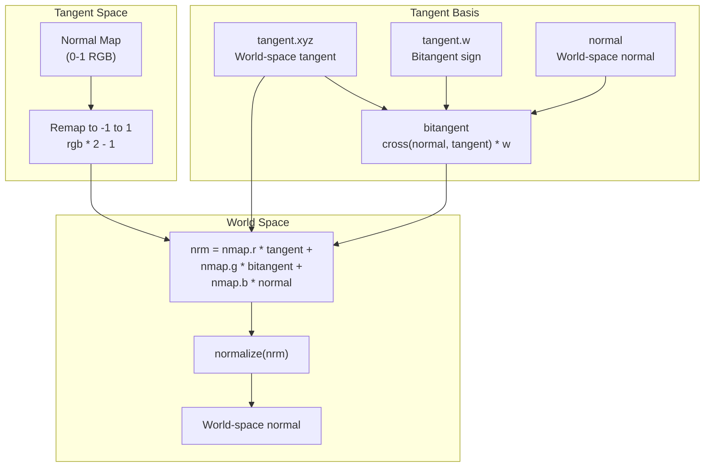
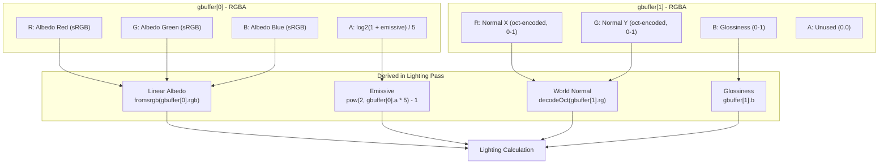

# G-Buffer Generation

> **Relevant source files**
> * [src/shaders/mesh.frag.glsl](https://github.com/zeux/niagara/blob/6f3fb529/src/shaders/mesh.frag.glsl)

## Purpose and Scope

This document describes the fragment shader stage that generates the G-buffer in Niagara's deferred rendering pipeline. The G-buffer stores surface properties (albedo, normals, specular, emissive) in a compact multi-attachment format for later use in lighting and composition. For information about vertex attribute generation that precedes this stage, see [Vertex Processing](/zeux/niagara/8.1-vertex-processing). For information about how the G-buffer is consumed for lighting, see [Lighting and Final Composition](/zeux/niagara/8.3-lighting-and-final-composition).

The G-buffer generation occurs after mesh shader rasterization (or traditional vertex shader rasterization) and produces screen-space surface data that enables deferred shading.

**Sources:** [src/shaders/mesh.frag.glsl L1-L96](https://github.com/zeux/niagara/blob/6f3fb529/src/shaders/mesh.frag.glsl#L1-L96)

---

## G-Buffer Layout

Niagara uses a two-attachment G-buffer format optimized for memory efficiency and bandwidth:

| Attachment | Format | Contents |
| --- | --- | --- |
| `gbuffer[0]` | RGBA | RGB: sRGB albedo, A: logarithmic emissive intensity |
| `gbuffer[1]` | RGBA | RG: octahedral-encoded normal, B: specular glossiness, A: unused |

This compact layout stores all essential surface properties in just 8 bytes per pixel (assuming RGBA8 format), enabling efficient memory usage and cache coherency during the lighting pass.

**Sources:** [src/shaders/mesh.frag.glsl L25-L86](https://github.com/zeux/niagara/blob/6f3fb529/src/shaders/mesh.frag.glsl#L25-L86)

---

## Fragment Shader Pipeline

The fragment shader receives interpolated vertex attributes and produces the G-buffer outputs through a multi-stage process:



**Diagram: Fragment Shader Data Flow**

The shader receives five interpolated attributes per fragment and accesses material data through buffer bindings to produce two G-buffer attachments.

**Sources:** [src/shaders/mesh.frag.glsl L20-L95](https://github.com/zeux/niagara/blob/6f3fb529/src/shaders/mesh.frag.glsl#L20-L95)

---

## Input Attributes and Bindings

### Vertex Attributes

The fragment shader receives these interpolated attributes from the vertex or mesh shader stage:

| Location | Type | Description |
| --- | --- | --- |
| 0 | `flat uint` | `drawId` - identifies which MeshDraw instance this fragment belongs to |
| 1 | `vec2` | `uv` - texture coordinates for material sampling |
| 2 | `vec3` | `normal` - normalized world-space surface normal |
| 3 | `vec4` | `tangent` - world-space tangent (xyz) with handedness (w) |
| 4 | `vec3` | `wpos` - world-space position (currently unused in G-buffer generation) |

The `flat` qualifier on `drawId` prevents interpolation, ensuring each fragment knows which draw call it originated from.

**Sources:** [src/shaders/mesh.frag.glsl L27-L31](https://github.com/zeux/niagara/blob/6f3fb529/src/shaders/mesh.frag.glsl#L27-L31)

### Resource Bindings

The shader accesses material and texture data through descriptor bindings:

| Binding | Type | Description |
| --- | --- | --- |
| 1 | SSBO | `draws[]` - array of MeshDraw structures containing per-instance data |
| 7 | Sampler | `textureSampler` - shared sampler for all texture lookups |
| 8 | SSBO | `materials[]` - array of Material structures with factors and texture IDs |
| 0 (set 1) | Texture array | `textures[]` - bindless array of all scene textures |

The bindless texture array uses the `nonuniformEXT` qualifier to enable dynamic indexing with material-specific texture IDs.

**Sources:** [src/shaders/mesh.frag.glsl L20-L42](https://github.com/zeux/niagara/blob/6f3fb529/src/shaders/mesh.frag.glsl#L20-L42)

---

## Material Processing

### Albedo/Diffuse Color

The albedo (base color) is computed by combining a material factor with an optional texture:

```
vec4 albedo = material.diffuseFactor;
if (material.albedoTexture > 0)
    albedo *= fromsrgb(texture(SAMP(material.albedoTexture), uv));
```

The `fromsrgb()` function converts the texture from sRGB color space to linear space for correct lighting calculations. The conditional check `material.albedoTexture > 0` skips texture sampling when no albedo texture is assigned, using only the material factor.

**Sources:** [src/shaders/mesh.frag.glsl L62-L64](https://github.com/zeux/niagara/blob/6f3fb529/src/shaders/mesh.frag.glsl#L62-L64)

### Normal Mapping

Normal mapping transforms tangent-space normals from a texture into world space:



**Diagram: Normal Mapping Transformation Pipeline**

The shader reconstructs the bitangent from the normal and tangent using the handedness stored in `tangent.w`, then transforms the tangent-space normal to world space:

```
vec3 nmap = vec3(0, 0, 1);
if (material.normalTexture > 0)
    nmap = texture(SAMP(material.normalTexture), uv).rgb * 2 - 1;

vec3 bitangent = cross(normal, tangent.xyz) * tangent.w;
vec3 nrm = normalize(nmap.r * tangent.xyz + nmap.g * bitangent + nmap.b * normal);
```

When no normal texture is assigned, `nmap` defaults to `(0, 0, 1)`, which represents an unperturbed surface in tangent space and results in using the interpolated vertex normal directly.

**Sources:** [src/shaders/mesh.frag.glsl L66-L80](https://github.com/zeux/niagara/blob/6f3fb529/src/shaders/mesh.frag.glsl#L66-L80)

### Specular/Glossiness

The specular channel stores glossiness information for the lighting model:

```
vec4 specgloss = material.specularFactor;
if (material.specularTexture > 0)
    specgloss *= fromsrgb(texture(SAMP(material.specularTexture), uv));
```

The glossiness value from `specgloss.a` is written directly to the blue channel of `gbuffer[1]`. The RGB components of the specular texture are converted from sRGB but are not currently used in the G-buffer output (a TODO comment indicates metalness should be reconstructed from this data).

**Sources:** [src/shaders/mesh.frag.glsl L70-L86](https://github.com/zeux/niagara/blob/6f3fb529/src/shaders/mesh.frag.glsl#L70-L86)

### Emissive Materials

Emissive materials are handled through a relative intensity encoding:

```
vec3 emissive = material.emissiveFactor;
if (material.emissiveTexture > 0)
    emissive *= fromsrgb(texture(SAMP(material.emissiveTexture), uv).rgb);

float emissivef = dot(emissive, vec3(0.3, 0.6, 0.1)) / (dot(albedo.rgb, vec3(0.3, 0.6, 0.1)) + 1e-3);
```

The emissive intensity is computed as a luminance ratio between the emissive color and the albedo color. This approach allows HDR emissive values to be stored compactly while preserving perceptual brightness relationships. The weights `(0.3, 0.6, 0.1)` approximate photometric luminance (similar to Rec. 709 luma coefficients).

**Sources:** [src/shaders/mesh.frag.glsl L74-L82](https://github.com/zeux/niagara/blob/6f3fb529/src/shaders/mesh.frag.glsl#L74-L82)

---

## Encoding and Optimization

### Octahedral Normal Encoding

World-space normals are compressed using octahedral encoding, which maps a unit sphere to a 2D square. This reduces normal storage from 3 components to 2:

```
gbuffer[1] = vec4(encodeOct(nrm) * 0.5 + 0.5 + deband * (0.5 / 1023), specgloss.a, 0.0);
```

The `encodeOct()` function (defined in `math.h`) produces values in the range `[-1, 1]`, which are then:

1. Scaled to `[0, 1]` by `* 0.5 + 0.5`
2. Dithered by adding a small noise value
3. Stored in the RG channels of `gbuffer[1]`

This encoding preserves normal precision while using only 16 bits (in an RGBA8 format) instead of 24 bits or more.

**Sources:** [src/shaders/mesh.frag.glsl L86](https://github.com/zeux/niagara/blob/6f3fb529/src/shaders/mesh.frag.glsl#L86-L86)

### Emissive Logarithmic Encoding

Emissive intensity is encoded logarithmically to handle HDR values in limited precision:

```
gbuffer[0] = vec4(tosrgb(albedo).rgb, log2(1 + emissivef) / 5);
```

The encoding `log2(1 + emissivef) / 5` compresses a wide dynamic range into the alpha channel:

* The `1 +` ensures zero emissive values map to zero
* `log2` provides perceptually-uniform compression
* Division by 5 scales the result to fit in `[0, 1]` for typical emissive ranges

The composition shader can reconstruct the emissive intensity using the inverse operation: `emissive = (2^(alpha * 5) - 1) * albedo`.

**Sources:** [src/shaders/mesh.frag.glsl L85](https://github.com/zeux/niagara/blob/6f3fb529/src/shaders/mesh.frag.glsl#L85-L85)

### Gradient Noise Dithering

Dithering is applied to the encoded normals to reduce banding artifacts in low-precision formats:

```
float deband = gradientNoise(gl_FragCoord.xy) * 2 - 1;
// ...
gbuffer[1] = vec4(encodeOct(nrm) * 0.5 + 0.5 + deband * (0.5 / 1023), specgloss.a, 0.0);
```

The `gradientNoise()` function (from `math.h`) generates screen-space noise based on fragment coordinates. The noise is:

1. Scaled from `[0, 1]` to `[-1, 1]`
2. Scaled by `0.5 / 1023` (approximately half a bit in 10-bit precision)
3. Added to the encoded normal before quantization

This breaks up visible banding in smooth normal gradients at the cost of adding imperceptible noise.

**Sources:** [src/shaders/mesh.frag.glsl L60-L86](https://github.com/zeux/niagara/blob/6f3fb529/src/shaders/mesh.frag.glsl#L60-L86)

### Alpha Testing

Transparent materials can be culled using alpha testing when the `POST` specialization constant is enabled:

```
if (POST > 0 && albedo.a < 0.5)
    discard;
```

This feature allows materials with alpha-tested transparency (like foliage or chainlink fences) to be rendered correctly in a deferred pipeline. The `POST` constant is set at pipeline creation time (default is 0, disabling this feature).

**Sources:** [src/shaders/mesh.frag.glsl L11-L89](https://github.com/zeux/niagara/blob/6f3fb529/src/shaders/mesh.frag.glsl#L11-L89)

---

## G-Buffer Output Summary

The final G-buffer outputs encode all surface properties efficiently:



**Diagram: G-Buffer Layout and Decoding**

This compact format provides all necessary surface data for deferred shading while maintaining efficient memory bandwidth usage. The encoding choices (sRGB albedo, octahedral normals, logarithmic emissive) balance precision, dynamic range, and storage efficiency.

**Sources:** [src/shaders/mesh.frag.glsl L85-L86](https://github.com/zeux/niagara/blob/6f3fb529/src/shaders/mesh.frag.glsl#L85-L86)

---

## Debug Visualization

The shader includes an optional debug mode that color-codes fragments by draw ID:

```
#if DEBUG
    uint mhash = hash(drawId);
    gbuffer[0] = vec4(float(mhash & 255), float((mhash >> 8) & 255), float((mhash >> 16) & 255), 255) / 255.0;
#endif
```

When `DEBUG` is set to 1, each draw call is assigned a pseudo-random color based on its ID using a hash function. This helps visualize draw call distribution, debugging culling issues, or identifying geometry boundaries.

**Sources:** [src/shaders/mesh.frag.glsl L13-L94](https://github.com/zeux/niagara/blob/6f3fb529/src/shaders/mesh.frag.glsl#L13-L94)