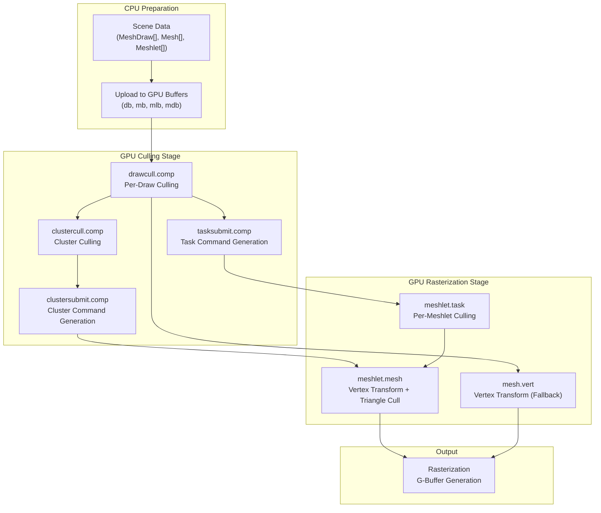
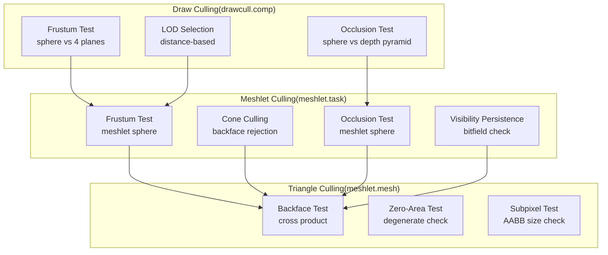
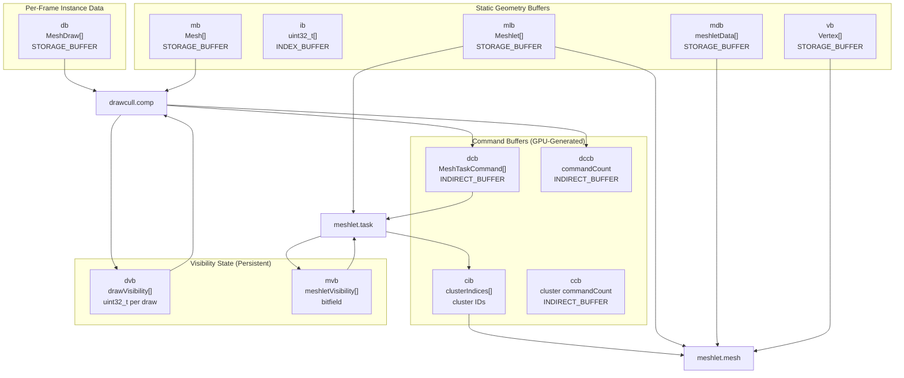
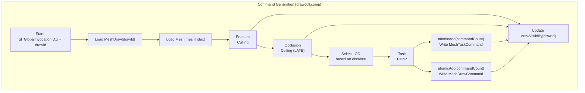
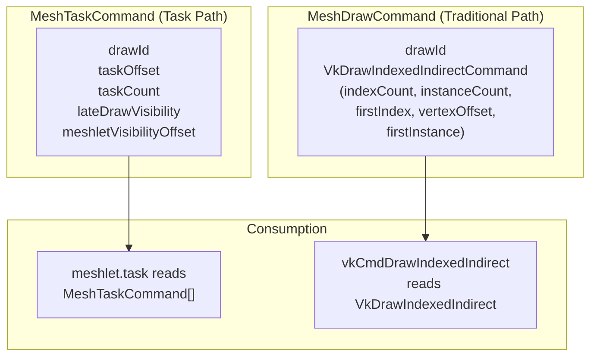
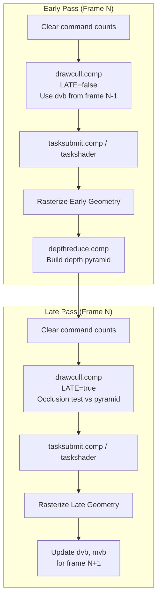

# GPU-Driven Rendering

> **Relevant source files**
> * [src/niagara.cpp](https://github.com/zeux/niagara/blob/6f3fb529/src/niagara.cpp)
> * [src/shaders/drawcull.comp.glsl](https://github.com/zeux/niagara/blob/6f3fb529/src/shaders/drawcull.comp.glsl)
> * [src/shaders/meshlet.mesh.glsl](https://github.com/zeux/niagara/blob/6f3fb529/src/shaders/meshlet.mesh.glsl)
> * [src/shaders/meshlet.task.glsl](https://github.com/zeux/niagara/blob/6f3fb529/src/shaders/meshlet.task.glsl)

## Purpose and Scope

This document describes Niagara's GPU-driven rendering architecture, which offloads draw call generation, culling, and geometry processing to the GPU. The system uses compute shaders to perform per-draw and per-meshlet culling, then leverages task and mesh shaders (or traditional vertex shaders as fallback) to emit visible geometry. This approach minimizes CPU overhead and enables efficient processing of massive scene complexity.

For details on individual pipeline stages, see:

* Draw culling implementation: [7.1](/zeux/niagara/7.1-draw-culling-pipeline)
* Task shader stage: [7.2](/zeux/niagara/7.2-task-shader-stage)
* Mesh shader stage: [7.3](/zeux/niagara/7.3-mesh-shader-stage)
* Two-phase rendering strategy: [7.4](/zeux/niagara/7.4-two-phase-rendering-strategy)

For scene data structures processed by these stages, see [5.2](/zeux/niagara/5.2-geometry-data-structures).

## Architecture Overview

The GPU-driven rendering pipeline operates in multiple stages, with each stage filtering geometry at increasingly fine granularity:



**Architecture: GPU-Driven Rendering Pipeline Stages**

The pipeline supports three execution paths:

* **Task Path**: `drawcull.comp` → `tasksubmit.comp` → `meshlet.task` → `meshlet.mesh`
* **Cluster Path**: `drawcull.comp` → `clustercull.comp` → `clustersubmit.comp` → `meshlet.mesh`
* **Traditional Path**: `drawcull.comp` → `mesh.vert` (fallback when mesh shading unavailable)

Sources: [src/niagara.cpp L1224-L1280](https://github.com/zeux/niagara/blob/6f3fb529/src/niagara.cpp#L1224-L1280)

 [src/shaders/drawcull.comp.glsl L1-L162](https://github.com/zeux/niagara/blob/6f3fb529/src/shaders/drawcull.comp.glsl#L1-L162)

 [src/shaders/meshlet.task.glsl L1-L151](https://github.com/zeux/niagara/blob/6f3fb529/src/shaders/meshlet.task.glsl#L1-L151)

 [src/shaders/meshlet.mesh.glsl L1-L207](https://github.com/zeux/niagara/blob/6f3fb529/src/shaders/meshlet.mesh.glsl#L1-L207)

## Culling Hierarchy

The GPU-driven pipeline performs culling at three granularities:

| Culling Level | Stage | Granularity | Techniques |
| --- | --- | --- | --- |
| **Draw** | `drawcull.comp` | Per-object | Frustum, occlusion (depth pyramid), LOD selection |
| **Meshlet** | `meshlet.task` | Per-meshlet (64 vertices) | Frustum, cone (backface), occlusion, visibility persistence |
| **Triangle** | `meshlet.mesh` | Per-triangle | Backface, zero-area, subpixel |

### Culling Techniques by Stage



**Culling Hierarchy: Progressive Geometry Filtering**

Each stage eliminates invisible geometry before passing work to the next stage, reducing memory bandwidth and shader execution cost.

Sources: [src/shaders/drawcull.comp.glsl L76-L104](https://github.com/zeux/niagara/blob/6f3fb529/src/shaders/drawcull.comp.glsl#L76-L104)

 [src/shaders/meshlet.task.glsl L86-L126](https://github.com/zeux/niagara/blob/6f3fb529/src/shaders/meshlet.task.glsl#L86-L126)

 [src/shaders/meshlet.mesh.glsl L175-L198](https://github.com/zeux/niagara/blob/6f3fb529/src/shaders/meshlet.mesh.glsl#L175-L198)

## Data Flow and Buffer Management

The GPU-driven pipeline operates on several key buffer types:



**Data Flow: Buffer Usage Across GPU-Driven Pipeline**

Sources: [src/niagara.cpp L787-L849](https://github.com/zeux/niagara/blob/6f3fb529/src/niagara.cpp#L787-L849)

### Buffer Descriptions

#### Static Geometry Buffers

* `vb` (Vertex Buffer): Device-local storage for vertex data (position, normal, tangent, UV)
* `ib` (Index Buffer): Triangle indices for traditional rendering path
* `mlb` (Meshlet Buffer): Meshlet descriptors containing bounds, cone data, data offsets
* `mdb` (Meshlet Data): Packed vertex references and triangle indices
* `mb` (Mesh Buffer): Mesh metadata including center, radius, LOD information

#### Per-Frame Instance Data

* `db` (Draw Buffer): `MeshDraw` instances defining object transforms, mesh references, material IDs

#### Visibility State (Frame-Persistent)

* `dvb` (Draw Visibility Buffer): Per-draw visibility bits from previous frame
* `mvb` (Meshlet Visibility Buffer): Per-meshlet bitfield tracking visibility across frames

#### Command Buffers (GPU-Generated)

* `dcb` (Draw Command Buffer): `MeshTaskCommand` structures for task shader dispatch
* `dccb` (Draw Command Count): Atomic counter for command buffer writes
* `cib` (Cluster Index Buffer): Visible cluster IDs for mesh shader dispatch
* `ccb` (Cluster Command Count): Atomic counter for cluster commands

Sources: [src/niagara.cpp L787-L849](https://github.com/zeux/niagara/blob/6f3fb529/src/niagara.cpp#L787-L849)

 [src/niagara.cpp L113-L126](https://github.com/zeux/niagara/blob/6f3fb529/src/niagara.cpp#L113-L126)

## Command Generation Flow

The GPU-driven pipeline generates indirect draw/dispatch commands entirely on the GPU:



**Command Generation: Draw Culling Compute Shader Flow**

The `drawcull.comp` shader processes each draw in parallel, culling at object level and generating indirect commands for visible geometry. The atomic counter ensures commands are written contiguously without gaps.

Sources: [src/shaders/drawcull.comp.glsl L53-L161](https://github.com/zeux/niagara/blob/6f3fb529/src/shaders/drawcull.comp.glsl#L53-L161)

### Command Structure Mapping

The shader generates different command types based on the rendering path:



**Command Structures: Task Commands vs Traditional Draw Commands**

Sources: [src/niagara.cpp L113-L126](https://github.com/zeux/niagara/blob/6f3fb529/src/niagara.cpp#L113-L126)

 [src/shaders/drawcull.comp.glsl L125-L156](https://github.com/zeux/niagara/blob/6f3fb529/src/shaders/drawcull.comp.glsl#L125-L156)

## Integration with Rendering Loop

The GPU-driven culling integrates into the main rendering loop with distinct early and late passes:



**Rendering Loop: Two-Phase GPU-Driven Culling Integration**

The early pass renders previously-visible geometry to establish depth, then the late pass performs occlusion testing against the depth pyramid to discover newly-visible geometry. This two-phase approach provides temporal coherency and efficient occlusion culling.

Sources: [src/niagara.cpp L1224-L1335](https://github.com/zeux/niagara/blob/6f3fb529/src/niagara.cpp#L1224-L1335)

## Shader Execution Configuration

The GPU-driven shaders are configured with compile-time specialization constants and workgroup sizes defined in `config.h`:

| Shader | Workgroup Size | Specialization Constants | Purpose |
| --- | --- | --- | --- |
| `drawcull.comp` | 64 threads | `LATE`, `TASK` | Per-draw parallel culling |
| `tasksubmit.comp` | 64 threads | - | Task command linearization |
| `clustercull.comp` | 64 threads | `LATE` | Per-cluster culling |
| `clustersubmit.comp` | 64 threads | - | Cluster command generation |
| `meshlet.task` | `TASK_WGSIZE` (32) | `LATE` | Per-meshlet culling |
| `meshlet.mesh` | `MESH_WGSIZE` (128) | `TASK`, `CULL` | Vertex transform, triangle cull |

### Workgroup Size Definitions

```
// From config.h
#define TASK_WGSIZE 32      // Task shader workgroup size
#define MESH_WGSIZE 128     // Mesh shader workgroup size
#define MESH_MAXVTX 64      // Max vertices per meshlet
#define MESH_MAXTRI 124     // Max triangles per meshlet
#define TASK_WGLIMIT 786432 // Max task workgroups
#define CLUSTER_LIMIT 8388608 // Max clusters
```

These constants are compiled into the shaders and also used CPU-side for buffer sizing and dispatch calculations.

Sources: [src/config.h](https://github.com/zeux/niagara/blob/6f3fb529/src/config.h)

 [src/shaders/drawcull.comp.glsl L14](https://github.com/zeux/niagara/blob/6f3fb529/src/shaders/drawcull.comp.glsl#L14-L14)

 [src/shaders/meshlet.task.glsl L16](https://github.com/zeux/niagara/blob/6f3fb529/src/shaders/meshlet.task.glsl#L16-L16)

 [src/shaders/meshlet.mesh.glsl L17](https://github.com/zeux/niagara/blob/6f3fb529/src/shaders/meshlet.mesh.glsl#L17-L17)

## Runtime Toggles and Configuration

The GPU-driven rendering system supports runtime toggles for debugging and performance analysis:

```
// Global flags in niagara.cpp
bool meshShadingEnabled = true;          // Enable mesh shader path
bool cullingEnabled = true;              // Enable frustum culling
bool lodEnabled = true;                  // Enable LOD selection
bool occlusionEnabled = true;            // Enable occlusion culling
bool clusterOcclusionEnabled = true;     // Enable meshlet-level occlusion
bool taskShadingEnabled = false;         // Enable task shader (disabled for AMD)
```

These flags are passed to shaders via the `CullData` structure:

```
struct CullData {
    mat4 view;
    float P00, P11, znear, zfar;
    float frustum[4];
    float lodTarget;
    float pyramidWidth, pyramidHeight;
    uint32_t drawCount;
    int cullingEnabled;
    int lodEnabled;
    int occlusionEnabled;
    int clusterOcclusionEnabled;
    int clusterBackfaceEnabled;
    uint32_t postPass;
};
```

The shaders check these flags to conditionally enable/disable features:

```
// In drawcull.comp.glsl
visible = visible || cullData.cullingEnabled == 0;

if (LATE && visible && cullData.occlusionEnabled == 1) {
    // Perform occlusion test
}
```

Sources: [src/niagara.cpp L30-L43](https://github.com/zeux/niagara/blob/6f3fb529/src/niagara.cpp#L30-L43)

 [src/niagara.cpp L128-L146](https://github.com/zeux/niagara/blob/6f3fb529/src/niagara.cpp#L128-L146)

 [src/shaders/drawcull.comp.glsl L83-L104](https://github.com/zeux/niagara/blob/6f3fb529/src/shaders/drawcull.comp.glsl#L83-L104)

## Performance Characteristics

The GPU-driven approach provides several performance advantages:

1. **Minimal CPU Overhead**: Draw commands generated entirely on GPU, CPU only dispatches compute shaders
2. **Parallel Culling**: All draws/meshlets processed in parallel across GPU threads
3. **Efficient Memory Access**: Indirect buffers eliminate CPU-GPU round-trip for draw call data
4. **Fine-Grained Culling**: Three-level hierarchy eliminates invisible triangles before rasterization
5. **Temporal Coherency**: Visibility persistence reduces redundant culling work across frames

### GPU Pipeline Queries

The renderer tracks GPU timing and statistics using Vulkan query pools:

```
// From niagara.cpp
VkQueryPool queryPoolsTimestamp[MAX_FRAMES];  // Timestamp queries
VkQueryPool queryPoolsPipeline[MAX_FRAMES];   // Pipeline statistics

// Tracked stages:
// - Draw culling early/late
// - Task submission
// - Cluster culling
// - Depth pyramid generation
// - Shadow ray tracing
// - Final composition
```

Timestamps are written at pipeline stage boundaries to measure GPU time spent in each pass.

Sources: [src/niagara.cpp L572-L580](https://github.com/zeux/niagara/blob/6f3fb529/src/niagara.cpp#L572-L580)

 [src/niagara.cpp L1144-L1145](https://github.com/zeux/niagara/blob/6f3fb529/src/niagara.cpp#L1144-L1145)

 [src/niagara.cpp L1231-L1232](https://github.com/zeux/niagara/blob/6f3fb529/src/niagara.cpp#L1231-L1232)