# Geometry Data Structures

> **Relevant source files**
> * [src/scene.h](https://github.com/zeux/niagara/blob/6f3fb529/src/scene.h)
> * [src/shaders/mesh.h](https://github.com/zeux/niagara/blob/6f3fb529/src/shaders/mesh.h)

## Purpose and Scope

This page documents the core data structures used to represent geometry in the Niagara renderer. These structures define how mesh data, LOD levels, meshlets, vertices, and draw instances are organized in memory and shared between CPU and GPU.

For information about how these structures are populated from scene files, see [Scene Loading and Processing](/zeux/niagara/5.1-scene-loading-and-processing). For details on materials and textures, see [Materials and Textures](/zeux/niagara/5.3-materials-and-textures). For the runtime culling and rendering pipeline that processes these structures, see [GPU-Driven Rendering](/zeux/niagara/7-gpu-driven-rendering).

**Sources:** [src/shaders/mesh.h L1-L123](https://github.com/zeux/niagara/blob/6f3fb529/src/shaders/mesh.h#L1-L123)

 [src/scene.h L1-L118](https://github.com/zeux/niagara/blob/6f3fb529/src/scene.h#L1-L118)

## Structure Overview

The Niagara renderer organizes geometry data hierarchically to enable efficient LOD selection, culling, and mesh shader rendering:

**Sources:** [src/shaders/mesh.h L53-L96](https://github.com/zeux/niagara/blob/6f3fb529/src/shaders/mesh.h#L53-L96)

 [src/scene.h L37-L76](https://github.com/zeux/niagara/blob/6f3fb529/src/scene.h#L37-L76)

## Dual Representation: CPU and GPU Structures

All geometry structures exist in two forms: a CPU-side definition in `scene.h` and a GPU-side definition in `shaders/mesh.h`. The structures are designed to match in memory layout so they can be directly uploaded to GPU buffers.

| Structure | CPU Definition | GPU Definition | Key Differences |
| --- | --- | --- | --- |
| `Vertex` | [src/scene.h L49-L55](https://github.com/zeux/niagara/blob/6f3fb529/src/scene.h#L49-L55) | [src/shaders/mesh.h L3-L9](https://github.com/zeux/niagara/blob/6f3fb529/src/shaders/mesh.h#L3-L9) | Identical layout |
| `Meshlet` | [src/scene.h L10-L23](https://github.com/zeux/niagara/blob/6f3fb529/src/scene.h#L10-L23) | [src/shaders/mesh.h L11-L24](https://github.com/zeux/niagara/blob/6f3fb529/src/shaders/mesh.h#L11-L24) | CPU uses `uint16_t`, GPU uses `float16_t` for center |
| `MeshLod` | [src/scene.h L57-L64](https://github.com/zeux/niagara/blob/6f3fb529/src/scene.h#L57-L64) | [src/shaders/mesh.h L53-L60](https://github.com/zeux/niagara/blob/6f3fb529/src/shaders/mesh.h#L53-L60) | CPU uses `uint32_t`, GPU uses `uint` |
| `Mesh` | [src/scene.h L66-L76](https://github.com/zeux/niagara/blob/6f3fb529/src/scene.h#L66-L76) | [src/shaders/mesh.h L62-L72](https://github.com/zeux/niagara/blob/6f3fb529/src/shaders/mesh.h#L62-L72) | Identical layout |
| `MeshDraw` | [src/scene.h L37-L47](https://github.com/zeux/niagara/blob/6f3fb529/src/scene.h#L37-L47) | [src/shaders/mesh.h L86-L96](https://github.com/zeux/niagara/blob/6f3fb529/src/shaders/mesh.h#L86-L96) | Identical layout |
| `Material` | [src/scene.h L25-L35](https://github.com/zeux/niagara/blob/6f3fb529/src/scene.h#L25-L35) | [src/shaders/mesh.h L74-L84](https://github.com/zeux/niagara/blob/6f3fb529/src/shaders/mesh.h#L74-L84) | CPU uses `int`, GPU uses `uint` |

**Sources:** [src/shaders/mesh.h L1-L123](https://github.com/zeux/niagara/blob/6f3fb529/src/shaders/mesh.h#L1-L123)

 [src/scene.h L1-L118](https://github.com/zeux/niagara/blob/6f3fb529/src/scene.h#L1-L118)

## Vertex Structure

The `Vertex` structure stores per-vertex attributes in a highly compressed format to minimize memory bandwidth.

### Field Descriptions

| Field | Type | Size | Description |
| --- | --- | --- | --- |
| `vx, vy, vz` | `float16_t` | 6 bytes | Position in 16-bit half-precision format |
| `tp` | `uint16_t` | 2 bytes | Tangent packed using 8-8 octahedral encoding |
| `np` | `uint32_t` | 4 bytes | Normal packed as 10-10-10-2 vector with bitangent sign in the last 2 bits |
| `tu, tv` | `float16_t` | 4 bytes | Texture coordinates in 16-bit half-precision format |

The vertex structure achieves a compact 16-byte size through aggressive compression:

* **Position**: Uses half-precision floats, sufficient for most mesh scales
* **Tangent**: Encoded using octahedral mapping (8 bits per component)
* **Normal**: Packed into 10 bits per component with 2-bit bitangent sign
* **UV Coordinates**: Half-precision floats

**Sources:** [src/shaders/mesh.h L3-L9](https://github.com/zeux/niagara/blob/6f3fb529/src/shaders/mesh.h#L3-L9)

 [src/scene.h L49-L55](https://github.com/zeux/niagara/blob/6f3fb529/src/scene.h#L49-L55)

## Meshlet Structure

A `Meshlet` represents a small cluster of geometry optimized for mesh shader processing. Each meshlet contains up to 64 vertices and 124 triangles.

### Field Descriptions

| Field | Type | Size | Description |
| --- | --- | --- | --- |
| `center[3]` | `float16_t` | 6 bytes | Center of bounding sphere (CPU uses `uint16_t`) |
| `radius` | `float16_t` | 2 bytes | Radius of bounding sphere |
| `cone_axis[3]` | `int8_t` | 3 bytes | Normal cone axis for backface culling |
| `cone_cutoff` | `int8_t` | 1 byte | Normal cone cutoff angle |
| `dataOffset` | `uint32_t` | 4 bytes | Offset into meshlet data buffer for vertex indices |
| `baseVertex` | `uint32_t` | 4 bytes | Base vertex index for this meshlet |
| `vertexCount` | `uint8_t` | 1 byte | Number of vertices (max 64 per `MESH_MAXVTX`) |
| `triangleCount` | `uint8_t` | 1 byte | Number of triangles (max 124 per `MESH_MAXTRI`) |
| `shortRefs` | `uint8_t` | 1 byte | Flag indicating if vertex references fit in 4 bits |
| `padding` | `uint8_t` | 1 byte | Alignment padding |

The meshlet data buffer stores vertex indices in a packed format. When `shortRefs` is true, indices are packed as 4-bit values; otherwise, they use 8 bits.

**Sources:** [src/shaders/mesh.h L11-L24](https://github.com/zeux/niagara/blob/6f3fb529/src/shaders/mesh.h#L11-L24)

 [src/scene.h L10-L23](https://github.com/zeux/niagara/blob/6f3fb529/src/scene.h#L10-L23)

 [src/config.h](https://github.com/zeux/niagara/blob/6f3fb529/src/config.h)

## MeshLod Structure

The `MeshLod` structure defines a single level of detail for a mesh, referencing ranges in the index and meshlet buffers.

### Field Descriptions

| Field | Type | Description |
| --- | --- | --- |
| `indexOffset` | `uint32_t` | Starting offset in global index buffer |
| `indexCount` | `uint32_t` | Number of indices at this LOD level |
| `meshletOffset` | `uint32_t` | Starting offset in global meshlet buffer |
| `meshletCount` | `uint32_t` | Number of meshlets at this LOD level |
| `error` | `float` | Screen-space error threshold for this LOD |

Each `MeshLod` provides two representations of the same geometry:

* **Index-based**: For traditional rendering pipelines
* **Meshlet-based**: For mesh shader pipelines

The `error` field is used for runtime LOD selection based on screen-space projected size.

**Sources:** [src/shaders/mesh.h L53-L60](https://github.com/zeux/niagara/blob/6f3fb529/src/shaders/mesh.h#L53-L60)

 [src/scene.h L57-L64](https://github.com/zeux/niagara/blob/6f3fb529/src/scene.h#L57-L64)

## Mesh Structure

The `Mesh` structure is the top-level geometry definition, containing a bounding volume, vertex data range, and up to 8 LOD levels.

### Field Descriptions

| Field | Type | Description |
| --- | --- | --- |
| `center` | `vec3` | Center of mesh bounding sphere in local space |
| `radius` | `float` | Radius of mesh bounding sphere |
| `vertexOffset` | `uint32_t` | Starting offset in global vertex buffer |
| `vertexCount` | `uint32_t` | Total number of vertices for this mesh |
| `lodCount` | `uint32_t` | Number of valid LOD levels (0-8) |
| `lods[8]` | `MeshLod[8]` | Array of LOD level descriptors |

The mesh bounding sphere is used for early culling at the draw level before LOD selection occurs. All vertices for all LOD levels are stored contiguously in the vertex buffer.

**Sources:** [src/shaders/mesh.h L62-L72](https://github.com/zeux/niagara/blob/6f3fb529/src/shaders/mesh.h#L62-L72)

 [src/scene.h L66-L76](https://github.com/zeux/niagara/blob/6f3fb529/src/scene.h#L66-L76)

## MeshDraw Structure

The `MeshDraw` structure represents a single instance of a mesh in the scene, defining its transform, mesh reference, and rendering parameters.

### Field Descriptions

| Field | Type | Description |
| --- | --- | --- |
| `position` | `vec3` | World-space position of mesh instance |
| `scale` | `float` | Uniform scale factor |
| `orientation` | `quat` | Rotation as quaternion |
| `meshIndex` | `uint32_t` | Index into mesh buffer |
| `meshletVisibilityOffset` | `uint32_t` | Offset into meshlet visibility buffer for temporal coherency |
| `postPass` | `uint32_t` | Flag indicating if this draw is part of the late pass (0 = early, 1 = late) |
| `materialIndex` | `uint32_t` | Index into material buffer |

The transform is stored as position + scale + quaternion rather than a full matrix to save memory. The transform is converted to a matrix in shaders as needed.

**Sources:** [src/shaders/mesh.h L86-L96](https://github.com/zeux/niagara/blob/6f3fb529/src/shaders/mesh.h#L86-L96)

 [src/scene.h L37-L47](https://github.com/zeux/niagara/blob/6f3fb529/src/scene.h#L37-L47)

## Material Structure

The `Material` structure stores texture references and color factors for physically-based rendering.

### Field Descriptions

| Field | Type | Description |
| --- | --- | --- |
| `albedoTexture` | `uint32_t` | Index of albedo/diffuse texture in bindless array |
| `normalTexture` | `uint32_t` | Index of normal map texture |
| `specularTexture` | `uint32_t` | Index of specular/metallic-roughness texture |
| `emissiveTexture` | `uint32_t` | Index of emissive texture |
| `diffuseFactor` | `vec4` | Diffuse color multiplier (RGB + alpha) |
| `specularFactor` | `vec4` | Specular parameters (metallic, roughness, etc.) |
| `emissiveFactor` | `vec3` | Emissive color multiplier |

Texture indices reference a bindless texture array. An index of `~0u` (all bits set) indicates no texture is bound.

**Sources:** [src/shaders/mesh.h L74-L84](https://github.com/zeux/niagara/blob/6f3fb529/src/shaders/mesh.h#L74-L84)

 [src/scene.h L25-L35](https://github.com/zeux/niagara/blob/6f3fb529/src/scene.h#L25-L35)

## Command Structures

The renderer uses several command structures for indirect drawing, allowing the GPU to generate draw commands dynamically.

### MeshDrawCommand

The `MeshDrawCommand` structure wraps `VkDrawIndexedIndirectCommand` with an additional draw ID for traditional rendering paths.

**Sources:** [src/shaders/mesh.h L98-L108](https://github.com/zeux/niagara/blob/6f3fb529/src/shaders/mesh.h#L98-L108)

### MeshTaskCommand

The `MeshTaskCommand` structure is used for mesh shader rendering, specifying task shader workgroups and visibility data.

**Sources:** [src/shaders/mesh.h L110-L117](https://github.com/zeux/niagara/blob/6f3fb529/src/shaders/mesh.h#L110-L117)

### MeshTaskPayload

The `MeshTaskPayload` structure is passed from task shaders to mesh shaders, containing indices of visible meshlets.

| Field | Type | Description |
| --- | --- | --- |
| `clusterIndices[TASK_WGSIZE]` | `uint[32]` | Indices of visible meshlets to process |

The task shader writes meshlet indices into this payload, and the mesh shader reads them to determine which meshlets to process.

**Sources:** [src/shaders/mesh.h L119-L122](https://github.com/zeux/niagara/blob/6f3fb529/src/shaders/mesh.h#L119-L122)

 [src/config.h](https://github.com/zeux/niagara/blob/6f3fb529/src/config.h)

## Supporting Structures

### CullData

The `CullData` structure contains parameters for GPU culling passes.

| Field | Type | Description |
| --- | --- | --- |
| `view` | `mat4` | View matrix |
| `P00, P11, znear, zfar` | `float` | Symmetric projection parameters |
| `frustum[4]` | `float[4]` | Left/right/top/bottom frustum plane data |
| `lodTarget` | `float` | LOD target error at z=1 |
| `pyramidWidth, pyramidHeight` | `float` | Depth pyramid dimensions in texels |
| `drawCount` | `uint` | Number of draws to process |
| `cullingEnabled` | `int` | Enable frustum culling |
| `lodEnabled` | `int` | Enable LOD selection |
| `occlusionEnabled` | `int` | Enable occlusion culling |
| `clusterOcclusionEnabled` | `int` | Enable meshlet-level occlusion culling |
| `clusterBackfaceEnabled` | `int` | Enable meshlet-level backface culling |
| `postPass` | `uint` | Flag for early (0) or late (1) pass |

**Sources:** [src/shaders/mesh.h L26-L44](https://github.com/zeux/niagara/blob/6f3fb529/src/shaders/mesh.h#L26-L44)

### Globals

The `Globals` structure bundles rendering parameters passed to shaders.

| Field | Type | Description |
| --- | --- | --- |
| `projection` | `mat4` | Projection matrix |
| `cullData` | `CullData` | Culling parameters |
| `screenWidth, screenHeight` | `float` | Render target dimensions |

**Sources:** [src/shaders/mesh.h L46-L51](https://github.com/zeux/niagara/blob/6f3fb529/src/shaders/mesh.h#L46-L51)

## Memory Layout and Alignment

All structures are carefully aligned for efficient GPU access:

**Alignment Requirements:**

* **Vertex**: 16 bytes, naturally aligned
* **Meshlet**: 32 bytes, requires 8-byte alignment on CPU ([src/scene.h L10](https://github.com/zeux/niagara/blob/6f3fb529/src/scene.h#L10-L10) )
* **Material**: 16-byte aligned ([src/scene.h L25](https://github.com/zeux/niagara/blob/6f3fb529/src/scene.h#L25-L25) )
* **MeshDraw**: 16-byte aligned ([src/scene.h L37](https://github.com/zeux/niagara/blob/6f3fb529/src/scene.h#L37-L37) )
* **Mesh**: 16-byte aligned, ~256 bytes total ([src/scene.h L66](https://github.com/zeux/niagara/blob/6f3fb529/src/scene.h#L66-L66) )

The alignment directives ensure structures can be efficiently accessed by the GPU without padding or misalignment issues.

**Sources:** [src/shaders/mesh.h L1-L123](https://github.com/zeux/niagara/blob/6f3fb529/src/shaders/mesh.h#L1-L123)

 [src/scene.h L1-L118](https://github.com/zeux/niagara/blob/6f3fb529/src/scene.h#L1-L118)

## Usage in Rendering Pipeline

The geometry data structures flow through the rendering pipeline as follows:

```mermaid
flowchart TD

Scene["Scene Loading<br>Populates Geometry"]
Upload["Buffer Upload<br>CPU → GPU transfer"]
DrawCull["Draw Culling<br>drawcull.comp<br>Reads: MeshDraw, Mesh<br>Writes: DrawCommand"]
TaskShader["Task Shader<br>meshlet.task.glsl<br>Reads: Meshlet, CullData<br>Writes: MeshTaskPayload"]
MeshShader["Mesh Shader<br>meshlet.mesh.glsl<br>Reads: Vertex, Meshlet<br>Outputs: Primitives"]
Fragment["Fragment Shader<br>mesh.frag.glsl<br>Reads: Material<br>Outputs: G-Buffer"]

Scene --> Upload
Upload --> DrawCull
DrawCull --> TaskShader
TaskShader --> MeshShader
MeshShader --> Fragment
```

**Key Access Patterns:**

1. **Draw Culling**: Reads `MeshDraw` and `Mesh` to perform frustum/occlusion culling and LOD selection
2. **Task Shader**: Reads `Meshlet` for per-meshlet culling (cone, occlusion)
3. **Mesh Shader**: Reads `Vertex` and `Meshlet` to generate triangle primitives
4. **Fragment Shader**: Reads `Material` to compute surface properties

**Sources:** [src/shaders/mesh.h L1-L123](https://github.com/zeux/niagara/blob/6f3fb529/src/shaders/mesh.h#L1-L123)

 [src/scene.h L1-L118](https://github.com/zeux/niagara/blob/6f3fb529/src/scene.h#L1-L118)

## Geometry Container

The `Geometry` structure on the CPU side serves as a container for all geometry data before GPU upload.

| Field | Type | Description |
| --- | --- | --- |
| `vertices` | `std::vector<Vertex>` | All vertices across all meshes |
| `indices` | `std::vector<uint32_t>` | All triangle indices |
| `meshlets` | `std::vector<Meshlet>` | All meshlets across all LODs |
| `meshletdata` | `std::vector<uint32_t>` | Packed vertex indices for meshlets |
| `meshletvtx0` | `std::vector<uint16_t>` | Packed vertex positions for LOD 0 (4 components per vertex) |
| `meshes` | `std::vector<Mesh>` | All mesh descriptors |

This structure aggregates all geometry data for a scene, which is then uploaded to corresponding GPU buffers. The comment at [src/scene.h L80](https://github.com/zeux/niagara/blob/6f3fb529/src/scene.h#L80-L80)

 notes these are "scratch copies" maintained for convenience.

**Sources:** [src/scene.h L78-L87](https://github.com/zeux/niagara/blob/6f3fb529/src/scene.h#L78-L87)