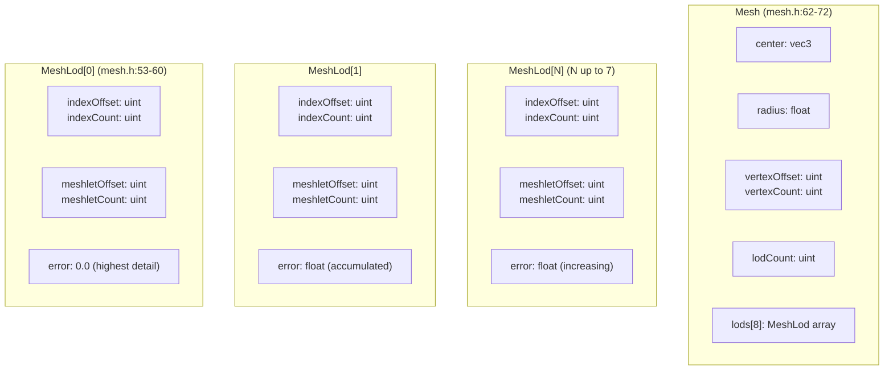
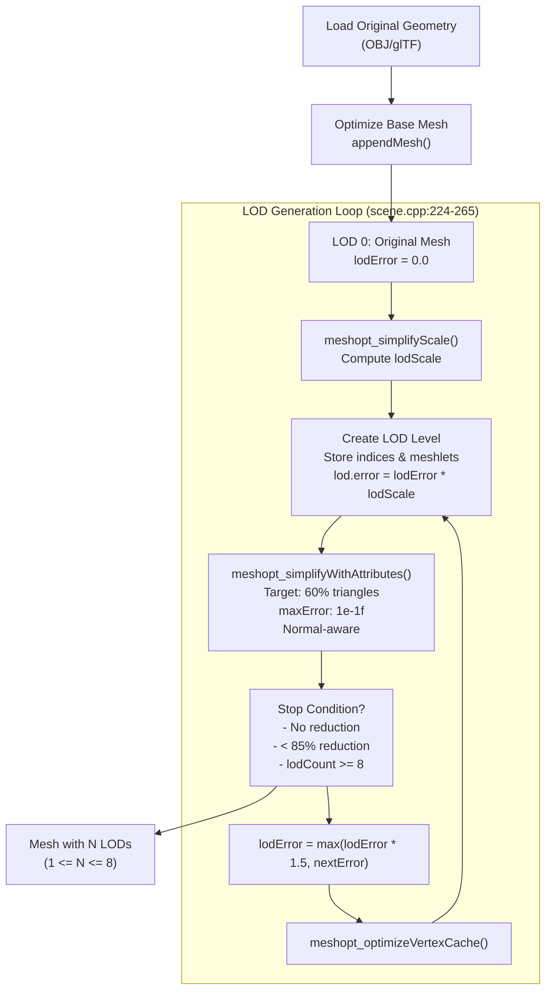
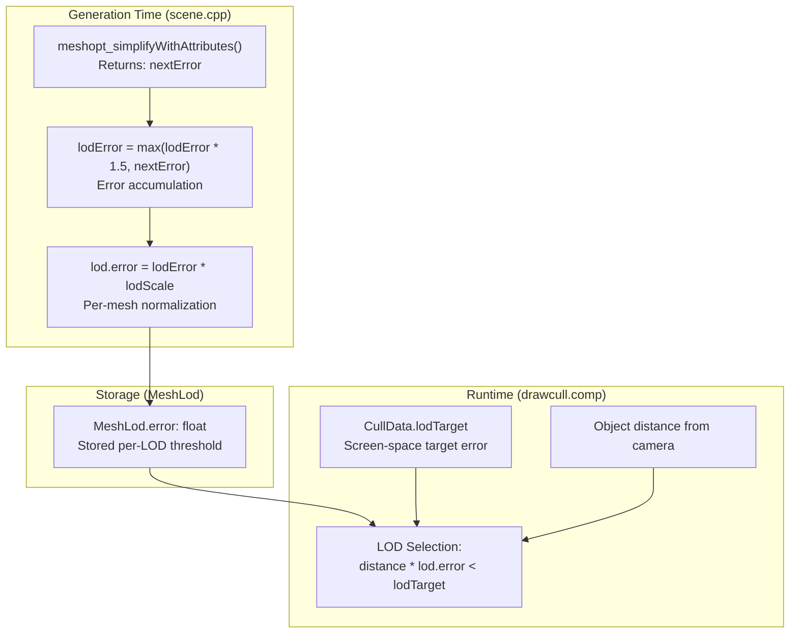
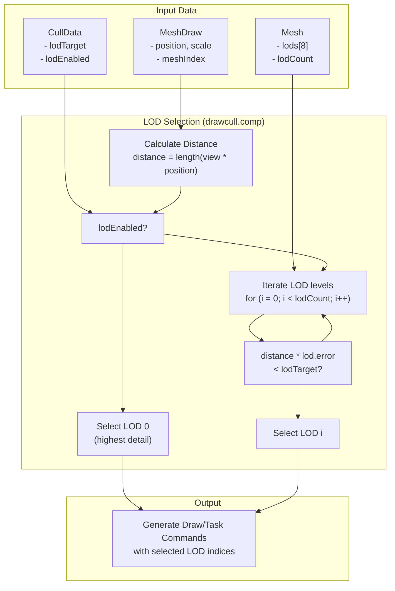
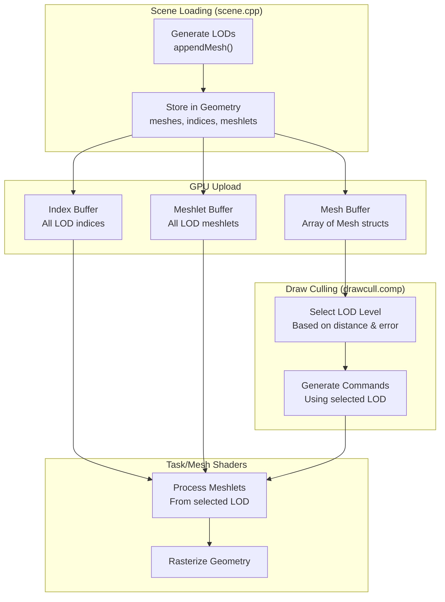

# Level of Detail System

> **Relevant source files**
> * [src/scene.cpp](https://github.com/zeux/niagara/blob/6f3fb529/src/scene.cpp)
> * [src/shaders/mesh.h](https://github.com/zeux/niagara/blob/6f3fb529/src/shaders/mesh.h)

## Purpose and Scope

The Level of Detail (LOD) system in Niagara automatically generates and selects progressively simplified versions of mesh geometry to optimize rendering performance based on distance and screen-space error. This system reduces geometric complexity for distant objects while maintaining visual quality for nearby geometry.

This document covers:

* Automatic LOD generation using mesh simplification
* Error metric calculation and accumulation
* Runtime LOD selection during draw culling

For information about meshlet generation for each LOD level, see [Meshlet Generation and Optimization](/zeux/niagara/10.1-meshlet-generation-and-optimization). For details on how LOD selection integrates with the culling pipeline, see [Draw Culling Pipeline](/zeux/niagara/7.1-draw-culling-pipeline). For the underlying mesh data structures, see [Geometry Data Structures](/zeux/niagara/5.2-geometry-data-structures).

---

## LOD Data Structures

The LOD system uses a hierarchical representation where each `Mesh` contains up to 8 LOD levels (`MeshLod`), each with its own geometry and error metric.

### Mesh and MeshLod Structures



**Structure Details:**

| Field | Type | Purpose |
| --- | --- | --- |
| `Mesh.lodCount` | `uint` | Number of valid LOD levels (1-8) |
| `Mesh.lods[8]` | `MeshLod[8]` | Array of LOD levels, ordered from finest to coarsest |
| `MeshLod.indexOffset` | `uint` | Starting position in global index buffer |
| `MeshLod.indexCount` | `uint` | Number of indices for this LOD |
| `MeshLod.meshletOffset` | `uint` | Starting position in meshlet array |
| `MeshLod.meshletCount` | `uint` | Number of meshlets for this LOD |
| `MeshLod.error` | `float` | Screen-space error threshold for this LOD |

**Sources:** [src/shaders/mesh.h L53-L72](https://github.com/zeux/niagara/blob/6f3fb529/src/shaders/mesh.h#L53-L72)

---

## Automatic LOD Generation

LOD levels are generated automatically during scene loading using meshoptimizer's mesh simplification algorithm. The process creates progressively coarser representations of the original mesh geometry.

### LOD Generation Pipeline



### Generation Process Details

The LOD generation occurs in the `appendMesh` function and follows these steps:

1. **Initialize LOD 0** ([src/scene.cpp L217-L220](https://github.com/zeux/niagara/blob/6f3fb529/src/scene.cpp#L217-L220) ): * Store the original (optimized) mesh as LOD 0 * Set `lodError = 0.f` for the base level
2. **Compute Scale Factor** ([src/scene.cpp L217](https://github.com/zeux/niagara/blob/6f3fb529/src/scene.cpp#L217-L217) ): * Use `meshopt_simplifyScale()` to normalize error metrics based on mesh size * This ensures consistent error thresholds across different mesh scales
3. **Iterative Simplification** ([src/scene.cpp L224-L265](https://github.com/zeux/niagara/blob/6f3fb529/src/scene.cpp#L224-L265) ): ``` while (mesh.lodCount < 8):     a. Store current LOD indices and meshlets     b. Calculate lod.error = lodError * lodScale     c. Simplify mesh to 60% of current triangles     d. Check termination conditions     e. Accumulate error: lodError = max(lodError * 1.5, nextError)     f. Optimize vertex cache for new LOD ```
4. **Termination Conditions** ([src/scene.cpp L249-L255](https://github.com/zeux/niagara/blob/6f3fb529/src/scene.cpp#L249-L255) ): * **Error bound reached**: No further simplification possible within maxError * **No reduction**: `nextIndices == lodIndices.size()` * **Minimal reduction**: `nextIndices >= lodIndices.size() * 0.85` * **Maximum LODs**: Already have 8 LOD levels

**Sources:** [src/scene.cpp L164-L268](https://github.com/zeux/niagara/blob/6f3fb529/src/scene.cpp#L164-L268)

 [src/shaders/mesh.h L53-L72](https://github.com/zeux/niagara/blob/6f3fb529/src/shaders/mesh.h#L53-L72)

---

## Error Metric Calculation

The error metric determines when to switch between LOD levels at runtime. Niagara uses a screen-space error metric that accounts for mesh simplification quality and viewing distance.

### Error Calculation Diagram



### Error Metric Components

| Component | Purpose | Calculation |
| --- | --- | --- |
| **Simplification Error** | Raw error from meshoptimizer | Output of `meshopt_simplifyWithAttributes()` |
| **Error Accumulation** | Compounds error across LOD chain | `max(lodError * 1.5, nextError)` per iteration |
| **Scale Normalization** | Adjusts for mesh size | Multiply by `meshopt_simplifyScale()` result |
| **Screen-Space Target** | Runtime threshold | `CullData.lodTarget` at z=1 distance |

### Error Accumulation Strategy

The error accumulates with a 1.5× multiplier to ensure progressive degradation ([src/scene.cpp L258](https://github.com/zeux/niagara/blob/6f3fb529/src/scene.cpp#L258-L258)

):

```
LOD 0: error = 0.0
LOD 1: error = (nextError₁) * lodScale
LOD 2: error = max(error₁ * 1.5, nextError₂) * lodScale
LOD 3: error = max(error₂ * 1.5, nextError₃) * lodScale
...
```

This ensures that:

* Each LOD has strictly increasing error values
* Error bounds remain conservative even if simplification quality varies
* LOD transitions are stable and predictable

**Sources:** [src/scene.cpp L217-L265](https://github.com/zeux/niagara/blob/6f3fb529/src/scene.cpp#L217-L265)

 [src/shaders/mesh.h L26-L44](https://github.com/zeux/niagara/blob/6f3fb529/src/shaders/mesh.h#L26-L44)

---

## Runtime LOD Selection

During the draw culling pass, the system selects the appropriate LOD level for each draw based on viewing distance and the configured error target.

### LOD Selection Pipeline



### Selection Algorithm

The LOD selection follows this logic:

1. **Distance Calculation**: * Transform draw position to view space * Calculate distance from camera
2. **LOD Iteration** (highest to lowest detail): ```sql for (lod_index = 0; lod_index < mesh.lodCount; lod_index++):     if (distance * mesh.lods[lod_index].error < cullData.lodTarget):         select mesh.lods[lod_index]         break ```
3. **Error Threshold Test**: * Lower LOD indices (higher detail) have smaller error values * Closer objects (smaller distance) require lower error * First LOD where `distance * error < target` is selected

### LOD Selection Example

Given a mesh at varying distances with `lodTarget = 0.5`:

| Distance | LOD 0 (error=0.0) | LOD 1 (error=0.05) | LOD 2 (error=0.12) | LOD 3 (error=0.25) | Selected |
| --- | --- | --- | --- | --- | --- |
| 1.0 | 0.0 < 0.5 ✓ | — | — | — | LOD 0 |
| 5.0 | 0.0 < 0.5 ✓ | — | — | — | LOD 0 |
| 12.0 | 0.0 < 0.5 ✓ | — | — | — | LOD 0 |
| 15.0 | — | 0.75 > 0.5 ✗ | 1.8 > 0.5 ✗ | 3.75 > 0.5 ✗ | LOD 3 |
| 8.0 | 0.0 < 0.5 ✓ | — | — | — | LOD 0 |

**Note:** LOD 0 has error=0.0, so it always passes the test. The algorithm iterates from finest to coarsest, selecting the first LOD that meets the threshold.

**Sources:** [src/shaders/mesh.h L26-L44](https://github.com/zeux/niagara/blob/6f3fb529/src/shaders/mesh.h#L26-L44)

 [src/shaders/drawcull.comp](https://github.com/zeux/niagara/blob/6f3fb529/src/shaders/drawcull.comp)

---

## Configuration Parameters

The LOD system is controlled by several configuration parameters that affect generation quality and runtime behavior.

### Generation Parameters

| Parameter | Value | Location | Purpose |
| --- | --- | --- | --- |
| **maxError** | `1e-1f` | [src/scene.cpp L241](https://github.com/zeux/niagara/blob/6f3fb529/src/scene.cpp#L241-L241) | Maximum simplification error per step |
| **targetRatio** | `0.6` | [src/scene.cpp L244](https://github.com/zeux/niagara/blob/6f3fb529/src/scene.cpp#L244-L244) | Triangle count reduction target (60%) |
| **minReduction** | `0.85` | [src/scene.cpp L254](https://github.com/zeux/niagara/blob/6f3fb529/src/scene.cpp#L254-L254) | Minimum effective reduction threshold |
| **errorMultiplier** | `1.5` | [src/scene.cpp L258](https://github.com/zeux/niagara/blob/6f3fb529/src/scene.cpp#L258-L258) | Error accumulation growth factor |
| **normalWeights** | `{1, 1, 1}` | [src/scene.cpp L222](https://github.com/zeux/niagara/blob/6f3fb529/src/scene.cpp#L222-L222) | Attribute importance for simplification |
| **maxLODs** | `8` | [src/shaders/mesh.h L71](https://github.com/zeux/niagara/blob/6f3fb529/src/shaders/mesh.h#L71-L71) | Maximum LOD levels per mesh |

### Runtime Parameters

| Parameter | Type | Location | Purpose |
| --- | --- | --- | --- |
| **lodTarget** | `float` | `CullData` ([src/shaders/mesh.h L32](https://github.com/zeux/niagara/blob/6f3fb529/src/shaders/mesh.h#L32-L32) <br> ) | Screen-space error target at z=1 |
| **lodEnabled** | `int` | `CullData` ([src/shaders/mesh.h L38](https://github.com/zeux/niagara/blob/6f3fb529/src/shaders/mesh.h#L38-L38) <br> ) | Enable/disable LOD selection |

### Simplification Options

The system uses `meshopt_SimplifySparse` flag ([src/scene.cpp L242](https://github.com/zeux/niagara/blob/6f3fb529/src/scene.cpp#L242-L242)

), which:

* Preserves mesh topology better for sparse meshes
* Maintains boundary edges
* Produces higher quality results for complex geometry

**Sources:** [src/scene.cpp L217-L265](https://github.com/zeux/niagara/blob/6f3fb529/src/scene.cpp#L217-L265)

 [src/shaders/mesh.h L26-L44](https://github.com/zeux/niagara/blob/6f3fb529/src/shaders/mesh.h#L26-L44)

---

## Integration with Rendering Pipeline

The LOD system integrates with multiple stages of the rendering pipeline:



### Pipeline Integration Points

1. **Scene Loading**: LODs generated during `appendMesh()` call
2. **Buffer Upload**: All LOD data uploaded to GPU in contiguous arrays
3. **Draw Culling**: LOD selected per-draw in compute shader
4. **Task Submission**: Selected LOD's meshlets dispatched to task shader
5. **Mesh Shading**: Meshlets from selected LOD processed and rasterized

The LOD system seamlessly integrates with meshlet generation ([see Meshlet Generation](/zeux/niagara/10.1-meshlet-generation-and-optimization)) and occlusion culling ([see Occlusion Culling](/zeux/niagara/10.3-occlusion-culling)), ensuring that only visible, appropriately detailed geometry is processed.

**Sources:** [src/scene.cpp L164-L268](https://github.com/zeux/niagara/blob/6f3fb529/src/scene.cpp#L164-L268)

 [src/shaders/mesh.h L53-L72](https://github.com/zeux/niagara/blob/6f3fb529/src/shaders/mesh.h#L53-L72)