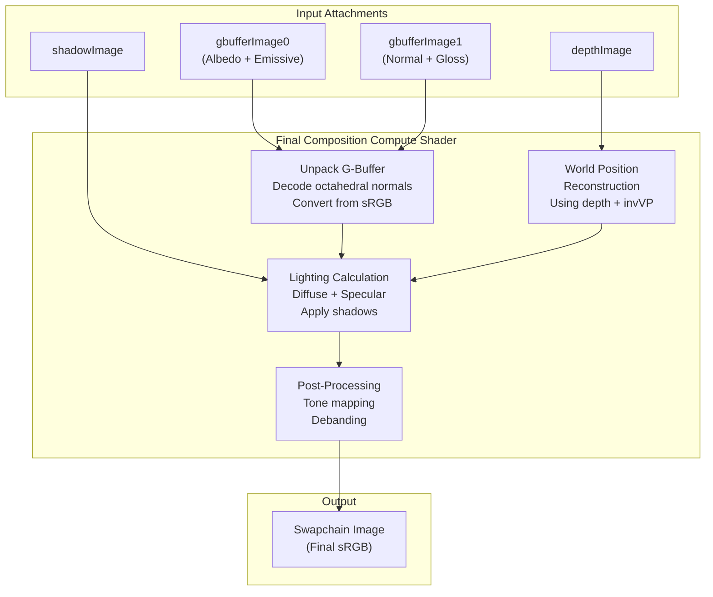
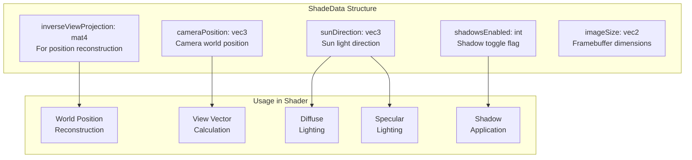
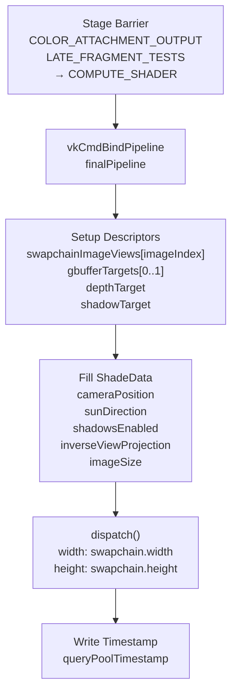
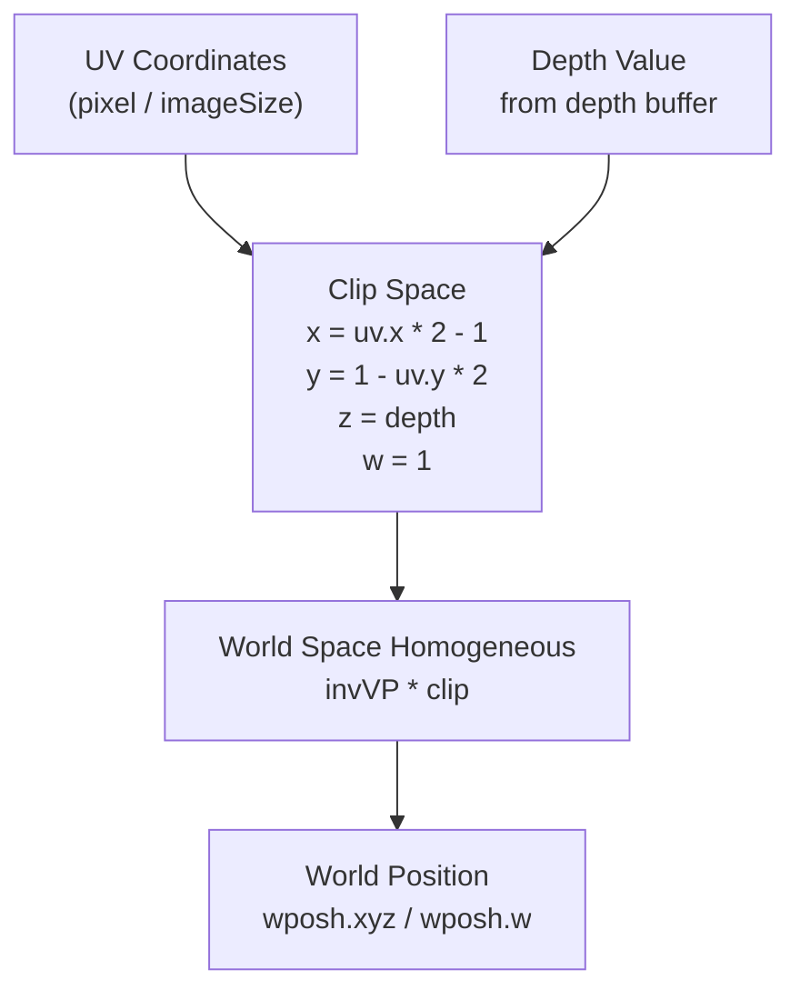
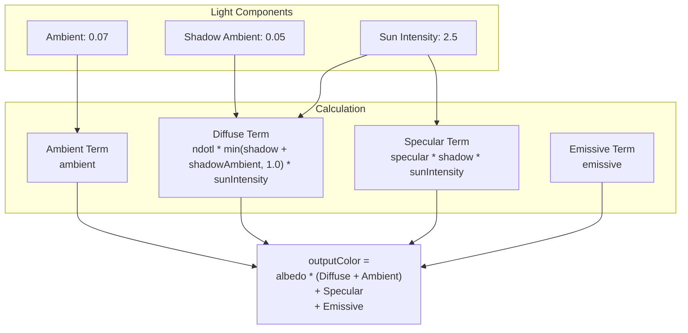
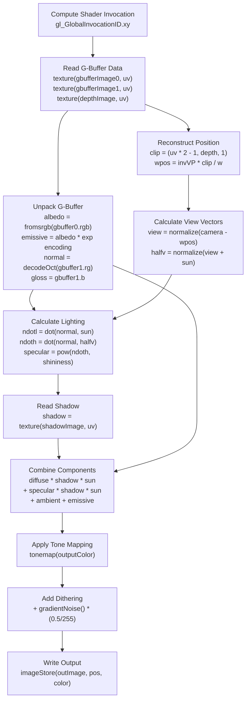

# Lighting and Final Composition

> **Relevant source files**
> * [src/niagara.cpp](https://github.com/zeux/niagara/blob/6f3fb529/src/niagara.cpp)
> * [src/shaders/final.comp.glsl](https://github.com/zeux/niagara/blob/6f3fb529/src/shaders/final.comp.glsl)
> * [src/shaders/math.h](https://github.com/zeux/niagara/blob/6f3fb529/src/shaders/math.h)

## Purpose and Scope

This page documents the final composition pass of the deferred rendering pipeline, which combines G-buffer data with shadow information to produce the final shaded image. This compute shader-based pass performs lighting calculations, applies shadows, and performs tone mapping to generate the output that is presented to the swapchain.

For information about how the G-buffer is generated, see [G-Buffer Generation](/zeux/niagara/8.2-g-buffer-generation). For details on shadow ray tracing, see [Shadow Ray Tracing](/zeux/niagara/9.2-shadow-ray-tracing).

## Final Composition Overview

The final composition pass is implemented as a compute shader that reads from the G-buffer attachments, depth buffer, and shadow map to produce the final image. It runs as the last major step before UI rendering, operating on a per-pixel basis to apply lighting, shadowing, and tone mapping.



**Sources:** [src/shaders/final.comp.glsl L1-L72](https://github.com/zeux/niagara/blob/6f3fb529/src/shaders/final.comp.glsl#L1-L72)

 [src/niagara.cpp L1536-L1557](https://github.com/zeux/niagara/blob/6f3fb529/src/niagara.cpp#L1536-L1557)

## Shader Program Configuration

The final composition shader is a compute shader with an 8×8 local workgroup size, dispatched to cover the entire framebuffer. The program is created during initialization and uses push constants and descriptor bindings to access input data.

### Program Creation and Pipeline

| Component | Details |
| --- | --- |
| **Shader** | `final.comp` compiled from GLSL to SPIR-V |
| **Bind Point** | `VK_PIPELINE_BIND_POINT_COMPUTE` |
| **Local Size** | 8×8×1 workgroups |
| **Push Constants** | `ShadeData` structure (64 bytes) |
| **Descriptor Count** | 5 sampled/storage images |

**Sources:** [src/niagara.cpp L480](https://github.com/zeux/niagara/blob/6f3fb529/src/niagara.cpp#L480-L480)

 [src/niagara.cpp L559](https://github.com/zeux/niagara/blob/6f3fb529/src/niagara.cpp#L559-L559)

 [src/shaders/final.comp.glsl L7](https://github.com/zeux/niagara/blob/6f3fb529/src/shaders/final.comp.glsl#L7-L7)

## Data Structures and Shader Bindings

### ShadeData Push Constants

The `ShadeData` structure provides per-frame parameters for the lighting calculations:



**Sources:** [src/niagara.cpp L166-L176](https://github.com/zeux/niagara/blob/6f3fb529/src/niagara.cpp#L166-L176)

 [src/shaders/final.comp.glsl L9-L23](https://github.com/zeux/niagara/blob/6f3fb529/src/shaders/final.comp.glsl#L9-L23)

### Descriptor Bindings

The shader uses five descriptor bindings to access image data:

| Binding | Type | Format | Purpose |
| --- | --- | --- | --- |
| 0 | Storage Image | `writeonly image2D` | Output swapchain image |
| 1 | Sampled Image | `sampler2D` | G-buffer 0 (albedo + emissive) |
| 2 | Sampled Image | `sampler2D` | G-buffer 1 (normal + gloss) |
| 3 | Sampled Image | `sampler2D` | Depth buffer |
| 4 | Sampled Image | `sampler2D` | Shadow map |

**Sources:** [src/shaders/final.comp.glsl L25-L31](https://github.com/zeux/niagara/blob/6f3fb529/src/shaders/final.comp.glsl#L25-L31)

 [src/niagara.cpp L1544](https://github.com/zeux/niagara/blob/6f3fb529/src/niagara.cpp#L1544-L1544)

## Shader Dispatch

The final composition pass is dispatched from the main rendering loop after all geometry rendering and shadow generation is complete:



**Sources:** [src/niagara.cpp L1463](https://github.com/zeux/niagara/blob/6f3fb529/src/niagara.cpp#L1463-L1463)

 [src/niagara.cpp L1536-L1557](https://github.com/zeux/niagara/blob/6f3fb529/src/niagara.cpp#L1536-L1557)

## G-Buffer Data Unpacking

The shader reads G-buffer data at each pixel location and unpacks the encoded information:

### G-Buffer 0: Albedo and Emissive

G-buffer 0 stores albedo in RGB and emissive encoding in alpha:

* **RGB**: sRGB-encoded albedo color
* **Alpha**: Emissive intensity encoded as `exp2(alpha * 5) - 1`

```
vec3 albedo = fromsrgb(gbuffer0.rgb);
vec3 emissive = albedo * (exp2(gbuffer0.a * 5) - 1);
```

**Sources:** [src/shaders/final.comp.glsl L42-L43](https://github.com/zeux/niagara/blob/6f3fb529/src/shaders/final.comp.glsl#L42-L43)

### G-Buffer 1: Normal and Gloss

G-buffer 1 stores octahedral-encoded normals in RG and gloss in B:

* **RG**: Octahedral-encoded normal (stored in [0,1], decoded from [-1,1])
* **B**: Gloss/smoothness factor [0,1]

```
vec3 normal = decodeOct(gbuffer1.rg * 2 - 1);
float gloss = gbuffer1.b;
```

The `decodeOct` function reconstructs the full 3D normal vector from the 2D octahedral encoding, ensuring unit length.

**Sources:** [src/shaders/final.comp.glsl L44](https://github.com/zeux/niagara/blob/6f3fb529/src/shaders/final.comp.glsl#L44-L44)

 [src/shaders/final.comp.glsl L55](https://github.com/zeux/niagara/blob/6f3fb529/src/shaders/final.comp.glsl#L55-L55)

 [src/shaders/math.h L43-L50](https://github.com/zeux/niagara/blob/6f3fb529/src/shaders/math.h#L43-L50)

## World Position Reconstruction

The shader reconstructs world-space position from screen-space UV coordinates and depth using the inverse view-projection matrix:



**Sources:** [src/shaders/final.comp.glsl L48-L50](https://github.com/zeux/niagara/blob/6f3fb529/src/shaders/final.comp.glsl#L48-L50)

## Lighting Model

The shader implements a simple Blinn-Phong lighting model with ambient, diffuse, and specular components:

### Diffuse Lighting

Diffuse lighting is computed using Lambert's cosine law:

```
float ndotl = max(dot(normal, sunDirection), 0.0);
```

**Sources:** [src/shaders/final.comp.glsl L46](https://github.com/zeux/niagara/blob/6f3fb529/src/shaders/final.comp.glsl#L46-L46)

### Specular Lighting

Specular highlights use a Blinn-Phong model with gloss-dependent shininess:

```
vec3 view = normalize(cameraPosition - wpos);
vec3 halfv = normalize(view + sunDirection);
float ndoth = max(dot(normal, halfv), 0.0);
float specular = pow(ndoth, mix(1, 64, gloss)) * gloss;
```

The specular exponent ranges from 1 (rough) to 64 (glossy) based on the gloss parameter.

**Sources:** [src/shaders/final.comp.glsl L52-L58](https://github.com/zeux/niagara/blob/6f3fb529/src/shaders/final.comp.glsl#L52-L58)

### Shadow Application

Shadow values are sampled from the shadow map and applied to both diffuse and specular terms:

```
float shadow = texture(shadowImage, uv).r;
```

The shadow value is clamped with a minimum ambient occlusion to ensure surfaces are never completely black:

**Sources:** [src/shaders/final.comp.glsl L60-L62](https://github.com/zeux/niagara/blob/6f3fb529/src/shaders/final.comp.glsl#L60-L62)

### Final Lighting Equation

The complete lighting equation combines all components:



**Sources:** [src/shaders/final.comp.glsl L64-L68](https://github.com/zeux/niagara/blob/6f3fb529/src/shaders/final.comp.glsl#L64-L68)

## Post-Processing

After lighting calculations, the output color undergoes post-processing before being written to the swapchain.

### Tone Mapping

The shader uses a filmic tone mapping operator optimized by Jim Hejl and Richard Burgess-Dawson:

```
vec3 tonemap(vec3 c)
{
    vec3 x = max(vec3(0), c - 0.004);
    return (x * (6.2 * x + .5)) / (x * (6.2 * x + 1.7) + 0.06);
}
```

This operator maps high dynamic range (HDR) values to the [0,1] range suitable for display, providing a natural-looking contrast curve.

**Sources:** [src/shaders/math.h L74-L78](https://github.com/zeux/niagara/blob/6f3fb529/src/shaders/math.h#L74-L78)

 [src/shaders/final.comp.glsl L71](https://github.com/zeux/niagara/blob/6f3fb529/src/shaders/final.comp.glsl#L71-L71)

### Debanding

To prevent visible banding artifacts in gradients, the shader applies gradient noise dithering:

```
float deband = gradientNoise(vec2(pos)) * 2 - 1;
imageStore(outImage, ivec2(pos), vec4(tonemap(outputColor) + deband * (0.5 / 255), 1.0));
```

The `gradientNoise` function generates pseudo-random noise based on screen position, which is scaled to ±0.5 bits per channel and added to the final color.

**Sources:** [src/shaders/final.comp.glsl L70-L71](https://github.com/zeux/niagara/blob/6f3fb529/src/shaders/final.comp.glsl#L70-L71)

 [src/shaders/math.h L82-L85](https://github.com/zeux/niagara/blob/6f3fb529/src/shaders/math.h#L82-L85)

## Complete Processing Pipeline

The following diagram shows the complete data flow through the final composition shader:



**Sources:** [src/shaders/final.comp.glsl L33-L72](https://github.com/zeux/niagara/blob/6f3fb529/src/shaders/final.comp.glsl#L33-L72)

## Performance Considerations

The final composition pass is highly parallel and benefits from several optimizations:

### Compute Workgroup Size

The 8×8 workgroup size provides a good balance between occupancy and cache locality:

* **Workgroup size**: 64 threads matches typical GPU SIMD widths
* **Memory access**: Neighboring pixels access nearby texels, improving cache hit rates
* **Dispatch overhead**: Reduces total number of workgroups compared to smaller sizes

**Sources:** [src/shaders/final.comp.glsl L7](https://github.com/zeux/niagara/blob/6f3fb529/src/shaders/final.comp.glsl#L7-L7)

### Texture Sampling

The shader uses point sampling (`readSampler` with `VK_FILTER_NEAREST`) for G-buffer and shadow reads to avoid interpolation overhead and maintain exact data values:

**Sources:** [src/niagara.cpp L436](https://github.com/zeux/niagara/blob/6f3fb529/src/niagara.cpp#L436-L436)

 [src/niagara.cpp L1544](https://github.com/zeux/niagara/blob/6f3fb529/src/niagara.cpp#L1544-L1544)

### Push Constants

The `ShadeData` structure is passed via push constants for optimal performance, avoiding descriptor indirection:

**Sources:** [src/niagara.cpp L1546-L1551](https://github.com/zeux/niagara/blob/6f3fb529/src/niagara.cpp#L1546-L1551)