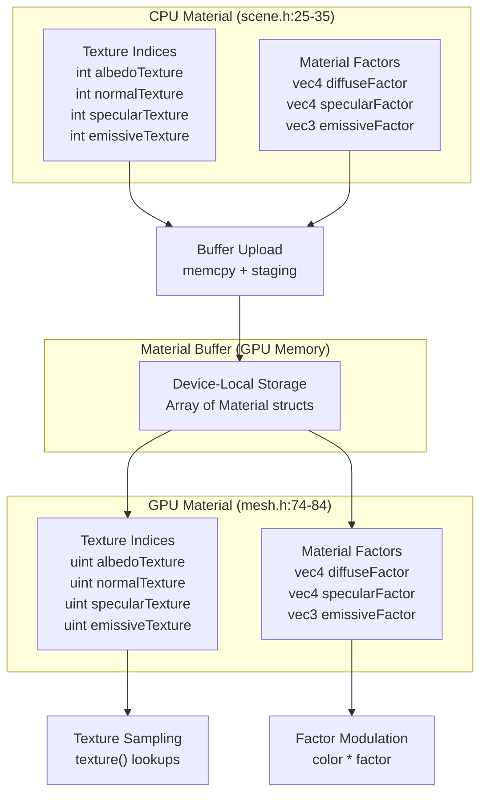
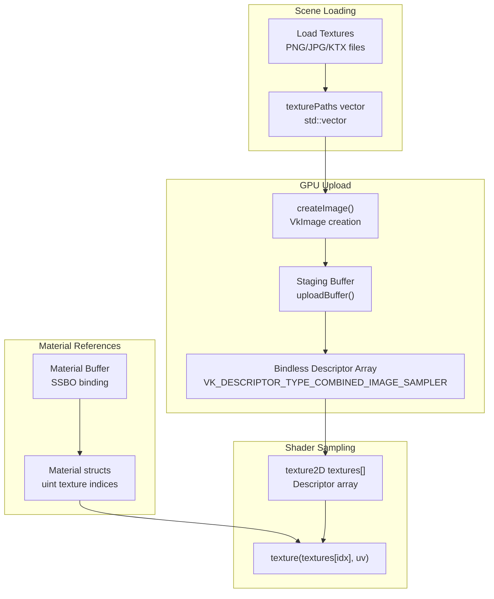
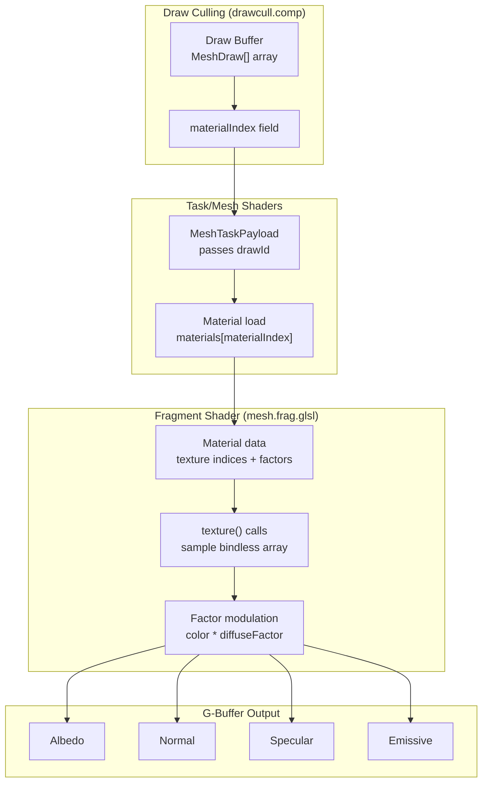
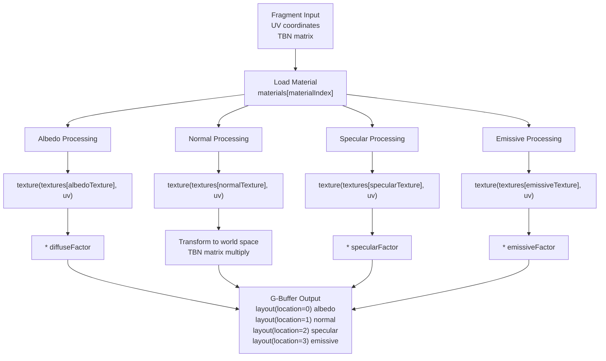

# Materials and Textures

> **Relevant source files**
> * [src/scene.h](https://github.com/zeux/niagara/blob/6f3fb529/src/scene.h)
> * [src/shaders/mesh.h](https://github.com/zeux/niagara/blob/6f3fb529/src/shaders/mesh.h)

## Purpose and Scope

This document describes the material system and texture management in Niagara. Materials define the visual appearance of rendered geometry through texture references and material factor coefficients. The system supports physically-based rendering (PBR) materials with albedo, normal, specular, and emissive properties.

For information about geometry data structures that reference materials, see [Geometry Data Structures](/zeux/niagara/5.2-geometry-data-structures). For details on how materials are used during shading, see [G-Buffer Generation](/zeux/niagara/8.2-g-buffer-generation) and [Lighting and Final Composition](/zeux/niagara/8.3-lighting-and-final-composition).

---

## Material Data Structure

The material system maintains parallel data structures on the CPU and GPU to represent material properties. Both versions are memory-layout compatible to enable direct buffer uploads.

### CPU-Side Material Structure

The CPU-side material structure is defined in [src/scene.h L25-L35](https://github.com/zeux/niagara/blob/6f3fb529/src/scene.h#L25-L35)

:

```
struct alignas(16) Material
{
    int albedoTexture;
    int normalTexture;
    int specularTexture;
    int emissiveTexture;

    vec4 diffuseFactor;
    vec4 specularFactor;
    vec3 emissiveFactor;
};
```

The `alignas(16)` ensures the structure matches GPU alignment requirements. Texture fields store signed integers where `-1` indicates no texture is bound for that channel.

### GPU-Side Material Structure

The GPU-side material structure in [src/shaders/mesh.h L74-L84](https://github.com/zeux/niagara/blob/6f3fb529/src/shaders/mesh.h#L74-L84)

 mirrors the CPU layout:

```
struct Material
{
    uint albedoTexture;
    uint normalTexture;
    uint specularTexture;
    uint emissiveTexture;

    vec4 diffuseFactor;
    vec4 specularFactor;
    vec3 emissiveFactor;
};
```

The shader version uses `uint` for texture indices to match binding point requirements, but the memory layout remains identical.

### Material Structure Diagram



**Sources:** [src/scene.h L25-L35](https://github.com/zeux/niagara/blob/6f3fb529/src/scene.h#L25-L35)

 [src/shaders/mesh.h L74-L84](https://github.com/zeux/niagara/blob/6f3fb529/src/shaders/mesh.h#L74-L84)

---

## Material Fields

### Texture Indices

The four texture index fields reference positions in a bindless texture array:

| Field | Purpose | Typical Content |
| --- | --- | --- |
| `albedoTexture` | Base color/diffuse map | sRGB color texture |
| `normalTexture` | Tangent-space normal map | Linear RGB normal vectors |
| `specularTexture` | Specular/roughness map | Linear RGB PBR parameters |
| `emissiveTexture` | Emissive/glow map | sRGB emissive intensity |

A value of `-1` (CPU) or a sentinel value (GPU) indicates the channel should use only the material factor without texture sampling.

### Material Factors

Material factors provide per-material color modulation and default values when textures are absent:

| Factor | Type | Purpose |
| --- | --- | --- |
| `diffuseFactor` | `vec4` | RGBA multiplier for albedo (alpha may encode transparency) |
| `specularFactor` | `vec4` | RGB specular tint, A may encode roughness/metallic |
| `emissiveFactor` | `vec3` | RGB additive emissive color |

Factors are applied multiplicatively (diffuse, specular) or additively (emissive) to texture samples during shading.

**Sources:** [src/scene.h L25-L35](https://github.com/zeux/niagara/blob/6f3fb529/src/scene.h#L25-L35)

 [src/shaders/mesh.h L74-L84](https://github.com/zeux/niagara/blob/6f3fb529/src/shaders/mesh.h#L74-L84)

---

## Bindless Texture System

Niagara uses bindless texture arrays to enable efficient random access to textures without descriptor set switching. Each material stores integer indices into a large descriptor array rather than binding individual textures per draw call.

### Texture Array Organization



### Texture Loading Pipeline

Scene loading (via `loadScene` in [src/scene.h L114](https://github.com/zeux/niagara/blob/6f3fb529/src/scene.h#L114-L114)

) populates a `std::vector<std::string>` containing texture file paths. These paths are processed during initialization:

1. Texture images are decoded from disk (PNG, JPEG, KTX formats)
2. Images are uploaded to GPU via staging buffers
3. VkImageView objects are created for each texture
4. Image views are bound to a large descriptor array
5. Material structs store indices into this array

**Sources:** [src/scene.h L114](https://github.com/zeux/niagara/blob/6f3fb529/src/scene.h#L114-L114)

---

## Material Assignment to Geometry

Materials are assigned to geometry through the `MeshDraw` structure, which associates a draw instance with a material index.

### MeshDraw Material Reference

The `MeshDraw` structure in [src/scene.h L37-L47](https://github.com/zeux/niagara/blob/6f3fb529/src/scene.h#L37-L47)

 and [src/shaders/mesh.h L86-L96](https://github.com/zeux/niagara/blob/6f3fb529/src/shaders/mesh.h#L86-L96)

 contains:

```
struct MeshDraw
{
    vec3 position;
    float scale;
    quat orientation;

    uint meshIndex;
    uint meshletVisibilityOffset;
    uint postPass;
    uint materialIndex;  // Index into material buffer
};
```

The `materialIndex` field references an entry in the material buffer. During rendering, shaders load the material using this index and access textures via the material's texture indices.

### Material Access Flow



**Sources:** [src/scene.h L37-L47](https://github.com/zeux/niagara/blob/6f3fb529/src/scene.h#L37-L47)

 [src/shaders/mesh.h L86-L96](https://github.com/zeux/niagara/blob/6f3fb529/src/shaders/mesh.h#L86-L96)

---

## Material Buffer Organization

Materials are stored in a device-local buffer as a contiguous array of `Material` structures. This buffer is bound as an SSBO (Shader Storage Buffer Object) in descriptor sets used by rendering shaders.

### Buffer Layout

| Offset | Content | Size |
| --- | --- | --- |
| 0 | Material[0] | 64 bytes |
| 64 | Material[1] | 64 bytes |
| 128 | Material[2] | 64 bytes |
| ... | ... | ... |
| N * 64 | Material[N] | 64 bytes |

The 64-byte size accounts for 16-byte alignment of the structure and padding for GPU access patterns.

### Shader Access Pattern

In shaders, the material buffer is accessed via:

```
layout(binding = X) readonly buffer Materials
{
    Material materials[];
};

Material mat = materials[draw.materialIndex];
```

The read-only qualifier enables GPU-side caching optimizations. Index bounds are validated during scene loading to prevent out-of-bounds access.

**Sources:** [src/scene.h L25-L35](https://github.com/zeux/niagara/blob/6f3fb529/src/scene.h#L25-L35)

 [src/shaders/mesh.h L74-L84](https://github.com/zeux/niagara/blob/6f3fb529/src/shaders/mesh.h#L74-L84)

---

## Scene Loading Integration

Materials are loaded as part of the scene loading pipeline alongside geometry and texture data.

### Scene File Processing

The `loadScene` function in [src/scene.h L114](https://github.com/zeux/niagara/blob/6f3fb529/src/scene.h#L114-L114)

 populates several output vectors:

```javascript
bool loadScene(
    Geometry& geometry,
    std::vector<Material>& materials,      // Material array output
    std::vector<MeshDraw>& draws,
    std::vector<std::string>& texturePaths, // Texture paths output
    std::vector<Animation>& animations,
    Camera& camera,
    vec3& sunDirection,
    const char* path,
    bool buildMeshlets,
    bool fast = false,
    bool clrt = false
);
```

The function parses OBJ or glTF scene files to extract:

* Material definitions with texture references
* Texture file paths relative to the scene file
* Assignments of materials to mesh instances

### Scene Cache Support

Scene data including materials can be cached to disk for faster loading:

* `saveSceneCache` in [src/scene.h L116](https://github.com/zeux/niagara/blob/6f3fb529/src/scene.h#L116-L116)  serializes materials and texture paths
* `loadSceneCache` in [src/scene.h L117](https://github.com/zeux/niagara/blob/6f3fb529/src/scene.h#L117-L117)  deserializes cached material data

Cached scenes avoid re-parsing source files and re-generating LOD/meshlet data.

**Sources:** [src/scene.h L114](https://github.com/zeux/niagara/blob/6f3fb529/src/scene.h#L114-L114)

 [src/scene.h L116-L117](https://github.com/zeux/niagara/blob/6f3fb529/src/scene.h#L116-L117)

---

## Material Usage in Rendering

Materials are accessed throughout the rendering pipeline to determine surface appearance.

### Fragment Shader Material Application

During G-buffer generation, fragment shaders sample textures and apply material factors:



### Texture Sampling Patterns

For each material channel, the shader follows this pattern:

1. Check if texture index is valid (not `-1` or sentinel)
2. If valid: Sample texture using UV coordinates
3. If invalid: Use default color (white for albedo, zero for emissive, etc.)
4. Multiply/add the material factor
5. Write result to G-buffer attachment

Normal maps require additional processing to transform from tangent space to world space using the TBN (tangent, bitangent, normal) matrix computed from vertex attributes.

**Sources:** [src/shaders/mesh.h L74-L84](https://github.com/zeux/niagara/blob/6f3fb529/src/shaders/mesh.h#L74-L84)

 [src/scene.h L25-L35](https://github.com/zeux/niagara/blob/6f3fb529/src/scene.h#L25-L35)

---

## Material System Summary

The material system provides a simple but flexible PBR material model:

| Component | CPU Structure | GPU Structure | Storage |
| --- | --- | --- | --- |
| Material definitions | `Material` in scene.h | `Material` in mesh.h | Device-local buffer |
| Texture references | `int` indices | `uint` indices | Bindless descriptor array |
| Material factors | `vec3`/`vec4` factors | `vec3`/`vec4` factors | Inline in Material struct |
| Assignment | `materialIndex` in MeshDraw | `materialIndex` in MeshDraw | Draw buffer |

The design emphasizes:

* **Memory layout compatibility**: CPU and GPU structures share identical layouts
* **Bindless access**: Materials reference textures via integer indices into a large array
* **Cache efficiency**: Materials stored contiguously for sequential access patterns
* **Flexibility**: Factor-based defaults allow materials without textures

This architecture enables efficient material switching without descriptor set updates, supporting GPU-driven rendering with minimal CPU involvement.

**Sources:** [src/scene.h L25-L47](https://github.com/zeux/niagara/blob/6f3fb529/src/scene.h#L25-L47)

 [src/shaders/mesh.h L74-L96](https://github.com/zeux/niagara/blob/6f3fb529/src/shaders/mesh.h#L74-L96)

 [src/scene.h L114-L117](https://github.com/zeux/niagara/blob/6f3fb529/src/scene.h#L114-L117)