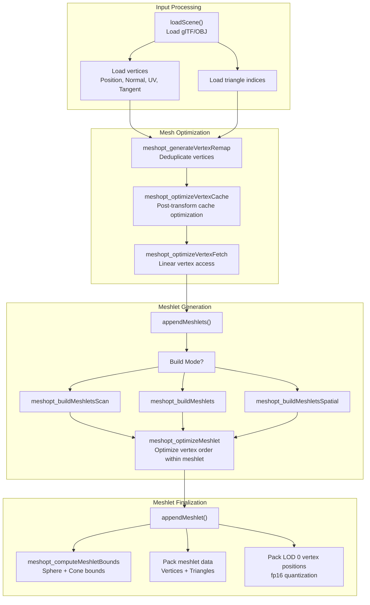
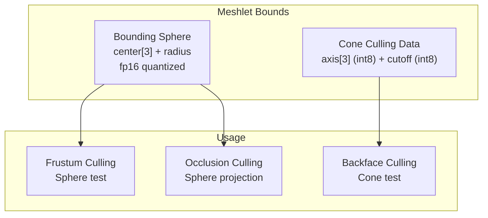
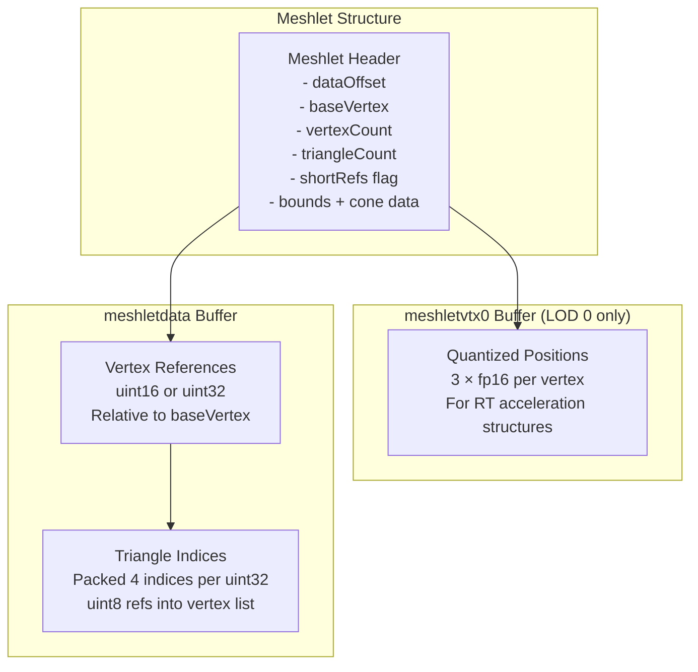
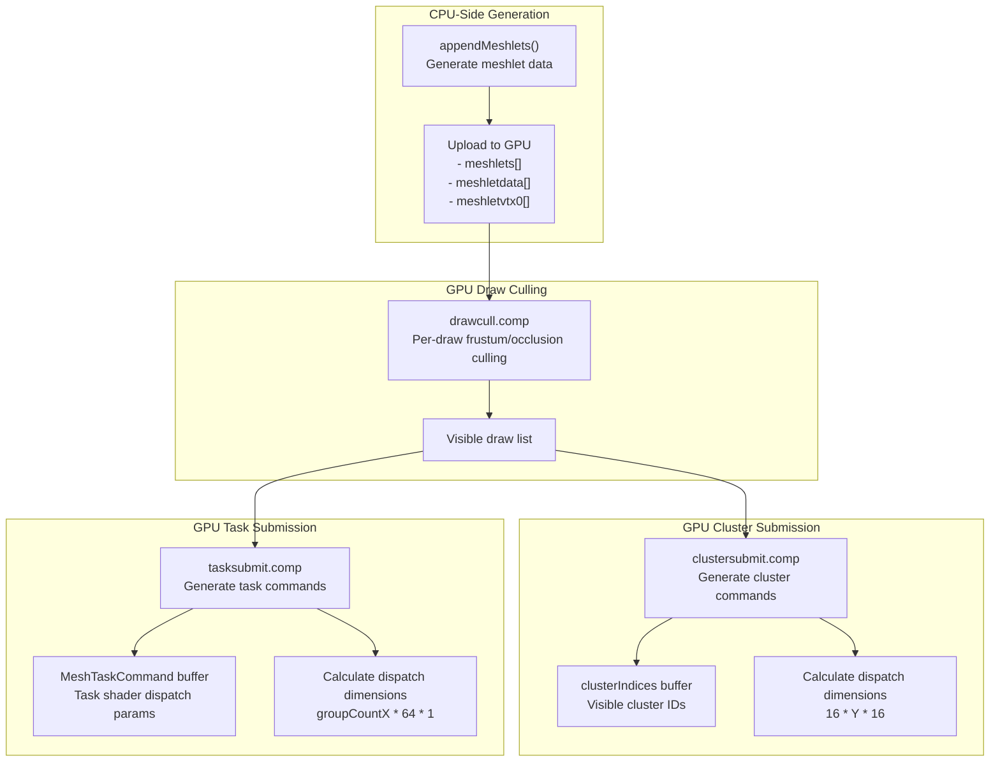

# Meshlet Generation and Optimization

> **Relevant source files**
> * [src/config.h](https://github.com/zeux/niagara/blob/6f3fb529/src/config.h)
> * [src/scene.cpp](https://github.com/zeux/niagara/blob/6f3fb529/src/scene.cpp)
> * [src/shaders/clustersubmit.comp.glsl](https://github.com/zeux/niagara/blob/6f3fb529/src/shaders/clustersubmit.comp.glsl)
> * [src/shaders/tasksubmit.comp.glsl](https://github.com/zeux/niagara/blob/6f3fb529/src/shaders/tasksubmit.comp.glsl)

## Purpose and Scope

This document describes the meshlet generation and optimization subsystem in Niagara. Meshlets are small clusters of triangles (typically 64 vertices and 96 triangles) that serve as the fundamental rendering unit for GPU-driven mesh shader pipelines. This page covers the generation process during scene loading, optimization algorithms for culling efficiency, and data packing strategies for GPU consumption.

For information about the runtime meshlet data structures used by shaders, see [Geometry Data Structures](/zeux/niagara/5.2-geometry-data-structures). For details on how meshlets are culled and rendered at runtime, see [Task Shader Stage](/zeux/niagara/7.2-task-shader-stage) and [Mesh Shader Stage](/zeux/niagara/7.3-mesh-shader-stage).

## Meshlet Overview

A meshlet is a small cluster of geometry that represents a portion of a mesh. The Niagara renderer uses meshoptimizer's meshlet generation algorithms to partition meshes into these clusters during scene loading.

### Meshlet Constraints

The meshlet size constraints are defined in configuration constants:

| Parameter | Value | Purpose |
| --- | --- | --- |
| `MESH_MAXVTX` | 64 | Maximum vertices per meshlet |
| `MESH_MAXTRI` | 96 | Maximum triangles per meshlet (nominal) |
| `MESH_MAXTRI/4` | 24 | Minimum triangles per meshlet (for spatial mode) |

These constraints balance mesh shader workgroup efficiency with culling granularity. The 64-vertex limit allows efficient shared memory usage, while the 96-triangle limit ensures sufficient work per meshlet for GPU occupancy.

Sources: [src/config.h L14-L15](https://github.com/zeux/niagara/blob/6f3fb529/src/config.h#L14-L15)

 [src/scene.cpp L84-L86](https://github.com/zeux/niagara/blob/6f3fb529/src/scene.cpp#L84-L86)

## Meshlet Build Modes

The renderer supports three meshlet build modes, selected based on optimization goals and ray tracing requirements:

```

```

### Fast Mode

Fast mode uses `meshopt_buildMeshletsScan`, a scan-line algorithm that quickly partitions geometry without sophisticated optimization. This mode is selected when the `fast` parameter is true.

**Use case**: Rapid iteration during development or for meshes where culling performance is not critical.

Sources: [src/scene.cpp L94-L95](https://github.com/zeux/niagara/blob/6f3fb529/src/scene.cpp#L94-L95)

### Default Mode

Default mode uses `meshopt_buildMeshlets` with cone weight optimization. This balances meshlet generation speed with cone culling quality, producing meshlets with good backface culling characteristics.

**Cone weight configuration**: The `MESHLET_CONE_WEIGHT` constant (0.25) controls the importance of generating tight cone bounds for backface culling during meshlet partitioning.

Sources: [src/scene.cpp L99](https://github.com/zeux/niagara/blob/6f3fb529/src/scene.cpp#L99-L99)

 [src/config.h L18](https://github.com/zeux/niagara/blob/6f3fb529/src/config.h#L18-L18)

### Spatial Mode (Cluster Ray Tracing)

Spatial mode uses `meshopt_buildMeshletsSpatial`, which generates spatially coherent clusters optimized for ray tracing acceleration structures. This mode is only used for LOD 0 when cluster ray tracing is enabled (`clrt && lod0`).

**Fill weight configuration**: The `MESHLET_FILL_WEIGHT` constant (0.5) controls triangle density within clusters, balancing between tight spatial bounds and full meshlet utilization.

**Rationale**: Spatial coherency improves ray tracing performance by reducing memory divergence during BVH traversal. Only LOD 0 is used for ray tracing, so higher LODs use the default mode.

Sources: [src/scene.cpp L96-L97](https://github.com/zeux/niagara/blob/6f3fb529/src/scene.cpp#L96-L97)

 [src/config.h L19](https://github.com/zeux/niagara/blob/6f3fb529/src/config.h#L19-L19)

## Meshlet Generation Pipeline

The following diagram illustrates the complete meshlet generation pipeline during scene loading:



Sources: [src/scene.cpp L82-L109](https://github.com/zeux/niagara/blob/6f3fb529/src/scene.cpp#L82-L109)

 [src/scene.cpp L164-L268](https://github.com/zeux/niagara/blob/6f3fb529/src/scene.cpp#L164-L268)

### Vertex Cache Optimization

Before meshlet generation, vertex indices are optimized for post-transform cache efficiency:

* **Fast mode**: Uses `meshopt_optimizeVertexCacheFifo` with a 16-entry FIFO cache model
* **Default mode**: Uses `meshopt_optimizeVertexCache` for better cache utilization

After optimization, `meshopt_optimizeVertexFetch` reorders vertices to match index buffer access patterns, improving memory locality.

Sources: [src/scene.cpp L174-L179](https://github.com/zeux/niagara/blob/6f3fb529/src/scene.cpp#L174-L179)

### Per-Meshlet Optimization

After meshlet generation, each meshlet undergoes additional optimization via `meshopt_optimizeMeshlet`, which reorders vertex references and triangle indices within the meshlet to improve mesh shader performance.

Sources: [src/scene.cpp L103-L105](https://github.com/zeux/niagara/blob/6f3fb529/src/scene.cpp#L103-L105)

## Meshlet Bounds and Cone Culling Data

Each meshlet stores culling data computed by `meshopt_computeMeshletBounds`:



### Bounding Sphere

The bounding sphere is computed from meshlet vertices and stored with fp16 quantization:

* **Center**: 3 × fp16 values (6 bytes)
* **Radius**: 1 × fp16 value (2 bytes)

This tight bounding volume enables efficient frustum and occlusion culling in the task shader.

Sources: [src/scene.cpp L61](https://github.com/zeux/niagara/blob/6f3fb529/src/scene.cpp#L61-L61)

 [src/scene.cpp L70-L73](https://github.com/zeux/niagara/blob/6f3fb529/src/scene.cpp#L70-L73)

### Cone Culling Data

Cone culling data represents the normal cone of the meshlet's front-facing triangles:

* **Axis**: 3 × int8 values representing the cone's central axis (normalized)
* **Cutoff**: 1 × int8 value representing `cos(angle)` where `angle` is the cone's half-angle

The cone test in the task shader performs: `dot(coneAxis, viewDirection) >= coneCutoff`. If this test fails, all triangles in the meshlet are backfacing and can be culled.

Sources: [src/scene.cpp L74-L77](https://github.com/zeux/niagara/blob/6f3fb529/src/scene.cpp#L74-L77)

## Meshlet Data Packing

Meshlet data is packed into GPU-friendly formats to minimize memory bandwidth and storage:



### Vertex Reference Packing

Vertex references are packed to minimize storage:

1. **Compute reference range**: Find minimum and maximum vertex indices within the meshlet
2. **Check short reference eligibility**: If `maxVertex - minVertex < 65536`, use 16-bit references
3. **Pack references**: * **16-bit mode**: Pack two uint16 values per uint32 * **32-bit mode**: One uint32 per reference
4. **Store as relative offsets**: All references are stored relative to `minVertex`

Sources: [src/scene.cpp L20-L36](https://github.com/zeux/niagara/blob/6f3fb529/src/scene.cpp#L20-L36)

### Triangle Index Packing

Triangle indices reference the meshlet's local vertex list (not the global vertex buffer). Each triangle uses 3 uint8 indices, packed 4 indices per uint32:

* Triangles are grouped as: `(i0, i1, i2), (i3, i4, i5), ...`
* Packed into uint32 as: `[i0, i1, i2, i3]`, `[i4, i5, i6, i7]`, ...
* The last group may be partially filled

This packing reduces triangle index storage by 4× compared to unpacked uint32 indices.

Sources: [src/scene.cpp L38-L42](https://github.com/zeux/niagara/blob/6f3fb529/src/scene.cpp#L38-L42)

### LOD 0 Vertex Positions

For LOD 0 meshlets (used in ray tracing), quantized vertex positions are stored separately in the `meshletvtx0` buffer. Each vertex position is quantized to 3 × fp16 values, providing sufficient precision for ray tracing while reducing memory usage.

Sources: [src/scene.cpp L44-L59](https://github.com/zeux/niagara/blob/6f3fb529/src/scene.cpp#L44-L59)

## Configuration Parameters

The following table summarizes configuration parameters affecting meshlet generation:

| Parameter | Location | Value | Description |
| --- | --- | --- | --- |
| `MESH_MAXVTX` | config.h:14 | 64 | Maximum vertices per meshlet |
| `MESH_MAXTRI` | config.h:15 | 96 | Target maximum triangles per meshlet |
| `MESHLET_CONE_WEIGHT` | config.h:18 | 0.25 | Weight for cone culling optimization in default mode |
| `MESHLET_FILL_WEIGHT` | config.h:19 | 0.5 | Weight for spatial density in cluster RT mode |

### Tuning Guidelines

* **Increasing `MESH_MAXVTX`**: Reduces meshlet count but may decrease mesh shader efficiency if shared memory becomes constrained
* **Increasing `MESH_MAXTRI`**: Provides more work per meshlet but reduces culling granularity
* **Adjusting `MESHLET_CONE_WEIGHT`**: Higher values improve backface culling at the cost of slower meshlet generation
* **Adjusting `MESHLET_FILL_WEIGHT`**: Higher values produce denser spatial clusters for RT but may reduce culling effectiveness

Sources: [src/config.h L14-L19](https://github.com/zeux/niagara/blob/6f3fb529/src/config.h#L14-L19)

## GPU Command Generation

The generated meshlets drive GPU command submission through indirect dispatch mechanisms:



### Task Command Submission

The `tasksubmit.comp` shader generates task shader dispatch commands from visible draws. It calculates a dispatch dimension of `X * 64 * 1` where `X` is clamped to 65535 (the maximum allowed by `EXT_mesh_shader`). This allows up to ~4M task shader workgroups, sufficient for ~256M meshlets at `TASK_WGSIZE=64`.

**Padding**: The shader pads unused command slots with dummy commands to ensure dispatch boundaries align with 64-entry boundaries, preventing out-of-bounds reads.

Sources: [src/shaders/tasksubmit.comp.glsl L28-L46](https://github.com/zeux/niagara/blob/6f3fb529/src/shaders/tasksubmit.comp.glsl#L28-L46)

### Cluster Command Submission

The `clustersubmit.comp` shader generates cluster-based dispatch commands. It uses a `16 * Y * 16` layout (where `Y ≤ 65535`) to balance locality of access across different GPU architectures. The `CLUSTER_TILE` constant (16) provides a compromise between discrete GPU preferences (large Y dimension) and integrated GPU preferences (larger X/Z dimensions).

**Cluster limit**: The system supports up to `CLUSTER_LIMIT` (16M) visible clusters, consuming ~64MB for cluster index storage.

Sources: [src/shaders/clustersubmit.comp.glsl L26-L44](https://github.com/zeux/niagara/blob/6f3fb529/src/shaders/clustersubmit.comp.glsl#L26-L44)

 [src/config.h L22-L28](https://github.com/zeux/niagara/blob/6f3fb529/src/config.h#L22-L28)

## Meshlet Statistics

During scene loading, the system reports meshlet statistics to aid in performance analysis:

```yaml
Meshlets: N meshlets, M triangles, K vertex refs
```

These statistics help identify:

* **Meshlet count**: Higher counts provide finer culling granularity but increase dispatch overhead
* **Triangle count**: Average triangles per meshlet indicate utilization (target ~80-95 triangles)
* **Vertex references**: Total vertex references compared to unique vertices indicate reuse efficiency

Sources: [src/scene.cpp L719-L730](https://github.com/zeux/niagara/blob/6f3fb529/src/scene.cpp#L719-L730)

## Integration with LOD System

Meshlet generation is integrated with the automatic LOD generation system. Each LOD level generates its own set of meshlets:

1. **LOD 0**: Full-detail meshlets, potentially using spatial mode for ray tracing
2. **LOD 1-7**: Simplified meshlets generated from simplified geometry

Each `MeshLod` structure stores:

* `meshletOffset`: Starting index in the global meshlet array
* `meshletCount`: Number of meshlets for this LOD
* `error`: LOD error metric used for runtime LOD selection

The task shader selects the appropriate LOD based on projected screen-space error and dispatches only the meshlets for that LOD.

Sources: [src/scene.cpp L233-L234](https://github.com/zeux/niagara/blob/6f3fb529/src/scene.cpp#L233-L234)

---

**Page Sources Summary**:

* [src/scene.cpp L16-L109](https://github.com/zeux/niagara/blob/6f3fb529/src/scene.cpp#L16-L109)  - Core meshlet generation and optimization functions
* [src/scene.cpp L164-L268](https://github.com/zeux/niagara/blob/6f3fb529/src/scene.cpp#L164-L268)  - Mesh processing and LOD integration
* [src/config.h L14-L19](https://github.com/zeux/niagara/blob/6f3fb529/src/config.h#L14-L19)  - Meshlet configuration constants
* [src/shaders/tasksubmit.comp.glsl L1-L47](https://github.com/zeux/niagara/blob/6f3fb529/src/shaders/tasksubmit.comp.glsl#L1-L47)  - Task command generation
* [src/shaders/clustersubmit.comp.glsl L1-L45](https://github.com/zeux/niagara/blob/6f3fb529/src/shaders/clustersubmit.comp.glsl#L1-L45)  - Cluster command generation