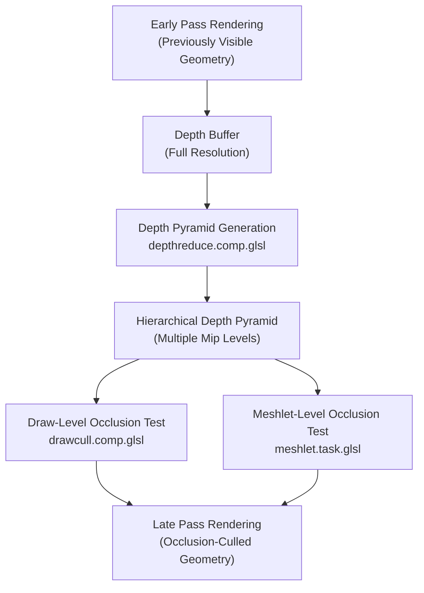
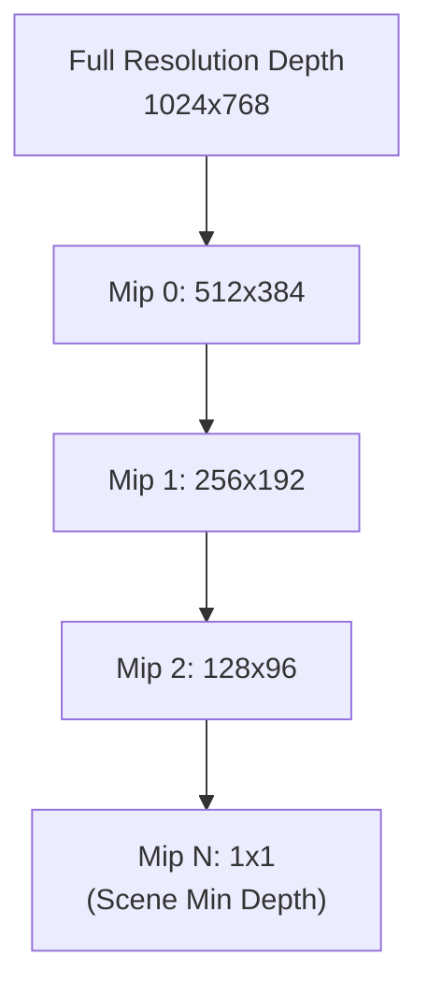
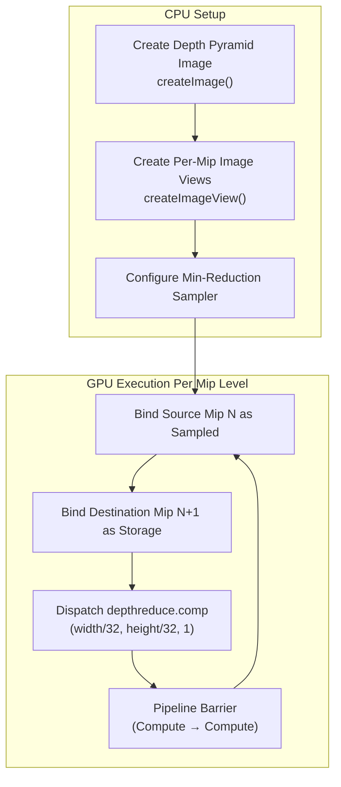
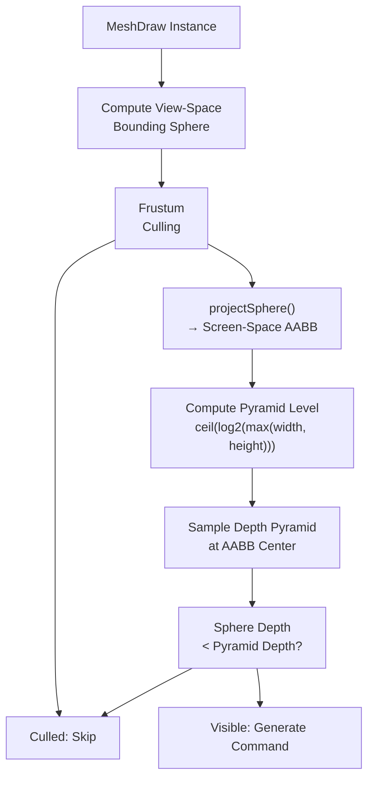
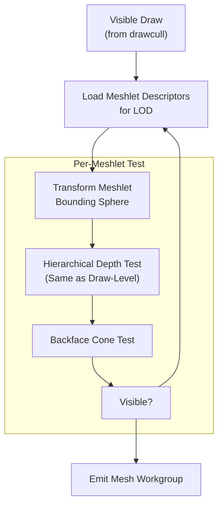
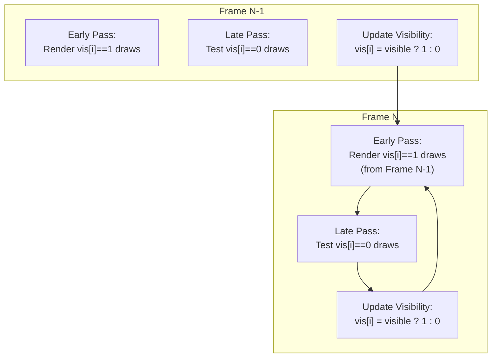

# Occlusion Culling

> **Relevant source files**
> * [src/niagara.cpp](https://github.com/zeux/niagara/blob/6f3fb529/src/niagara.cpp)
> * [src/resources.cpp](https://github.com/zeux/niagara/blob/6f3fb529/src/resources.cpp)
> * [src/resources.h](https://github.com/zeux/niagara/blob/6f3fb529/src/resources.h)
> * [src/shaders/depthreduce.comp.glsl](https://github.com/zeux/niagara/blob/6f3fb529/src/shaders/depthreduce.comp.glsl)
> * [src/shaders/drawcull.comp.glsl](https://github.com/zeux/niagara/blob/6f3fb529/src/shaders/drawcull.comp.glsl)

## Purpose and Scope

This document describes the hierarchical occlusion culling system used to reject geometry that is occluded by previously rendered objects. The system operates at two levels: per-draw occlusion culling in the compute shader pipeline, and per-meshlet occlusion culling in the task shader stage. The implementation leverages a hierarchical depth pyramid built from early-pass rendering to enable efficient occlusion queries without CPU readback.

For information about the two-phase rendering strategy that enables this occlusion culling, see [Two-Phase Rendering Strategy](/zeux/niagara/7.4-two-phase-rendering-strategy). For details on the task shader's per-meshlet culling, see [Task Shader Stage](/zeux/niagara/7.2-task-shader-stage).

---

## Occlusion Culling Overview

The occlusion culling system uses a two-phase rendering approach combined with hierarchical depth testing to maximize GPU efficiency:



**Diagram: Occlusion Culling Pipeline Flow**

The system performs occlusion testing in two stages:

1. **Draw-Level Culling**: Tests entire mesh draws against the depth pyramid to reject invisible objects
2. **Meshlet-Level Culling**: Tests individual meshlets within visible draws for finer-grained rejection

Sources: [src/niagara.cpp L1185-L1249](https://github.com/zeux/niagara/blob/6f3fb529/src/niagara.cpp#L1185-L1249)

 [src/shaders/drawcull.comp.glsl L85-L104](https://github.com/zeux/niagara/blob/6f3fb529/src/shaders/drawcull.comp.glsl#L85-L104)

---

## Depth Pyramid Generation

The hierarchical depth pyramid is a mipmap chain where each level contains the minimum depth value from a 2x2 region of the previous level. This enables efficient conservative occlusion testing at multiple scales.

### Depth Pyramid Structure

| Property | Value | Description |
| --- | --- | --- |
| **Format** | `VK_FORMAT_R32_SFLOAT` | Single-channel 32-bit float depth |
| **Mip Levels** | `log2(max(width, height))` | Full mipmap chain to 1x1 |
| **Reduction Mode** | Minimum | Conservative depth for occlusion testing |
| **Source** | Early pass depth buffer | Built after initial geometry rendering |

The depth pyramid is created with storage and sampled image usage:



**Diagram: Hierarchical Depth Pyramid Structure**

Sources: [src/niagara.cpp L913-L917](https://github.com/zeux/niagara/blob/6f3fb529/src/niagara.cpp#L913-L917)

 [src/niagara.cpp L1038-L1058](https://github.com/zeux/niagara/blob/6f3fb529/src/niagara.cpp#L1038-L1058)

### Depth Reduction Compute Shader

The depth pyramid is generated using the `depthreduce.comp.glsl` compute shader, which processes one mip level at a time. Each invocation samples a 2x2 texel region from the source mip and writes the minimum depth to the destination mip.

**Key Implementation Details:**

| Aspect | Implementation |
| --- | --- |
| **Workgroup Size** | 32x32 invocations |
| **Input Sampler** | `VK_FILTER_LINEAR` with `VK_SAMPLER_REDUCTION_MODE_MIN` |
| **Sampling Pattern** | Bilinear fetch with min reduction (2x2 texels) |
| **Output** | Single depth value per invocation via image store |

The sampler configuration is critical - the `VK_SAMPLER_REDUCTION_MODE_MIN` reduction mode ensures that each texture fetch returns the minimum of the 2x2 texel region automatically:

Sources: [src/shaders/depthreduce.comp.glsl L1-L21](https://github.com/zeux/niagara/blob/6f3fb529/src/shaders/depthreduce.comp.glsl#L1-L21)

 [src/niagara.cpp L439](https://github.com/zeux/niagara/blob/6f3fb529/src/niagara.cpp#L439-L439)

### Depth Pyramid Creation Flow



**Diagram: Depth Pyramid Generation Process**

Sources: [src/niagara.cpp L1185-L1212](https://github.com/zeux/niagara/blob/6f3fb529/src/niagara.cpp#L1185-L1212)

 [src/resources.cpp L201-L218](https://github.com/zeux/niagara/blob/6f3fb529/src/resources.cpp#L201-L218)

---

## Draw-Level Occlusion Culling

Draw-level occlusion culling is performed in the `drawcull.comp.glsl` compute shader during the late pass. Each draw command is tested against the depth pyramid to determine if any part of the object is visible.

### Occlusion Test Algorithm

The draw culling shader performs the following steps for each draw:

1. **Transform Bounding Sphere**: Convert object-space bounding sphere to view space
2. **Frustum Culling**: Test against view frustum planes (early rejection)
3. **Project to Screen Space**: Project bounding sphere to 2D AABB in normalized device coordinates
4. **Select Pyramid Level**: Choose appropriate mip level based on AABB size
5. **Depth Comparison**: Sample depth pyramid and compare against sphere depth



**Diagram: Draw-Level Occlusion Test Flow**

Sources: [src/shaders/drawcull.comp.glsl L85-L104](https://github.com/zeux/niagara/blob/6f3fb529/src/shaders/drawcull.comp.glsl#L85-L104)

### Sphere Projection

The `projectSphere()` function (defined in the shader math utilities) projects a view-space bounding sphere to a screen-space axis-aligned bounding box (AABB). The projection is conservative - if any part of the sphere is visible, the AABB will cover it.

**Projection Parameters:**

| Parameter | Source | Description |
| --- | --- | --- |
| `center` | View-space object center | Transformed by view matrix |
| `radius` | Scaled bounding sphere radius | `mesh.radius * draw.scale` |
| `znear` | Camera near plane | From `CullData` |
| `P00`, `P11` | Projection matrix elements | Symmetric projection parameters |

The resulting AABB is in normalized coordinates [0, 1]:

Sources: [src/shaders/drawcull.comp.glsl L72-L88](https://github.com/zeux/niagara/blob/6f3fb529/src/shaders/drawcull.comp.glsl#L72-L88)

### Mip Level Selection

The appropriate pyramid mip level is selected based on the AABB dimensions to ensure conservative occlusion testing:

```
width = (aabb.z - aabb.x) * pyramidWidth
height = (aabb.w - aabb.y) * pyramidHeight
level = ceil(log2(max(width, height)))
```

The `ceil()` function ensures that the selected mip represents a region smaller than or equal to the AABB size. This guarantees that sampling from the center of the AABB will test at least a 2x2 texel region from the appropriate detail level.

**Why ceil() instead of floor():**

* Using `floor()` would require sampling all 4 corners of the AABB (4 texture fetches)
* Using `ceil()` allows a single bilinear fetch at the center, as the 2x2 bilinear footprint is guaranteed to cover the AABB
* The min-reduction sampler ensures conservative results

Sources: [src/shaders/drawcull.comp.glsl L96-L99](https://github.com/zeux/niagara/blob/6f3fb529/src/shaders/drawcull.comp.glsl#L96-L99)

### Depth Comparison

The final occlusion test compares the sphere's closest depth against the sampled pyramid depth:

```
float depth = textureLod(depthPyramid, (aabb.xy + aabb.zw) * 0.5, level).x;
float depthSphere = znear / (center.z - radius);
visible = visible && depthSphere > depth;
```

The test is conservative:

* `depthSphere` represents the **closest** point on the sphere (front of sphere)
* `depth` represents the **minimum** depth in the pyramid region (closest occluder)
* If any part of the sphere is in front of the occluders, it's considered visible

Sources: [src/shaders/drawcull.comp.glsl L99-L102](https://github.com/zeux/niagara/blob/6f3fb529/src/shaders/drawcull.comp.glsl#L99-L102)

---

## Meshlet-Level Occlusion Culling

When meshlet-level occlusion culling is enabled (`clusterOcclusionEnabled`), the task shader performs additional fine-grained occlusion testing on individual meshlets within visible draws.

### Meshlet Occlusion Test

The task shader (`meshlet.task.glsl`) performs per-meshlet occlusion testing similar to draw-level culling, but using the meshlet's tighter bounding sphere for improved culling efficiency.



**Diagram: Meshlet-Level Occlusion Culling in Task Shader**

The meshlet occlusion test uses the same depth pyramid and projection logic as draw-level culling, but operates on smaller bounding volumes for better granularity.

Sources: [src/niagara.cpp L34](https://github.com/zeux/niagara/blob/6f3fb529/src/niagara.cpp#L34-L34)

 [src/shaders/drawcull.comp.glsl L109](https://github.com/zeux/niagara/blob/6f3fb529/src/shaders/drawcull.comp.glsl#L109-L109)

### Cluster Occlusion Configuration

The meshlet-level occlusion culling can be independently enabled/disabled:

| Flag | Type | Purpose |
| --- | --- | --- |
| `occlusionEnabled` | Global | Enables draw-level occlusion culling in late pass |
| `clusterOcclusionEnabled` | Global | Enables meshlet-level occlusion culling in task shader |

Both flags are passed to the GPU via the `CullData` structure and can be toggled at runtime (O key for draw-level, K key for meshlet-level).

Sources: [src/niagara.cpp L33-L34](https://github.com/zeux/niagara/blob/6f3fb529/src/niagara.cpp#L33-L34)

 [src/niagara.cpp L204-L211](https://github.com/zeux/niagara/blob/6f3fb529/src/niagara.cpp#L204-L211)

 [src/shaders/drawcull.comp.glsl L142](https://github.com/zeux/niagara/blob/6f3fb529/src/shaders/drawcull.comp.glsl#L142-L142)

---

## Visibility Persistence and Temporal Coherency

The renderer maintains visibility information across frames to exploit temporal coherency and optimize the two-phase rendering strategy.

### Visibility Buffer Management

Two visibility buffers track object and meshlet visibility:

| Buffer | Contents | Size | Purpose |
| --- | --- | --- | --- |
| **Draw Visibility Buffer** (`dvb`) | Per-draw visibility bits | `drawCount * sizeof(uint32_t)` | Tracks which draws were visible last frame |
| **Meshlet Visibility Buffer** (`mvb`) | Per-meshlet visibility bits | `(meshletCount + 31) / 32 * 4` bytes | Tracks which meshlets were visible last frame |

### Two-Phase Visibility Update



**Diagram: Visibility Buffer Temporal Updates**

### Early Pass Filtering

In the early pass (`LATE = false`), draws are filtered by their previous visibility:

```
if (!LATE && drawVisibility[di] == 0)
    return;  // Skip this draw in early pass
```

This ensures that only objects visible in the previous frame are rendered in the early pass, establishing an initial depth buffer for occlusion testing.

Sources: [src/shaders/drawcull.comp.glsl L66-L67](https://github.com/zeux/niagara/blob/6f3fb529/src/shaders/drawcull.comp.glsl#L66-L67)

### Late Pass Visibility Update

In the late pass (`LATE = true`), all draws are tested (both previously visible and invisible). After the occlusion test, the visibility buffer is updated:

```
if (LATE)
    drawVisibility[di] = visible ? 1 : 0;
```

This persistent visibility allows objects that become visible to be efficiently rendered in subsequent frames without requiring a full scene traversal.

Sources: [src/shaders/drawcull.comp.glsl L159-L160](https://github.com/zeux/niagara/blob/6f3fb529/src/shaders/drawcull.comp.glsl#L159-L160)

### Meshlet Visibility Persistence

When meshlet occlusion culling is enabled, the late pass behavior changes to handle newly visible meshlets within previously invisible draws:

```
if (visible && (!LATE || 
    (clusterOcclusionEnabled == 1 && TASK_CULL == 1) || 
    drawVisibility[di] == 0 || 
    postPass != 0))
{
    // Generate draw/task command
}
```

This condition ensures that:

* Newly visible draws (`drawVisibility[di] == 0`) generate commands to render all their meshlets
* Previously visible draws with meshlet occlusion enabled re-test individual meshlets for visibility changes
* Post-pass geometry always renders regardless of occlusion

Sources: [src/shaders/drawcull.comp.glsl L109-L144](https://github.com/zeux/niagara/blob/6f3fb529/src/shaders/drawcull.comp.glsl#L109-L144)

---

## Configuration and Control

### Runtime Configuration

The occlusion culling system exposes several configuration parameters through the `CullData` structure:

| Field | Type | Description |
| --- | --- | --- |
| `cullingEnabled` | `int` | Global frustum culling enable/disable |
| `occlusionEnabled` | `int` | Draw-level occlusion culling enable/disable |
| `clusterOcclusionEnabled` | `int` | Meshlet-level occlusion culling enable/disable |
| `pyramidWidth` | `float` | Depth pyramid width in texels |
| `pyramidHeight` | `float` | Depth pyramid height in texels |
| `P00`, `P11` | `float` | Symmetric projection matrix parameters |
| `znear` | `float` | Camera near plane distance |

Sources: [src/niagara.cpp L128-L146](https://github.com/zeux/niagara/blob/6f3fb529/src/niagara.cpp#L128-L146)

### Keyboard Controls

The following keyboard shortcuts control occlusion culling at runtime:

| Key | Toggle | Default State |
| --- | --- | --- |
| **O** | `occlusionEnabled` | Enabled |
| **K** | `clusterOcclusionEnabled` | Enabled |
| **C** | `cullingEnabled` | Enabled |

These controls allow for easy A/B testing and performance analysis of the occlusion culling system.

Sources: [src/niagara.cpp L204-L211](https://github.com/zeux/niagara/blob/6f3fb529/src/niagara.cpp#L204-L211)

### Pipeline Specialization

The draw culling compute shader uses specialization constants to generate optimized variants:

```
// Early pass: LATE=false, renders previously visible geometry
drawcullPipeline = createComputePipeline(device, pipelineCache, 
    drawcullProgram, { /* LATE= */ false, /* TASK= */ false });

// Late pass: LATE=true, tests all geometry with occlusion
drawculllatePipeline = createComputePipeline(device, pipelineCache, 
    drawcullProgram, { /* LATE= */ true, /* TASK= */ false });
```

This compile-time specialization eliminates branches and allows the compiler to optimize each variant independently.

Sources: [src/niagara.cpp L533-L536](https://github.com/zeux/niagara/blob/6f3fb529/src/niagara.cpp#L533-L536)

---

## Performance Characteristics

### Depth Pyramid Cost

The depth pyramid generation has logarithmic complexity in screen resolution:

* **Computation Cost**: O(width × height × log(max(width, height)))
* **Memory Overhead**: ~33% additional memory (full mipmap chain)
* **Typical Cost**: 0.1-0.3ms on modern GPUs at 1080p

### Occlusion Culling Efficiency

Occlusion culling effectiveness depends on scene characteristics:

| Scene Type | Typical Culling Rate | Benefit |
| --- | --- | --- |
| **Dense Urban** | 40-70% objects culled | High - many occluders |
| **Open Terrain** | 10-30% objects culled | Moderate - fewer occluders |
| **Indoor** | 60-90% objects culled | Very high - strong occlusion |

The hierarchical approach enables efficient testing with minimal texture bandwidth - a single bilinear fetch per object in most cases.

### Two-Phase Overhead

The two-phase rendering strategy introduces a small overhead:

* **Early Pass**: Renders ~60-80% of visible geometry (temporal coherency)
* **Late Pass**: Discovers newly visible geometry (10-30% of total)
* **Depth Pyramid**: Generated once between passes

The benefit of reduced overdraw and vertex processing for occluded geometry typically outweighs this overhead in complex scenes.

Sources: [src/niagara.cpp L1185-L1249](https://github.com/zeux/niagara/blob/6f3fb529/src/niagara.cpp#L1185-L1249)

 [src/shaders/drawcull.comp.glsl L1-L162](https://github.com/zeux/niagara/blob/6f3fb529/src/shaders/drawcull.comp.glsl#L1-L162)