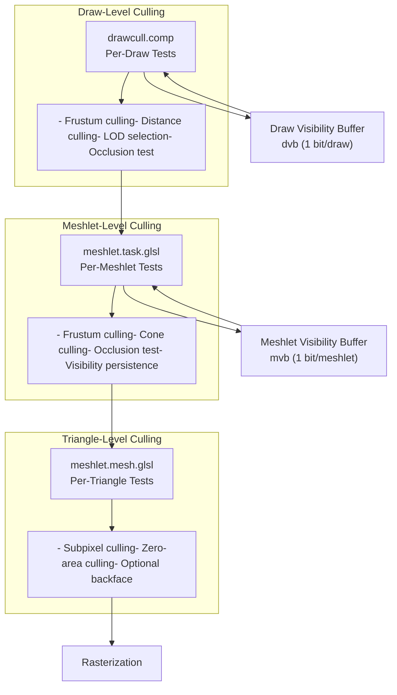
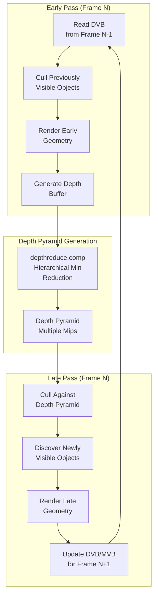
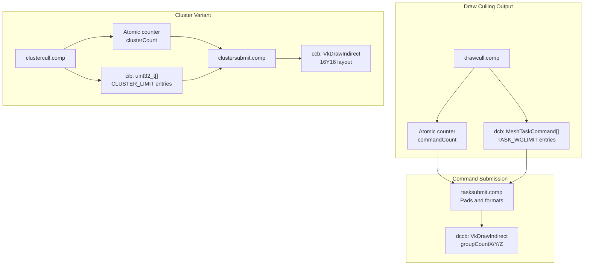
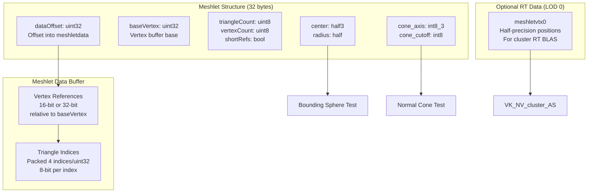
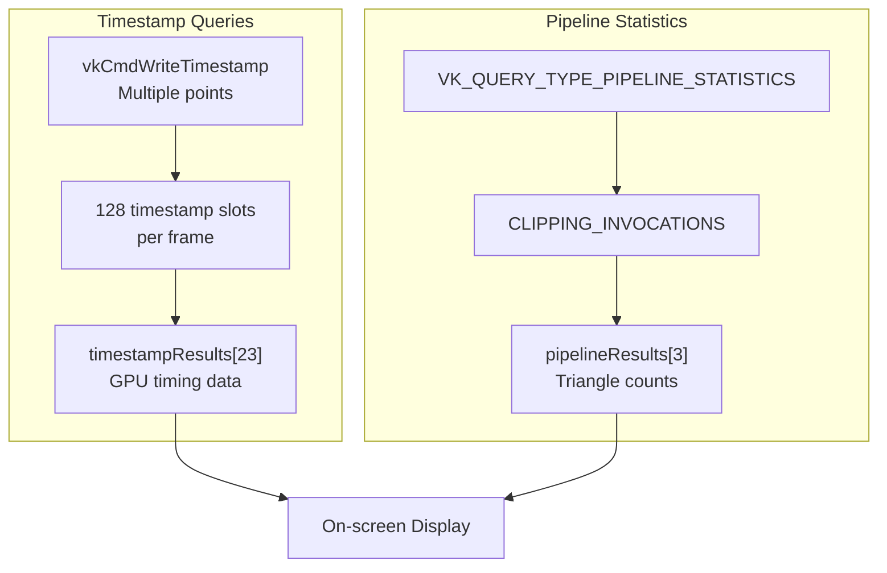

# Optimization Techniques

> **Relevant source files**
> * [src/config.h](https://github.com/zeux/niagara/blob/6f3fb529/src/config.h)
> * [src/niagara.cpp](https://github.com/zeux/niagara/blob/6f3fb529/src/niagara.cpp)
> * [src/scene.cpp](https://github.com/zeux/niagara/blob/6f3fb529/src/scene.cpp)
> * [src/shaders/clustersubmit.comp.glsl](https://github.com/zeux/niagara/blob/6f3fb529/src/shaders/clustersubmit.comp.glsl)
> * [src/shaders/tasksubmit.comp.glsl](https://github.com/zeux/niagara/blob/6f3fb529/src/shaders/tasksubmit.comp.glsl)

## Purpose and Scope

This document provides an overview of the optimization strategies employed throughout the Niagara renderer to achieve high performance on modern GPUs. The renderer uses a combination of algorithmic optimizations, GPU-driven rendering techniques, and careful memory layout to maximize throughput and minimize overhead.

For detailed information on specific optimization subsystems, see:

* [Meshlet Generation and Optimization](/zeux/niagara/10.1-meshlet-generation-and-optimization)
* [Level of Detail System](/zeux/niagara/10.2-level-of-detail-system)
* [Occlusion Culling](/zeux/niagara/10.3-occlusion-culling)
* [GPU-Driven Rendering](/zeux/niagara/7-gpu-driven-rendering) for the overall architecture that enables these optimizations

---

## Optimization Philosophy

Niagara's optimization strategy is based on several core principles:

1. **GPU-Driven Execution**: Minimize CPU involvement by performing culling, LOD selection, and command generation entirely on the GPU
2. **Multi-Stage Culling**: Reject invisible geometry at multiple granularities (draw, meshlet, triangle) to maximize early rejection
3. **Temporal Coherency**: Exploit frame-to-frame coherence through visibility persistence
4. **Data Locality**: Organize geometry data (meshlets) to maximize cache efficiency and enable efficient culling
5. **Configurability**: Provide runtime toggles for different optimization strategies to support various hardware capabilities

Sources: [src/niagara.cpp L30-L43](https://github.com/zeux/niagara/blob/6f3fb529/src/niagara.cpp#L30-L43)

 [src/scene.cpp L82-L109](https://github.com/zeux/niagara/blob/6f3fb529/src/scene.cpp#L82-L109)

---

## Optimization Categories

### Geometry Optimization

The renderer uses meshlets as the fundamental unit of geometry, generated using `meshoptimizer` library with different strategies:

**Meshlet Build Modes**

| Mode | When Used | Optimization Goal | Function |
| --- | --- | --- | --- |
| **Fast** | `FAST=1` environment variable | Quick preprocessing with FIFO cache optimization | `meshopt_buildMeshletsScan` |
| **Standard** | Default for most LODs | Balance between cone culling and general quality | `meshopt_buildMeshlets` |
| **Spatial** | LOD 0 with `CLRT=1` | Optimize spatial coherence for ray tracing | `meshopt_buildMeshletsSpatial` |

**Meshlet Constraints**

```
// Maximum vertices and triangles per meshlet
#define MESH_MAXVTX 64  // From config.h
#define MESH_MAXTRI 96  // From config.h

// Cone culling weight for backface rejection
#define MESHLET_CONE_WEIGHT 0.25f  // From config.h
```

Each meshlet stores:

* Bounding sphere (center + radius) for frustum culling
* Normal cone (axis + cutoff) for backface culling
* Compact vertex and index references

Sources: [src/scene.cpp L82-L109](https://github.com/zeux/niagara/blob/6f3fb529/src/scene.cpp#L82-L109)

 [src/config.h L14-L19](https://github.com/zeux/niagara/blob/6f3fb529/src/config.h#L14-L19)

---

### Culling Pipeline

**Multi-Granularity Culling Flow**



**Culling Configuration Parameters**

The `CullData` structure controls all culling behavior:

```
struct CullData {
    mat4 view;
    float P00, P11, znear, zfar;      // Projection parameters
    float frustum[4];                  // Frustum plane data
    float lodTarget;                   // LOD target error at z=1
    float pyramidWidth, pyramidHeight; // Depth pyramid dimensions
    uint32_t drawCount;
    
    // Runtime toggles
    int cullingEnabled;
    int lodEnabled;
    int occlusionEnabled;
    int clusterOcclusionEnabled;
    int clusterBackfaceEnabled;
    uint32_t postPass;
};
```

Sources: [src/niagara.cpp L128-L146](https://github.com/zeux/niagara/blob/6f3fb529/src/niagara.cpp#L128-L146)

 [src/shaders/drawcull.comp.glsl](https://github.com/zeux/niagara/blob/6f3fb529/src/shaders/drawcull.comp.glsl)

---

### Visibility Persistence

The renderer maintains per-draw and per-meshlet visibility information across frames to exploit temporal coherency:

**Two-Phase Rendering Strategy**



**Visibility Buffer Organization**

| Buffer | Type | Size | Purpose |
| --- | --- | --- | --- |
| `dvb` | `uint32_t[]` | 1 bit per draw | Tracks which draws were visible last frame |
| `mvb` | `uint32_t[]` | 1 bit per meshlet | Tracks which meshlets were visible (when task shading enabled) |
| `dcb` | `MeshTaskCommand[]` | Up to `TASK_WGLIMIT` | GPU-generated task shader dispatch commands |
| `dccb` | Indirect dispatch | 16 bytes | Dispatch dimensions for task commands |
| `cib` | `uint32_t[]` | Up to `CLUSTER_LIMIT` | Visible cluster indices |
| `ccb` | Indirect dispatch | 16 bytes | Dispatch dimensions for clusters |

Sources: [src/niagara.cpp L822-L847](https://github.com/zeux/niagara/blob/6f3fb529/src/niagara.cpp#L822-L847)

---

### GPU Command Generation

The renderer generates all draw and dispatch commands on the GPU, eliminating CPU overhead:

**Command Generation Pipeline**



**Command Limits**

```
// Maximum task shader workgroups: 4M workgroups ~= 256M meshlets
#define TASK_WGLIMIT (1 << 22)  // 4,194,304 commands

// Maximum visible clusters: 16M meshlets ~= 64MB buffer
#define CLUSTER_LIMIT (1 << 24)  // 16,777,216 clusters
```

The submission shaders pad the command buffers to dispatch-friendly boundaries:

* Task commands: Padded to multiples of 64 (workgroup size)
* Cluster commands: Padded to multiples of 256 (tile size)

Sources: [src/config.h L24-L28](https://github.com/zeux/niagara/blob/6f3fb529/src/config.h#L24-L28)

 [src/shaders/tasksubmit.comp.glsl L1-L47](https://github.com/zeux/niagara/blob/6f3fb529/src/shaders/tasksubmit.comp.glsl#L1-L47)

 [src/shaders/clustersubmit.comp.glsl L1-L45](https://github.com/zeux/niagara/blob/6f3fb529/src/shaders/clustersubmit.comp.glsl#L1-L45)

---

### Memory Layout Optimization

**Meshlet Data Packing**

Meshlets use a compact memory representation to maximize cache efficiency:



**Short Reference Optimization**

When a meshlet's vertices span less than 65,536 indices, it uses 16-bit references packed two per `uint32_t`:

```javascript
// From appendMeshlet in scene.cpp
bool shortRefs = maxVertex - minVertex < (1 << 16);

// Packing: odd indices go in upper 16 bits
if (shortRefs && i % 2)
    result.meshletdata.back() |= ref << 16;
else
    result.meshletdata.push_back(ref);
```

This reduces memory bandwidth by up to 50% for vertex references.

Sources: [src/scene.cpp L16-L80](https://github.com/zeux/niagara/blob/6f3fb529/src/scene.cpp#L16-L80)

 [src/mesh.h](https://github.com/zeux/niagara/blob/6f3fb529/src/mesh.h)

---

## Runtime Performance Controls

The renderer provides numerous runtime toggles accessible via keyboard shortcuts:

**Optimization Toggle Mapping**

| Key | Variable | Description | Default |
| --- | --- | --- | --- |
| `M` | `meshShadingEnabled` | Enable mesh shading pipeline | Supported |
| `C` | `cullingEnabled` | Enable all culling | `true` |
| `O` | `occlusionEnabled` | Enable occlusion culling | `true` |
| `K` | `clusterOcclusionEnabled` | Enable per-cluster occlusion | `true` |
| `L` | `lodEnabled` | Enable LOD selection | `true` |
| `T` | `taskShadingEnabled` | Enable task shader | `false`* |
| `F` | `shadowsEnabled` | Enable ray-traced shadows | `true` |
| `B` | `shadowblurEnabled` | Enable shadow blur | `true` |
| `X` | `shadowCheckerboard` | Checkerboard shadow sampling | `false` |
| `Q` | `shadowQuality` | Toggle shadow quality (0/1) | `1` |
| `0-9` | `debugLodStep` | Force specific LOD level | `0` (auto) |

*Task shading disabled by default for AMD hardware compatibility.

These flags are passed to compute shaders via the `CullData` structure and checked in shader code to enable/disable specific optimizations.

Sources: [src/niagara.cpp L30-L43](https://github.com/zeux/niagara/blob/6f3fb529/src/niagara.cpp#L30-L43)

 [src/niagara.cpp L192-L262](https://github.com/zeux/niagara/blob/6f3fb529/src/niagara.cpp#L192-L262)

---

## Performance Measurement

**Query Integration**



The renderer creates query pools per frame to avoid synchronization stalls:

```
VkQueryPool queryPoolsTimestamp[MAX_FRAMES];  // Timestamp queries
VkQueryPool queryPoolsPipeline[MAX_FRAMES];   // Pipeline statistics

// 128 timestamp slots for detailed profiling
createQueryPool(device, 128, VK_QUERY_TYPE_TIMESTAMP);

// 4 pipeline statistics slots
createQueryPool(device, 4, VK_QUERY_TYPE_PIPELINE_STATISTICS);
```

Sources: [src/niagara.cpp L572-L579](https://github.com/zeux/niagara/blob/6f3fb529/src/niagara.cpp#L572-L579)

 [src/niagara.cpp L81-L96](https://github.com/zeux/niagara/blob/6f3fb529/src/niagara.cpp#L81-L96)

---

## Build-Time Optimization Selection

Scene loading can be configured for different optimization strategies via environment variables:

**Environment Variable Controls**

| Variable | Effect | Default |
| --- | --- | --- |
| `FAST=1` | Use fast meshlet generation (`meshopt_buildMeshletsScan`) | `0` |
| `CLRT=1` | Use spatial meshlet clustering for ray tracing | `0` |
| `COMPRESSED=1` | Enable compression for scene cache | `1` |
| `VERBOSE=1` | Enable verbose output during scene processing | `0` |

Example usage:

```markdown
FAST=1 ./niagara scene.gltf           # Fast preprocessing
CLRT=1 ./niagara scene.gltf           # Optimize for ray tracing
FAST=1 COMPRESSED=0 ./niagara scene.gltf  # Fast, uncompressed
```

These flags determine which meshlet build algorithm is used in `appendMeshlets`:

```
if (fast)
    meshopt_buildMeshletsScan(...);
else if (clrt && lod0)
    meshopt_buildMeshletsSpatial(...);  // Only for LOD 0
else
    meshopt_buildMeshlets(...);
```

Sources: [src/niagara.cpp L623-L626](https://github.com/zeux/niagara/blob/6f3fb529/src/niagara.cpp#L623-L626)

 [src/scene.cpp L94-L99](https://github.com/zeux/niagara/blob/6f3fb529/src/scene.cpp#L94-L99)

---

## Summary of Optimization Impact

The combined optimization strategies provide significant performance benefits:

1. **GPU-Driven Rendering**: Eliminates CPU overhead for culling and command generation
2. **Multi-Stage Culling**: Reduces rasterization load by rejecting invisible geometry at multiple levels
3. **Temporal Coherency**: Reduces culling work by tracking visibility across frames
4. **Meshlet Organization**: Maximizes cache efficiency and enables fine-grained culling
5. **LOD System**: Reduces geometric complexity for distant objects while maintaining visual quality
6. **Occlusion Culling**: Prevents overdraw by using hierarchical depth testing

For implementation details of specific optimization techniques, see the child pages:

* [Meshlet Generation and Optimization](/zeux/niagara/10.1-meshlet-generation-and-optimization)
* [Level of Detail System](/zeux/niagara/10.2-level-of-detail-system)
* [Occlusion Culling](/zeux/niagara/10.3-occlusion-culling)

Sources: [src/niagara.cpp L1-L2500](https://github.com/zeux/niagara/blob/6f3fb529/src/niagara.cpp#L1-L2500)

 [src/scene.cpp L1-L734](https://github.com/zeux/niagara/blob/6f3fb529/src/scene.cpp#L1-L734)

 [src/config.h L1-L47](https://github.com/zeux/niagara/blob/6f3fb529/src/config.h#L1-L47)