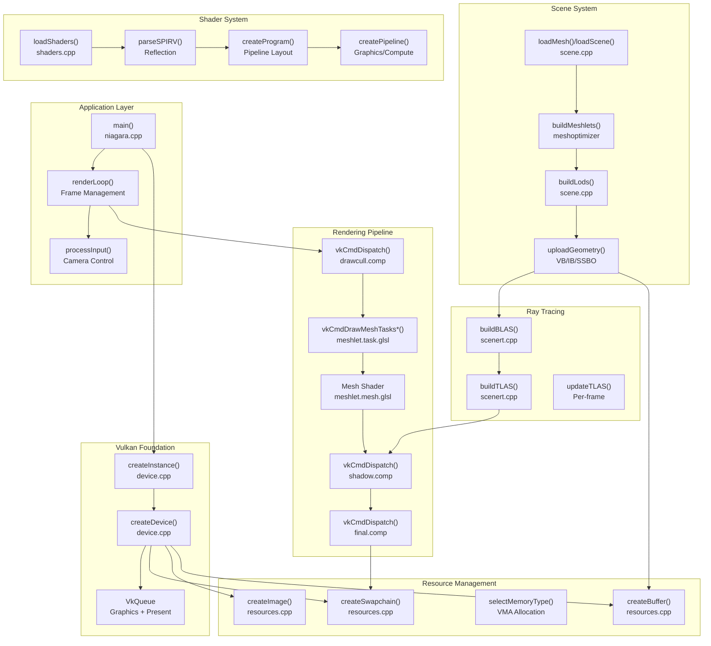
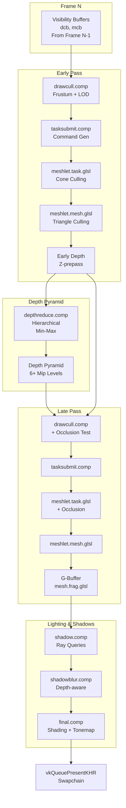

# Overview

> **Relevant source files**
> * [README.md](https://github.com/zeux/niagara/blob/6f3fb529/README.md)

## Purpose and Scope

This document provides a high-level introduction to the Niagara renderer, an experimental GPU-driven Vulkan rendering engine. It covers the renderer's goals, core features, architectural organization, and rendering pipeline. For detailed information about specific subsystems, refer to the following pages:

* Building and configuration: see [Getting Started](/zeux/niagara/2-getting-started)
* Main application structure: see [Application Architecture](/zeux/niagara/3-application-architecture)
* Vulkan initialization and resources: see [Vulkan Foundation](/zeux/niagara/4-vulkan-foundation)
* Scene loading and geometry: see [Scene System](/zeux/niagara/5-scene-system)
* Shader compilation and management: see [Shader System](/zeux/niagara/6-shader-system)
* GPU-driven culling and mesh shaders: see [GPU-Driven Rendering](/zeux/niagara/7-gpu-driven-rendering)
* Lighting and composition: see [Deferred Rendering](/zeux/niagara/8-deferred-rendering)
* Shadow ray tracing: see [Ray Tracing System](/zeux/niagara/9-ray-tracing-system)

---

## Introduction

Niagara is an experimental Vulkan renderer designed to explore and demonstrate modern GPU-driven rendering techniques. The project was developed from scratch on stream, avoiding third-party Vulkan-specific libraries while leveraging general-purpose libraries for mesh optimization and scene loading.

The renderer targets Vulkan 1.3+ with support for recent extensions, requiring hardware capable of:

* Mesh shaders (VK_EXT_mesh_shader)
* Ray queries (VK_KHR_ray_query)
* Dynamic rendering (VK_KHR_dynamic_rendering)
* Buffer device address (VK_KHR_buffer_device_address)

**Primary Implementation Files:**

| Component | File | Purpose |
| --- | --- | --- |
| Main Application | `niagara.cpp` | Application loop, rendering orchestration |
| Vulkan Device | `device.cpp` | Instance, device, extension management |
| Resource Management | `resources.cpp` | Buffer, image, memory allocation |
| Scene Processing | `scene.cpp` | OBJ/glTF loading, meshlet generation |
| Ray Tracing | `scenert.cpp` | Acceleration structure management |
| Shader Loading | `shaders.cpp` | SPIR-V parsing, pipeline creation |
| Data Structures | `mesh.h` | Mesh, Meshlet, MeshDraw definitions |

Sources: [README.md L1-L30](https://github.com/zeux/niagara/blob/6f3fb529/README.md#L1-L30)

---

## Key Features

### GPU-Driven Rendering

Niagara implements a fully GPU-driven rendering pipeline where the GPU autonomously determines which geometry to render without CPU intervention per frame. The system uses:

* **Draw-level culling** via compute shader (`drawcull.comp`) that performs frustum and occlusion tests on entire draw calls
* **Meshlet-level culling** via task shaders (`meshlet.task.glsl`) that test individual meshlets against view frustum and occlusion
* **Triangle-level culling** via mesh shaders (`meshlet.mesh.glsl`) that discard degenerate or backfacing triangles
* **Indirect command generation** where GPU writes `VkDrawIndexedIndirectCommand` and `VkDrawMeshTasksIndirectCommandEXT` structures

### Task/Mesh Shader Pipeline

The renderer uses the modern mesh shader pipeline (VK_EXT_mesh_shader) as its primary rendering path:

* Task shaders emit work for visible meshlets
* Mesh shaders generate primitives directly without vertex/index buffers
* Cone culling eliminates backfacing meshlet clusters
* Per-triangle culling removes subpixel and zero-area triangles

### Automatic Occlusion Culling

The renderer implements temporal occlusion culling without manual occlusion geometry:

* Two-phase rendering (early/late pass) leverages previous frame visibility
* Hierarchical depth pyramid (`depthreduce.comp`) built from early pass depth
* Occlusion queries against depth pyramid eliminate invisible geometry
* Visibility buffers (`dcb` for draws, `mcb` for meshlets) persist visibility across frames

### Ray-Traced Shadows

Hardware ray tracing provides high-quality shadow rendering:

* Bottom-level acceleration structures (BLAS) built per-mesh
* Top-level acceleration structure (TLAS) instances scene objects
* Ray queries in compute shader (`shadow.comp`) generate shadow masks
* Support for transparent shadows with alpha testing
* Optional checkerboard rendering with temporal reconstruction

### Level of Detail System

Automatic LOD generation and selection optimize rendering performance:

* Up to 8 LOD levels per mesh generated using meshoptimizer
* Screen-space error metrics guide LOD selection
* Seamless transitions without popping artifacts
* LOD selection performed in `drawcull.comp` based on projected size

Sources: [README.md L3-L6](https://github.com/zeux/niagara/blob/6f3fb529/README.md#L3-L6)

 Diagrams 1-5

---

## System Architecture

The following diagram maps the major subsystems to their implementation files and shows data flow between components:

**Key Data Structures:**

| Structure | File | Purpose |
| --- | --- | --- |
| `Mesh` | mesh.h | Mesh metadata, bounds, LOD array |
| `MeshLod` | mesh.h | LOD level with index/meshlet ranges |
| `Meshlet` | mesh.h | 64-vertex cluster with culling data |
| `MeshDraw` | mesh.h | Draw instance with transform, indices |
| `Globals` | niagara.cpp | Per-frame uniforms (view, projection) |
| `VkAccelerationStructureInstanceKHR` | scenert.cpp | TLAS instance data |

Sources: [niagara.cpp](https://github.com/zeux/niagara/blob/6f3fb529/niagara.cpp)

 [device.cpp](https://github.com/zeux/niagara/blob/6f3fb529/device.cpp)

 [resources.cpp](https://github.com/zeux/niagara/blob/6f3fb529/resources.cpp)

 [scene.cpp](https://github.com/zeux/niagara/blob/6f3fb529/scene.cpp)

 [scenert.cpp](https://github.com/zeux/niagara/blob/6f3fb529/scenert.cpp)

 [shaders.cpp](https://github.com/zeux/niagara/blob/6f3fb529/shaders.cpp)

 [mesh.h](https://github.com/zeux/niagara/blob/6f3fb529/mesh.h)

---

## Rendering Pipeline

The rendering pipeline executes multiple passes to achieve high performance through aggressive culling and temporal coherency:

**Pass Descriptions:**

| Pass | Shaders | Purpose | Output |
| --- | --- | --- | --- |
| Early | drawcull, tasksubmit, meshlet.task, meshlet.mesh | Render previously-visible geometry | Depth buffer |
| Pyramid | depthreduce | Build hierarchical depth | Depth pyramid (mipmapped) |
| Late | drawcull (with occlusion), tasksubmit, meshlet.task, meshlet.mesh, mesh.frag | Discover and render newly-visible geometry | G-buffer (albedo, normal, etc.) |
| Shadow | shadow, shadowblur | Ray trace shadows, post-process | Shadow mask |
| Composition | final | Combine G-buffer + shadows, tonemap | Final image |

**Buffer Flow:**

The pipeline uses persistent buffers for temporal coherency:

* `db` (draw buffer) - `MeshDraw` instances
* `mb` (mesh buffer) - `Mesh` metadata
* `vb`, `ib` (vertex/index buffers) - Geometry data
* `mlb`, `mdb` (meshlet buffers) - Meshlet descriptors and packed data
* `dcb` (draw commands) - Indirect draw commands
* `dccb` (draw command count) - Atomic counter for compaction
* `dcv` (draw culling visibility) - Per-draw visibility bits
* `mcv` (meshlet culling visibility) - Per-meshlet visibility bits

Sources: [niagara.cpp](https://github.com/zeux/niagara/blob/6f3fb529/niagara.cpp)

 [drawcull.comp.glsl](https://github.com/zeux/niagara/blob/6f3fb529/drawcull.comp.glsl)

 [tasksubmit.comp.glsl](https://github.com/zeux/niagara/blob/6f3fb529/tasksubmit.comp.glsl)

 [meshlet.task.glsl](https://github.com/zeux/niagara/blob/6f3fb529/meshlet.task.glsl)

 [meshlet.mesh.glsl](https://github.com/zeux/niagara/blob/6f3fb529/meshlet.mesh.glsl)

 [depthreduce.comp.glsl](https://github.com/zeux/niagara/blob/6f3fb529/depthreduce.comp.glsl)

 [shadow.comp.glsl](https://github.com/zeux/niagara/blob/6f3fb529/shadow.comp.glsl)

 [final.comp.glsl](https://github.com/zeux/niagara/blob/6f3fb529/final.comp.glsl)

---

## Technology Stack

### Core Dependencies

| Library | Purpose | Usage |
| --- | --- | --- |
| Vulkan 1.3+ | Graphics API | Device management, command submission |
| GLFW | Windowing | Window creation, input handling |
| volk | Vulkan loader | Function pointer loading |
| meshoptimizer | Mesh optimization | Meshlet generation, LOD creation, vertex cache optimization |
| cgltf | glTF loading | Scene file parsing |
| fast_obj | OBJ loading | Mesh file parsing |
| stb_image | Image loading | Texture decoding |
| etcpak | Texture compression | BC7/ETC2 encoding |

### Vulkan Extensions

| Extension | Purpose | Optional |
| --- | --- | --- |
| VK_EXT_mesh_shader | Task/mesh shader pipeline | No |
| VK_KHR_ray_query | Shadow ray tracing | No |
| VK_KHR_acceleration_structure | BLAS/TLAS management | No |
| VK_KHR_dynamic_rendering | Renderpass-free rendering | No |
| VK_EXT_descriptor_indexing | Bindless textures | No |
| VK_KHR_buffer_device_address | GPU buffer pointers | No |
| VK_NV_cluster_acceleration_structure | Meshlet-aware RT | Yes |
| VK_EXT_mesh_shader | Mesh shader support | No |

Sources: [README.md L10-L24](https://github.com/zeux/niagara/blob/6f3fb529/README.md#L10-L24)

 [device.cpp](https://github.com/zeux/niagara/blob/6f3fb529/device.cpp)

 CMakeLists.txt

---

## Design Philosophy

### GPU-Driven Architecture

The renderer minimizes CPU-GPU synchronization by moving decisions to the GPU:

* CPU submits broad work (all draws, all meshlets)
* GPU culls and compacts into visible work
* Visibility persists across frames in device-local buffers
* No CPU readback required for culling decisions

**Benefits:**

* Reduced CPU overhead
* Better GPU utilization
* Scalability to millions of triangles

### Two-Phase Rendering

The early/late pass strategy optimizes occlusion culling:

* **Early Pass**: Renders previously-visible geometry (high confidence)
* **Late Pass**: Tests and renders newly-visible geometry (discovery)

This approach provides:

* Temporal stability (no flickering)
* Efficient occlusion queries
* Amortized cost of depth pyramid construction

### Meshlet-Based Geometry

Meshlets provide fine-grained culling and efficient GPU processing:

* 64 vertices, 124 triangles per meshlet
* Cone culling data for backface elimination
* Bounding spheres for frustum/occlusion testing
* Compatible with cluster acceleration structures

**Meshlet Generation** ([scene.cpp](https://github.com/zeux/niagara/blob/6f3fb529/scene.cpp)

) uses meshoptimizer with configurable modes:

* Fast mode: Quick generation for iteration
* Spatial mode: Locality optimization for cache coherency
* RT-cluster mode: Optimized for ray tracing performance

### Deferred Shading

The G-buffer approach decouples geometry from lighting:

* Single geometry pass with minimal fragment shading
* Lighting computed in screen-space compute shader
* Efficient handling of complex lighting scenarios
* No overdraw penalty for multiple lights

Sources: [README.md L3-L6](https://github.com/zeux/niagara/blob/6f3fb529/README.md#L3-L6)

 [niagara.cpp](https://github.com/zeux/niagara/blob/6f3fb529/niagara.cpp)

 [scene.cpp](https://github.com/zeux/niagara/blob/6f3fb529/scene.cpp)

 [mesh.h](https://github.com/zeux/niagara/blob/6f3fb529/mesh.h)

---

## Configuration

The renderer provides compile-time configuration through [config.h](https://github.com/zeux/niagara/blob/6f3fb529/config.h)

:

| Constant | Default | Purpose |
| --- | --- | --- |
| `TASK_WGSIZE` | 32 | Task shader workgroup size |
| `MESH_WGSIZE` | 128 | Mesh shader workgroup size |
| `MESH_MAXVTX` | 64 | Maximum vertices per meshlet |
| `MESH_MAXTRI` | 124 | Maximum triangles per meshlet |
| `CLUSTER_LIMIT` | Varies | Maximum clusters per dispatch |

Additional runtime features controlled via command-line arguments and keyboard input:

* Shadow quality modes (opaque/transparent)
* Shadow filtering (blur radius)
* Culling toggles (frustum, occlusion, cone)
* LOD bias adjustment
* Debug visualization modes

For detailed configuration options, see [Configuration Options](/zeux/niagara/2.2-configuration-options).

Sources: [config.h](https://github.com/zeux/niagara/blob/6f3fb529/config.h)

 [niagara.cpp](https://github.com/zeux/niagara/blob/6f3fb529/niagara.cpp)

---

## Performance Characteristics

The renderer is designed for high geometry throughput:

**Typical Scene (Lumberyard Bistro):**

* ~3M triangles total
* ~500K-1M triangles visible per frame
* ~50K-100K draw calls submitted
* ~10K-30K draws after culling
* ~100K-300K meshlets tested
* 60+ FPS on modern GPUs (RTX 30xx series)

**Culling Efficiency:**

* Draw culling: Eliminates 70-90% of draws
* Meshlet culling: Eliminates 50-80% of meshlets
* Triangle culling: Eliminates 20-40% of triangles

**Memory Usage:**

* Geometry buffers: Device-local, persistent
* Visibility buffers: ~100KB for typical scenes
* Depth pyramid: ~1-2MB for 1080p
* G-buffer: ~20MB for 1080p (4x textures)

Sources: Diagram 1 analysis, [README.md L8](https://github.com/zeux/niagara/blob/6f3fb529/README.md#L8-L8)

---

## Navigation

To dive deeper into specific subsystems:

* **Setup**: [Getting Started](/zeux/niagara/2-getting-started) → [Building](/zeux/niagara/2.1-building-the-project), [Configuration](/zeux/niagara/2.2-configuration-options)
* **Application**: [Application Architecture](/zeux/niagara/3-application-architecture) → [Main Loop](/zeux/niagara/3.1-main-application-loop), [Pipeline Overview](/zeux/niagara/3.2-rendering-pipeline-overview)
* **Vulkan**: [Vulkan Foundation](/zeux/niagara/4-vulkan-foundation) → [Device Management](/zeux/niagara/4.1-device-and-instance-management), [Resources](/zeux/niagara/4.2-resource-management), [Swapchain](/zeux/niagara/4.3-swapchain-and-presentation)
* **Scene**: [Scene System](/zeux/niagara/5-scene-system) → [Loading](/zeux/niagara/5.1-scene-loading-and-processing), [Data Structures](/zeux/niagara/5.2-geometry-data-structures), [Materials](/zeux/niagara/5.3-materials-and-textures)
* **Shaders**: [Shader System](/zeux/niagara/6-shader-system) → [Loading](/zeux/niagara/6.1-shader-loading-and-programs), [Pipelines](/zeux/niagara/6.2-pipeline-creation-and-descriptor-management), [Utilities](/zeux/niagara/6.3-shader-utilities-and-math)
* **GPU-Driven**: [GPU-Driven Rendering](/zeux/niagara/7-gpu-driven-rendering) → [Draw Culling](/zeux/niagara/7.1-draw-culling-pipeline), [Task Shader](/zeux/niagara/7.2-task-shader-stage), [Mesh Shader](/zeux/niagara/7.3-mesh-shader-stage), [Two-Phase](/zeux/niagara/7.4-two-phase-rendering-strategy)
* **Deferred**: [Deferred Rendering](/zeux/niagara/8-deferred-rendering) → [Vertex Processing](/zeux/niagara/8.1-vertex-processing), [G-Buffer](/zeux/niagara/8.2-g-buffer-generation), [Composition](/zeux/niagara/8.3-lighting-and-final-composition)
* **Ray Tracing**: [Ray Tracing System](/zeux/niagara/9-ray-tracing-system) → [Acceleration Structures](/zeux/niagara/9.1-acceleration-structure-management), [Shadows](/zeux/niagara/9.2-shadow-ray-tracing), [Post-Processing](/zeux/niagara/9.3-shadow-post-processing)
* **Optimization**: [Optimization Techniques](/zeux/niagara/10-optimization-techniques) → [Meshlets](/zeux/niagara/10.1-meshlet-generation-and-optimization), [LOD](/zeux/niagara/10.2-level-of-detail-system), [Occlusion](/zeux/niagara/10.3-occlusion-culling)