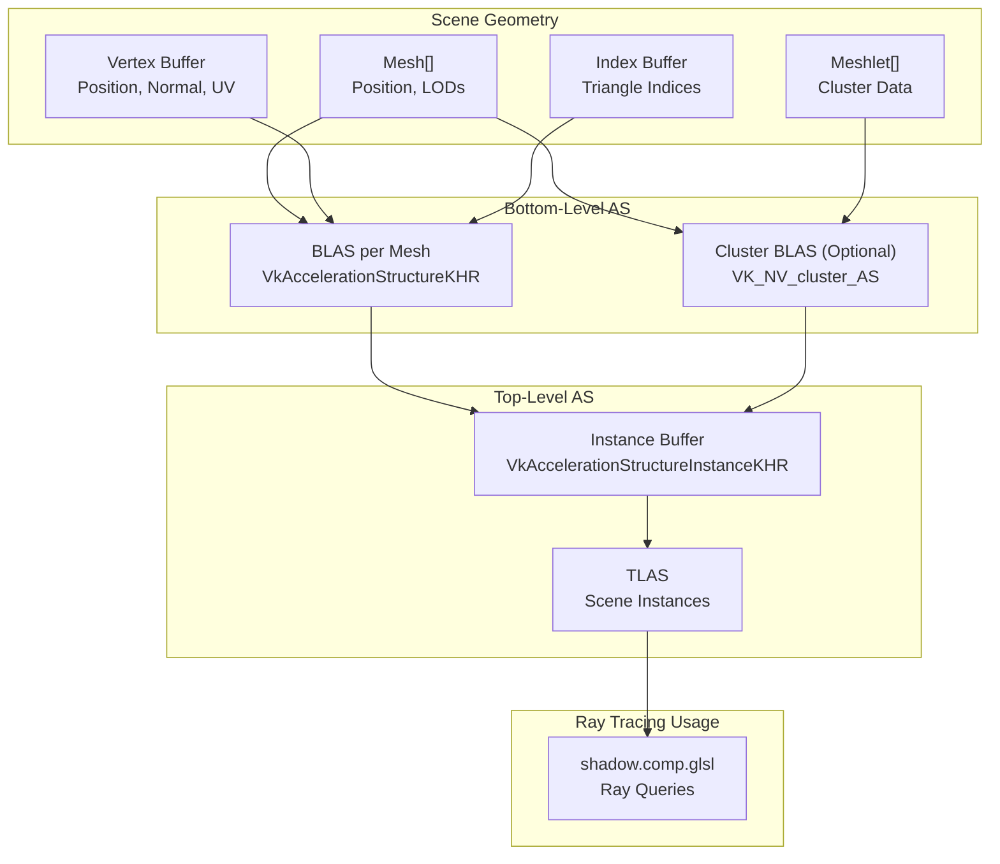
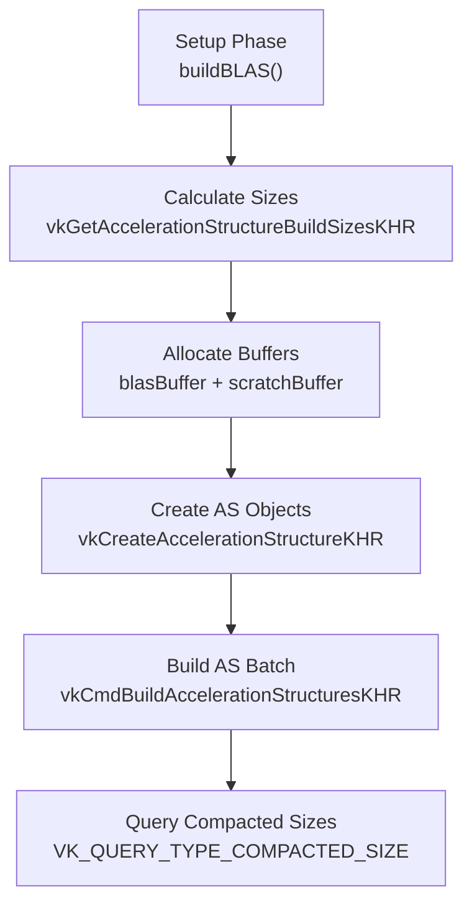
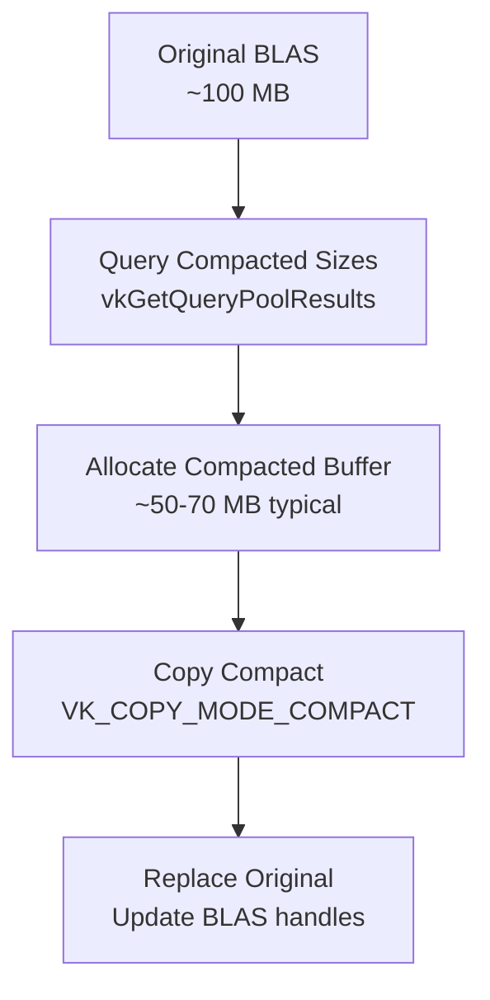
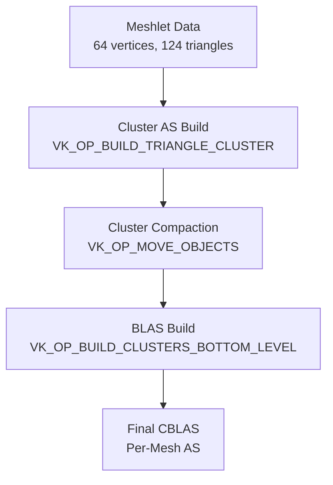
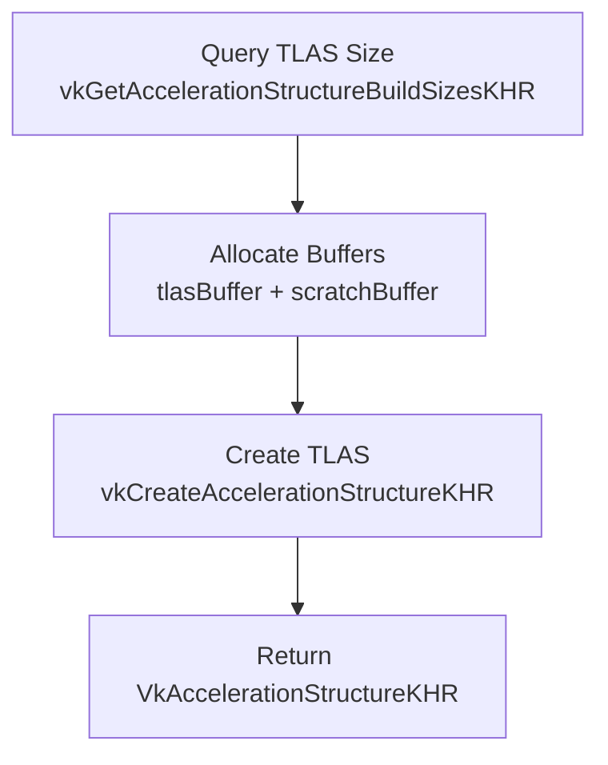
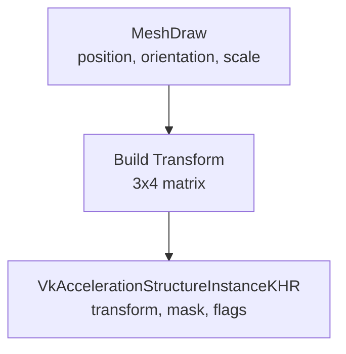
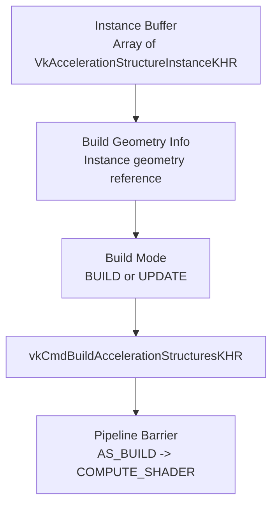
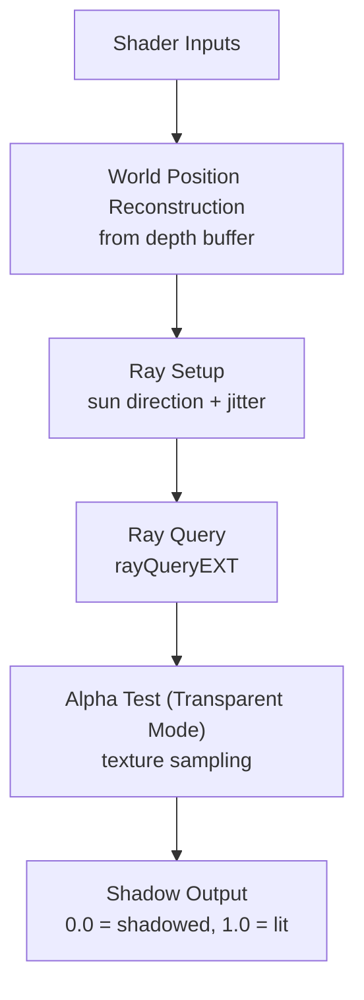
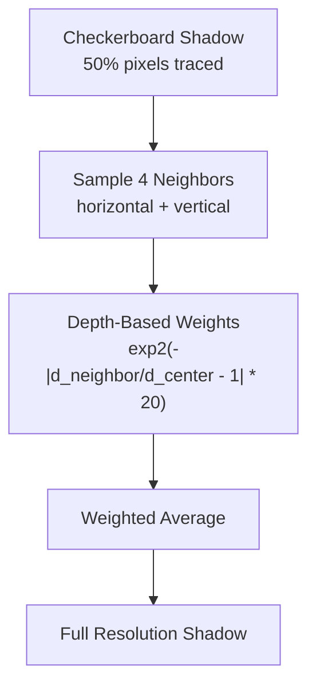
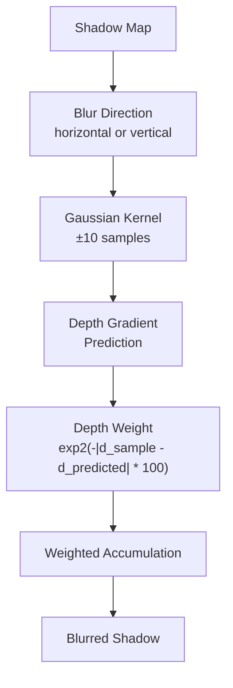

# Ray Tracing System

> **Relevant source files**
> * [src/scenert.cpp](https://github.com/zeux/niagara/blob/6f3fb529/src/scenert.cpp)
> * [src/scenert.h](https://github.com/zeux/niagara/blob/6f3fb529/src/scenert.h)
> * [src/shaders/shadow.comp.glsl](https://github.com/zeux/niagara/blob/6f3fb529/src/shaders/shadow.comp.glsl)
> * [src/shaders/shadowblur.comp.glsl](https://github.com/zeux/niagara/blob/6f3fb529/src/shaders/shadowblur.comp.glsl)
> * [src/shaders/shadowfill.comp.glsl](https://github.com/zeux/niagara/blob/6f3fb529/src/shaders/shadowfill.comp.glsl)

## Purpose and Scope

The Ray Tracing System provides hardware-accelerated ray tracing functionality for shadow generation in Niagara. The system manages Vulkan ray tracing acceleration structures (BLAS and TLAS) and implements shadow ray queries using the `VK_KHR_ray_query` extension. It integrates with the scene loading pipeline to build optimized acceleration structures from mesh geometry and supports both standard triangle-based BLAS and NVIDIA's cluster acceleration structures for meshlet-optimized ray tracing.

For information about scene geometry processing and meshlet generation, see [Scene System](/zeux/niagara/5-scene-system). For details on the deferred rendering pipeline that consumes shadow output, see [Deferred Rendering](/zeux/niagara/8-deferred-rendering).

---

## Acceleration Structure Overview

The ray tracing system uses a two-level acceleration structure hierarchy:



**Sources:** [src/scenert.cpp L15-L227](https://github.com/zeux/niagara/blob/6f3fb529/src/scenert.cpp#L15-L227)

 [src/scenert.cpp L229-L469](https://github.com/zeux/niagara/blob/6f3fb529/src/scenert.cpp#L229-L469)

 [src/scenert.cpp L487-L519](https://github.com/zeux/niagara/blob/6f3fb529/src/scenert.cpp#L487-L519)

---

## Bottom-Level Acceleration Structures (BLAS)

### BLAS Building

The `buildBLAS()` function constructs one BLAS per mesh from vertex and index buffers. Each BLAS contains the LOD 0 geometry and is built with compaction support enabled.



**Key Implementation Details:**

| Aspect | Configuration |
| --- | --- |
| Build Flags | `VK_BUILD_ACCELERATION_STRUCTURE_PREFER_FAST_TRACE_BIT_KHR \| VK_BUILD_ACCELERATION_STRUCTURE_ALLOW_COMPACTION_BIT_KHR` |
| Geometry Type | `VK_GEOMETRY_TYPE_TRIANGLES_KHR` |
| Vertex Format | `VK_FORMAT_R16G16B16A16_SFLOAT` |
| Index Type | `VK_INDEX_TYPE_UINT32` |
| Alignment | 256 bytes (required by spec) |
| Scratch Strategy | Batch builds to fit within allocated scratch buffer |

The function processes geometries in [src/scenert.cpp L35-L75](https://github.com/zeux/niagara/blob/6f3fb529/src/scenert.cpp#L35-L75)

 by:

1. Setting up `VkAccelerationStructureGeometryKHR` with device addresses from vertex/index buffers
2. Querying size requirements for each BLAS
3. Accumulating total memory requirements and max scratch size

Build execution occurs in [src/scenert.cpp L116-L138](https://github.com/zeux/niagara/blob/6f3fb529/src/scenert.cpp#L116-L138)

 using batch processing to fit multiple builds within the allocated scratch buffer.

**Sources:** [src/scenert.cpp L15-L158](https://github.com/zeux/niagara/blob/6f3fb529/src/scenert.cpp#L15-L158)

 [src/scenert.h L9](https://github.com/zeux/niagara/blob/6f3fb529/src/scenert.h#L9-L9)

---

### BLAS Compaction

After initial build, `compactBLAS()` performs compaction to reduce memory usage:



The compaction process [src/scenert.cpp L160-L227](https://github.com/zeux/niagara/blob/6f3fb529/src/scenert.cpp#L160-L227)

:

1. Retrieves compacted sizes from query pool populated during build
2. Calculates new buffer layout with 256-byte alignment
3. Creates compacted acceleration structures in smaller buffer
4. Copies data using `VK_COPY_ACCELERATION_STRUCTURE_MODE_COMPACT_KHR`
5. Destroys original structures and buffer

Typical compaction ratios achieve 50-70% memory reduction, printed in diagnostic output [src/scenert.cpp L175](https://github.com/zeux/niagara/blob/6f3fb529/src/scenert.cpp#L175-L175)

**Sources:** [src/scenert.cpp L160-L227](https://github.com/zeux/niagara/blob/6f3fb529/src/scenert.cpp#L160-L227)

 [src/scenert.h L10](https://github.com/zeux/niagara/blob/6f3fb529/src/scenert.h#L10-L10)

---

## Cluster Acceleration Structures (CBLAS)

### NVIDIA Extension Support

When `VK_NV_cluster_acceleration_structure` is available, `buildCBLAS()` creates optimized acceleration structures from meshlets rather than raw triangles. This path is conditionally compiled [src/scenert.cpp L231-L469](https://github.com/zeux/niagara/blob/6f3fb529/src/scenert.cpp#L231-L469)



**Cluster Build Configuration:**

| Parameter | Value |
| --- | --- |
| Max Cluster Triangles | `MESH_MAXTRI` (124) |
| Max Cluster Vertices | `MESH_MAXVTX` (64) |
| Index Format | `VK_CLUSTER_INDEX_FORMAT_8BIT_NV` |
| Vertex Stride | 8 bytes (4x uint16_t) |
| Build Flags | `VK_BUILD_ACCELERATION_STRUCTURE_PREFER_FAST_TRACE_BIT_KHR` |
| Cluster Alignment | 128 bytes |

The three-phase build process [src/scenert.cpp L342-L444](https://github.com/zeux/niagara/blob/6f3fb529/src/scenert.cpp#L342-L444)

:

1. **Cluster Build Phase**: Builds individual cluster acceleration structures from meshlet data, one per meshlet
2. **Compaction Phase**: Moves clusters into final buffer with tight packing
3. **BLAS Build Phase**: Constructs per-mesh BLAS from references to compacted clusters

**Sources:** [src/scenert.cpp L229-L469](https://github.com/zeux/niagara/blob/6f3fb529/src/scenert.cpp#L229-L469)

 [src/scenert.h L12](https://github.com/zeux/niagara/blob/6f3fb529/src/scenert.h#L12-L12)

---

## Top-Level Acceleration Structures (TLAS)

### TLAS Creation

The `createTLAS()` function allocates buffers and creates a TLAS object with update support:



TLAS is built with `VK_BUILD_ACCELERATION_STRUCTURE_ALLOW_UPDATE_BIT_KHR` [src/scenert.cpp L496](https://github.com/zeux/niagara/blob/6f3fb529/src/scenert.cpp#L496-L496)

 to enable per-frame updates for animated scenes without full rebuilds.

**Sources:** [src/scenert.cpp L487-L519](https://github.com/zeux/niagara/blob/6f3fb529/src/scenert.cpp#L487-L519)

 [src/scenert.h L16](https://github.com/zeux/niagara/blob/6f3fb529/src/scenert.h#L16-L16)

---

### Instance Management

The `fillInstanceRT()` function populates `VkAccelerationStructureInstanceKHR` structures from `MeshDraw` data:



**Instance Configuration [src/scenert.cpp L471-L485](https://github.com/zeux/niagara/blob/6f3fb529/src/scenert.cpp#L471-L485)

:**

| Field | Value |
| --- | --- |
| Transform | Transposed 3x3 rotation * scale + translation in column 3 |
| Custom Index | Instance index for shader identification |
| Mask | `1 << draw.postPass` (ray mask based on render pass) |
| Flags | `FORCE_OPAQUE` (postPass=0) or `FORCE_NO_OPAQUE` (postPass>0) |
| AS Reference | BLAS device address (0 if postPass > 1) |

The mask and flags system allows selective ray intersection: opaque objects in the main pass use opaque flags, while transparent objects in post-pass use non-opaque flags for alpha testing.

**Sources:** [src/scenert.cpp L471-L485](https://github.com/zeux/niagara/blob/6f3fb529/src/scenert.cpp#L471-L485)

 [src/scenert.h L14](https://github.com/zeux/niagara/blob/6f3fb529/src/scenert.h#L14-L14)

---

### TLAS Build and Update

The `buildTLAS()` function builds or updates the TLAS structure:



The function supports two modes [src/scenert.cpp L521-L546](https://github.com/zeux/niagara/blob/6f3fb529/src/scenert.cpp#L521-L546)

:

* `VK_BUILD_ACCELERATION_STRUCTURE_MODE_BUILD_KHR`: Full rebuild
* `VK_BUILD_ACCELERATION_STRUCTURE_MODE_UPDATE_KHR`: Fast incremental update

A pipeline barrier ensures the build completes before compute shaders access the TLAS for ray queries [src/scenert.cpp L545](https://github.com/zeux/niagara/blob/6f3fb529/src/scenert.cpp#L545-L545)

**Sources:** [src/scenert.cpp L521-L546](https://github.com/zeux/niagara/blob/6f3fb529/src/scenert.cpp#L521-L546)

 [src/scenert.h L18](https://github.com/zeux/niagara/blob/6f3fb529/src/scenert.h#L18-L18)

---

## Shadow Ray Tracing

### Compute Shader Architecture

Shadow generation uses a compute shader `shadow.comp.glsl` that performs ray queries against the TLAS. The shader is dispatched with 8x8 local workgroup size [src/shaders/shadow.comp.glsl L15](https://github.com/zeux/niagara/blob/6f3fb529/src/shaders/shadow.comp.glsl#L15-L15)



**Shader Bindings [src/shaders/shadow.comp.glsl L33-L66](https://github.com/zeux/niagara/blob/6f3fb529/src/shaders/shadow.comp.glsl#L33-L66)

:**

| Binding | Type | Purpose |
| --- | --- | --- |
| 0 | `writeonly image2D` | Shadow output image |
| 1 | `sampler2D` | Depth buffer for world position reconstruction |
| 2 | `accelerationStructureEXT` | TLAS for ray queries |
| 3 | `buffer Draws` | MeshDraw instances |
| 4 | `buffer Meshes` | Mesh metadata |
| 5 | `buffer Materials` | Material data (albedo texture IDs) |
| 6 | `buffer Vertices` | Vertex buffer for UV interpolation |
| 7 | `buffer Indices` | Index buffer for triangle access |
| 8 | `sampler` | Texture sampler |
| 0 (set 1) | `texture2D[]` | Bindless texture array |

**Sources:** [src/shaders/shadow.comp.glsl L1-L152](https://github.com/zeux/niagara/blob/6f3fb529/src/shaders/shadow.comp.glsl#L1-L152)

---

### Ray Query Modes

Two quality modes are supported via specialization constant `QUALITY` [src/shaders/shadow.comp.glsl L13](https://github.com/zeux/niagara/blob/6f3fb529/src/shaders/shadow.comp.glsl#L13-L13)

:

#### Opaque Shadow Mode (QUALITY=0)

Uses `shadowTrace()` [src/shaders/shadow.comp.glsl L69-L75](https://github.com/zeux/niagara/blob/6f3fb529/src/shaders/shadow.comp.glsl#L69-L75)

:

```
rayQueryInitializeEXT(rq, tlas, 
    gl_RayFlagsTerminateOnFirstHitEXT | gl_RayFlagsCullNoOpaqueEXT,
    0xff, wpos, 1e-2, dir, 1e3);
rayQueryProceedEXT(rq);
return rayQueryGetIntersectionTypeEXT(rq, true) != 
    gl_RayQueryCommittedIntersectionNoneEXT;
```

Terminates on first hit with any opaque geometry. Fast but does not handle transparency.

#### Transparent Shadow Mode (QUALITY=1)

Uses `shadowTraceTransparent()` [src/shaders/shadow.comp.glsl L77-L114](https://github.com/zeux/niagara/blob/6f3fb529/src/shaders/shadow.comp.glsl#L77-L114)

:

```python
while (rayQueryProceedEXT(rq))
{
    // Get intersection data
    int objid = rayQueryGetIntersectionInstanceIdEXT(rq, false);
    int triid = rayQueryGetIntersectionPrimitiveIndexEXT(rq, false);
    vec2 bary = rayQueryGetIntersectionBarycentricsEXT(rq, false);
    
    // Sample alpha from texture
    float alpha = textureLod(SAMP(material.albedoTexture), uv, 0).a;
    
    if (alpha >= 0.5)
        rayQueryConfirmIntersectionEXT(rq);
}
```

Manually processes each candidate intersection, sampling albedo texture alpha at the hit UV coordinate. Confirms intersection only if alpha ≥ 0.5.

**Sources:** [src/shaders/shadow.comp.glsl L69-L114](https://github.com/zeux/niagara/blob/6f3fb529/src/shaders/shadow.comp.glsl#L69-L114)

---

### World Position Reconstruction

World position is reconstructed from screen-space UV and depth [src/shaders/shadow.comp.glsl L127-L132](https://github.com/zeux/niagara/blob/6f3fb529/src/shaders/shadow.comp.glsl#L127-L132)

:

```
vec2 uv = (vec2(pos) + 0.5) / shadowData.imageSize;
float depth = texture(depthImage, uv).r;

vec4 clip = vec4(uv.x * 2 - 1, 1 - uv.y * 2, depth, 1);
vec4 wposh = shadowData.inverseViewProjection * clip;
vec3 wpos = wposh.xyz / wposh.w;
```

The inverse view-projection matrix transforms clip-space coordinates back to world space.

**Sources:** [src/shaders/shadow.comp.glsl L127-L132](https://github.com/zeux/niagara/blob/6f3fb529/src/shaders/shadow.comp.glsl#L127-L132)

---

### Checkerboard Rendering

To reduce ray tracing cost, shadow rays can be traced at half horizontal resolution in a checkerboard pattern [src/shaders/shadow.comp.glsl L120-L125](https://github.com/zeux/niagara/blob/6f3fb529/src/shaders/shadow.comp.glsl#L120-L125)

:

```
if (shadowData.checkerboard > 0)
{
    pos.x *= 2;
    pos.x += (pos.y ^ shadowData.checkerboard) & 1;
}
```

The checkerboard parameter alternates between frames (0, 1, 2) to trace different pixel subsets, which are later filled by `shadowfill.comp.glsl`.

**Sources:** [src/shaders/shadow.comp.glsl L120-L125](https://github.com/zeux/niagara/blob/6f3fb529/src/shaders/shadow.comp.glsl#L120-L125)

---

## Shadow Post-Processing

### Checkerboard Fill

The `shadowfill.comp.glsl` shader reconstructs missing checkerboard pixels using depth-weighted interpolation from neighbors [src/shaders/shadowfill.comp.glsl L1-L45](https://github.com/zeux/niagara/blob/6f3fb529/src/shaders/shadowfill.comp.glsl#L1-L45)



**Weighting Formula [src/shaders/shadowfill.comp.glsl L40](https://github.com/zeux/niagara/blob/6f3fb529/src/shaders/shadowfill.comp.glsl#L40-L40)

:**

```
vec4 weights = exp2(-abs(depths / depth - 1) * 20);
float shadow = dot(weights, shadows) / (dot(weights, vec4(1)) + 1e-2);
```

Neighbors with similar depth receive higher weight, preventing shadow bleeding across depth discontinuities.

**Sources:** [src/shaders/shadowfill.comp.glsl L1-L45](https://github.com/zeux/niagara/blob/6f3fb529/src/shaders/shadowfill.comp.glsl#L1-L45)

---

### Depth-Aware Blur

The `shadowblur.comp.glsl` shader applies separable Gaussian blur with depth discontinuity preservation [src/shaders/shadowblur.comp.glsl L1-L63](https://github.com/zeux/niagara/blob/6f3fb529/src/shaders/shadowblur.comp.glsl#L1-L63)



**Key Features:**

| Feature | Implementation |
| --- | --- |
| Kernel Size | ±10 samples per direction |
| Gaussian Weight | `exp2(-i*i / 50)` |
| Depth Gradient | Linear prediction from first neighbor |
| Depth Weight | `exp2(-abs(d_sample - d_predicted) * 100)` |
| Gradient Threshold | Gradient ignored if `abs(depth - dnext) >= 0.1` |

The blur applies in two passes (horizontal, vertical) [src/shaders/shadowblur.comp.glsl L33](https://github.com/zeux/niagara/blob/6f3fb529/src/shaders/shadowblur.comp.glsl#L33-L33)

 using the `direction` parameter to control axis.

Depth gradient prediction [src/shaders/shadowblur.comp.glsl L39-L41](https://github.com/zeux/niagara/blob/6f3fb529/src/shaders/shadowblur.comp.glsl#L39-L41)

 helps maintain soft shadows on planar surfaces while preserving edges:

```
float dnext = znear / texelFetch(depthImage, uvnext, 0).r;
float dgrad = abs(depth - dnext) < 0.1 ? dnext - depth : 0;
// Sample at: depth + dgrad * i
```

**Sources:** [src/shaders/shadowblur.comp.glsl L1-L63](https://github.com/zeux/niagara/blob/6f3fb529/src/shaders/shadowblur.comp.glsl#L1-L63)

---

## Memory Management

### Buffer Allocation Strategy

| Buffer Type | Usage | Memory Type |
| --- | --- | --- |
| BLAS/CBLAS Storage | `ACCELERATION_STRUCTURE_STORAGE` | Device-local |
| TLAS Storage | `ACCELERATION_STRUCTURE_STORAGE` | Device-local |
| Scratch Buffer | `STORAGE_BUFFER \| SHADER_DEVICE_ADDRESS` | Device-local |
| Instance Buffer | `ACCELERATION_STRUCTURE_BUILD_INPUT` | Host-visible or Device-local |
| Info Buffer (CBLAS) | `ACCELERATION_STRUCTURE_BUILD_INPUT` | Host-visible + coherent |

All acceleration structure buffers require `VK_BUFFER_USAGE_SHADER_DEVICE_ADDRESS_BIT` for address-based referencing.

**Sources:** [src/scenert.cpp L77-L80](https://github.com/zeux/niagara/blob/6f3fb529/src/scenert.cpp#L77-L80)

 [src/scenert.cpp L300-L307](https://github.com/zeux/niagara/blob/6f3fb529/src/scenert.cpp#L300-L307)

 [src/scenert.cpp L506-L508](https://github.com/zeux/niagara/blob/6f3fb529/src/scenert.cpp#L506-L508)

---

## Integration with Main Renderer

The ray tracing system integrates with the main rendering pipeline through several key points:

1. **Scene Loading**: BLAS built during scene initialization from loaded mesh data
2. **Frame Update**: TLAS updated per-frame with current instance transforms
3. **Shadow Pass**: Compute shader dispatched after G-buffer generation
4. **Post-Processing**: Checkerboard fill and blur applied before final composition

The system provides high-quality shadows with relatively low cost by leveraging hardware ray tracing acceleration and smart techniques like checkerboard rendering and depth-aware filtering.

**Sources:** [src/scenert.cpp L1-L547](https://github.com/zeux/niagara/blob/6f3fb529/src/scenert.cpp#L1-L547)

 [src/shaders/shadow.comp.glsl L1-L152](https://github.com/zeux/niagara/blob/6f3fb529/src/shaders/shadow.comp.glsl#L1-L152)