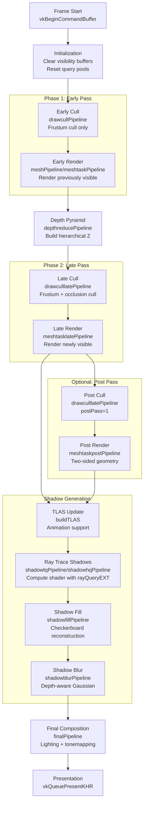
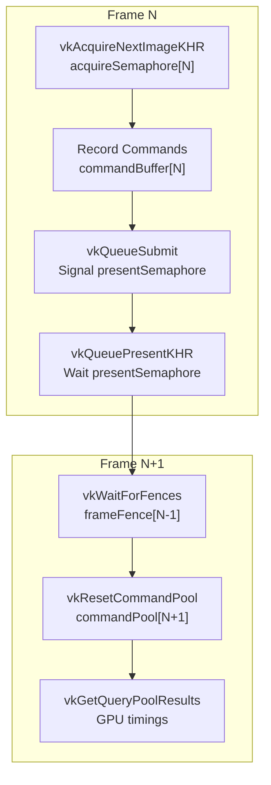
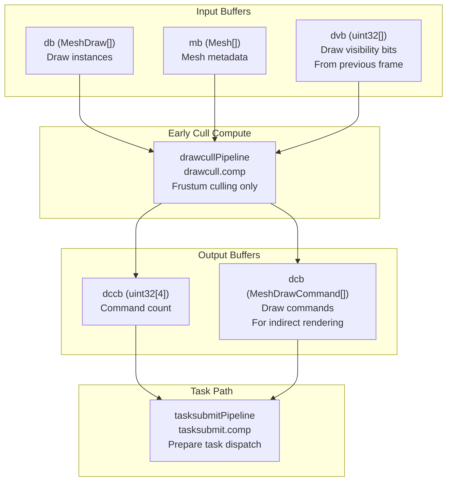
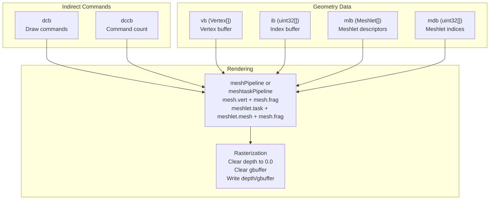
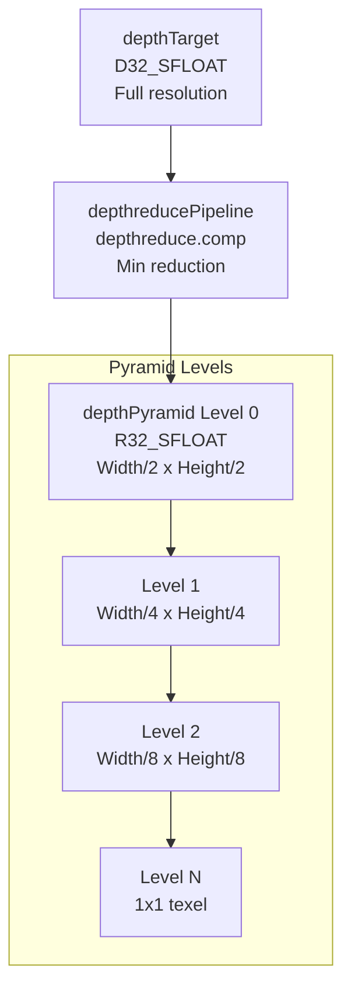
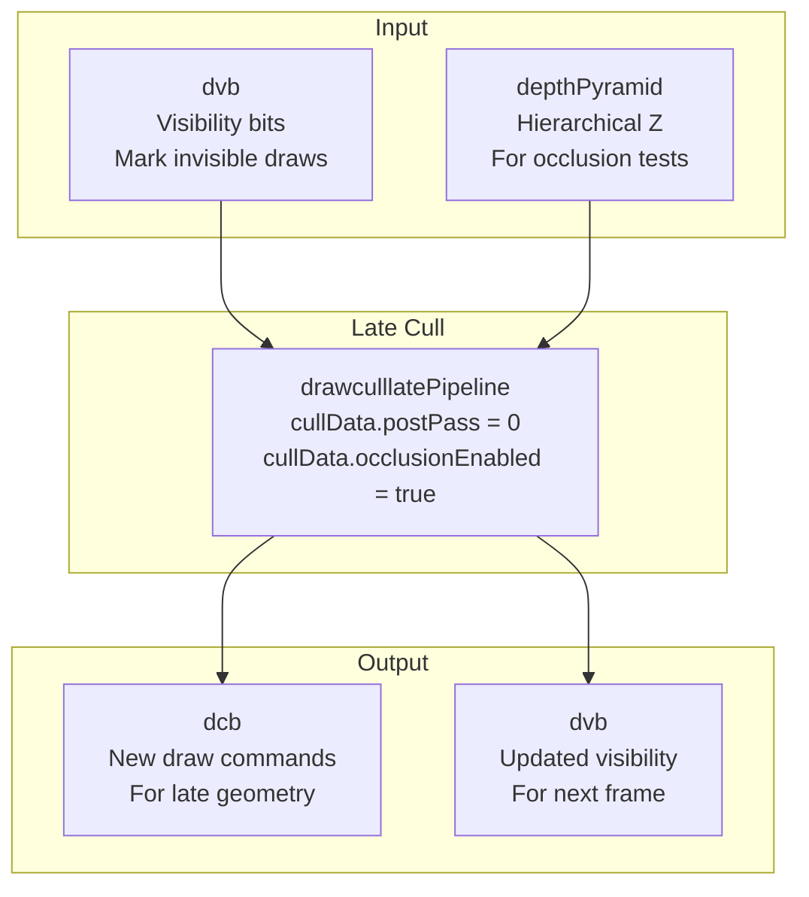
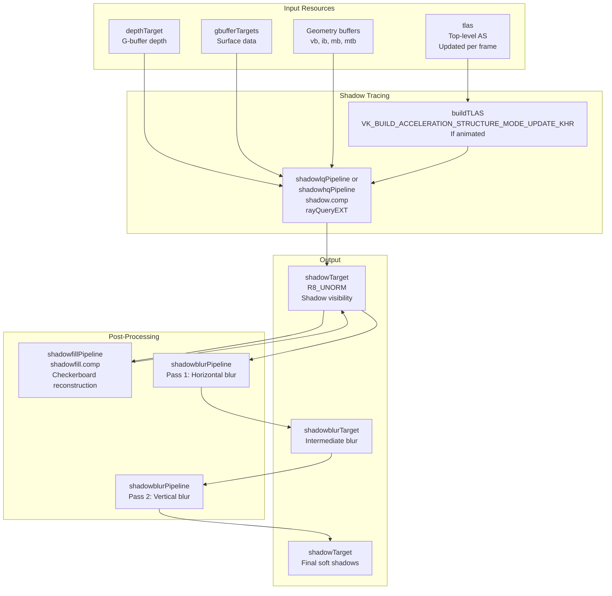
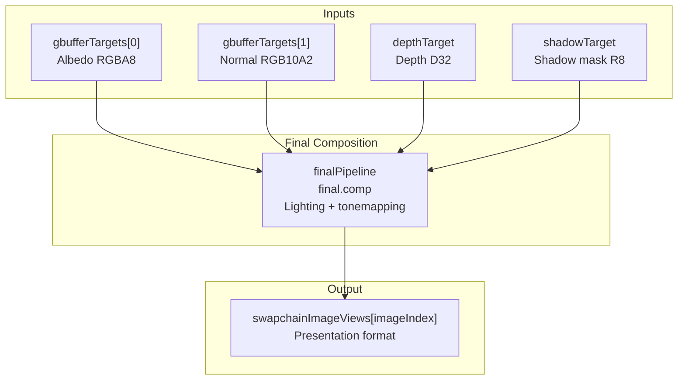
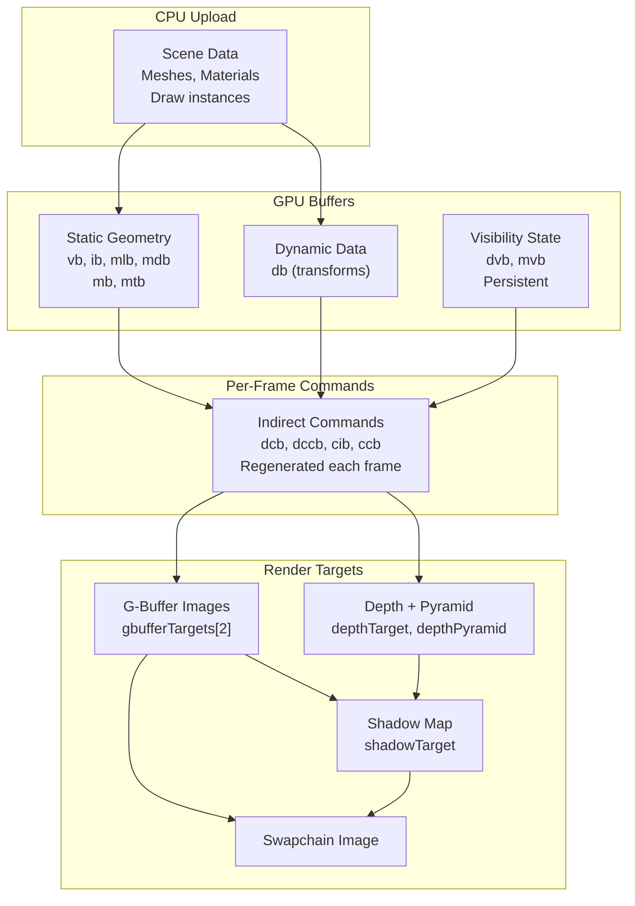

# Rendering Pipeline Overview

> **Relevant source files**
> * [src/niagara.cpp](https://github.com/zeux/niagara/blob/6f3fb529/src/niagara.cpp)
> * [src/shaders/mesh.h](https://github.com/zeux/niagara/blob/6f3fb529/src/shaders/mesh.h)

## Purpose and Scope

This page provides a detailed walkthrough of Niagara's complete rendering pipeline from frame start to presentation. It covers the sequence of GPU passes, data dependencies, and synchronization between stages.

For details on the GPU-driven culling architecture, see [Draw Culling Pipeline](/zeux/niagara/7.1-draw-culling-pipeline), [Task Shader Stage](/zeux/niagara/7.2-task-shader-stage), and [Mesh Shader Stage](/zeux/niagara/7.3-mesh-shader-stage). For information about the G-buffer layout and lighting calculations, see [Deferred Rendering](/zeux/niagara/8-deferred-rendering). For ray tracing specifics, see [Ray Tracing System](/zeux/niagara/9-ray-tracing-system).

---

## Pipeline Architecture

Niagara implements a **two-phase GPU-driven rendering pipeline** with hierarchical occlusion culling. The pipeline executes multiple passes per frame, each optimized for discovering and rendering visible geometry while minimizing overdraw.

### High-Level Pipeline Flow



**Sources:** [src/niagara.cpp L1137-L1650](https://github.com/zeux/niagara/blob/6f3fb529/src/niagara.cpp#L1137-L1650)

---

## Frame Structure and Synchronization

The renderer maintains a ring buffer of `MAX_FRAMES` (typically 2) in-flight frames to overlap CPU and GPU work. Each frame has dedicated resources to avoid synchronization stalls.

### Per-Frame Resources

| Resource Type | Purpose | Declaration |
| --- | --- | --- |
| `VkCommandPool` | Command buffer allocation | [src/niagara.cpp L582-L596](https://github.com/zeux/niagara/blob/6f3fb529/src/niagara.cpp#L582-L596) |
| `VkCommandBuffer` | GPU command recording | [src/niagara.cpp L583](https://github.com/zeux/niagara/blob/6f3fb529/src/niagara.cpp#L583-L583) |
| `VkSemaphore` (acquire) | Swapchain image acquisition | [src/niagara.cpp L420-L428](https://github.com/zeux/niagara/blob/6f3fb529/src/niagara.cpp#L420-L428) |
| `VkSemaphore` (present) | Presentation synchronization | [src/niagara.cpp L937-L943](https://github.com/zeux/niagara/blob/6f3fb529/src/niagara.cpp#L937-L943) |
| `VkFence` | CPU-GPU synchronization | [src/niagara.cpp L421-L427](https://github.com/zeux/niagara/blob/6f3fb529/src/niagara.cpp#L421-L427) |
| `VkQueryPool` (timestamp) | GPU profiling | [src/niagara.cpp L572-L580](https://github.com/zeux/niagara/blob/6f3fb529/src/niagara.cpp#L572-L580) |
| `VkQueryPool` (pipeline stats) | Triangle count | [src/niagara.cpp L573-L579](https://github.com/zeux/niagara/blob/6f3fb529/src/niagara.cpp#L573-L579) |

### Frame Loop Structure



**Sources:** [src/niagara.cpp L1120-L1695](https://github.com/zeux/niagara/blob/6f3fb529/src/niagara.cpp#L1120-L1695)

---

## Phase 1: Early Pass

The early pass renders geometry that was **visible in the previous frame** using cached visibility information. This establishes an initial depth buffer quickly, enabling effective occlusion culling in subsequent passes.

### Early Cull Stage



**Pipeline:** `drawcullPipeline` or `taskcullPipeline` depending on rendering mode

**Key Functions:**

* Lambda `cull` at [src/niagara.cpp L1224-L1269](https://github.com/zeux/niagara/blob/6f3fb529/src/niagara.cpp#L1224-L1269)  orchestrates the culling stage
* Fills `dccb` buffer with `vkCmdFillBuffer` at [src/niagara.cpp L1235](https://github.com/zeux/niagara/blob/6f3fb529/src/niagara.cpp#L1235-L1235)  to reset command count
* Dispatches `drawcullProgram` compute shader at [src/niagara.cpp L1251](https://github.com/zeux/niagara/blob/6f3fb529/src/niagara.cpp#L1251-L1251)
* Optionally dispatches `tasksubmitProgram` at [src/niagara.cpp L1258-L1263](https://github.com/zeux/niagara/blob/6f3fb529/src/niagara.cpp#L1258-L1263)  to prepare task shader indirect dispatch

**Culling Parameters (`CullData`):**

* `postPass = 0` for early pass [src/niagara.cpp L1244](https://github.com/zeux/niagara/blob/6f3fb529/src/niagara.cpp#L1244-L1244)
* `cullingEnabled` controls frustum culling [src/niagara.cpp L1207](https://github.com/zeux/niagara/blob/6f3fb529/src/niagara.cpp#L1207-L1207)
* `occlusionEnabled = false` for early pass (no depth pyramid yet)

**Sources:** [src/niagara.cpp L1224-L1269](https://github.com/zeux/niagara/blob/6f3fb529/src/niagara.cpp#L1224-L1269)

 [src/niagara.cpp L1439](https://github.com/zeux/niagara/blob/6f3fb529/src/niagara.cpp#L1439-L1439)

### Early Render Stage



**Pipeline:** `meshPipeline` (traditional vertex/fragment) or `meshtaskPipeline` (task/mesh shaders)

**Key Functions:**

* Lambda `render` at [src/niagara.cpp L1271-L1395](https://github.com/zeux/niagara/blob/6f3fb529/src/niagara.cpp#L1271-L1395)  orchestrates rendering
* Begins dynamic rendering with `vkCmdBeginRendering` at [src/niagara.cpp L1335](https://github.com/zeux/niagara/blob/6f3fb529/src/niagara.cpp#L1335-L1335)
* Issues draw call via `vkCmdDrawIndexedIndirectCount` (traditional) at [src/niagara.cpp L1387](https://github.com/zeux/niagara/blob/6f3fb529/src/niagara.cpp#L1387-L1387)  or `vkCmdDrawMeshTasksIndirectEXT` (mesh shading) at [src/niagara.cpp L1373](https://github.com/zeux/niagara/blob/6f3fb529/src/niagara.cpp#L1373-L1373)

**Render Targets:**

* G-buffer targets: `gbufferTargets[0]` (albedo, RGBA8), `gbufferTargets[1]` (normal, RGB10A2) [src/niagara.cpp L444-L448](https://github.com/zeux/niagara/blob/6f3fb529/src/niagara.cpp#L444-L448)
* Depth target: `depthTarget` (D32_SFLOAT) [src/niagara.cpp L442](https://github.com/zeux/niagara/blob/6f3fb529/src/niagara.cpp#L442-L442)
* Load op: `VK_ATTACHMENT_LOAD_OP_CLEAR` for early pass [src/niagara.cpp L1315](https://github.com/zeux/niagara/blob/6f3fb529/src/niagara.cpp#L1315-L1315)

**Sources:** [src/niagara.cpp L1271-L1395](https://github.com/zeux/niagara/blob/6f3fb529/src/niagara.cpp#L1271-L1395)

 [src/niagara.cpp L1442](https://github.com/zeux/niagara/blob/6f3fb529/src/niagara.cpp#L1442-L1442)

---

## Depth Pyramid Generation

After the early render, a **hierarchical depth pyramid** is constructed from the depth buffer. This structure enables efficient occlusion testing in subsequent passes.



**Implementation:**

* Lambda `pyramid` at [src/niagara.cpp L1397-L1426](https://github.com/zeux/niagara/blob/6f3fb529/src/niagara.cpp#L1397-L1426)
* Iterates through `depthPyramidLevels` mip levels [src/niagara.cpp L1405-L1421](https://github.com/zeux/niagara/blob/6f3fb529/src/niagara.cpp#L1405-L1421)
* Each level samples the previous level (or depth target for level 0) and computes conservative min depth
* Uses `depthSampler` with `VK_SAMPLER_REDUCTION_MODE_MIN` [src/niagara.cpp L439](https://github.com/zeux/niagara/blob/6f3fb529/src/niagara.cpp#L439-L439)

**Pyramid Dimensions:**

* Width/height rounded down to previous power of 2 using `previousPow2` [src/niagara.cpp L1059-L1060](https://github.com/zeux/niagara/blob/6f3fb529/src/niagara.cpp#L1059-L1060)
* Ensures all reductions are 2x2 or less, maintaining conservative depth values
* Mip levels computed via `getImageMipLevels` [src/niagara.cpp L1061](https://github.com/zeux/niagara/blob/6f3fb529/src/niagara.cpp#L1061-L1061)

**Sources:** [src/niagara.cpp L1397-L1426](https://github.com/zeux/niagara/blob/6f3fb529/src/niagara.cpp#L1397-L1426)

 [src/niagara.cpp L1059-L1068](https://github.com/zeux/niagara/blob/6f3fb529/src/niagara.cpp#L1059-L1068)

 [src/niagara.cpp L1445](https://github.com/zeux/niagara/blob/6f3fb529/src/niagara.cpp#L1445-L1445)

---

## Phase 2: Late Pass

The late pass discovers and renders geometry that is **visible this frame but was not rendered in the early pass**. It performs full frustum and occlusion culling against the depth pyramid.

### Late Cull Stage



**Key Differences from Early Cull:**

* `cullData.occlusionEnabled = true` [src/niagara.cpp L1209](https://github.com/zeux/niagara/blob/6f3fb529/src/niagara.cpp#L1209-L1209)  enables depth pyramid testing
* Depth pyramid descriptor passed to shader [src/niagara.cpp L1248](https://github.com/zeux/niagara/blob/6f3fb529/src/niagara.cpp#L1248-L1248)
* Visibility buffer `dvb` is both read (to skip already-visible draws) and written (to mark newly visible draws)

**Sources:** [src/niagara.cpp L1448](https://github.com/zeux/niagara/blob/6f3fb529/src/niagara.cpp#L1448-L1448)

### Late Render Stage

Rendering configuration identical to early pass except:

* `late = true` parameter [src/niagara.cpp L1451](https://github.com/zeux/niagara/blob/6f3fb529/src/niagara.cpp#L1451-L1451)
* Load op: `VK_ATTACHMENT_LOAD_OP_LOAD` to preserve early pass results [src/niagara.cpp L1315](https://github.com/zeux/niagara/blob/6f3fb529/src/niagara.cpp#L1315-L1315)
* Pipeline: `meshtasklatePipeline` (task/mesh) or `meshPipeline` (traditional) with `LATE` specialization constant

**Sources:** [src/niagara.cpp L1451](https://github.com/zeux/niagara/blob/6f3fb529/src/niagara.cpp#L1451-L1451)

---

## Optional Post Pass

Some draw calls require special handling (e.g., two-sided rendering for vegetation, double-sided materials). These are rendered in an optional post pass if `meshPostPasses` contains post pass flags.

### Post Pass Configuration

| Setting | Early/Late | Post |
| --- | --- | --- |
| **Cull Mode** | `BACK` | `NONE` |
| **Depth Bias** | 0 / 0 | 16 / 1 |
| **Pipeline** | Standard | `meshpostPipeline` / `meshtaskpostPipeline` |
| **postPass Flag** | 0 | 1 |

**Implementation:**

* Post cull at [src/niagara.cpp L1457](https://github.com/zeux/niagara/blob/6f3fb529/src/niagara.cpp#L1457-L1457)  with `postPass = 1` parameter
* Post render at [src/niagara.cpp L1460](https://github.com/zeux/niagara/blob/6f3fb529/src/niagara.cpp#L1460-L1460)  with depth bias and no backface culling [src/niagara.cpp L1343-L1344](https://github.com/zeux/niagara/blob/6f3fb529/src/niagara.cpp#L1343-L1344)
* Skipped if `meshPostPasses >> 1` is zero [src/niagara.cpp L1454](https://github.com/zeux/niagara/blob/6f3fb529/src/niagara.cpp#L1454-L1454)

**Sources:** [src/niagara.cpp L1454-L1461](https://github.com/zeux/niagara/blob/6f3fb529/src/niagara.cpp#L1454-L1461)

---

## Shadow Generation

Shadows are generated using **ray tracing with compute shaders** and `rayQueryEXT`. The system supports both low-quality (1 sample) and high-quality (multiple samples) modes.

### Shadow Pipeline



**Shadow Tracing:**

* TLAS update at [src/niagara.cpp L1173-L1179](https://github.com/zeux/niagara/blob/6f3fb529/src/niagara.cpp#L1173-L1179)  if animation enabled
* Shadow compute dispatch at [src/niagara.cpp L1476-L1489](https://github.com/zeux/niagara/blob/6f3fb529/src/niagara.cpp#L1476-L1489)
* Checkerboard rendering: dispatch width halved if `shadowCheckerboard` enabled [src/niagara.cpp L1470](https://github.com/zeux/niagara/blob/6f3fb529/src/niagara.cpp#L1470-L1470)

**Shadow Data Structure (`ShadowData`):**

```
struct ShadowData {
    vec3 sunDirection;      // Light direction
    float sunJitter;        // 1e-2 for soft shadows
    mat4 inverseViewProjection;
    vec2 imageSize;
    unsigned int checkerboard;  // 0 or 1
};
```

**Post-Processing:**

* Checkerboard fill at [src/niagara.cpp L1494-L1506](https://github.com/zeux/niagara/blob/6f3fb529/src/niagara.cpp#L1494-L1506)  interpolates missing samples
* Two-pass blur at [src/niagara.cpp L1508-L1522](https://github.com/zeux/niagara/blob/6f3fb529/src/niagara.cpp#L1508-L1522)  with depth-aware Gaussian kernel
* Ping-pongs between `shadowTarget` and `shadowblurTarget`

**Sources:** [src/niagara.cpp L1465-L1534](https://github.com/zeux/niagara/blob/6f3fb529/src/niagara.cpp#L1465-L1534)

 [src/niagara.cpp L155-L164](https://github.com/zeux/niagara/blob/6f3fb529/src/niagara.cpp#L155-L164)

---

## Final Composition

The final pass combines G-buffer data, depth, and shadows into the swapchain image, applying lighting and tonemapping.



**Implementation:**

* Dispatch at [src/niagara.cpp L1536-L1557](https://github.com/zeux/niagara/blob/6f3fb529/src/niagara.cpp#L1536-L1557)
* Full-screen compute shader with one thread per pixel
* Push constants via `ShadeData` structure [src/niagara.cpp L1546-L1551](https://github.com/zeux/niagara/blob/6f3fb529/src/niagara.cpp#L1546-L1551)

**ShadeData Structure:**

```
struct ShadeData {
    vec3 cameraPosition;
    vec3 sunDirection;
    int shadowsEnabled;
    mat4 inverseViewProjection;
    vec2 imageSize;
};
```

**Sources:** [src/niagara.cpp L1536-L1557](https://github.com/zeux/niagara/blob/6f3fb529/src/niagara.cpp#L1536-L1557)

 [src/niagara.cpp L166-L176](https://github.com/zeux/niagara/blob/6f3fb529/src/niagara.cpp#L166-L176)

---

## Buffer Management and Data Flow

### Core Scene Buffers

| Buffer | Type | Content | Usage |
| --- | --- | --- | --- |
| `vb` | Storage | `Vertex[]` | Vertex positions, normals, UVs |
| `ib` | Index + Storage | `uint32[]` | Triangle indices |
| `mlb` | Storage | `Meshlet[]` | Meshlet descriptors |
| `mdb` | Storage | `uint32[]` | Packed meshlet vertex/triangle indices |
| `mb` | Storage | `Mesh[]` | Mesh metadata (LODs, bounds) |
| `mtb` | Storage | `Material[]` | Material properties |
| `db` | Storage | `MeshDraw[]` | Draw instance transforms |

**Sources:** [src/niagara.cpp L787-L849](https://github.com/zeux/niagara/blob/6f3fb529/src/niagara.cpp#L787-L849)

### Visibility and Command Buffers

| Buffer | Size | Content | Read By | Written By |
| --- | --- | --- | --- | --- |
| `dvb` | `draws.size() * 4` bytes | Per-draw visibility bits | Draw cull shaders | Draw cull shaders |
| `mvb` | `(meshletCount + 31) / 32 * 4` bytes | Per-meshlet visibility bits | Task shaders | Task/cluster shaders |
| `dcb` | `TASK_WGLIMIT * sizeof(MeshTaskCommand)` | Draw/task commands | Rendering stages | Draw cull / task submit |
| `dccb` | 16 bytes | Command counts | Indirect dispatch/draw | Draw cull shaders |
| `cib` | `CLUSTER_LIMIT * 4` bytes | Visible cluster indices | Mesh shaders | Cluster cull shader |
| `ccb` | 16 bytes | Cluster command count | Indirect dispatch | Cluster cull shader |

**Visibility Buffer Initialization:**

* `dvb` cleared once at frame start [src/niagara.cpp L1147-L1155](https://github.com/zeux/niagara/blob/6f3fb529/src/niagara.cpp#L1147-L1155)
* `mvb` cleared once at frame start [src/niagara.cpp L1157-L1165](https://github.com/zeux/niagara/blob/6f3fb529/src/niagara.cpp#L1157-L1165)
* Persistent across frames for temporal coherency

**Sources:** [src/niagara.cpp L822-L847](https://github.com/zeux/niagara/blob/6f3fb529/src/niagara.cpp#L822-L847)

### Data Flow Through Passes



**Sources:** [src/niagara.cpp L787-L849](https://github.com/zeux/niagara/blob/6f3fb529/src/niagara.cpp#L787-L849)

 [src/niagara.cpp L908-L917](https://github.com/zeux/niagara/blob/6f3fb529/src/niagara.cpp#L908-L917)

---

## Pipeline Barriers and Synchronization

The rendering pipeline uses explicit memory barriers to synchronize access between stages.

### Key Barrier Points

**1. Pre-Render Invalidation:**

```
invalidateBarrier(commandBuffer, 
    VK_PIPELINE_STAGE_COMPUTE_SHADER_BIT | 
    VK_PIPELINE_STAGE_COLOR_ATTACHMENT_OUTPUT_BIT | 
    VK_PIPELINE_STAGE_EARLY_FRAGMENT_TESTS_BIT,
    { swapchain.images[imageIndex], depthPyramid.image, 
      shadowTarget.image, shadowblurTarget.image, 
      gbufferTargets[0].image, gbufferTargets[1].image },
    { depthTarget.image });
```

Location: [src/niagara.cpp L1429-L1431](https://github.com/zeux/niagara/blob/6f3fb529/src/niagara.cpp#L1429-L1431)

**2. Between Cull and Render:**

```
stageBarrier(commandBuffer, 
    VK_PIPELINE_STAGE_COMPUTE_SHADER_BIT, 
    VK_PIPELINE_STAGE_DRAW_INDIRECT_BIT | rasterizationStage);
```

Location: [src/niagara.cpp L1266](https://github.com/zeux/niagara/blob/6f3fb529/src/niagara.cpp#L1266-L1266)

**3. After Render, Before Pyramid:**

```
stageBarrier(commandBuffer,
    VK_PIPELINE_STAGE_LATE_FRAGMENT_TESTS_BIT | 
    VK_PIPELINE_STAGE_COMPUTE_SHADER_BIT,
    VK_PIPELINE_STAGE_COMPUTE_SHADER_BIT);
```

Location: [src/niagara.cpp L1401](https://github.com/zeux/niagara/blob/6f3fb529/src/niagara.cpp#L1401-L1401)

**4. Between Shadow Passes:**

```
stageBarrier(commandBuffer, VK_PIPELINE_STAGE_COMPUTE_SHADER_BIT);
```

Location: [src/niagara.cpp L1496](https://github.com/zeux/niagara/blob/6f3fb529/src/niagara.cpp#L1496-L1496)

 [src/niagara.cpp L1513](https://github.com/zeux/niagara/blob/6f3fb529/src/niagara.cpp#L1513-L1513)

 [src/niagara.cpp L1524](https://github.com/zeux/niagara/blob/6f3fb529/src/niagara.cpp#L1524-L1524)

**Sources:** [src/niagara.cpp L1152](https://github.com/zeux/niagara/blob/6f3fb529/src/niagara.cpp#L1152-L1152)

 [src/niagara.cpp L1233](https://github.com/zeux/niagara/blob/6f3fb529/src/niagara.cpp#L1233-L1233)

 [src/niagara.cpp L1266](https://github.com/zeux/niagara/blob/6f3fb529/src/niagara.cpp#L1266-L1266)

 [src/niagara.cpp L1401](https://github.com/zeux/niagara/blob/6f3fb529/src/niagara.cpp#L1401-L1401)

 [src/niagara.cpp L1463](https://github.com/zeux/niagara/blob/6f3fb529/src/niagara.cpp#L1463-L1463)

---

## Timestamp Queries and Profiling

The pipeline records 23 timestamps per frame for performance analysis:

| Index | Event | Stage |
| --- | --- | --- |
| 0 | Frame begin | - |
| 1 | Frame end | - |
| 2-3 | Early cull | Compute |
| 4-5 | Early render | Graphics |
| 6-7 | Depth pyramid | Compute |
| 8-9 | Late cull | Compute |
| 10-11 | Late render | Graphics |
| 12-13 | Post cull (optional) | Compute |
| 14-15 | Post render (optional) | Graphics |
| 16-18 | Shadow trace + post | Compute |
| 19-20 | Final composition | Compute |
| 21-22 | TLAS build/update | Transfer/Compute |

**Query Pool Operations:**

* Reset at frame start: [src/niagara.cpp L1144](https://github.com/zeux/niagara/blob/6f3fb529/src/niagara.cpp#L1144-L1144)
* Timestamp writes throughout command buffer
* Results retrieved with frame delay: [src/niagara.cpp L1684](https://github.com/zeux/niagara/blob/6f3fb529/src/niagara.cpp#L1684-L1684)
* Exponential moving average: [src/niagara.cpp L1689](https://github.com/zeux/niagara/blob/6f3fb529/src/niagara.cpp#L1689-L1689)

**Pipeline Statistics:**

* Query type: `VK_QUERY_TYPE_PIPELINE_STATISTICS`
* Metric: `VK_QUERY_PIPELINE_STATISTIC_CLIPPING_INVOCATIONS_BIT` (triangle count)
* Three queries for early, late, and post render passes [src/niagara.cpp L1275](https://github.com/zeux/niagara/blob/6f3fb529/src/niagara.cpp#L1275-L1275)  [src/niagara.cpp L1392](https://github.com/zeux/niagara/blob/6f3fb529/src/niagara.cpp#L1392-L1392)

**Sources:** [src/niagara.cpp L1144-L1146](https://github.com/zeux/niagara/blob/6f3fb529/src/niagara.cpp#L1144-L1146)

 [src/niagara.cpp L1231](https://github.com/zeux/niagara/blob/6f3fb529/src/niagara.cpp#L1231-L1231)

 [src/niagara.cpp L1684-L1689](https://github.com/zeux/niagara/blob/6f3fb529/src/niagara.cpp#L1684-L1689)

---

## Configuration and Rendering Modes

### Runtime Feature Toggles

| Variable | Default | Key | Effect |
| --- | --- | --- | --- |
| `meshShadingEnabled` | `true` (if supported) | M | Enable mesh shading pipeline |
| `cullingEnabled` | `true` | C | Enable frustum culling |
| `lodEnabled` | `true` | L | Enable LOD selection |
| `occlusionEnabled` | `true` | O | Enable occlusion culling |
| `clusterOcclusionEnabled` | `true` | K | Enable per-cluster occlusion |
| `taskShadingEnabled` | `false` | T | Enable task shader stage |
| `shadowsEnabled` | `true` | F | Enable ray traced shadows |
| `shadowblurEnabled` | `true` | B | Enable shadow blur |
| `shadowCheckerboard` | `false` | X | Checkerboard shadow rendering |
| `shadowQuality` | 1 | Q | 0=LQ (1 sample), 1=HQ (multi-sample) |

**Sources:** [src/niagara.cpp L30-L43](https://github.com/zeux/niagara/blob/6f3fb529/src/niagara.cpp#L30-L43)

 [src/niagara.cpp L192-L260](https://github.com/zeux/niagara/blob/6f3fb529/src/niagara.cpp#L192-L260)

### Rendering Path Selection

The pipeline supports three rendering paths:

1. **Traditional Vertex/Fragment** (`meshShadingEnabled = false`) * Uses `meshPipeline` with `mesh.vert` and `mesh.frag` * Indirect draw via `vkCmdDrawIndexedIndirectCount`
2. **Task + Mesh Shaders** (`meshShadingEnabled = true`, `taskShadingEnabled = true`) * Uses `meshtaskPipeline` with `meshlet.task`, `meshlet.mesh`, and `mesh.frag` * Indirect dispatch via `vkCmdDrawMeshTasksIndirectEXT`
3. **Cluster Mesh Shaders** (`meshShadingEnabled = true`, `taskShadingEnabled = false`) * Uses `clusterProgram` with `meshlet.mesh` and `mesh.frag` * Additional cluster culling via `clustercullPipeline` * Indirect dispatch via `vkCmdDrawMeshTasksIndirectEXT`

**Path Selection Logic:** [src/niagara.cpp L1221-L1222](https://github.com/zeux/niagara/blob/6f3fb529/src/niagara.cpp#L1221-L1222)

**Sources:** [src/niagara.cpp L1221-L1222](https://github.com/zeux/niagara/blob/6f3fb529/src/niagara.cpp#L1221-L1222)

 [src/niagara.cpp L1349-L1388](https://github.com/zeux/niagara/blob/6f3fb529/src/niagara.cpp#L1349-L1388)