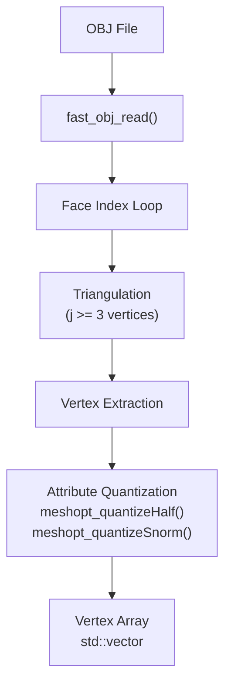
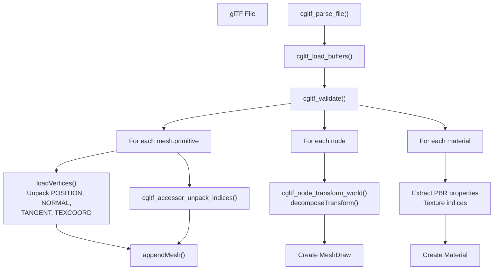
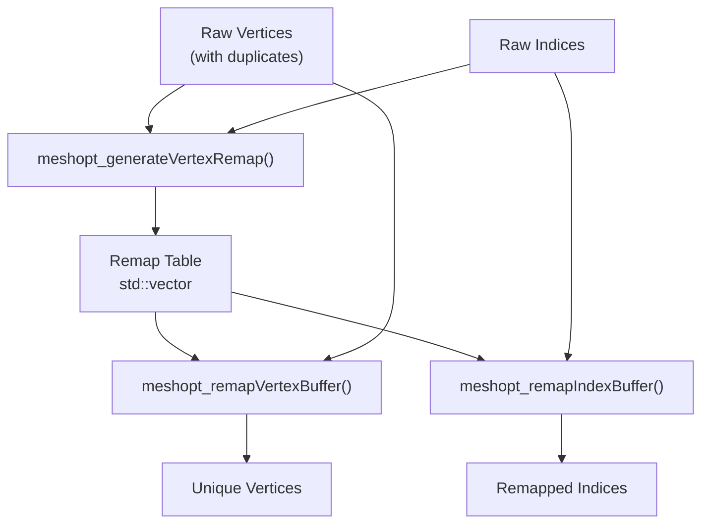
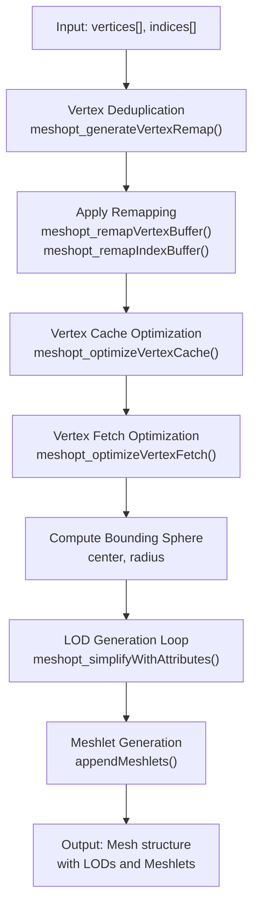
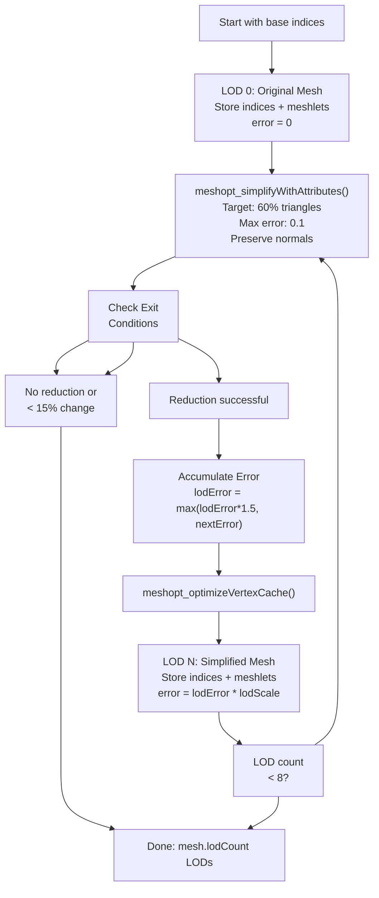
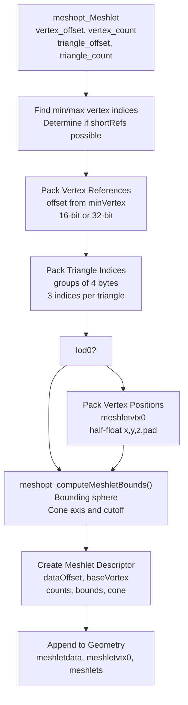
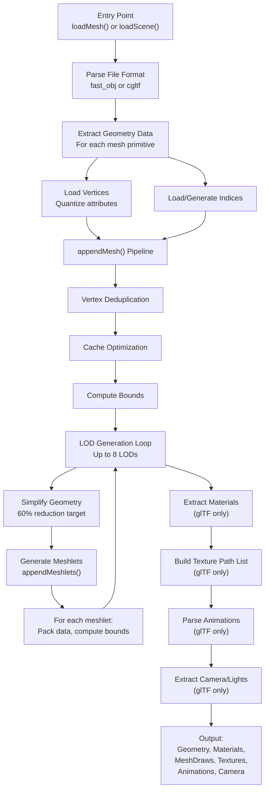
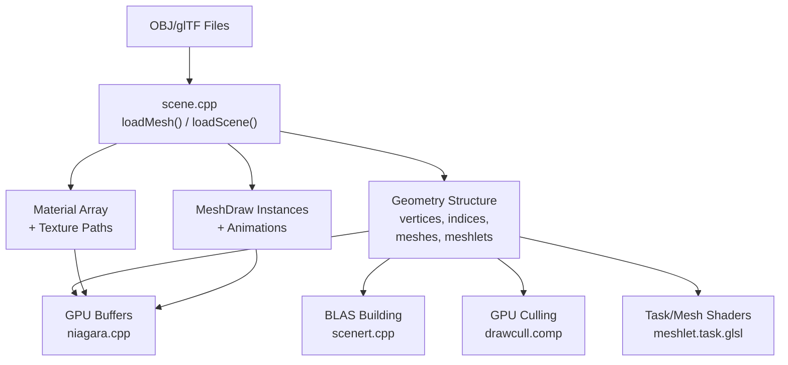

# Scene Loading and Processing

> **Relevant source files**
> * [src/scene.cpp](https://github.com/zeux/niagara/blob/6f3fb529/src/scene.cpp)

This page documents the scene loading pipeline, which converts external 3D model files (OBJ and glTF formats) into optimized runtime geometry data structures. The system handles vertex processing, mesh optimization, automatic LOD generation, and meshlet construction for GPU-driven rendering.

For information about the runtime geometry data structures produced by this pipeline, see [Geometry Data Structures](/zeux/niagara/5.2-geometry-data-structures). For material and texture management, see [Materials and Textures](/zeux/niagara/5.3-materials-and-textures).

**Scope**: This page covers the CPU-side geometry import and optimization pipeline implemented in [src/scene.cpp](https://github.com/zeux/niagara/blob/6f3fb529/src/scene.cpp)

 It does not cover GPU-side geometry processing, runtime rendering, or acceleration structure building (see [Acceleration Structure Management](/zeux/niagara/9.1-acceleration-structure-management)).

---

## Overview

The scene loading system provides two entry points:

* **`loadMesh()`** - Loads standalone OBJ files
* **`loadScene()`** - Loads complete glTF scenes with materials, textures, animations, cameras, and lights

Both functions populate a `Geometry` structure containing vertices, indices, meshes, meshlets, and associated metadata. The loading pipeline performs extensive optimization to prepare data for GPU-driven rendering with mesh shaders and LOD selection.

**Sources**: [src/scene.cpp L270-L282](https://github.com/zeux/niagara/blob/6f3fb529/src/scene.cpp#L270-L282)

 [src/scene.cpp L394-L733](https://github.com/zeux/niagara/blob/6f3fb529/src/scene.cpp#L394-L733)

---

## File Format Support

### OBJ Format Loading

The `loadObj()` function uses the fast_obj library to parse Wavefront OBJ files. It extracts positions, normals, and texture coordinates, performing on-the-fly triangulation of polygonal faces.

**Process**:

1. Parse OBJ file using `fast_obj_read()`
2. Count total triangles (triangulating n-gons)
3. Extract vertex attributes per face vertex
4. Quantize positions to 16-bit half-float
5. Pack normals into 10-10-10 format (30 bits)
6. Quantize texture coordinates to 16-bit half-float



**Vertex Layout**: The `Vertex` structure stores:

* `vx, vy, vz`: Position (16-bit half-float each)
* `tp`: Tangent (16-bit octahedral encoded)
* `np`: Normal (10-10-10-2 packed format) + tangent handedness bit
* `tu, tv`: Texture coordinates (16-bit half-float each)

**Sources**: [src/scene.cpp L111-L162](https://github.com/zeux/niagara/blob/6f3fb529/src/scene.cpp#L111-L162)

### glTF Format Loading

The `loadScene()` function uses the cgltf library to parse glTF 2.0 files, supporting both PBR metallic-roughness and specular-glossiness workflows. It extracts complete scene hierarchies including meshes, materials, textures, animations, cameras, and lights.

**Process**:

1. Parse glTF file using `cgltf_parse_file()`
2. Load external buffers with `cgltf_load_buffers()`
3. Validate glTF data structure
4. For each mesh primitive: * Extract vertex attributes via `loadVertices()` * Unpack indices from accessor * Process through `appendMesh()` pipeline
5. Extract node transforms and create `MeshDraw` instances
6. Parse materials and build texture path list
7. Extract animation data from samplers
8. Find camera and directional light nodes



**Attribute Extraction**: The `loadVertices()` function unpacks glTF accessors into the quantized `Vertex` format:

* Positions → 16-bit half-float
* Normals → 10-10-10 packed format
* Tangents → Octahedral encoding (8-8 format) with handedness in normal.w
* Texture coordinates → 16-bit half-float

**Transform Decomposition**: The `decomposeTransform()` function extracts TRS (translation, rotation, scale) from 4×4 matrices using determinant-based handedness detection and Mike Day's matrix-to-quaternion conversion algorithm.

**Sources**: [src/scene.cpp L394-L733](https://github.com/zeux/niagara/blob/6f3fb529/src/scene.cpp#L394-L733)

 [src/scene.cpp L331-L392](https://github.com/zeux/niagara/blob/6f3fb529/src/scene.cpp#L331-L392)

 [src/scene.cpp L284-L329](https://github.com/zeux/niagara/blob/6f3fb529/src/scene.cpp#L284-L329)

---

## Mesh Processing Pipeline

The `appendMesh()` function transforms raw vertex and index data into optimized runtime geometry through a multi-stage pipeline.

### Vertex Deduplication

Uses `meshopt_generateVertexRemap()` to identify duplicate vertices and create a remap table, then applies the remap to both vertex and index buffers. This reduces memory usage and improves cache efficiency.



**Sources**: [src/scene.cpp L166-L172](https://github.com/zeux/niagara/blob/6f3fb529/src/scene.cpp#L166-L172)

### Vertex Cache Optimization

Reorders indices to maximize post-transform vertex cache (PTVR) hit rate. Two strategies:

* **Standard**: `meshopt_optimizeVertexCache()` - optimizes for typical ~32 entry caches
* **Fast mode**: `meshopt_optimizeVertexCacheFifo()` - optimizes for FIFO caches with 16 entries

Following cache optimization, `meshopt_optimizeVertexFetch()` reorders vertices to match index access patterns, improving memory locality.

**Sources**: [src/scene.cpp L174-L179](https://github.com/zeux/niagara/blob/6f3fb529/src/scene.cpp#L174-L179)

### Bounding Volume Calculation

Computes mesh-level bounding sphere by calculating the centroid of all vertices and finding the maximum distance:

1. Accumulate vertex positions to find center
2. Calculate radius as max distance from center to any vertex
3. Store in `Mesh.center` and `Mesh.radius` for frustum culling

**Sources**: [src/scene.cpp L202-L215](https://github.com/zeux/niagara/blob/6f3fb529/src/scene.cpp#L202-L215)

### Pipeline Summary Diagram



**Sources**: [src/scene.cpp L164-L268](https://github.com/zeux/niagara/blob/6f3fb529/src/scene.cpp#L164-L268)

---

## Level of Detail Generation

The LOD generation loop creates up to 8 LODs per mesh (controlled by `COUNTOF(mesh.lods)` in [src/mesh.h](https://github.com/zeux/niagara/blob/6f3fb529/src/mesh.h)

). Each LOD is progressively simplified while maintaining visual fidelity within a target error threshold.

### LOD Generation Algorithm

**Parameters**:

* Target reduction per LOD: 60% of previous triangle count
* Maximum error threshold: `1e-1f` (10% of mesh bounds)
* Simplification mode: `meshopt_SimplifySparse` (preserves topology)
* Normal weight: `[1.f, 1.f, 1.f]` (equal weighting for normal preservation)

**Process per LOD**:

1. Store current index buffer as LOD data
2. Generate meshlets from current indices (see Meshlet Generation)
3. Calculate and store LOD error metric (in mesh-relative space)
4. Attempt simplification with `meshopt_simplifyWithAttributes()`: * Target 60% of current triangles * Preserve vertex normals with equal weight * Return actual triangle count and error metric
5. Exit conditions: * No further reduction possible (plateau reached) * Reduction less than 15% (too similar to previous LOD) * Maximum LODs reached (8)
6. Optimize simplified indices for vertex cache
7. Accumulate error: `lodError = max(lodError * 1.5f, nextError)`



**Error Accumulation**: The error metric is multiplied by `lodScale = meshopt_simplifyScale()` to convert from absolute distance to mesh-relative units. The error is accumulated across LODs with a 1.5× multiplier to account for compounding simplification artifacts.

**LOD Selection at Runtime**: The GPU culling pipeline (see [Draw Culling Pipeline](/zeux/niagara/7.1-draw-culling-pipeline)) selects LODs based on screen-space error thresholds derived from mesh bounds and view parameters.

**Sources**: [src/scene.cpp L217-L265](https://github.com/zeux/niagara/blob/6f3fb529/src/scene.cpp#L217-L265)

---

## Meshlet Generation

Meshlets are clusters of up to 64 vertices and 124 triangles used by the mesh shader pipeline. The `appendMeshlets()` function generates meshlets using meshoptimizer with three different build strategies selectable at load time.

### Build Strategies

**Configuration Constants** (from [src/config.h](https://github.com/zeux/niagara/blob/6f3fb529/src/config.h)

):

* `MESH_MAXVTX`: 64 (maximum vertices per meshlet)
* `MESH_MAXTRI`: 124 (maximum triangles per meshlet)
* `MESHLET_CONE_WEIGHT`: Controls cone culling data generation
* `MESHLET_FILL_WEIGHT`: Controls spatial locality in cluster RT mode

**Build Modes**:

| Mode | Algorithm | Use Case | LOD Restriction |
| --- | --- | --- | --- |
| `fast=true` | `meshopt_buildMeshletsScan()` | Fast loading, minimal optimization | All LODs |
| `clrt=true, lod0=true` | `meshopt_buildMeshletsSpatial()` | Ray tracing optimization via spatial clustering | LOD 0 only |
| Default | `meshopt_buildMeshlets()` | Standard mesh shader rendering with cone culling | All LODs |

**Spatial Clustering**: When `clrt` is enabled, LOD 0 uses `meshopt_buildMeshletsSpatial()` to group spatially-adjacent triangles into meshlets. This improves ray tracing performance by minimizing BLAS size and improving cache coherency when building cluster acceleration structures (VK_NV_displacement_micromap extension).

**Sources**: [src/scene.cpp L82-L109](https://github.com/zeux/niagara/blob/6f3fb529/src/scene.cpp#L82-L109)

### Meshlet Data Packing

The `appendMeshlet()` function packs meshlet data into a compact format optimized for GPU consumption.

**Data Structure** (per meshlet):

1. **Vertex references** (`meshletdata`): * Store as offsets from `minVertex` (base vertex of meshlet) * Use 16-bit refs if range < 65536, otherwise 32-bit * Pack 16-bit refs two per uint32
2. **Triangle indices** (`meshletdata`): * Store as groups of 4 indices (3 per triangle + padding) * Append directly to meshlet data stream
3. **LOD 0 vertex positions** (`meshletvtx0`): * Store 16-bit half-float positions for ray tracing * Only generated for LOD 0 when ray tracing is used * 4 components per vertex (x, y, z, padding)
4. **Meshlet descriptor** (`Meshlet`): * `dataOffset`: Offset into `meshletdata` buffer * `baseVertex`: Mesh-relative base vertex index * `vertexCount`, `triangleCount`: Element counts * `shortRefs`: Boolean indicating 16-bit vertex references * **Bounding sphere**: `center[3]` (16-bit half), `radius` (16-bit half) * **Cone culling data**: `cone_axis[3]` (8-bit signed), `cone_cutoff` (8-bit signed)

**Bounding Volume and Cone Calculation**: Uses `meshopt_computeMeshletBounds()` to calculate:

* Bounding sphere for frustum culling
* Cone axis and cutoff for backface/cone culling (see [Task Shader Stage](/zeux/niagara/7.2-task-shader-stage))



**Memory Layout Optimization**:

* Short references save 50% memory when vertex range fits in 16 bits
* Triangle indices packed tightly (no padding within groups)
* Bounding data quantized to minimize descriptor size

**Sources**: [src/scene.cpp L16-L80](https://github.com/zeux/niagara/blob/6f3fb529/src/scene.cpp#L16-L80)

### Meshlet Optimization

After generation, each meshlet is optimized with `meshopt_optimizeMeshlet()` to:

* Reorder vertices for optimal mesh shader processing
* Arrange triangles to minimize primitive shader invocations
* Improve cache utilization within the meshlet

**Sources**: [src/scene.cpp L101-L106](https://github.com/zeux/niagara/blob/6f3fb529/src/scene.cpp#L101-L106)

---

## Material and Texture Extraction

### Material Parsing

The `loadScene()` function extracts materials from glTF, supporting both PBR metallic-roughness and specular-glossiness workflows.

**PBR Metallic-Roughness**:

* `base_color_texture` → `Material.albedoTexture`
* `base_color_factor` → `Material.diffuseFactor`
* `metallic_roughness_texture` → `Material.specularTexture`
* `roughness_factor` → `Material.specularFactor.w` (inverted: 1 - roughness)

**PBR Specular-Glossiness** (KHR_materials_pbrSpecularGlossiness):

* `diffuse_texture` → `Material.albedoTexture`
* `diffuse_factor` → `Material.diffuseFactor`
* `specular_glossiness_texture` → `Material.specularTexture`
* `specular_factor`, `glossiness_factor` → `Material.specularFactor`

**Common Properties**:

* `normal_texture` → `Material.normalTexture`
* `emissive_texture` → `Material.emissiveTexture`
* `emissive_factor` → `Material.emissiveFactor`

**Alpha Modes**: Materials with `alpha_mode != opaque` are marked with `MeshDraw.postPass = 1` for separate rendering pass. Transmission materials set `postPass = 2`.

**Sources**: [src/scene.cpp L521-L562](https://github.com/zeux/niagara/blob/6f3fb529/src/scene.cpp#L521-L562)

### Texture Path Construction

Texture paths are extracted from glTF images and automatically converted to DDS format:

1. Parse image URI from `cgltf_texture.image.uri`
2. Decode URI encoding with `cgltf_decode_uri()`
3. Construct absolute path: `<scene_directory>/<decoded_uri>`
4. Replace file extension with `.dds`
5. Store in `texturePaths` vector

The texture offset starts at 1 (index 0 is reserved for a dummy texture). Material texture indices are offset by `textureOffset` to account for previously loaded textures.

**Sources**: [src/scene.cpp L519-L520](https://github.com/zeux/niagara/blob/6f3fb529/src/scene.cpp#L519-L520)

 [src/scene.cpp L564-L587](https://github.com/zeux/niagara/blob/6f3fb529/src/scene.cpp#L564-L587)

---

## Scene Graph Processing

### Instance Creation

For each glTF node containing a mesh, the system creates `MeshDraw` instances:

1. Calculate world transform with `cgltf_node_transform_world()`
2. Decompose into translation, rotation (quaternion), and scale
3. For each mesh primitive: * Create `MeshDraw` with transform data * Link to corresponding `Mesh` via `meshIndex` * Link to material via `materialIndex` * Set `postPass` flags based on alpha mode

**Transform Representation**: `MeshDraw` stores:

* `position`: vec3 world position
* `orientation`: quat rotation (quaternion)
* `scale`: float uniform scale (max of x, y, z components)

**Non-uniform Scale Warning**: The system uses the maximum scale component. Non-uniform or negative scales may produce incorrect results.

**Sources**: [src/scene.cpp L451-L491](https://github.com/zeux/niagara/blob/6f3fb529/src/scene.cpp#L451-L491)

### Camera Extraction

Perspective cameras are extracted from glTF camera nodes:

* World transform → `Camera.position` and `Camera.orientation`
* Field of view → `Camera.fovY`

**Sources**: [src/scene.cpp L493-L508](https://github.com/zeux/niagara/blob/6f3fb529/src/scene.cpp#L493-L508)

### Light Extraction

Directional lights (KHR_lights_punctual) are extracted:

* Light direction from node transform's forward vector (matrix[8,9,10])
* Stored in `sunDirection` vec3

**Sources**: [src/scene.cpp L510-L516](https://github.com/zeux/niagara/blob/6f3fb529/src/scene.cpp#L510-L516)

---

## Animation System

### Animation Sampling

The system extracts keyframe animations from glTF animation channels, supporting translation, rotation, and scale animation tracks.

**Supported Features**:

* Linear interpolation only (other modes trigger warnings)
* Translation, rotation, and scale tracks
* Constant time step between keyframes (extracted from first two keyframes)

**Limitations**:

* All tracks for a node must have matching keyframe counts
* Only animates nodes that have associated draw calls
* Minimum 2 keyframes required per animation

**Data Structure**: Each `Animation` contains:

* `drawIndex`: Index of the `MeshDraw` to animate
* `startTime`: Animation start time
* `period`: Time between keyframes (assumed constant)
* `keyframes`: Vector of `Keyframe` structs (translation, rotation, scale)

**Transform Baking**: For each keyframe:

1. Combine translation, rotation, and scale into node-local transform
2. Calculate world transform with `cgltf_node_transform_world()`
3. Decompose back into TRS for storage

This baking ensures animations account for parent transforms in the scene graph.

**Sources**: [src/scene.cpp L589-L713](https://github.com/zeux/niagara/blob/6f3fb529/src/scene.cpp#L589-L713)

---

## Complete Loading Pipeline



**Sources**: [src/scene.cpp L1-L733](https://github.com/zeux/niagara/blob/6f3fb529/src/scene.cpp#L1-L733)

---

## Performance Considerations

### Loading Metrics

The system prints timing and statistics after loading:

* Total load time (in seconds)
* Mesh count, draw count, animation count
* Total vertex count
* Meshlet statistics (count, triangles, vertex references)

Example output:

```yaml
Loaded scene.gltf: 150 meshes, 200 draws, 5 animations, 125000 vertices in 2.34 sec
Meshlets: 8432 meshlets, 982456 triangles, 518234 vertex refs
```

**Sources**: [src/scene.cpp L715-L730](https://github.com/zeux/niagara/blob/6f3fb529/src/scene.cpp#L715-L730)

### Optimization Trade-offs

| Mode | Flag | Benefits | Drawbacks |
| --- | --- | --- | --- |
| Fast | `fast=true` | 2-3× faster loading | Lower cache hit rates, worse LOD quality |
| Standard | default | Optimal cache performance | Slower loading time |
| Cluster RT | `clrt=true` | Smaller BLASs, better RT performance | LOD 0 only, spatial not cone-optimized |

**Recommendation**: Use standard mode for production, fast mode for rapid iteration during development.

---

## Integration Points

### Consumed By

* **[Acceleration Structure Management](/zeux/niagara/9.1-acceleration-structure-management)**: Uses `meshletvtx0` and `meshletdata` to build BLASs
* **[Draw Culling Pipeline](/zeux/niagara/7.1-draw-culling-pipeline)**: References `Mesh` bounds and LOD data for culling
* **[Task Shader Stage](/zeux/niagara/7.2-task-shader-stage)**: Consumes `Meshlet` descriptors and cone culling data
* **[Materials and Textures](/zeux/niagara/5.3-materials-and-textures)**: Uses texture paths to load DDS files

### Data Flow Summary



**Sources**: [src/scene.cpp](https://github.com/zeux/niagara/blob/6f3fb529/src/scene.cpp)

 [src/niagara.cpp](https://github.com/zeux/niagara/blob/6f3fb529/src/niagara.cpp)

 [src/scenert.cpp](https://github.com/zeux/niagara/blob/6f3fb529/src/scenert.cpp)