# Scene System

> **Relevant source files**
> * [src/scene.cpp](https://github.com/zeux/niagara/blob/6f3fb529/src/scene.cpp)
> * [src/scene.h](https://github.com/zeux/niagara/blob/6f3fb529/src/scene.h)
> * [src/shaders/mesh.h](https://github.com/zeux/niagara/blob/6f3fb529/src/shaders/mesh.h)

## Purpose and Scope

The Scene System is responsible for loading 3D scene data from external file formats (OBJ and glTF), processing geometry into optimized GPU-friendly representations, and organizing the data into hierarchical structures suitable for GPU-driven rendering. This includes vertex processing, meshlet generation, automatic LOD (Level of Detail) creation, material parsing, and animation support.

For information about how this geometry is used in the rendering pipeline, see [GPU-Driven Rendering](/zeux/niagara/7-gpu-driven-rendering). For details on how materials and textures are bound during rendering, see [Deferred Rendering](/zeux/niagara/8-deferred-rendering). For ray tracing acceleration structure creation from this geometry, see [Ray Tracing System](/zeux/niagara/9-ray-tracing-system).

**Sources:** [src/scene.h L1-L118](https://github.com/zeux/niagara/blob/6f3fb529/src/scene.h#L1-L118)

 [src/scene.cpp L1-L734](https://github.com/zeux/niagara/blob/6f3fb529/src/scene.cpp#L1-L734)

---

## Core Data Structures

The Scene System defines a hierarchical representation of geometry that spans both CPU and GPU memory spaces. The primary container is `Geometry`, which holds all mesh data for a scene.

### Geometry Container

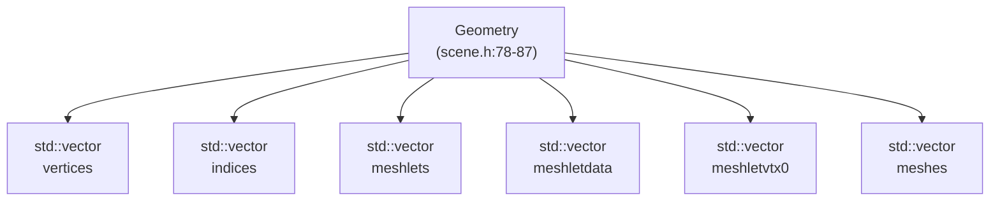

The `Geometry` structure [src/scene.h L78-L87](https://github.com/zeux/niagara/blob/6f3fb529/src/scene.h#L78-L87)

 serves as the primary container:

| Field | Type | Purpose |
| --- | --- | --- |
| `vertices` | `std::vector<Vertex>` | All vertex data for the scene |
| `indices` | `std::vector<uint32_t>` | Triangle indices for traditional rendering |
| `meshlets` | `std::vector<Meshlet>` | Meshlet descriptors for mesh shader rendering |
| `meshletdata` | `std::vector<uint32_t>` | Packed vertex indices and triangle data per meshlet |
| `meshletvtx0` | `std::vector<uint16_t>` | Half-precision positions for LOD 0 meshlet vertices |
| `meshes` | `std::vector<Mesh>` | Mesh metadata with LOD information |

**Sources:** [src/scene.h L78-L87](https://github.com/zeux/niagara/blob/6f3fb529/src/scene.h#L78-L87)

### Mesh Hierarchy

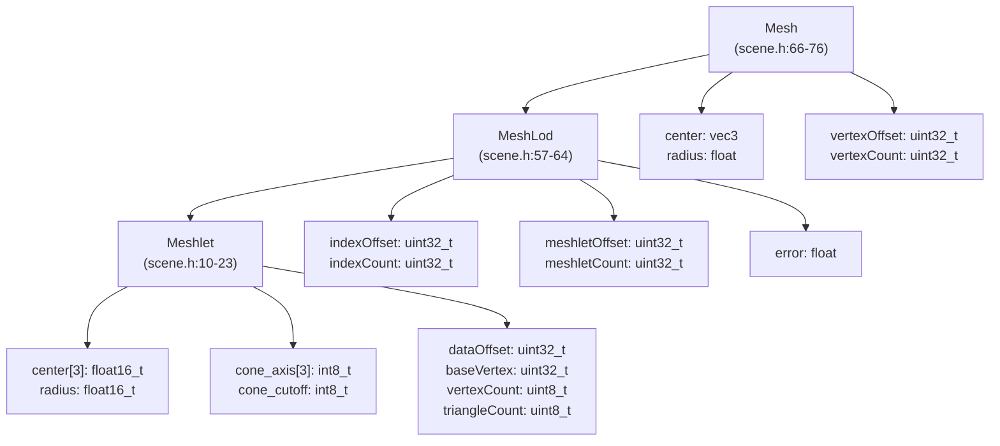

The hierarchy represents three levels of detail:

**Mesh** [src/scene.h L66-L76](https://github.com/zeux/niagara/blob/6f3fb529/src/scene.h#L66-L76)

: Top-level object containing multiple LODs

* Bounding sphere for culling (`center`, `radius`)
* Vertex range within the global vertex buffer
* Array of up to 8 LOD levels (`lods[8]`)

**MeshLod** [src/scene.h L57-L64](https://github.com/zeux/niagara/blob/6f3fb529/src/scene.h#L57-L64)

: A single level of detail

* Index range for traditional rendering (`indexOffset`, `indexCount`)
* Meshlet range for mesh shader rendering (`meshletOffset`, `meshletCount`)
* Error metric for LOD selection (`error`)

**Meshlet** [src/scene.h L10-L23](https://github.com/zeux/niagara/blob/6f3fb529/src/scene.h#L10-L23)

: Smallest rendering unit (max 64 vertices, 124 triangles)

* Bounding sphere for visibility testing
* Cone data for backface culling (`cone_axis`, `cone_cutoff`)
* Reference to packed vertex/triangle data (`dataOffset`)

**Sources:** [src/scene.h L57-L76](https://github.com/zeux/niagara/blob/6f3fb529/src/scene.h#L57-L76)

 [src/scene.h L10-L23](https://github.com/zeux/niagara/blob/6f3fb529/src/scene.h#L10-L23)

### Vertex Format

The `Vertex` structure uses aggressive quantization to minimize memory bandwidth:

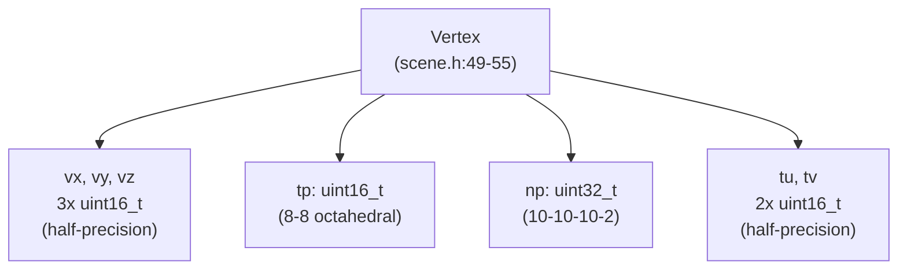

| Field | Type | Encoding | Purpose |
| --- | --- | --- | --- |
| `vx, vy, vz` | `uint16_t` × 3 | Half-precision float | Position coordinates |
| `tp` | `uint16_t` | 8-8 octahedral encoding | Tangent vector |
| `np` | `uint32_t` | 10-10-10-2 SNORM + sign bit | Normal vector + bitangent sign |
| `tu, tv` | `uint16_t` × 2 | Half-precision float | Texture coordinates |

**Total size: 12 bytes per vertex**

**Sources:** [src/scene.h L49-L55](https://github.com/zeux/niagara/blob/6f3fb529/src/scene.h#L49-L55)

 [src/shaders/mesh.h L3-L9](https://github.com/zeux/niagara/blob/6f3fb529/src/shaders/mesh.h#L3-L9)

### CPU/GPU Structure Mapping

The scene system maintains parallel data structures for CPU and GPU:

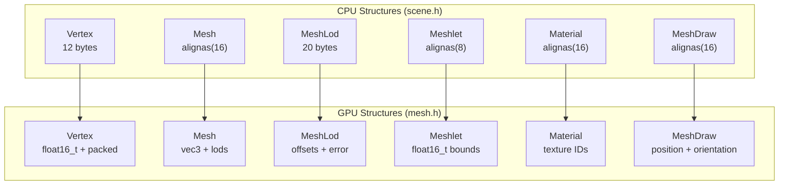

Both CPU [src/scene.h](https://github.com/zeux/niagara/blob/6f3fb529/src/scene.h)

 and GPU [src/shaders/mesh.h](https://github.com/zeux/niagara/blob/6f3fb529/src/shaders/mesh.h)

 headers define identical layouts with careful alignment to ensure direct upload to GPU buffers without conversion.

**Sources:** [src/scene.h L1-L118](https://github.com/zeux/niagara/blob/6f3fb529/src/scene.h#L1-L118)

 [src/shaders/mesh.h L1-L123](https://github.com/zeux/niagara/blob/6f3fb529/src/shaders/mesh.h#L1-L123)

---

## Scene Loading Pipeline

The system supports two file formats through dedicated loaders:

### File Format Support

| Format | Function | Use Case |
| --- | --- | --- |
| OBJ | `loadMesh()` [src/scene.cpp L270-L282](https://github.com/zeux/niagara/blob/6f3fb529/src/scene.cpp#L270-L282) | Simple geometry loading |
| glTF 2.0 | `loadScene()` [src/scene.cpp L394-L733](https://github.com/zeux/niagara/blob/6f3fb529/src/scene.cpp#L394-L733) | Full scene with materials, animations, hierarchy |

### glTF Loading Pipeline

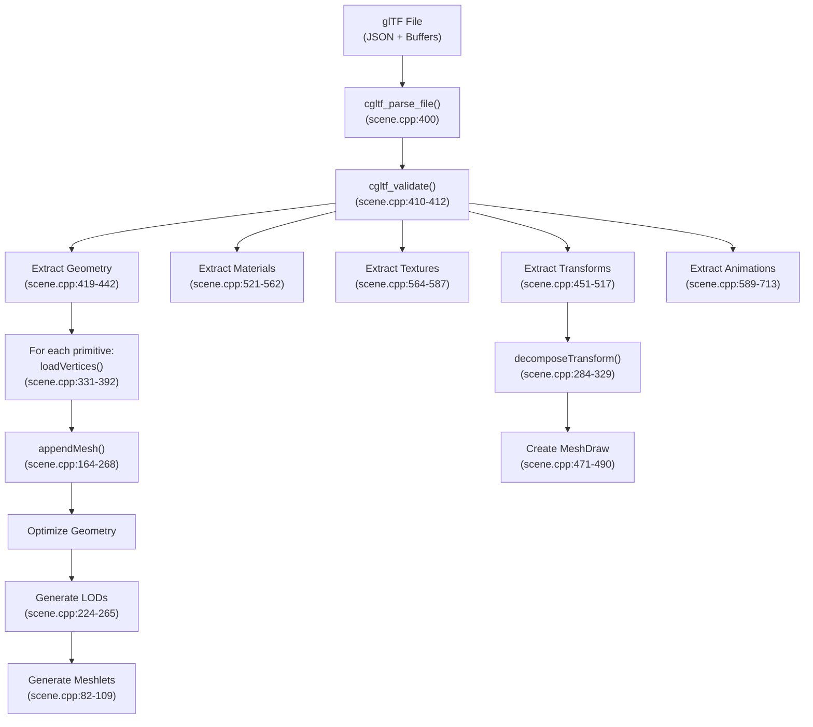

**Sources:** [src/scene.cpp L394-L733](https://github.com/zeux/niagara/blob/6f3fb529/src/scene.cpp#L394-L733)

### Vertex Attribute Loading

The `loadVertices()` function [src/scene.cpp L331-L392](https://github.com/zeux/niagara/blob/6f3fb529/src/scene.cpp#L331-L392)

 extracts and encodes vertex attributes from glTF accessors:

| Attribute | glTF Accessor Type | Encoding Process |
| --- | --- | --- |
| Position | `cgltf_attribute_type_position` | `meshopt_quantizeHalf()` → `vx, vy, vz` [src/scene.cpp L342-L346](https://github.com/zeux/niagara/blob/6f3fb529/src/scene.cpp#L342-L346) |
| Normal | `cgltf_attribute_type_normal` | `meshopt_quantizeSnorm(10)` → `np` bits [0:29] [src/scene.cpp L354-L361](https://github.com/zeux/niagara/blob/6f3fb529/src/scene.cpp#L354-L361) |
| Tangent | `cgltf_attribute_type_tangent` | Octahedral encoding → `tp` [src/scene.cpp L369-L378](https://github.com/zeux/niagara/blob/6f3fb529/src/scene.cpp#L369-L378) |
| TexCoord | `cgltf_attribute_type_texcoord` | `meshopt_quantizeHalf()` → `tu, tv` [src/scene.cpp L386-L390](https://github.com/zeux/niagara/blob/6f3fb529/src/scene.cpp#L386-L390) |

The tangent encoding uses octahedral mapping [src/scene.cpp L373-L376](https://github.com/zeux/niagara/blob/6f3fb529/src/scene.cpp#L373-L376)

:

```
tu = tz >= 0 ? tx/tsum : (1 - |ty/tsum|) * sign(tx)
tv = tz >= 0 ? ty/tsum : (1 - |tx/tsum|) * sign(ty)
```

The bitangent sign is stored in bit 30 of `np` [src/scene.cpp L377](https://github.com/zeux/niagara/blob/6f3fb529/src/scene.cpp#L377-L377)

**Sources:** [src/scene.cpp L331-L392](https://github.com/zeux/niagara/blob/6f3fb529/src/scene.cpp#L331-L392)

### Transform Decomposition

World transforms are extracted from glTF nodes and decomposed into TRS (Translation-Rotation-Scale) components using `decomposeTransform()` [src/scene.cpp L284-L329](https://github.com/zeux/niagara/blob/6f3fb529/src/scene.cpp#L284-L329)

:

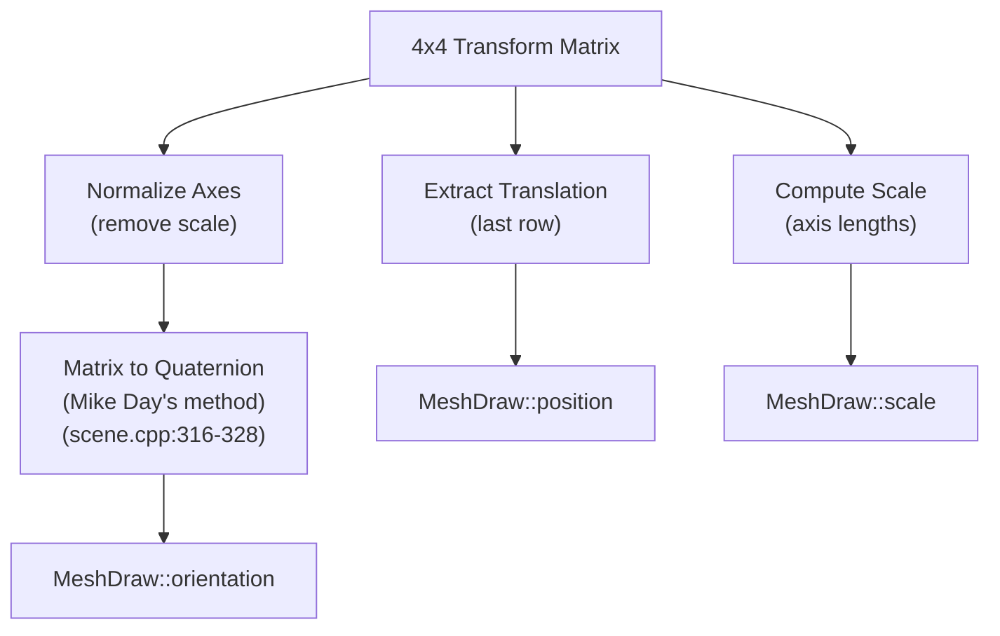

The quaternion conversion uses a branchless algorithm that selects the largest component to avoid numerical instability [src/scene.cpp L317-L328](https://github.com/zeux/niagara/blob/6f3fb529/src/scene.cpp#L317-L328)

**Sources:** [src/scene.cpp L284-L329](https://github.com/zeux/niagara/blob/6f3fb529/src/scene.cpp#L284-L329)

---

## Geometry Optimization

After loading, geometry undergoes multiple optimization passes using the `meshoptimizer` library.

### Optimization Pipeline

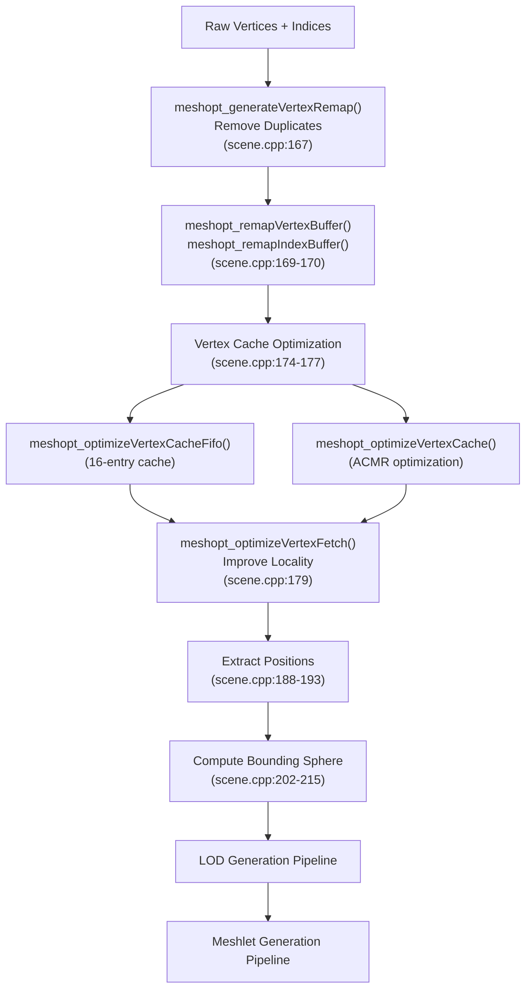

The optimization process consists of:

1. **Vertex Deduplication** [src/scene.cpp L166-L172](https://github.com/zeux/niagara/blob/6f3fb529/src/scene.cpp#L166-L172) : Merge identical vertices using `meshopt_generateVertexRemap()`
2. **Post-Transform Cache Optimization** [src/scene.cpp L174-L177](https://github.com/zeux/niagara/blob/6f3fb529/src/scene.cpp#L174-L177) : Reorder indices to maximize GPU vertex cache hits
3. **Vertex Fetch Optimization** [src/scene.cpp L179](https://github.com/zeux/niagara/blob/6f3fb529/src/scene.cpp#L179-L179) : Reorder vertices to improve memory access patterns
4. **Bounds Computation** [src/scene.cpp L202-L215](https://github.com/zeux/niagara/blob/6f3fb529/src/scene.cpp#L202-L215) : Calculate bounding sphere for culling

**Sources:** [src/scene.cpp L164-L215](https://github.com/zeux/niagara/blob/6f3fb529/src/scene.cpp#L164-L215)

### LOD Generation

The system automatically generates up to 8 LOD levels using progressive mesh simplification:

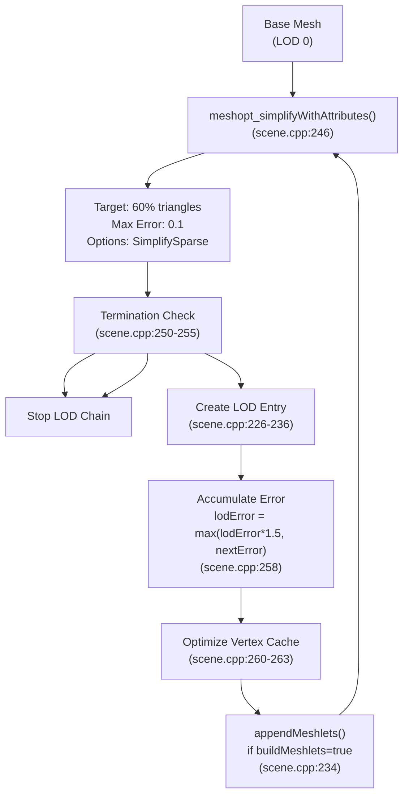

Each LOD level stores [src/scene.cpp L226-L236](https://github.com/zeux/niagara/blob/6f3fb529/src/scene.cpp#L226-L236)

:

* Index range for rendering
* Meshlet range for mesh shader path
* Error metric for LOD selection (scaled by `meshopt_simplifyScale()`)

The error accumulation [src/scene.cpp L258](https://github.com/zeux/niagara/blob/6f3fb529/src/scene.cpp#L258-L258)

 ensures conservative LOD selection: `lodError = max(lodError * 1.5, nextError)` prevents visual discontinuities when switching between levels.

**Sources:** [src/scene.cpp L217-L268](https://github.com/zeux/niagara/blob/6f3fb529/src/scene.cpp#L217-L268)

### Meshlet Generation

Meshlets are generated using different strategies based on build mode:

| Mode | Condition | Algorithm | Purpose |
| --- | --- | --- | --- |
| Fast | `fast=true` | `meshopt_buildMeshletsScan()` [src/scene.cpp L95](https://github.com/zeux/niagara/blob/6f3fb529/src/scene.cpp#L95-L95) | Quick builds for iteration |
| Spatial | `clrt=true && lod0` | `meshopt_buildMeshletsSpatial()` [src/scene.cpp L97](https://github.com/zeux/niagara/blob/6f3fb529/src/scene.cpp#L97-L97) | Ray tracing locality |
| Standard | Default | `meshopt_buildMeshlets()` [src/scene.cpp L99](https://github.com/zeux/niagara/blob/6f3fb529/src/scene.cpp#L99-L99) | Cone culling optimization |

**Meshlet Constraints** [src/scene.cpp L84-L87](https://github.com/zeux/niagara/blob/6f3fb529/src/scene.cpp#L84-L87)

:

```
max_vertices = MESH_MAXVTX    // 64 vertices
min_triangles = MESH_MAXTRI/4  // 31 triangles
max_triangles = MESH_MAXTRI    // 124 triangles
cone_weight = MESHLET_CONE_WEIGHT
fill_weight = MESHLET_FILL_WEIGHT
```

#### Meshlet Data Packing

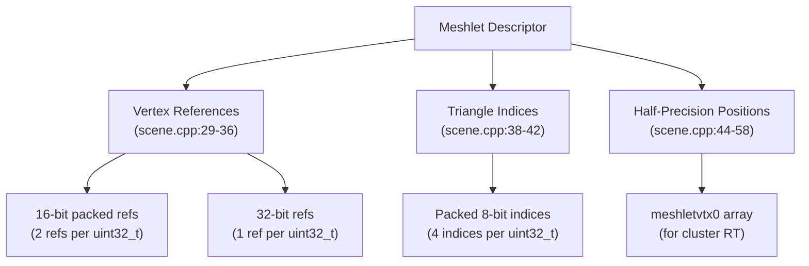

The `appendMeshlet()` function [src/scene.cpp L16-L80](https://github.com/zeux/niagara/blob/6f3fb529/src/scene.cpp#L16-L80)

 performs:

1. **Vertex Reference Optimization**: Computes min/max vertex indices to determine if 16-bit packing is possible [src/scene.cpp L20-L27](https://github.com/zeux/niagara/blob/6f3fb529/src/scene.cpp#L20-L27)
2. **Triangle Index Packing**: Stores indices in groups of 4 bytes [src/scene.cpp L38-L42](https://github.com/zeux/niagara/blob/6f3fb529/src/scene.cpp#L38-L42)
3. **LOD 0 Position Storage**: Stores half-precision positions for cluster acceleration structures [src/scene.cpp L44-L58](https://github.com/zeux/niagara/blob/6f3fb529/src/scene.cpp#L44-L58)
4. **Bounds Computation**: Uses `meshopt_computeMeshletBounds()` to calculate sphere and cone data [src/scene.cpp L61-L77](https://github.com/zeux/niagara/blob/6f3fb529/src/scene.cpp#L61-L77)

**Sources:** [src/scene.cpp L16-L109](https://github.com/zeux/niagara/blob/6f3fb529/src/scene.cpp#L16-L109)

---

## Material and Texture Management

### Material Structure

The `Material` structure [src/scene.h L25-L35](https://github.com/zeux/niagara/blob/6f3fb529/src/scene.h#L25-L35)

 stores PBR (Physically-Based Rendering) parameters:

| Field | Type | Purpose |
| --- | --- | --- |
| `albedoTexture` | `int` | Base color texture ID |
| `normalTexture` | `int` | Normal map texture ID |
| `specularTexture` | `int` | Specular/roughness texture ID |
| `emissiveTexture` | `int` | Emissive texture ID |
| `diffuseFactor` | `vec4` | Base color multiplier + alpha |
| `specularFactor` | `vec4` | Specular color + glossiness |
| `emissiveFactor` | `vec3` | Emissive color multiplier |

### glTF Material Parsing

The loader supports both PBR workflows [src/scene.cpp L521-L562](https://github.com/zeux/niagara/blob/6f3fb529/src/scene.cpp#L521-L562)

:

**Specular-Glossiness Workflow** [src/scene.cpp L528-L539](https://github.com/zeux/niagara/blob/6f3fb529/src/scene.cpp#L528-L539)

:

```
albedoTexture   ← diffuse_texture
diffuseFactor   ← diffuse_factor
specularTexture ← specular_glossiness_texture
specularFactor  ← (specular_factor.rgb, glossiness_factor)
```

**Metallic-Roughness Workflow** [src/scene.cpp L540-L551](https://github.com/zeux/niagara/blob/6f3fb529/src/scene.cpp#L540-L551)

:

```
albedoTexture   ← base_color_texture
diffuseFactor   ← base_color_factor
specularTexture ← metallic_roughness_texture
specularFactor  ← (1, 1, 1, 1-roughness_factor)
```

Common properties [src/scene.cpp L553-L559](https://github.com/zeux/niagara/blob/6f3fb529/src/scene.cpp#L553-L559)

:

```
normalTexture   ← normal_texture
emissiveTexture ← emissive_texture
emissiveFactor  ← emissive_factor
```

**Sources:** [src/scene.cpp L521-L562](https://github.com/zeux/niagara/blob/6f3fb529/src/scene.cpp#L521-L562)

### Texture Path Resolution

Textures are resolved from glTF image URIs with automatic DDS conversion:

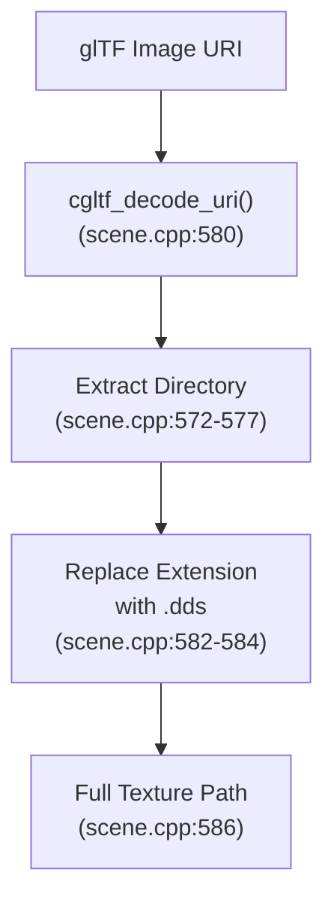

This assumes pre-converted DDS textures for efficient GPU consumption [src/scene.cpp L582-L586](https://github.com/zeux/niagara/blob/6f3fb529/src/scene.cpp#L582-L586)

**Sources:** [src/scene.cpp L564-L587](https://github.com/zeux/niagara/blob/6f3fb529/src/scene.cpp#L564-L587)

---

## Instance Management

Scene instances are represented by `MeshDraw` structures [src/scene.h L37-L47](https://github.com/zeux/niagara/blob/6f3fb529/src/scene.h#L37-L47)

:

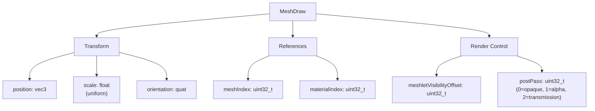

The `postPass` field determines rendering order [src/scene.cpp L481-L485](https://github.com/zeux/niagara/blob/6f3fb529/src/scene.cpp#L481-L485)

:

* `0`: Opaque geometry (main pass)
* `1`: Alpha-blended geometry (`alpha_mode != opaque`)
* `2`: Transmission (refractive materials)

**Sources:** [src/scene.h L37-L47](https://github.com/zeux/niagara/blob/6f3fb529/src/scene.h#L37-L47)

 [src/scene.cpp L471-L490](https://github.com/zeux/niagara/blob/6f3fb529/src/scene.cpp#L471-L490)

---

## Animation Support

The system supports skeletal animation through keyframe data extracted from glTF:

### Animation Data Structures

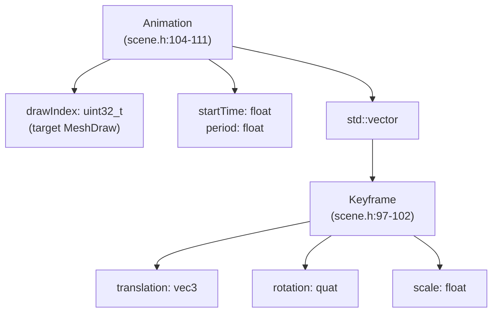

### Animation Extraction

The loader processes glTF animation channels [src/scene.cpp L593-L713](https://github.com/zeux/niagara/blob/6f3fb529/src/scene.cpp#L593-L713)

:

1. **Channel Mapping** [src/scene.cpp L597-L611](https://github.com/zeux/niagara/blob/6f3fb529/src/scene.cpp#L597-L611) : Associate samplers with nodes for translation, rotation, and scale
2. **Validation** [src/scene.cpp L614-L653](https://github.com/zeux/niagara/blob/6f3fb529/src/scene.cpp#L614-L653) : Ensure consistent keyframe counts and linear interpolation
3. **Keyframe Extraction** [src/scene.cpp L655-L710](https://github.com/zeux/niagara/blob/6f3fb529/src/scene.cpp#L655-L710) : * Unpack animation data from accessors * Apply transforms per keyframe * Decompose resulting world transform into TRS components

The system requires:

* At least 2 keyframes per animation [src/scene.cpp L649-L653](https://github.com/zeux/niagara/blob/6f3fb529/src/scene.cpp#L649-L653)
* Linear interpolation only [src/scene.cpp L641-L647](https://github.com/zeux/niagara/blob/6f3fb529/src/scene.cpp#L641-L647)
* Matching keyframe counts across channels [src/scene.cpp L633-L639](https://github.com/zeux/niagara/blob/6f3fb529/src/scene.cpp#L633-L639)

**Sources:** [src/scene.cpp L589-L713](https://github.com/zeux/niagara/blob/6f3fb529/src/scene.cpp#L589-L713)

 [src/scene.h L97-L111](https://github.com/zeux/niagara/blob/6f3fb529/src/scene.h#L97-L111)

---

## Performance Characteristics

### Memory Layout

The scene system prioritizes GPU efficiency through:

| Technique | Implementation | Benefit |
| --- | --- | --- |
| Quantized Vertices | 12-byte format [src/scene.h L49-L55](https://github.com/zeux/niagara/blob/6f3fb529/src/scene.h#L49-L55) | 67% size reduction vs float32 |
| Packed Meshlet Data | Variable-length encoding [src/scene.cpp L29-L42](https://github.com/zeux/niagara/blob/6f3fb529/src/scene.cpp#L29-L42) | ~40% reduction in index storage |
| Aligned Structures | `alignas(16)` directives | Direct GPU upload without padding |
| Continuous Arrays | `std::vector` storage | Sequential memory access |

### Processing Statistics

Scene loading reports comprehensive statistics [src/scene.cpp L715-L730](https://github.com/zeux/niagara/blob/6f3fb529/src/scene.cpp#L715-L730)

:

```html
Loaded <path>: 
  <N> meshes
  <N> draws
  <N> animations
  <N> vertices
  in <time> sec

Meshlets: 
  <N> meshlets
  <N> triangles
  <N> vertex refs
```

**Sources:** [src/scene.cpp L715-L730](https://github.com/zeux/niagara/blob/6f3fb529/src/scene.cpp#L715-L730)

---

## Scene Caching

The system supports binary caching to accelerate loading:

| Function | Purpose |
| --- | --- |
| `saveSceneCache()` [src/scene.h L116](https://github.com/zeux/niagara/blob/6f3fb529/src/scene.h#L116-L116) | Serialize processed geometry to disk |
| `loadSceneCache()` [src/scene.h L117](https://github.com/zeux/niagara/blob/6f3fb529/src/scene.h#L117-L117) | Load pre-processed data |

Cache files can be compressed and include all processed meshlets, LODs, and optimizations, bypassing the expensive processing pipeline on subsequent loads.

**Sources:** [src/scene.h L116-L117](https://github.com/zeux/niagara/blob/6f3fb529/src/scene.h#L116-L117)