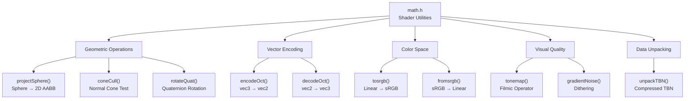
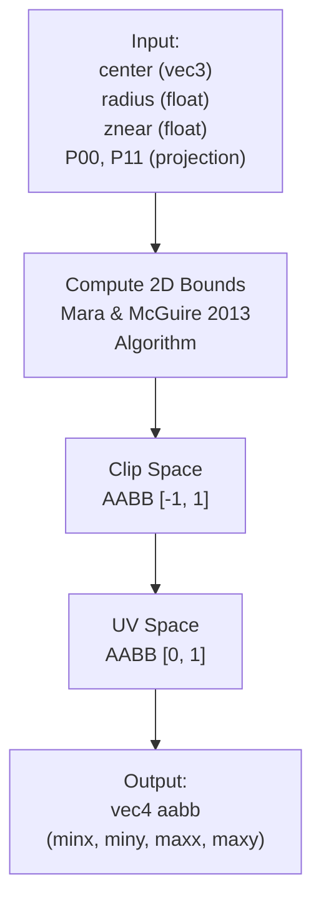
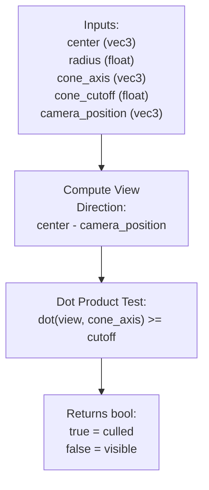
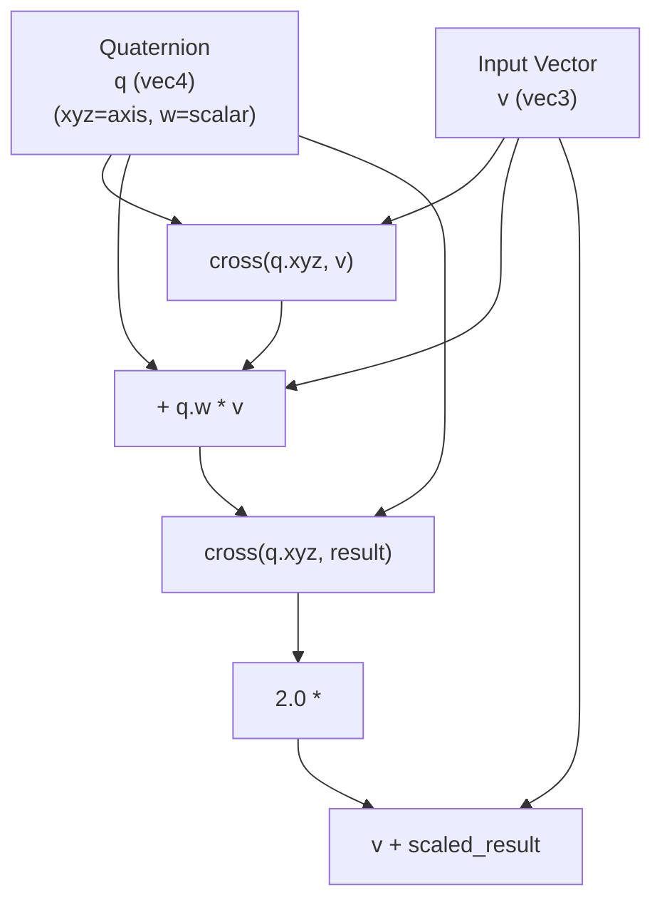
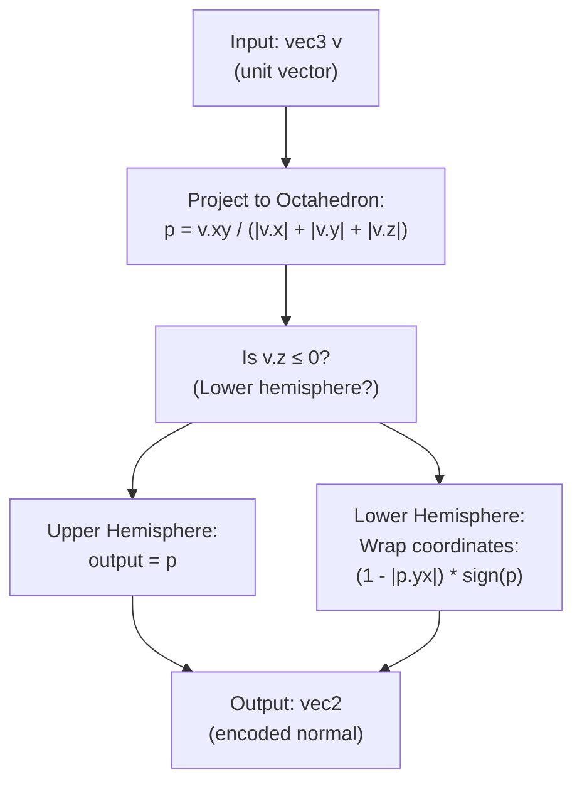
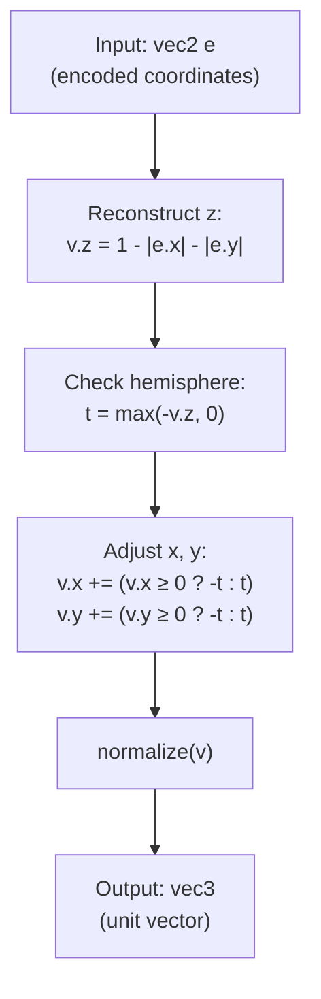
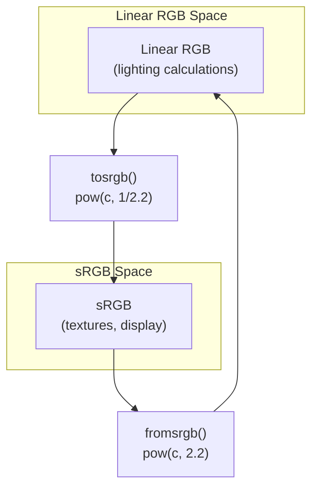
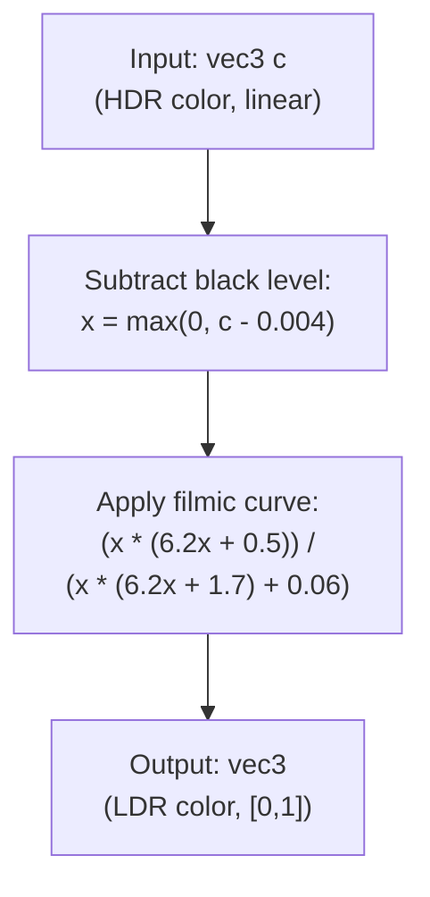
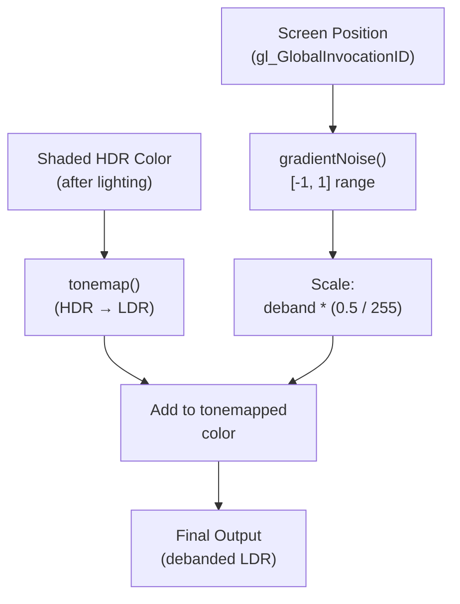
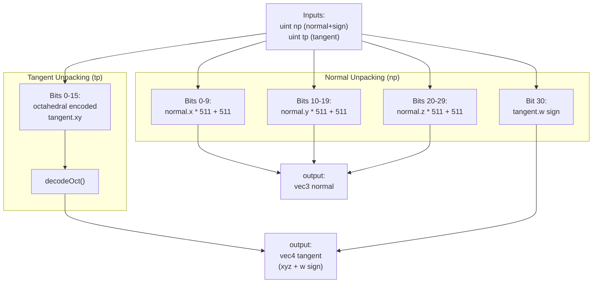

# Shader Utilities and Math

> **Relevant source files**
> * [src/shaders/final.comp.glsl](https://github.com/zeux/niagara/blob/6f3fb529/src/shaders/final.comp.glsl)
> * [src/shaders/math.h](https://github.com/zeux/niagara/blob/6f3fb529/src/shaders/math.h)

## Purpose and Scope

This page documents the mathematical utility functions and shader helper routines defined in [src/shaders/math.h](https://github.com/zeux/niagara/blob/6f3fb529/src/shaders/math.h)

 These utilities provide fundamental operations used throughout the shader pipeline, including geometric computations for culling, efficient vector encoding, color space conversions, and tonemapping. For information about shader loading and program creation, see [Shader Loading and Programs](/zeux/niagara/6.1-shader-loading-and-programs). For information about pipeline-level shader organization, see [Pipeline Creation and Descriptor Management](/zeux/niagara/6.2-pipeline-creation-and-descriptor-management).

The utilities in `math.h` are included by most shader stages and provide a common vocabulary for geometric operations, data compression, and visual quality enhancements.

---

## Utility Function Categories

The shader utilities are organized into several functional categories based on their purpose in the rendering pipeline:

**Sources:** [src/shaders/math.h L1-L93](https://github.com/zeux/niagara/blob/6f3fb529/src/shaders/math.h#L1-L93)

---

## Geometric Utility Functions

### Sphere Projection

The `projectSphere` function projects a 3D sphere (defined by center and radius in view space) to a 2D axis-aligned bounding box in screen space. This is used for hierarchical culling tests to determine if geometry might be visible.

| Operation | Details |
| --- | --- |
| **Function** | `projectSphere(vec3 c, float r, float znear, float P00, float P11, out vec4 aabb)` |
| **Algorithm** | 2D Polyhedral Bounds of a Clipped, Perspective-Projected 3D Sphere (Mara & McGuire 2013) |
| **Near Plane Test** | Returns `false` if `c.z < r + znear` (sphere intersects or behind near plane) |
| **Output Format** | `vec4(minx, miny, maxx, maxy)` in UV space [0, 1] |
| **Primary Use** | Occlusion culling tests against depth pyramid |

The implementation computes the tangent points of the sphere's silhouette in view space, projects them to clip space, then transforms to UV space for texture coordinate based tests.

**Sources:** [src/shaders/math.h L2-L22](https://github.com/zeux/niagara/blob/6f3fb529/src/shaders/math.h#L2-L22)

### Cone Culling

The `coneCull` function performs backface culling for geometry clusters by testing whether a view direction lies outside a normal cone. This is used extensively in the task shader to cull entire meshlets that face away from the camera.

| Parameter | Description |
| --- | --- |
| **center** | Meshlet bounding sphere center in world space |
| **radius** | Meshlet bounding sphere radius |
| **cone_axis** | Average normal direction for the meshlet |
| **cone_cutoff** | Cosine of maximum angle deviation from average normal |
| **camera_position** | Camera position in world space |

The function returns `true` when the meshlet is fully backface culled and can be safely discarded. The test accounts for the bounding sphere radius to be conservative.

**Sources:** [src/shaders/math.h L24-L27](https://github.com/zeux/niagara/blob/6f3fb529/src/shaders/math.h#L24-L27)

### Quaternion Rotation

The `rotateQuat` function applies a quaternion rotation to a 3D vector using an optimized formula that avoids explicit matrix construction.

This is used for transforming geometry with rotational components, particularly when instance transforms are stored as quaternions for efficiency.

**Sources:** [src/shaders/math.h L29-L32](https://github.com/zeux/niagara/blob/6f3fb529/src/shaders/math.h#L29-L32)

---

## Octahedral Normal Encoding

One of the most important utilities is the octahedral encoding scheme for compressing unit vectors (typically normals) from 3D `vec3` to 2D `vec2`. This reduces storage requirements by 33% while maintaining good precision.

### Encoding Process

| Function | Input | Output | Description |
| --- | --- | --- | --- |
| **encodeOct** | `vec3 v` (unit vector) | `vec2` (normalized) | Encodes a unit vector to 2D octahedral coordinates |
| **decodeOct** | `vec2 e` (encoded) | `vec3` (unit vector) | Reconstructs a unit vector from octahedral encoding |

The algorithm is based on "A Survey of Efficient Representations for Independent Unit Vectors" and provides a good balance between compression ratio and reconstruction quality. The encoding is bijective for the surface of a unit octahedron.

### Decoding Process

The decoding process (using an optimized method by Stubbesaurus) reconstructs the 3D vector:

**Usage in Pipeline:** Octahedral encoding is used extensively for storing normals in:

* G-buffer attachment 1 (deferred rendering)
* Compressed vertex data (tangent vectors)
* Material normal maps (when applicable)

**Sources:** [src/shaders/math.h L34-L50](https://github.com/zeux/niagara/blob/6f3fb529/src/shaders/math.h#L34-L50)

 [src/shaders/final.comp.glsl L44](https://github.com/zeux/niagara/blob/6f3fb529/src/shaders/final.comp.glsl#L44-L44)

---

## Color Space Conversion Functions

The shader utilities provide functions for converting between linear RGB color space (used for lighting calculations) and sRGB color space (used for texture storage and display).

### Conversion Functions

| Function | Formula | Purpose |
| --- | --- | --- |
| **tosrgb(vec3)** | `pow(c.xyz, vec3(1.0 / 2.2))` | Convert linear RGB to sRGB for display |
| **tosrgb(vec4)** | `vec4(pow(c.xyz, vec3(1.0 / 2.2)), c.w)` | Same, preserving alpha channel |
| **fromsrgb(vec3)** | `pow(c.xyz, vec3(2.2))` | Convert sRGB to linear RGB for lighting |
| **fromsrgb(vec4)** | `vec4(pow(c.xyz, vec3(2.2)), c.w)` | Same, preserving alpha channel |

These functions use a simplified gamma 2.2 approximation rather than the full sRGB transfer function for performance. This is adequate for most real-time rendering applications.

**Pipeline Usage:**

* `fromsrgb` is used in [src/shaders/final.comp.glsl L42](https://github.com/zeux/niagara/blob/6f3fb529/src/shaders/final.comp.glsl#L42-L42)  to convert G-buffer albedo to linear space before lighting
* `tosrgb` would be used when writing to sRGB format textures (though final output uses tonemapping instead)

**Sources:** [src/shaders/math.h L52-L70](https://github.com/zeux/niagara/blob/6f3fb529/src/shaders/math.h#L52-L70)

 [src/shaders/final.comp.glsl L42](https://github.com/zeux/niagara/blob/6f3fb529/src/shaders/final.comp.glsl#L42-L42)

---

## Tonemapping and Visual Quality

### Filmic Tonemapping

The `tonemap` function implements the optimized filmic operator by Jim Hejl and Richard Burgess-Dawson. This operator maps high dynamic range (HDR) colors to low dynamic range (LDR) for display while maintaining perceptual quality.

The operator characteristics:

* **Black Point Offset:** Subtracts 0.004 to establish proper black level
* **Shoulder:** Smoothly compresses highlights to prevent clipping
* **Toe:** Maintains shadow detail in dark regions
* **No Explicit Gamma:** Output is approximately gamma 2.2 encoded

**Sources:** [src/shaders/math.h L72-L78](https://github.com/zeux/niagara/blob/6f3fb529/src/shaders/math.h#L72-L78)

 [src/shaders/final.comp.glsl L71](https://github.com/zeux/niagara/blob/6f3fb529/src/shaders/final.comp.glsl#L71-L71)

### Gradient Noise for Debanding

The `gradientNoise` function generates procedural noise for dithering to prevent color banding artifacts in the final image.

| Function | Formula | Purpose |
| --- | --- | --- |
| **gradientNoise** | `fract(52.9829189 * fract(dot(uv, vec2(0.06711056, 0.00583715))))` | Generates screen-space noise pattern |

The noise generation:

* Takes UV coordinates as input (typically screen position)
* Produces values in [0, 1] range
* Uses carefully chosen constants for good distribution
* Based on Jorge Jimenez's presentation for Call of Duty: Advanced Warfare

**Application in Final Composition:**

The noise is scaled to approximately ±0.5 in 8-bit space, which breaks up banding while remaining imperceptible as random noise.

**Sources:** [src/shaders/math.h L80-L85](https://github.com/zeux/niagara/blob/6f3fb529/src/shaders/math.h#L80-L85)

 [src/shaders/final.comp.glsl L70-L71](https://github.com/zeux/niagara/blob/6f3fb529/src/shaders/final.comp.glsl#L70-L71)

---

## Data Unpacking Utilities

### TBN Unpacking

The `unpackTBN` function unpacks compressed tangent-space basis vectors (tangent, bitangent, normal) from two 32-bit unsigned integers. This compression scheme is used for vertex data storage.

### Bit Layout

**Normal + Sign (np):**

| Bits | Content |
| --- | --- |
| 0-9 | Normal X (10-bit signed) |
| 10-19 | Normal Y (10-bit signed) |
| 20-29 | Normal Z (10-bit signed) |
| 30 | Tangent W sign bit |
| 31 | Unused |

**Tangent (tp):**

| Bits | Content |
| --- | --- |
| 0-7 | Tangent octahedral X (8-bit) |
| 8-15 | Tangent octahedral Y (8-bit) |
| 16-31 | Unused |

The normal is stored with 10 bits per component in signed normalized format (`/ 511.0 - 1.0`), while the tangent uses octahedral encoding with 8 bits per component. The bitangent is computed in the shader as `cross(normal, tangent.xyz) * tangent.w`.

**Sources:** [src/shaders/math.h L87-L92](https://github.com/zeux/niagara/blob/6f3fb529/src/shaders/math.h#L87-L92)

---

## Function Usage in Pipeline

The following table summarizes where key utility functions are used throughout the rendering pipeline:

| Function | Primary Usage | Pipeline Stage |
| --- | --- | --- |
| **projectSphere** | Hierarchical occlusion culling | Draw culling (compute), Task shader |
| **coneCull** | Meshlet backface culling | Task shader |
| **rotateQuat** | Instance transform application | Vertex transformation |
| **encodeOct** | Normal compression | G-buffer generation |
| **decodeOct** | Normal decompression | Lighting/shading, vertex processing |
| **fromsrgb** | Texture sampling | Lighting calculations |
| **tosrgb** | (Less common) | Debug visualization |
| **tonemap** | HDR to LDR conversion | Final composition |
| **gradientNoise** | Dithering | Final composition |
| **unpackTBN** | Vertex attribute decompression | Vertex shader, mesh shader |

**Sources:** [src/shaders/math.h L1-L93](https://github.com/zeux/niagara/blob/6f3fb529/src/shaders/math.h#L1-L93)

 [src/shaders/final.comp.glsl L1-L72](https://github.com/zeux/niagara/blob/6f3fb529/src/shaders/final.comp.glsl#L1-L72)