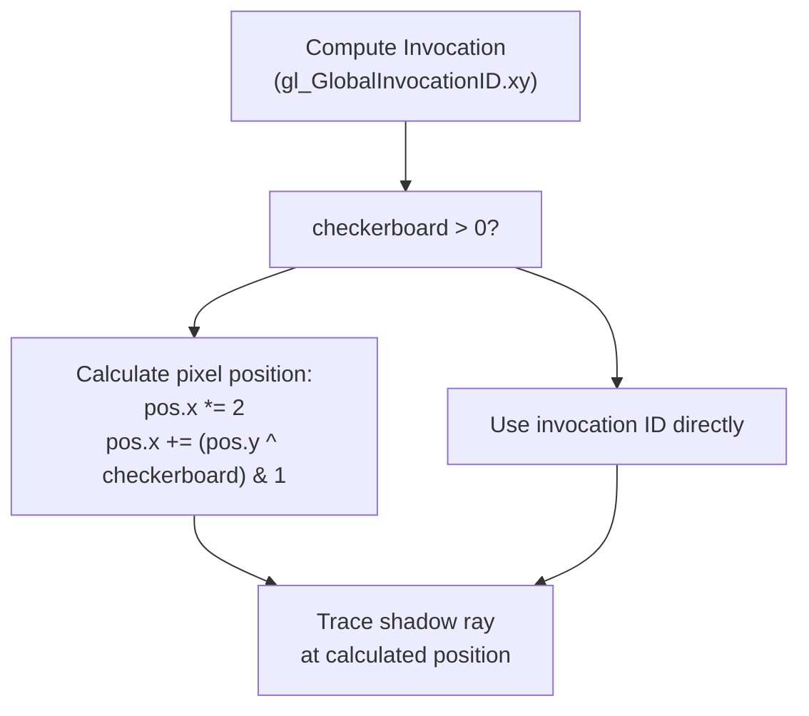
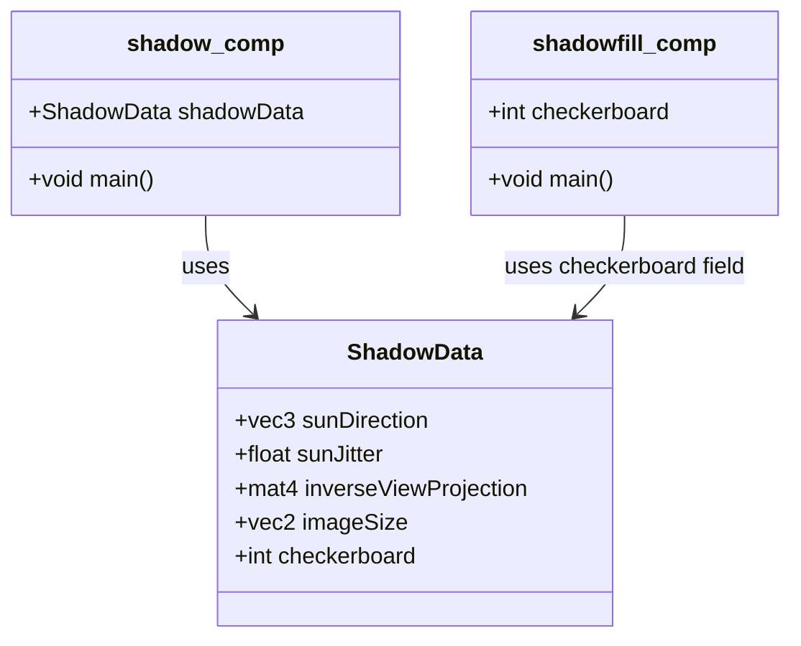
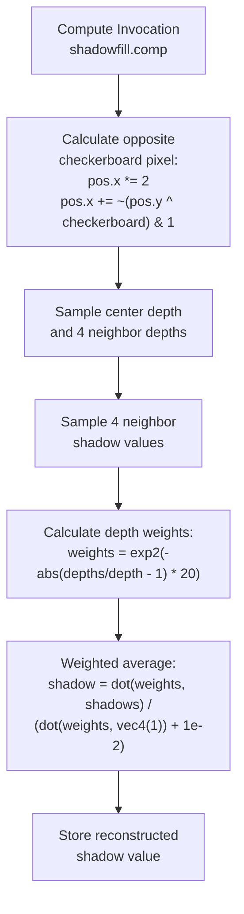
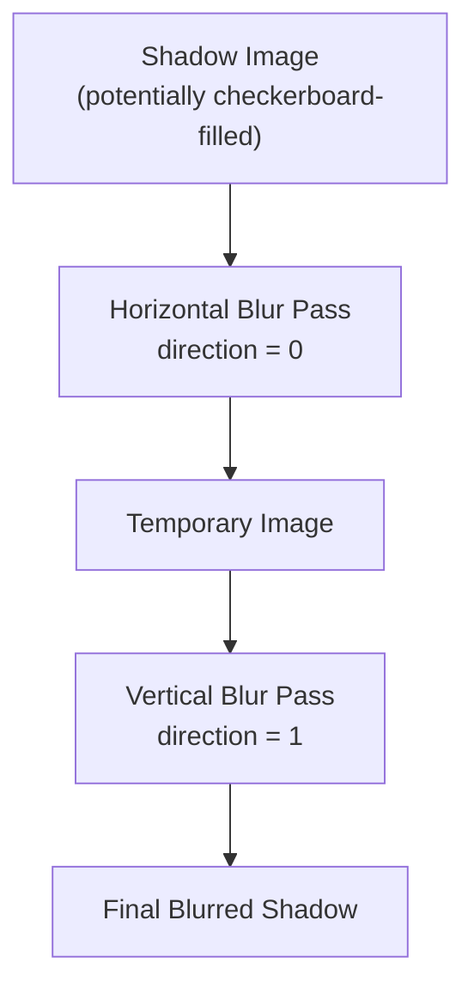
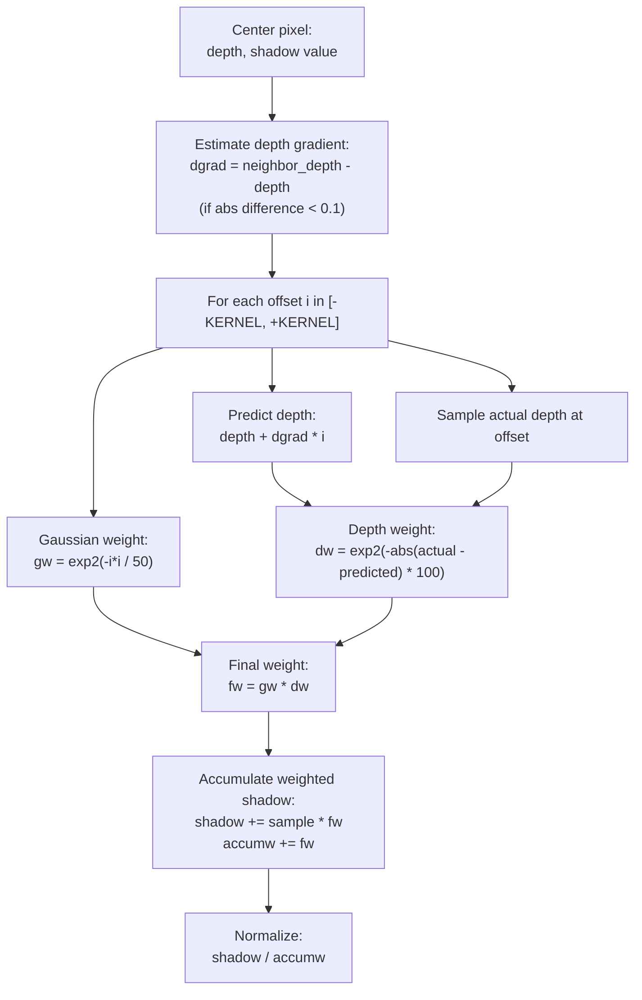
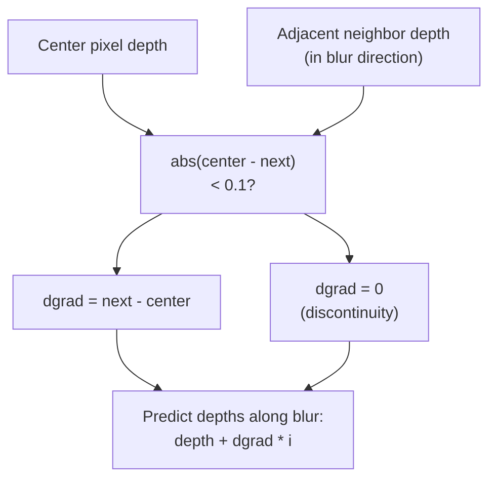
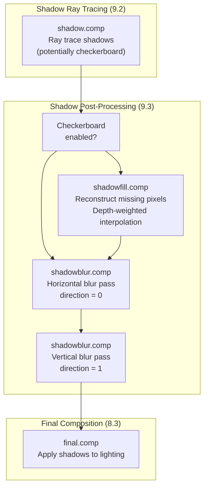
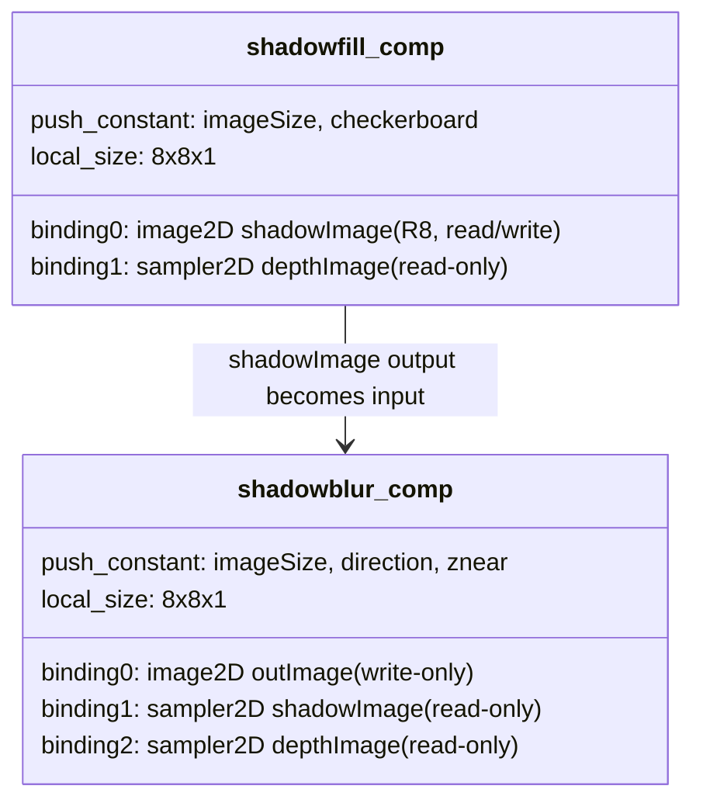

# Shadow Post-Processing

> **Relevant source files**
> * [src/shaders/shadow.comp.glsl](https://github.com/zeux/niagara/blob/6f3fb529/src/shaders/shadow.comp.glsl)
> * [src/shaders/shadowblur.comp.glsl](https://github.com/zeux/niagara/blob/6f3fb529/src/shaders/shadowblur.comp.glsl)
> * [src/shaders/shadowfill.comp.glsl](https://github.com/zeux/niagara/blob/6f3fb529/src/shaders/shadowfill.comp.glsl)

## Purpose and Scope

This document covers the post-processing steps applied to ray-traced shadow maps after the initial shadow ray tracing completes. The system implements two optimization techniques: checkerboard rendering to reduce ray tracing cost by half, and depth-aware blur for soft shadow generation. For details on shadow ray tracing itself, see [Shadow Ray Tracing](/zeux/niagara/9.2-shadow-ray-tracing). For acceleration structure management, see [Acceleration Structure Management](/zeux/niagara/9.1-acceleration-structure-management).

## Checkerboard Rendering Strategy

The shadow system supports optional checkerboard rendering, where shadow rays are only traced for half the pixels in a checkerboard pattern. This reduces ray tracing workload by 50% while maintaining visual quality through reconstruction.

### Checkerboard Pattern Generation

The shadow ray tracing shader selects pixels based on a checkerboard pattern:



The `checkerboard` parameter controls the pattern phase (0 for disabled, 1 or 2 for alternating patterns). The XOR operation with `pos.y` ensures a checkerboard distribution where adjacent horizontal pixels alternate between traced and skipped.

**Sources:** [src/shaders/shadow.comp.glsl L120-L125](https://github.com/zeux/niagara/blob/6f3fb529/src/shaders/shadow.comp.glsl#L120-L125)

### Checkerboard Configuration

| Configuration | Description |
| --- | --- |
| `checkerboard = 0` | Disabled - trace all pixels |
| `checkerboard = 1` | Phase 1 - trace even columns on even rows, odd columns on odd rows |
| `checkerboard = 2` | Phase 2 - trace odd columns on even rows, even columns on odd rows |

The `ShadowData` push constant structure provides the checkerboard mode to the shader:



**Sources:** [src/shaders/shadow.comp.glsl L17-L26](https://github.com/zeux/niagara/blob/6f3fb529/src/shaders/shadow.comp.glsl#L17-L26)

 [src/shaders/shadowfill.comp.glsl L7-L11](https://github.com/zeux/niagara/blob/6f3fb529/src/shaders/shadowfill.comp.glsl#L7-L11)

## Shadow Fill Pass

When checkerboard rendering is enabled, the `shadowfill.comp.glsl` shader reconstructs shadow values for the untraceable pixels using depth-weighted interpolation from neighboring traced pixels.

### Fill Algorithm



The fill shader operates on the complementary checkerboard pattern - pixels that were NOT traced during the shadow ray pass.

**Sources:** [src/shaders/shadowfill.comp.glsl L16-L45](https://github.com/zeux/niagara/blob/6f3fb529/src/shaders/shadowfill.comp.glsl#L16-L45)

### Depth-Weighted Interpolation

The reconstruction uses an exponential depth weighting function to preserve shadow discontinuities at geometry boundaries:

| Component | Formula | Purpose |
| --- | --- | --- |
| Neighbor depths | `depths = {left, right, up, down}` | Sample 4-neighbor depth values |
| Depth ratio | `depths / depth - 1` | Normalized depth difference |
| Weight function | `exp2(-abs(ratio) * 20)` | Exponential falloff with sharpness factor 20 |
| Final shadow | `dot(weights, shadows) / (sum(weights) + 1e-2)` | Normalized weighted average |

The exponential weight function [src/shaders/shadowfill.comp.glsl L40](https://github.com/zeux/niagara/blob/6f3fb529/src/shaders/shadowfill.comp.glsl#L40-L40)

 gives high weight to neighbors with similar depth (preserving smooth shadows) and near-zero weight to neighbors at significantly different depths (preventing shadow bleeding across geometry edges).

**Sources:** [src/shaders/shadowfill.comp.glsl L24-L44](https://github.com/zeux/niagara/blob/6f3fb529/src/shaders/shadowfill.comp.glsl#L24-L44)

## Shadow Blur Pass

The `shadowblur.comp.glsl` shader applies a separable depth-aware Gaussian blur to generate soft shadows while preserving sharp shadow boundaries at geometry discontinuities.

### Blur Pipeline Architecture



The blur is implemented as two passes with a separable kernel. The `direction` push constant controls the blur axis: 0 for horizontal (X-axis), 1 for vertical (Y-axis).

**Sources:** [src/shaders/shadowblur.comp.glsl L9-L16](https://github.com/zeux/niagara/blob/6f3fb529/src/shaders/shadowblur.comp.glsl#L9-L16)

### Depth-Aware Bilateral Filter

The blur kernel combines Gaussian spatial weighting with depth-based bilateral weighting to prevent bleeding across depth discontinuities:



**Sources:** [src/shaders/shadowblur.comp.glsl L27-L57](https://github.com/zeux/niagara/blob/6f3fb529/src/shaders/shadowblur.comp.glsl#L27-L57)

### Blur Parameters

| Parameter | Value | Description |
| --- | --- | --- |
| `KERNEL` | 10 | Blur radius in pixels [src/shaders/shadowblur.comp.glsl L35](https://github.com/zeux/niagara/blob/6f3fb529/src/shaders/shadowblur.comp.glsl#L35-L35) |
| Gaussian sharpness | 50 | Controls spatial falloff: `exp2(-i*i / 50)` |
| Depth gradient threshold | 0.1 | Maximum depth difference for gradient estimation [src/shaders/shadowblur.comp.glsl L41](https://github.com/zeux/niagara/blob/6f3fb529/src/shaders/shadowblur.comp.glsl#L41-L41) |
| Depth weight sharpness | 100 | Controls depth-based falloff: `exp2(-abs(delta) * 100)` [src/shaders/shadowblur.comp.glsl L49](https://github.com/zeux/niagara/blob/6f3fb529/src/shaders/shadowblur.comp.glsl#L49-L49) |

### Depth Gradient Estimation

The blur shader estimates the local depth gradient to handle sloped surfaces correctly [src/shaders/shadowblur.comp.glsl L39-L41](https://github.com/zeux/niagara/blob/6f3fb529/src/shaders/shadowblur.comp.glsl#L39-L41)

:



When the depth difference to the immediate neighbor exceeds 0.1 (normalized depth space), the gradient is zeroed to prevent blurring across geometry edges. Otherwise, the gradient is used to predict expected depths along the blur direction, allowing smooth blurring along sloped surfaces.

**Sources:** [src/shaders/shadowblur.comp.glsl L39-L41](https://github.com/zeux/niagara/blob/6f3fb529/src/shaders/shadowblur.comp.glsl#L39-L41)

## Post-Processing Pipeline Integration

The complete shadow post-processing pipeline consists of up to three compute passes:



### Pass Execution Details

| Pass | Shader | Input Images | Output Image | Description |
| --- | --- | --- | --- | --- |
| 1. Shadow Fill | `shadowfill.comp` | `shadowImage` (R8), `depthImage` | `shadowImage` (R8) | Reconstructs checkerboard-skipped pixels using depth-weighted 4-neighbor interpolation |
| 2. Horizontal Blur | `shadowblur.comp` | `shadowImage`, `depthImage` | Temporary image | Applies depth-aware 1D Gaussian blur horizontally with kernel size 10 |
| 3. Vertical Blur | `shadowblur.comp` | Temporary image, `depthImage` | `shadowImage` | Applies depth-aware 1D Gaussian blur vertically with kernel size 10 |

The shadow fill pass is conditionally executed only when checkerboard rendering is active. Both blur passes always execute to produce soft shadows.

**Sources:** [src/shaders/shadowfill.comp.glsl L1-L46](https://github.com/zeux/niagara/blob/6f3fb529/src/shaders/shadowfill.comp.glsl#L1-L46)

 [src/shaders/shadowblur.comp.glsl L1-L64](https://github.com/zeux/niagara/blob/6f3fb529/src/shaders/shadowblur.comp.glsl#L1-L64)

### Image Formats and Bindings



All shadow post-processing shaders use 8×8 workgroup sizes [src/shaders/shadowfill.comp.glsl L5](https://github.com/zeux/niagara/blob/6f3fb529/src/shaders/shadowfill.comp.glsl#L5-L5)

 [src/shaders/shadowblur.comp.glsl L9](https://github.com/zeux/niagara/blob/6f3fb529/src/shaders/shadowblur.comp.glsl#L9-L9)

 for efficient compute dispatch. The shadow image uses R8 format (single-channel 8-bit) as only a scalar shadow factor is needed.

**Sources:** [src/shaders/shadowfill.comp.glsl L5-L14](https://github.com/zeux/niagara/blob/6f3fb529/src/shaders/shadowfill.comp.glsl#L5-L14)

 [src/shaders/shadowblur.comp.glsl L9-L21](https://github.com/zeux/niagara/blob/6f3fb529/src/shaders/shadowblur.comp.glsl#L9-L21)

### Depth Buffer Format

Both fill and blur shaders sample from the same depth buffer used during G-buffer rendering. The depth is converted from normalized device coordinates to linear view-space depth for accurate geometric comparisons:

```
linear_depth = znear / depth_buffer_value
```

The `znear` parameter [src/shaders/shadowblur.comp.glsl L15](https://github.com/zeux/niagara/blob/6f3fb529/src/shaders/shadowblur.comp.glsl#L15-L15)

 is passed as a push constant to enable this conversion.

**Sources:** [src/shaders/shadowblur.comp.glsl L31](https://github.com/zeux/niagara/blob/6f3fb529/src/shaders/shadowblur.comp.glsl#L31-L31)

 [src/shaders/shadowblur.comp.glsl L40](https://github.com/zeux/niagara/blob/6f3fb529/src/shaders/shadowblur.comp.glsl#L40-L40)

 [src/shaders/shadowblur.comp.glsl L48](https://github.com/zeux/niagara/blob/6f3fb529/src/shaders/shadowblur.comp.glsl#L48-L48)