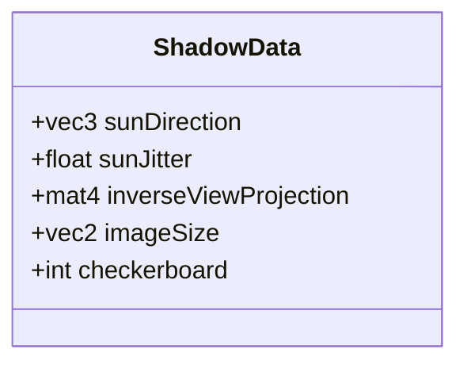
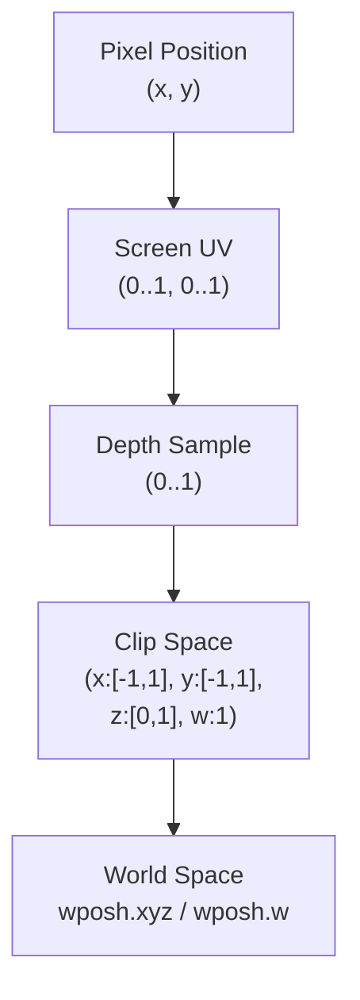
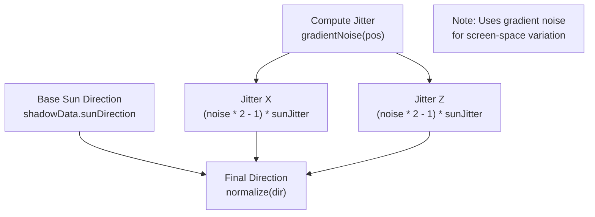
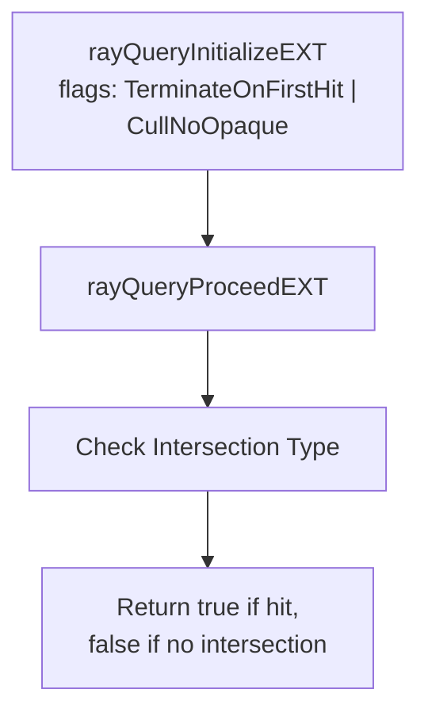
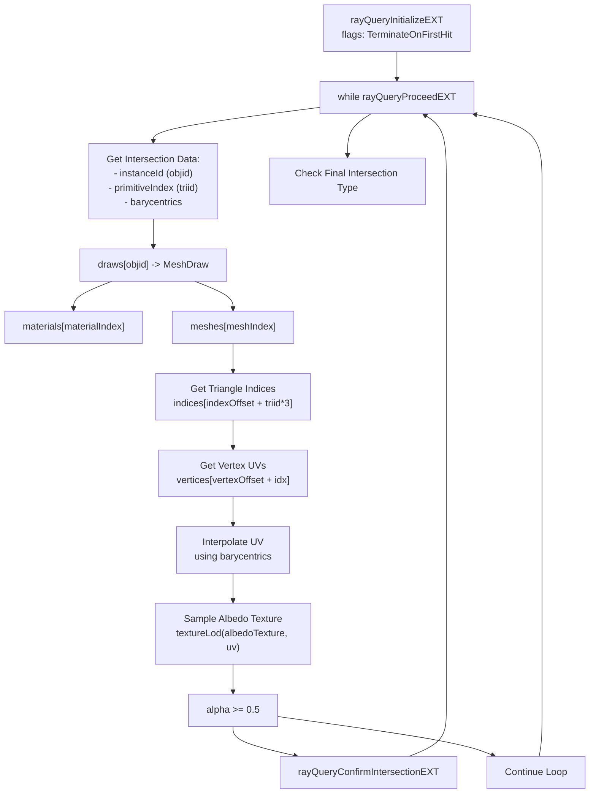
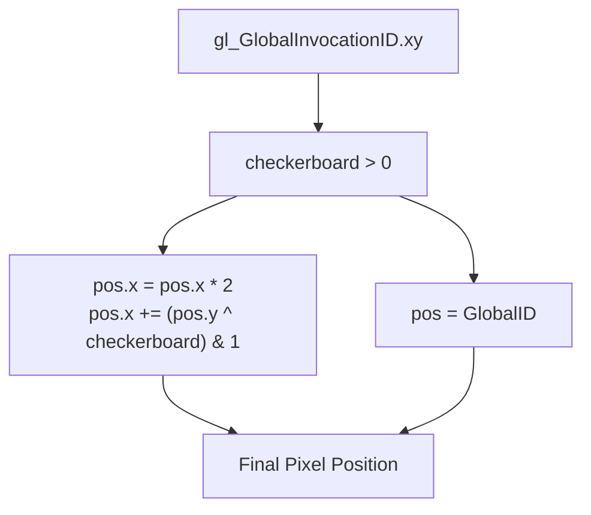
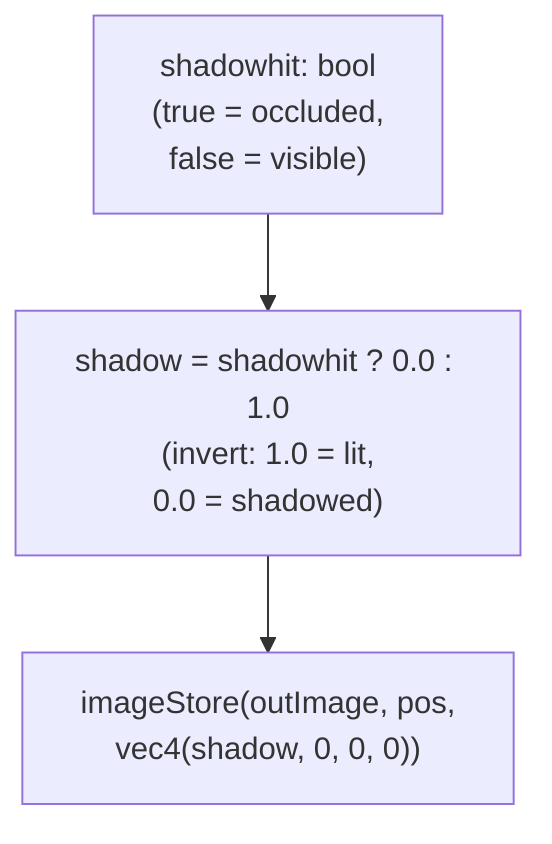

# Shadow Ray Tracing

> **Relevant source files**
> * [src/shaders/shadow.comp.glsl](https://github.com/zeux/niagara/blob/6f3fb529/src/shaders/shadow.comp.glsl)
> * [src/shaders/shadowblur.comp.glsl](https://github.com/zeux/niagara/blob/6f3fb529/src/shaders/shadowblur.comp.glsl)
> * [src/shaders/shadowfill.comp.glsl](https://github.com/zeux/niagara/blob/6f3fb529/src/shaders/shadowfill.comp.glsl)

## Purpose and Scope

This document describes the ray tracing compute shader that generates shadow maps for the Niagara renderer. The shadow system uses Vulkan's ray query extension (`GL_EXT_ray_query`) to trace shadow rays from visible geometry to the sun direction, supporting both opaque and transparent shadow modes. For information about building and managing acceleration structures, see [Acceleration Structure Management](/zeux/niagara/9.1-acceleration-structure-management). For shadow post-processing including checkerboard reconstruction and blurring, see [Shadow Post-Processing](/zeux/niagara/9.3-shadow-post-processing).

## Execution Model

The shadow ray tracing is implemented as a compute shader in [src/shaders/shadow.comp.glsl](https://github.com/zeux/niagara/blob/6f3fb529/src/shaders/shadow.comp.glsl)

 The shader is dispatched with an 8×8 local workgroup size [src/shaders/shadow.comp.glsl L15](https://github.com/zeux/niagara/blob/6f3fb529/src/shaders/shadow.comp.glsl#L15-L15)

 processing one pixel per invocation. Each thread reconstructs a world-space position from the depth buffer, traces a shadow ray toward the sun, and outputs a shadow visibility value.

```

```

**Sources:** [src/shaders/shadow.comp.glsl L15](https://github.com/zeux/niagara/blob/6f3fb529/src/shaders/shadow.comp.glsl#L15-L15)

 [src/shaders/shadow.comp.glsl L116-L152](https://github.com/zeux/niagara/blob/6f3fb529/src/shaders/shadow.comp.glsl#L116-L152)

## Shader Bindings and Input Data

The shadow shader accesses multiple resource bindings to perform ray tracing and handle transparent materials:

| Binding | Type | Description |
| --- | --- | --- |
| 0 | `image2D` | Output shadow map (write-only) |
| 1 | `sampler2D` | Depth buffer for world position reconstruction |
| 2 | `accelerationStructureEXT` | Top-level acceleration structure (TLAS) |
| 3 | `buffer` | `MeshDraw` array - per-instance draw data |
| 4 | `buffer` | `Mesh` array - mesh metadata |
| 5 | `buffer` | `Material` array - material properties including texture indices |
| 6 | `buffer` | `Vertex` array - vertex attributes (positions, UVs, etc.) |
| 7 | `buffer` | `uint` indices - triangle index data |
| 8 | `sampler` | Texture sampler for material textures |
| 0 (set 1) | `texture2D[]` | Bindless texture array for albedo maps |

The shader also receives push constants through the `ShadowData` structure:



**Sources:** [src/shaders/shadow.comp.glsl L17-L31](https://github.com/zeux/niagara/blob/6f3fb529/src/shaders/shadow.comp.glsl#L17-L31)

 [src/shaders/shadow.comp.glsl L33-L66](https://github.com/zeux/niagara/blob/6f3fb529/src/shaders/shadow.comp.glsl#L33-L66)

## World Position Reconstruction

Each shader invocation reconstructs the 3D world-space position of a pixel using the depth buffer and inverse view-projection matrix:



The reconstruction process [src/shaders/shadow.comp.glsl L127-L132](https://github.com/zeux/niagara/blob/6f3fb529/src/shaders/shadow.comp.glsl#L127-L132)

:

1. Converts pixel coordinates to normalized UV coordinates (0 to 1)
2. Samples depth from the depth buffer
3. Constructs a clip-space coordinate (X and Y remapped to -1 to 1, Y inverted for Vulkan)
4. Multiplies by the inverse view-projection matrix to get homogeneous world coordinates
5. Performs perspective division to obtain the final world position

**Sources:** [src/shaders/shadow.comp.glsl L127-L132](https://github.com/zeux/niagara/blob/6f3fb529/src/shaders/shadow.comp.glsl#L127-L132)

## Shadow Ray Configuration

The shadow ray is configured with a direction toward the sun plus optional jittering for soft shadows:



The jittering implementation [src/shaders/shadow.comp.glsl L138-L142](https://github.com/zeux/niagara/blob/6f3fb529/src/shaders/shadow.comp.glsl#L138-L142)

:

* Uses `gradientNoise()` based on pixel coordinates to generate pseudo-random offsets
* Applies offsets to X and Z components of the sun direction
* Scales offsets by `shadowData.sunJitter` parameter
* Normalizes the final direction vector

The shader notes that proper cone sampling should be implemented instead of simple XZ offsets [src/shaders/shadow.comp.glsl L136-L137](https://github.com/zeux/niagara/blob/6f3fb529/src/shaders/shadow.comp.glsl#L136-L137)

**Sources:** [src/shaders/shadow.comp.glsl L134-L142](https://github.com/zeux/niagara/blob/6f3fb529/src/shaders/shadow.comp.glsl#L134-L142)

## Ray Tracing Modes

The shadow shader supports two quality modes selected by the `QUALITY` specialization constant [src/shaders/shadow.comp.glsl L13](https://github.com/zeux/niagara/blob/6f3fb529/src/shaders/shadow.comp.glsl#L13-L13)

:

### Opaque Shadow Mode (QUALITY = 0)

The fast path uses `shadowTrace()` [src/shaders/shadow.comp.glsl L69-L75](https://github.com/zeux/niagara/blob/6f3fb529/src/shaders/shadow.comp.glsl#L69-L75)

 which terminates on the first hit:



This mode:

* Uses `gl_RayFlagsTerminateOnFirstHitEXT` to stop at the first intersection
* Uses `gl_RayFlagsCullNoOpaqueEXT` to skip opaque geometry (note: this appears to be a typo in the comment, as the flag actually ensures only opaque hits are considered)
* Ray parameters: origin at world position + 1e-2 offset, direction toward sun, maximum distance 1e3
* Returns immediately after the first confirmed intersection

**Sources:** [src/shaders/shadow.comp.glsl L69-L75](https://github.com/zeux/niagara/blob/6f3fb529/src/shaders/shadow.comp.glsl#L69-L75)

 [src/shaders/shadow.comp.glsl L145-L147](https://github.com/zeux/niagara/blob/6f3fb529/src/shaders/shadow.comp.glsl#L145-L147)

### Transparent Shadow Mode (QUALITY != 0)

The quality path uses `shadowTraceTransparent()` [src/shaders/shadow.comp.glsl L77-L114](https://github.com/zeux/niagara/blob/6f3fb529/src/shaders/shadow.comp.glsl#L77-L114)

 which handles alpha-tested materials:



This mode processes each potential intersection:

1. Extracts intersection data including instance ID, triangle index, and barycentric coordinates [src/shaders/shadow.comp.glsl L83-L85](https://github.com/zeux/niagara/blob/6f3fb529/src/shaders/shadow.comp.glsl#L83-L85)
2. Traverses data structures to access geometry: `draws` → `materials`, `meshes`, `vertices`, `indices` [src/shaders/shadow.comp.glsl L87-L98](https://github.com/zeux/niagara/blob/6f3fb529/src/shaders/shadow.comp.glsl#L87-L98)
3. Interpolates texture coordinates using barycentric weights [src/shaders/shadow.comp.glsl L100-L104](https://github.com/zeux/niagara/blob/6f3fb529/src/shaders/shadow.comp.glsl#L100-L104)
4. Samples the albedo texture's alpha channel [src/shaders/shadow.comp.glsl L106-L108](https://github.com/zeux/niagara/blob/6f3fb529/src/shaders/shadow.comp.glsl#L106-L108)
5. Confirms the intersection only if alpha >= 0.5, otherwise continues to the next hit [src/shaders/shadow.comp.glsl L110-L111](https://github.com/zeux/niagara/blob/6f3fb529/src/shaders/shadow.comp.glsl#L110-L111)

The shader includes a comment noting that repacking data for ray tracing showed no performance benefit [src/shaders/shadow.comp.glsl L94-L95](https://github.com/zeux/niagara/blob/6f3fb529/src/shaders/shadow.comp.glsl#L94-L95)

**Sources:** [src/shaders/shadow.comp.glsl L77-L114](https://github.com/zeux/niagara/blob/6f3fb529/src/shaders/shadow.comp.glsl#L77-L114)

## Checkerboard Rendering

To reduce computational cost, the shadow shader supports checkerboard rendering where only half the pixels are traced per frame [src/shaders/shadow.comp.glsl L120-L125](https://github.com/zeux/niagara/blob/6f3fb529/src/shaders/shadow.comp.glsl#L120-L125)

:



The checkerboard pattern:

* Multiplies X coordinate by 2 to skip every other column
* XORs the Y coordinate with the `checkerboard` parameter (1 or 2) to alternate between frames
* ANDs with 1 to get the offset (0 or 1)
* This creates a checkerboard pattern where adjacent frames trace complementary sets of pixels

The missing pixels are reconstructed by the shadow fill pass (see [Shadow Post-Processing](/zeux/niagara/9.3-shadow-post-processing)).

| Frame | Checkerboard Value | Pattern |
| --- | --- | --- |
| Even | 1 | ░█░█░██░█░█░░█░█░█ |
| Odd | 2 | █░█░█░░█░█░██░█░█░ |

**Sources:** [src/shaders/shadow.comp.glsl L120-L125](https://github.com/zeux/niagara/blob/6f3fb529/src/shaders/shadow.comp.glsl#L120-L125)

## Output Generation

The shader produces a binary shadow value and stores it in the output image:



The shadow value is inverted so that:

* `1.0` represents fully lit (no shadow hit)
* `0.0` represents fully shadowed (ray blocked)

This convention matches the final composition shader's expectations where the shadow value is multiplied with lighting [src/shaders/shadow.comp.glsl L149-L151](https://github.com/zeux/niagara/blob/6f3fb529/src/shaders/shadow.comp.glsl#L149-L151)

**Sources:** [src/shaders/shadow.comp.glsl L145-L151](https://github.com/zeux/niagara/blob/6f3fb529/src/shaders/shadow.comp.glsl#L145-L151)

## Performance Characteristics

The shader implementation includes several performance considerations:

| Aspect | Implementation | Rationale |
| --- | --- | --- |
| **Opaque vs Transparent** | Two separate trace functions | Opaque mode terminates immediately; transparent mode loops through multiple hits |
| **Ray Flags** | `gl_RayFlagsTerminateOnFirstHitEXT` | Stops traversal after first confirmed hit |
| **Ray Distance** | `1e3` units | Large enough to reach all scene geometry |
| **Ray Origin Offset** | `1e-2` | Prevents self-intersection artifacts |
| **Checkerboard** | Optional half-resolution trace | 2× performance improvement with reconstruction overhead |
| **Data Access Pattern** | Multiple buffer indirections | Comment notes repacking showed no benefit |

The shader notes platform-specific behavior differences between AMD and NVIDIA hardware regarding the relative performance of opaque versus transparent shadow modes [src/shaders/shadow.comp.glsl L144-L147](https://github.com/zeux/niagara/blob/6f3fb529/src/shaders/shadow.comp.glsl#L144-L147)

**Sources:** [src/shaders/shadow.comp.glsl L69-L114](https://github.com/zeux/niagara/blob/6f3fb529/src/shaders/shadow.comp.glsl#L69-L114)

 [src/shaders/shadow.comp.glsl L144-L147](https://github.com/zeux/niagara/blob/6f3fb529/src/shaders/shadow.comp.glsl#L144-L147)